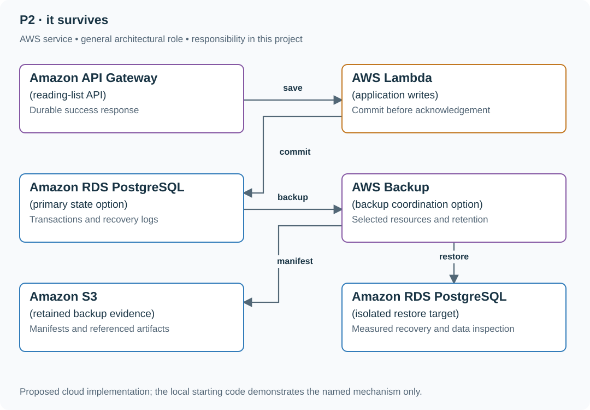
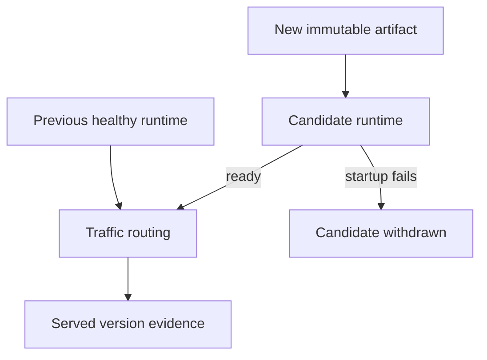
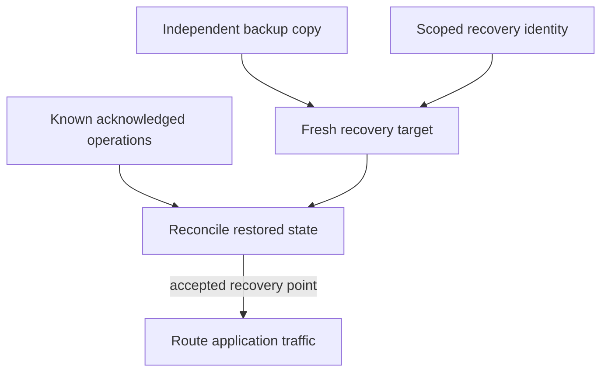

# Stage 2: Deploy, back up and recover the reading list

## Application background

Your Stage 1 reading list now contains links and notes people rely on. A restart should not erase them. A bad deployment or lost database also needs a planned recovery path, including an honest account of data that the available backup does not contain.

A backup is a copy from a particular time. Restoring it can recover older records while still losing more recent saves. The exercise asks you to measure that gap instead of reporting recovery merely because a server starts again.

### The evidence available during recovery

This is the constructed incident timeline for this stage:

```text
12:00 backup completes with bookmark 100 present
12:03 application reports bookmark 101 saved
12:05 primary database becomes unavailable
```

Restoring only that backup recovers bookmark 100. It does not establish that bookmark 101 survived. The recovery report must compare the restored data with what the application had already told users.

Recovery time measures how long service takes to return. The data-loss boundary describes which acknowledged saves could not be recovered. Both belong in the recovery report.

## Your assignment

**Deliver:** Extend your Stage 1 application with deployment and backup/restore procedures. Demonstrate recovery and compare the restored records with saves users were told had succeeded.

**Required behavior:** Durable acknowledgement, backup and restore are separate guarantees. Restore into an isolated location, inspect recovered data and state the observed recovery point/time. Do not claim zero loss when link 101 was never present in the restored backup.

The required first milestone is a working local implementation of the behavior above. The numbered implementation steps define the scope. The cloud architecture is a later extension, not something the starter has already provisioned.

## Get the code and run the supplied example

The code is in the public [junior-to-staff repository](https://github.com/Soulful-Iris/junior-to-staff). Install Git and Python 3.12+. No AWS account or Python packages are required for this first run. If you already have a checkout, use it and skip cloning.

```bash
git clone https://github.com/Soulful-Iris/junior-to-staff.git
cd junior-to-staff
python3 examples/architecture-starts/reading_list_it_survives.py
```

**Supplied file:** [`examples/architecture-starts/reading_list_it_survives.py`](https://github.com/Soulful-Iris/junior-to-staff/blob/main/examples/architecture-starts/reading_list_it_survives.py). You can also [read or download the source here](../../../../examples/architecture-starts/reading_list_it_survives.py).

This program is a **mechanism demonstration**: it runs the small scenario in one process and prints the result. It is not an HTTP service, a complete application, or an AWS deployment. A successful run demonstrates this mechanism only. It does not establish the workload or failure guarantees of the application you will build.

**Example output from the supplied run:**

Generated IDs and timestamps may differ. Compare the state transitions and outcomes.

```text
Acknowledged primary: [(100,), (101,)]
Restored 12:00 snapshot: [(100,)]
Link 101 is absent: snapshot-only restore has acknowledged-write loss.
```

### Run the application you will extend

The [reading-list API setup guide](../../../../examples/reading-list-starter/README.md) gives you a real local HTTP server, SQLite database, save/list/edit requests and controlled title success/timeout behavior. Start it in one terminal and send the documented `curl` requests from another. Read that setup before following the implementation steps below. The demo above isolates this lesson's mechanism. The server is where you integrate it.

Continue the application you built in the preceding stage. The supplied server is only a Stage 1 starting point. It does not contain the previous stages' completed UI, operations, jobs or AI feature.

For a first run, start this in **terminal 1** from the repository root:

```bash
python3 examples/reading-list-starter/app.py --db /tmp/reading-list.sqlite3
```

In **terminal 2**, save one bookmark with a controlled title timeout:

```bash
curl -i http://127.0.0.1:8080/bookmarks \
  -H 'X-Demo-User: alice' -H 'Content-Type: application/json' \
  -d '{"url":"https://example.com/docs","title_mode":"timeout"}'
```

Expect **201 Created**, a bookmark `id` and `title_status: "timeout"`. The URL is persisted despite the title failure. This is the supplied baseline. The assignment adds the behavior described above. The lookup is a fixture, so no external website is contacted. For members Bob or Ben in a scenario, use the starter's second demo identity `bob`. Alice or Ana corresponds to `alice`.

Work in your own branch or copy `examples/reading-list-starter/` to `work/02-it-survives/`. `app.py` exists in that directory. Add the modules named below there as you separate HTTP, storage and background work. The server has demo membership, not production authentication.

## Local components and state to implement

This table names the records, interfaces or decision inputs for your deliverable. Unless a name is explicitly linked to supplied source above, it is something you create. Implement the local state transitions first, then connect the HTTP, storage or worker boundaries required by the steps.

| Record / module | Key or interface | Responsibility |
|---|---|---|
| durable_store | committed link/request identity | What success promises across process restart. |
| backup_manifest | created_at,source_position,schema,objects | Exactly which data the backup contains. |
| restore_record | target,started,ready,recovered_position,missing_ids | Evidence of recovery and acknowledged loss. |

## Implement the assignment

### 1. Persist the application state

Move from disposable memory to a durable local file/database with an explicit commit boundary. Store request identities with creates so a lost response can be retried. Restart the process and show that acknowledged links and personal read state remain.

### 2. Create a restorable backup

Record schema version, database position/time and referenced object versions. Protect backup credentials and retention separately from the application’s ordinary write role. A copied database file is only a valid backup if the database’s supported snapshot procedure makes it consistent.

### 3. Restore away from the source

Use a new database/path and the documented startup command. Inspect link 100 and the acknowledged link 101 scenario. Record missing acknowledged operations rather than inferring completeness because the application starts successfully.

### 4. Close the recovery gap deliberately

Choose more frequent snapshots, log-based point-in-time recovery or another durability design based on the required loss bound. Rehearse the actual restore path and include access, schema migration and private object references in the measured recovery time.

## Demonstrate the completed local result

| Action | Expected visible result |
|---|---|
| Run the starting program | The restored snapshot contains 100 and lacks acknowledged 101. |
| Restart only the app process | Durable committed state remains available. |
| Restore into a fresh environment | Record the actual ready time and recovered data boundary. |

**Handoff:** In your implementation README, include the start command, one successful operation, the failure case above and the resulting stored state or decision. State which dependencies are simulated. Someone with a fresh checkout should be able to reproduce this without your chat history.

## Workload assumptions and capacity decisions

These are constructed exercise assumptions. The stated workload is a design target. The local demonstration does not establish that throughput. Use the [estimation constants](../../../../curriculum/01-code/01-problem-solving/estimation-constants.md) to check units before choosing capacity.

| Input or objective | Calculation / consequence |
|---|---|
| Backup 12:00. Acknowledgement 12:03. Failure 12:05 | Snapshot-only recovery may lose link 101. The latest backup is five minutes old. |
| 200 links at 1 KiB metadata assumption | Data volume is small enough to inspect directly. Correctness of restore is the exercise. |
| Thirty-minute recovery target assumption | Measure start-to-usable time, including credentials, schema and object references. |

## Map the local implementation to AWS

**Deployment status: local only.** Running the supplied command creates no AWS resources and configures no cloud connections. The diagram is a proposed deployment of the completed application. Each box needs either a deployed runtime, a provisioned service or an explicitly external dependency.

Read the diagram by following the arrows from the entry point: application code accepts the request or event, the state owner commits it, and any worker produces the later result. The table ties those roles to code and adapter work. Multiple boxes do not imply multiple Python files already exist.



A backup service coordinates retained recovery points, but the application’s loss and recovery claims come from inspecting a restored target. A successful backup job alone does not establish those claims.

| Local responsibility | Cloud destination and role | Implementation still required |
|---|---|---|
| Local HTTP boundary or the endpoint you will add | Amazon API Gateway: reading-list API | Create routes and an integration. Translate requests and responses and configure identity validation. |
| Python operation or worker function | AWS Lambda: application writes | Write a Lambda event adapter, package its dependencies and give its role only the required resource actions. |
| Local records and transaction boundary | Amazon RDS PostgreSQL: primary state option | Write PostgreSQL schema/migrations and a database adapter. Configure credentials, connection limits and recovery. |
| Local snapshot/recovery fixture | AWS Backup: backup coordination option | Configure backup and restore resources, then compare restored records with acknowledged writes. A backup job result alone is not a recovery demonstration. |
| Local file, object fixture or exported payload | Amazon S3: retained backup evidence | Implement upload/download and metadata adapters, scoped access, object naming, retention and incomplete-upload cleanup. |
| Local records and transaction boundary | Amazon RDS PostgreSQL: isolated restore target | Write PostgreSQL schema/migrations and a database adapter. Configure credentials, connection limits and recovery. |

### Provision resources, then connect the application

| Resource or boundary | Initial configuration and reason |
|---|---|
| Database recovery | Configure the selected service’s backup/PITR behavior and retain required logs. Verify the actual recoverable window. |
| Restore target | Separate resource identity and credentials. Never overwrite the only source while learning recovery. |
| Evidence | Record restored commit/time, schema and missing acknowledged IDs. Encrypt/restrict backups containing private data. |

Use one disposable AWS environment for the cloud exercise. Put the named resources in `infra/template.yaml` or your existing IaC tool, pass resource IDs through configuration, and scope each runtime role to its own tables, buckets and queues. The diagram is a design to implement. It is not a claim that these resources have been deployed. Record the commands you used to deploy and remove the exercise resources.

For concrete provisioning commands, configuration wiring and cleanup, use the [AWS foundation guide](../../../../examples/architecture-starts/infra/README.md). It includes a deployable table/queue/object-storage foundation and explains which application and service adapters you still implement.

A provisioned queue or table does not make the local program use it. Configure resource IDs in the deployed runtime, replace the local adapter, and replay the same successful and failing operation against that runtime. Record the deployed commit and observable result, then remove the disposable resources using your infrastructure tool.

## Extend the design after the baseline works


Continue to stage 3 with the recovery procedure intact. Add asynchronous work without weakening what an accepted job or a published result means.

<details>
<summary>Follow-up scenarios and worked designs</summary>

## Follow-up 1 · A deploy crashes

**Changed requirement:** A candidate version exits immediately. What keeps the previous version available?

<details>
<summary>Worked design and implementation</summary>

Build once, route only to ready instances, preserve the previous artifact and compatible config, and prove rollback by observing served version. Data compatibility remains a separate gate.

**Preserve a usable old release during startup failure.** Keep the previous immutable artifact and compatible configuration available while the candidate starts. Route requests only after the candidate can serve its required dependencies. A process that exits immediately must not replace all healthy capacity.

Deploy a deliberately exiting candidate in the disposable application environment and query the served version. It must remain the prior release. Then deploy a working candidate and show the version change. Record separately whether the schema still permits the old binary to run. This exercise does not alter the guide's main-to-site publishing path.

**Revised flow.** These are proposed components to implement, not extra services started by the supplied demo.



</details>

## Follow-up 2 · The primary and its credentials are lost

**Changed requirement:** Can an unfamiliar engineer recover without depending on the failed primary?

<details>
<summary>Worked design and implementation</summary>

Use independently accessible backup, documented scoped recovery identity and a fresh target. Verify row contents and application behavior before routing traffic. Retain evidence of missing acknowledged writes.

**Make recovery independent of the lost primary.** The backup location, decryption permissions and recovery instructions cannot require credentials available only inside the failed database. Restore into a fresh target with a scoped recovery identity. Compare application records against the last known acknowledged operations before redirecting users.

Use a backup that predates one acknowledged bookmark. Show the restored database missing that row and report the loss honestly. Recover it only from a trustworthy later log if available. Hand over the commands, identity requirements and observed recovery point, not just a successful restore message.

**Revised flow.** These are proposed components to implement, not extra services started by the supplied demo.



</details>

</details>
