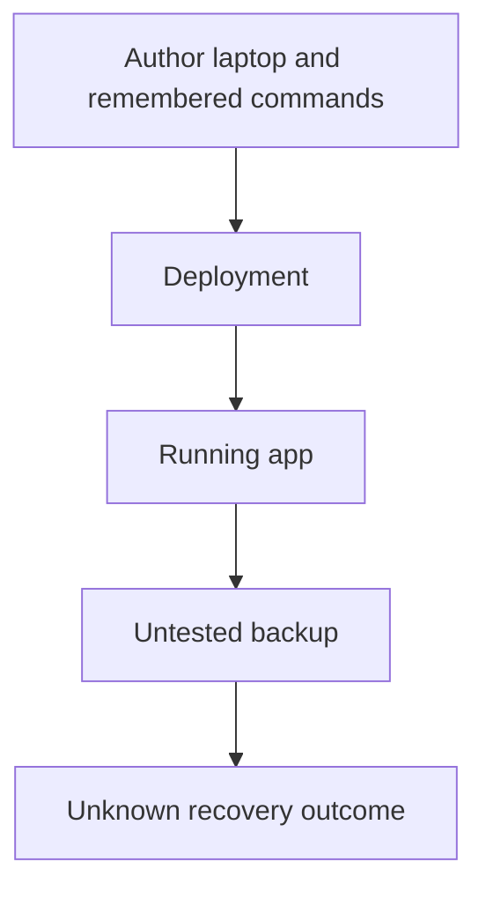
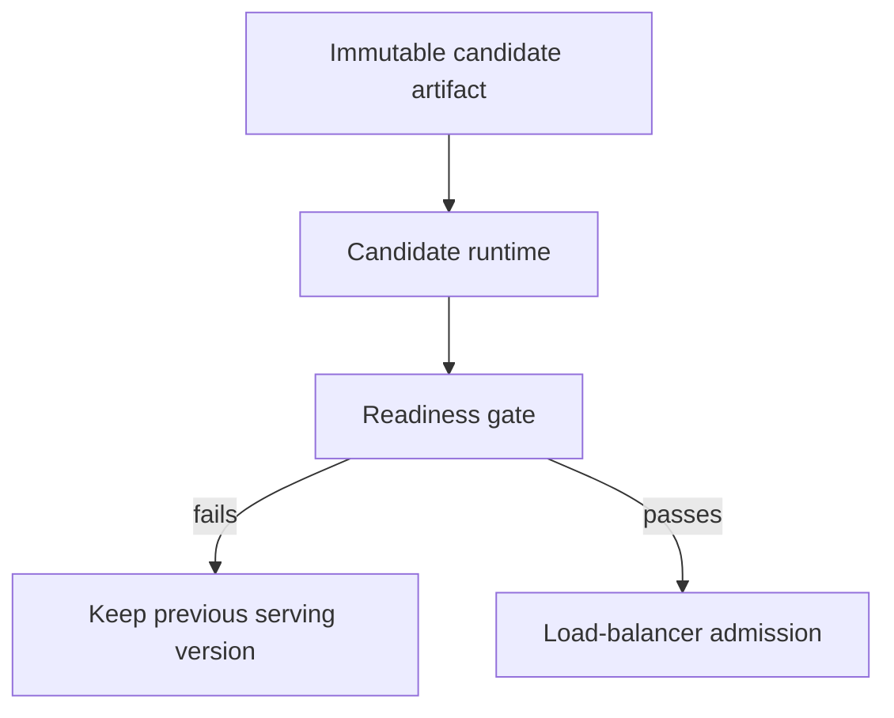
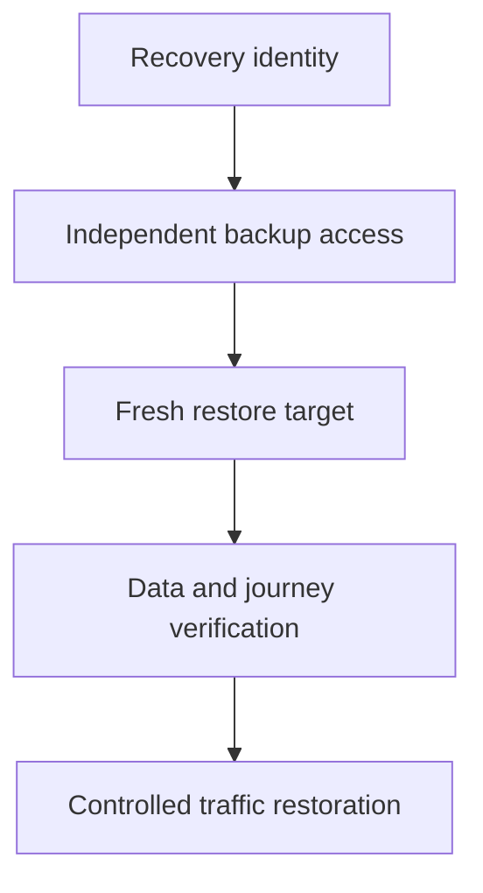
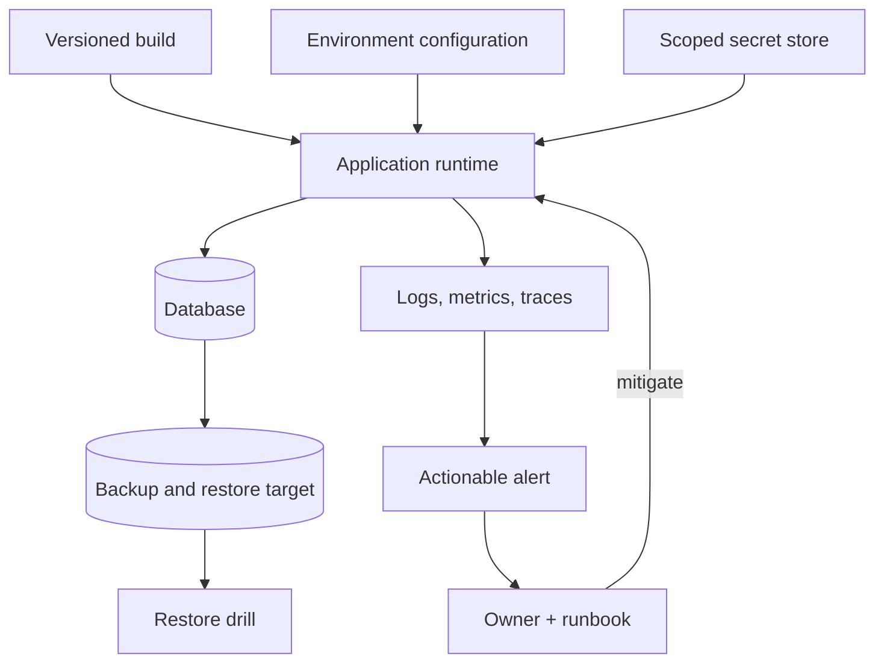

# P2 · it survives

## The reviewer's brief

> Your reading list works on your laptop. Tomorrow another engineer is on call, the database may be lost, and a new deploy may crash. Make the operating path reproducible and show what a restored system actually contains.

This is a **constructed practice brief**, not an attributed company question.
Prerequisites: [P1](../01-it-works/README.md). This page is a build brief; it does not ship a runnable application. The original build and prompt sequence below defines the implementation checkpoints.

| Case | Exact input or workload | Expected outcome |
|---|---|---|
| Small example | Backup at 12:00 includes items 1–100; acknowledged item 101 is written at 12:03; failure at 12:05. | Restore contains items 1–100; report missing item 101 and the recovery interval instead of claiming zero loss. |
| Boundary / failure | Application process is live but its required database is unreachable. | Readiness/user-journey evidence shows unavailable; liveness can remain true without triggering pointless restart loops. |
| Scope | Destructive drills only in scratch infrastructure; RPO and RTO are measured assumptions, not guarantees from one exercise. | Explain any additional assumption before implementing it. |

<!-- project-expectation:start -->

## What you are expected to hand over

**The finished artifact:** Junior → senior · fed by sections 10, 11, 12 · the question is can someone else run it, and can you fix it at 3am? Take the reading list you built in P1. Do not add a single feature to it.

Treat that sentence as a review contract, not an inspiration. A reviewable
submission contains all of the following:

- the narrow working slice or decision artifact described above, reproducible
  from a clean checkout with assumptions stated;
- captured proof of the normal flow **and** the boundary/failure row above;
- tests, probes, or metrics that can go red when the important guarantee breaks;
- a short decision record naming ownership, excluded scope, and the first
  operational limit; and
- a changed contract, diagram, and new evidence for each follow-up—not only a
  paragraph claiming the original design still works.

### How the review conversation gets harder

| Review gate | The interviewer changes | Expected response |
|---|---|---|
| Baseline | Run the small example from the table above. | Demonstrate the observable outcome end to end and identify which boundary owns it. |
| Failure | Reproduce the boundary/failure row above. | Show the failure before the fix, then prove the protected behavior without hiding the error. |
| Senior · A deploy crashes | A candidate version exits immediately. What keeps the previous version available? Predict which boundary must change before opening the design. | Build once, route only to ready instances, preserve the previous artifact and compatible config, and prove rollback by observing served version. Data compatibility remains a separate gate. |
| Lead · The primary and its credentials are lost | Can an unfamiliar engineer recover without depending on the failed primary? State what evidence would make you reject your first design. | Use independently accessible backup, documented scoped recovery identity and a fresh target. Verify row contents and application behavior before routing traffic; retain evidence of missing acknowledged writes. |
| Evidence | A reviewer asks, “How do you know?” | Build in three stops: reproduce the small case and baseline failure; implement the protected boundary; then replay both changed requirements with captured outputs. |
| Handoff | The author is unavailable and the environment is new. | Another engineer can run, observe, break, and recover the artifact from the repository evidence. |

Before implementation, say the baseline invariant, the owner of each piece of
state, and what the user sees when the named dependency or assumption fails. That
five-minute explanation is part of the project: if it is vague, the build is not
ready to begin.

<!-- project-expectation:end -->

Before looking at the guidance, state the invariant in one sentence and trace the example. In interview practice, implement or sketch independently, then reveal the reasoning. On the AI path, use the prompts below and verify each checkpoint before the next request.

## Baseline and the failure to explain



A stored backup and a deploy script do not prove restore correctness or that an unfamiliar operator has sufficient access.

<details>
<summary>Reveal the approach and decisions</summary>

Inventory artifact/config/secrets/data boundaries, define recovery objectives, and rehearse from a clean environment. The invariant is reproducible serving state with explicitly measured data loss. Separate liveness, readiness and user-journey checks according to what automation should do.

</details>

## Follow-up 1 · A deploy crashes

**Changed requirement:** A candidate version exits immediately. What keeps the previous version available? Predict which boundary must change before opening the design.

<details>
<summary>Expected reasoning and changed diagram</summary>

Build once, route only to ready instances, preserve the previous artifact and compatible config, and prove rollback by observing served version. Data compatibility remains a separate gate.



</details>

## Follow-up 2 · The primary and its credentials are lost

**Changed requirement:** Can an unfamiliar engineer recover without depending on the failed primary? State what evidence would make you reject your first design.

<details>
<summary>Expected reasoning and changed diagram</summary>

Use independently accessible backup, documented scoped recovery identity and a fresh target. Verify row contents and application behavior before routing traffic; retain evidence of missing acknowledged writes.



</details>

## Evidence to bring to review

Build in three stops: reproduce the small case and baseline failure; implement the protected boundary; then replay both changed requirements with captured outputs. Record commands, fixtures, and observed results in your implementation README. A diagram is a prediction until those checks run.

**Senior expectation:** Have another engineer deploy and restore from the recorded procedure. **Additional lead scope:** Own recovery access, compatibility and measurable RPO/RTO. Completion demonstrates practice evidence; it does not establish interview readiness or multi-team delivery experience.

## Build and prompt sequence

> Junior → senior · fed by sections 10, 11, 12 · the question is **can someone else run it, and can you fix it at 3am?**

Take the reading list you built in P1. Do not add a single feature to it.

The whole of P2 is making the same system survivable: deployable by somebody who
is not you, observable when it misbehaves, recoverable when it breaks, and
defensible when somebody pokes at it. Nothing a user can see changes. That is
the point, and it is why this project is the one people skip.

## What done means

- [ ] A deploy happens automatically when you merge, and you did not run any command by hand.
- [ ] The infrastructure is described in files in the repo. You destroyed it and recreated it from those files at least once, and it came back.
- [ ] You can answer "what happened to request X?" from telemetry, without adding a log line and redeploying.
- [ ] There is a dashboard or a query that tells you whether the thing is healthy right now, and it is the one you would actually look at first.
- [ ] You get told when it breaks. You have tested that by breaking it.
- [ ] A backup exists, and **you have restored from it into a scratch environment**. Not "we have backups."
- [ ] Rolling back to the previous version takes one action and you have done it.
- [ ] No long-lived cloud credential sits in CI. It uses short-lived identity.
- [ ] Every dependency is locked, installs are strict, and something checks them.
- [ ] A person who has never seen the repo can deploy it from the README alone. Ideally, a person actually did.

## The decisions you are being asked to make

Three sentences each, written down before you build.

1. **What is each health check for?** Liveness checks whether restarting the process may help; readiness decides admission; a synthetic checks user-visible dependencies. A database outage should fail the relevant readiness/journey check without forcing every live process into a restart loop.
2. **What do you alert on?** The temptation is "errors". The better question is: what would a user notice, and what would you want to be woken for? Everything else is a dashboard, not a page.
3. **What is your rollback unit?** The artefact, the config, the database schema? They roll back at different speeds, and a migration usually does not roll back at all.
4. **What is the blast radius of your CI?** It has credentials and it runs code from pull requests. Those two facts together are the whole supply-chain question in miniature.
5. **What is your recovery point?** If the database is lost right now, how much data have you lost — an hour, a day, all of it? Say the number before you find out.

## Working with Claude on it

**1. Make the pipeline explicit before generating any of it.**

```
Write the deployment pipeline for this project as stages, with what each
stage can access. For each stage, tell me what an attacker who controlled
a pull request could do with that access.
```

Why: CI is the highest-privilege thing most small projects own and the least
examined. Asking the second question reliably surfaces a step that is more
powerful than it needs to be.

**2. Make the alert prove itself.**

```
Add alerting for <the failure you care about>. Then break the system in
that exact way and show me the alert firing. Then fix it and show me the
alert clearing.

If the alert does not fire, tell me why rather than adjusting the
threshold until it does.
```

Why: the last sentence is the whole instruction. Tuning a threshold until an
alert fires on your test is how you get an alert that fires on nothing else.

**3. The restore, not the backup.**

```
Set up backups. Then write the restore procedure as a numbered list, run
it into a scratch database, and tell me how long it took and what was
missing.
```

Why: everyone has backups. Far fewer have restores. The time and the gap are
the two numbers that matter and neither is knowable without doing it.

## How you would know it is wrong

1. **Destroy your infrastructure and rebuild it from the repo.** Do it in a scratch environment. Whatever you had to do by hand is what is missing from the code.
2. **Kill the database and observe each health signal.** Readiness or the affected journey must show unavailable. Liveness may remain healthy when restarting cannot fix the dependency.
3. **Break the system on purpose and time yourself** from the moment it broke to the moment you knew. That number is your detection time, and it is probably much worse than you assumed.
4. **Restore from backup into a scratch environment** and diff it against production. Note the gap in minutes.
5. **Revoke the credential CI uses** and confirm the deploy fails. Then rotate it properly and confirm it works. Now you know both halves.
6. **Ask somebody else to deploy it** using only what is written down. Watch without helping. Every question they ask is a documentation bug.

## Break it on purpose

| do this | what should happen | what it teaches |
|---|---|---|
| deploy a version that crashes on start | it is caught before it takes traffic, or it is rolled back quickly | a deploy that cannot detect its own failure is not a deploy, it is a hope |
| fill the disk | a clear failure and an alert, not silent corruption | the boring resource limits are the ones that get you |
| delete a row somebody cares about | you restore it from backup and know how long it took | this is the drill that matters most and is rehearsed least |
| let a certificate expire (or simulate it) | you find out whether anything watches expiry dates | nobody is watching expiry dates |

## What P3 will do to this

P3 puts the same system under load: queues, caching, idempotency, rate limits,
and deliberate failure of the things it depends on.

Everything you leave manual in P2 becomes something you have to do by hand while
the system is misbehaving. That is the actual argument for this project, and it
is the one nobody believes until the first time it happens.

## Architecture rehearsal · Operational controls around the same application



**Draw the failure:** Erase the author of this project from the team. Can another engineer deploy and recover it?
