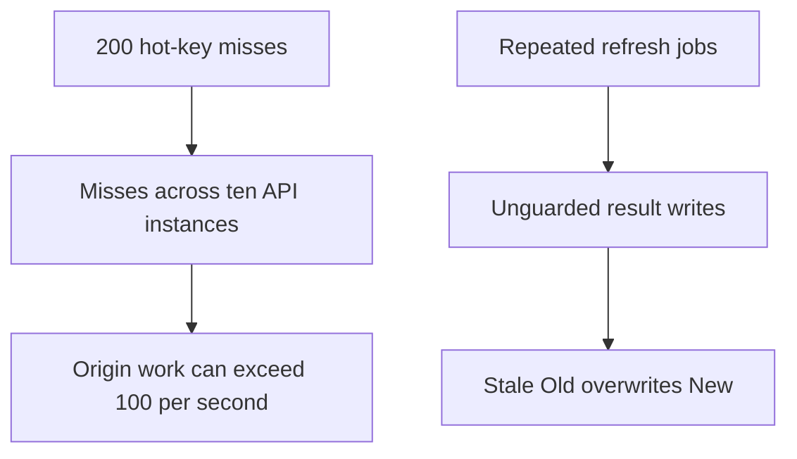
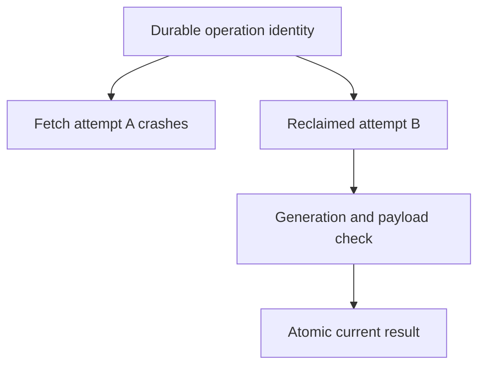
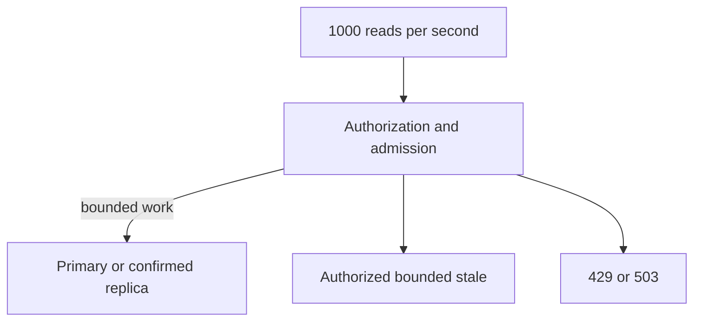
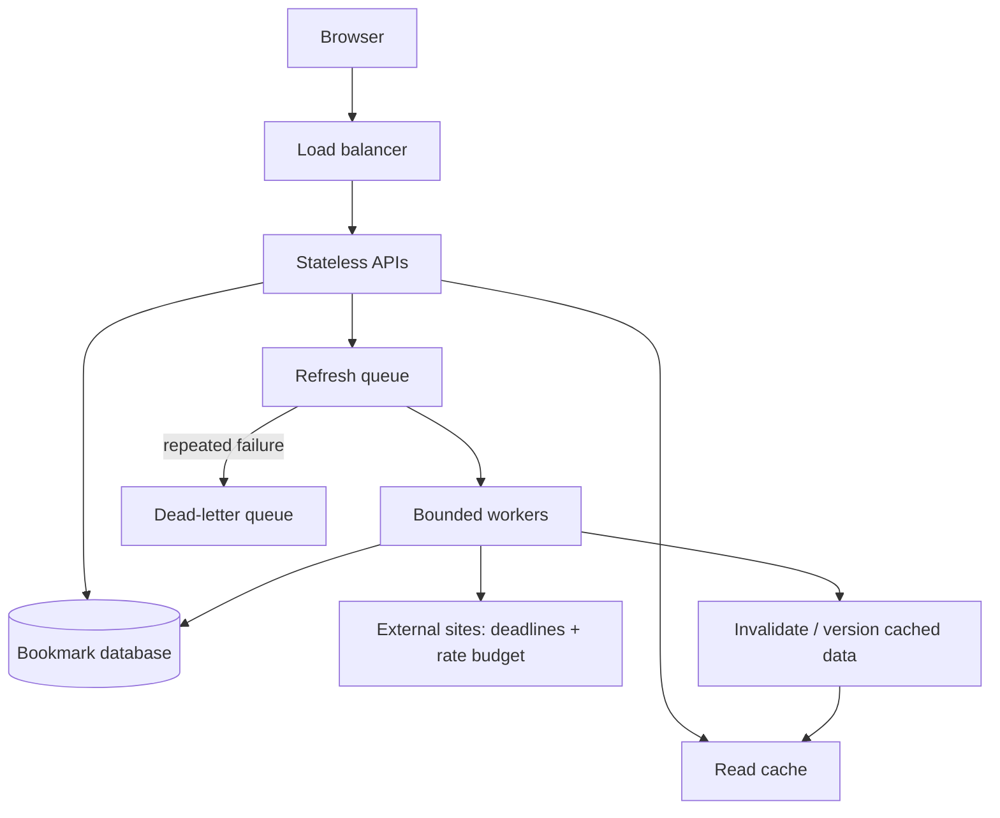

# P3 · it holds under load

## The reviewer's brief

> The same reading list now refreshes titles in the background. Two duplicate jobs arrive, a lease owner pauses, and a hot cache key expires across ten API instances. State what can be guaranteed at the stored result and what may execute more than once.

This is a **constructed practice brief**, not an attributed company question.
Prerequisites: [P2](../02-it-survives/README.md). This page is a build brief; it does not ship a runnable application. The original build and prompt sequence below defines the implementation checkpoints.

| Case | Exact input or workload | Expected outcome |
|---|---|---|
| Small example | Operation K has matching duplicate payloads; A owns epoch 1; B reclaims epoch 2 and stores `New`; A later submits `Old`. | One current result per retained operation identity; stale epoch 1 is rejected. Remote fetching may repeat after a crash. |
| Boundary / failure | 200 concurrent readers on ten instances miss one key; database budget is 100 reads/s. | Limit admitted origin work explicitly; do not infer one fleet-wide load from local coalescing or TTL jitter. |
| Scope | Refresh generations distinguish later refreshes from duplicate delivery of the same job. | Explain any additional assumption before implementing it. |

<!-- project-expectation:start -->

## What you are expected to hand over

**The finished artifact:** Stage 3 · the question is what happens when it is busy, and when a dependency dies? Same reading list. Now make it behave when it is under pressure and when the things it depends on stop working.

Treat that sentence as a review contract, not an inspiration. A reviewable
submission contains all of the following:

- the narrow working slice or decision artifact described above, reproducible
  from a clean checkout with assumptions stated;
- captured proof of the normal flow **and** the boundary/failure row above;
- tests, probes, or metrics that can go red when the important guarantee breaks;
- a short decision record naming ownership, excluded scope, and the first
  operational limit; and
- a changed contract, diagram, and new evidence for each follow-up—not only a
  paragraph claiming the original design still works.

### How the review conversation gets harder

| Review gate | The interviewer changes | Expected response |
|---|---|---|
| Baseline | Run the small example from the table above. | Demonstrate the observable outcome end to end and identify which boundary owns it. |
| Failure | Reproduce the boundary/failure row above. | Show the failure before the fix, then prove the protected behavior without hiding the error. |
| Senior · The owner stops after fetching | A crash occurs after the remote GET but before the durable record. How does retry recover? Predict which boundary must change before opening the design. | Refetch is allowed. Record outcome only with the current generation in an atomic completion transaction. Match payload hashes; a duplicate ID with different content is a conflict, not a replay. |
| Lead · The cache disappears | Traffic remains 1,000 reads/s but the database can handle only 100/s. What should users see? State what evidence would make you reject your first design. | Bound origin/bypass work and choose authorized bounded-stale responses or quick 429/503. If read-your-writes is required, use primary/session watermark/confirmed progress; a finite primary pin cannot cover unbounded replica lag. |
| Evidence | A reviewer asks, “How do you know?” | Build in three stops: reproduce the small case and baseline failure; implement the protected boundary; then replay both changed requirements with captured outputs. |
| Handoff | The author is unavailable and the environment is new. | Another engineer can run, observe, break, and recover the artifact from the repository evidence. |

Before implementation, say the baseline invariant, the owner of each piece of
state, and what the user sees when the named dependency or assumption fails. That
five-minute explanation is part of the project: if it is vague, the build is not
ready to begin.

<!-- project-expectation:end -->

Before looking at the guidance, state the invariant in one sentence and trace the example. In interview practice, implement or sketch independently, then reveal the reasoning. On the AI path, use the prompts below and verify each checkpoint before the next request.

## Baseline and the failure to explain



Two different concurrency boundaries fail: callers duplicate refresh work, and expired owners can write stale results. Neither is fixed by randomizing TTL alone.

<details>
<summary>Reveal the approach and decisions</summary>

Define item/job identity, atomic effect/result, conditional generations and retained deduplication horizon. Scope coalescing precisely and budget refresh/bypass work. The invariant is no stale stored completion and bounded downstream admission; do not promise exactly one remote read under crash recovery.

</details>

## Follow-up 1 · The owner stops after fetching

**Changed requirement:** A crash occurs after the remote GET but before the durable record. How does retry recover? Predict which boundary must change before opening the design.

<details>
<summary>Expected reasoning and changed diagram</summary>

Refetch is allowed. Record outcome only with the current generation in an atomic completion transaction. Match payload hashes; a duplicate ID with different content is a conflict, not a replay.



</details>

## Follow-up 2 · The cache disappears

**Changed requirement:** Traffic remains 1,000 reads/s but the database can handle only 100/s. What should users see? State what evidence would make you reject your first design.

<details>
<summary>Expected reasoning and changed diagram</summary>

Bound origin/bypass work and choose authorized bounded-stale responses or quick 429/503. If read-your-writes is required, use primary/session watermark/confirmed progress; a finite primary pin cannot cover unbounded replica lag.



</details>

## Evidence to bring to review

Build in three stops: reproduce the small case and baseline failure; implement the protected boundary; then replay both changed requirements with captured outputs. Record commands, fixtures, and observed results in your implementation README. A diagram is a prediction until those checks run.

**Senior expectation:** Trace stale-owner and cache-outage schedules with actual effect/query counts. **Additional lead scope:** Own tenant fairness, replay retention and freshness policy. Completion demonstrates practice evidence; it does not establish interview readiness or multi-team delivery experience.

## Supplied mechanism practice

- [Cache and replica boundary lab](../../../../curriculum/04-scale-and-evolution/01-data-at-scale/labs/cache-consistency/README.md) — includes its own run command, fixtures and validation limits.
- [Lease and provider recovery lab](../../../../curriculum/04-scale-and-evolution/04-migrations/labs/recovery-migration/README.md) — includes its own run command, fixtures and validation limits.
- [Reliability arithmetic and incident lab](../../../../curriculum/03-production/05-reliability/labs/reliability/README.md) — includes its own run command, fixtures and validation limits.

These exercises verify specific boundaries; completing their reference tests does not implement or assess the full project.

## Build and prompt sequence

> Stage 3 · the question is **what happens when it is busy, and when a dependency dies?**

Same reading list. Now make it behave when it is under pressure and when the
things it depends on stop working.

There is one new feature, and it exists only to create the pressure: the system
now fetches and re-checks links in the background — titles change, pages go
away, and somebody wants a weekly refresh. That gives you bursty writes, a slow
external dependency you do not control, and work that must survive being
retried. Everything else in this project is about what that does to you.

## What done means

- [ ] Link fetching happens on a queue, not in the request. The user's action returns immediately.
- [ ] The queue has a **bound**. You know what happens when it is full, because you chose it.
- [ ] Matching duplicate submissions for one retained operation identity produce one stored item/result under the chosen URL policy. Remote fetches may repeat after crashes; count and document them. Conflicting payload reuse is rejected.
- [ ] Every outbound call has a timeout you picked, a retry policy at exactly one layer, and jitter.
- [ ] When the external site is slow, your system stays responsive. It degrades rather than stopping.
- [ ] There is a cache, it has stampede protection, and you demonstrated the protection working.
- [ ] You measured throughput and latency under load, and you have the numbers written down.
- [ ] You know what breaks first, because you pushed it until something did.
- [ ] Rate limiting exists and returns something honest rather than dying.

## The decisions you are being asked to make

1. **What is the unit of work on the queue?** Define owner/item, operation ID, payload hash and refresh generation. Neither “fetch URL” nor “refresh item” is automatically idempotent; explain the protected stored effect and separate external execution.
2. **What happens when the queue is full?** Reject, shed, or block? Each is defensible; blocking is how a queue becomes a memory leak with a scheduler.
3. **What is your retry policy, and at which layer only?** Write the number of attempts and where jitter goes. Retrying at two layers multiplies, and three layers of three attempts is twenty-seven requests from one click.
4. **What does the user see while the fetch is pending?** This is a product decision and it is yours, not the queue's.
5. **What is stale-but-acceptable?** A cached title from an hour ago is fine. A cached authorisation decision from an hour ago is a security bug. Say where the line is.
6. **What do you shed first when you cannot serve everything?** Rank your request types before you need to.

## Working with Claude on it

**1. Make the failure modes explicit before the queue exists.**

```
I am moving link fetching out of the request and onto a queue.

List what can now go wrong that could not go wrong before. Include the
ones that are invisible: work silently lost, work done twice, work
backing up with nobody noticing.

Do not write code yet.
```

Why: a queue converts a slow synchronous failure into a fast success plus a
silent asynchronous failure. Naming that list before you build is the difference
between designing for it and discovering it.

**2. Prove the idempotency rather than asserting it.**

```
Make the stored result idempotent for one retained job identity and payload.
Deliver matching copies concurrently and assert one current committed result.
Then pause the old lease owner, let a new generation complete, and prove
the old completion is rejected. Allow repeated remote fetch after a crash.

Show me that test failing against the current code first.
```

Why: "it is idempotent" is a claim about a race. The only version worth
believing is one where two concurrent copies were actually run.

**3. Find the first thing to break, do not guess it.**

```
Write a load test that ramps up until something fails. Report what failed
first, at what rate, and what the failure looked like from the outside.

I want the actual limit, not a target.
```

Why: everyone assumes it will be the database. Frequently it is the connection
pool, the file descriptors, or the external API's rate limit. Guessing sends you
to optimise the wrong thing.

## How you would know it is wrong

1. **Expire a hot cache key under load** and watch what hits the database. If a hundred requests all miss and all recompute, you have a stampede and you just saw it.
2. **Stop the worker and keep submitting.** Watch the backlog. Does anything tell you it is growing? If not, that is your invisible failure.
3. **Deliver matching duplicate jobs concurrently** and assert one current stored result; reuse the ID with different content and require conflict. Crash after remote fetch and permit refetch; reject stale-generation completion.
4. **Point the fetcher at something that hangs forever.** Your timeout should fire. Time it, and compare to what you thought you configured.
5. **Count actual outbound requests during a failure**, not attempts you intended. Retry amplification is only visible from the outside.
6. **Run the load test twice and compare.** If the numbers move a lot, you are measuring your laptop's mood, not the system.
7. **Turn the external dependency off entirely.** The product should still work, minus the thing that depends on it. If everything stops, you have not degraded, you have coupled.

## Break it on purpose

| do this | what should happen | what it teaches |
|---|---|---|
| make the external site respond in 30 seconds | your timeout fires; the queue drains slower; nothing else notices | timeouts are the boundary between one slow thing and everything being slow |
| kill the worker mid-job | execution may repeat; current result commits conditionally or ends visibly failed | delivery, execution and stored effect are distinct guarantees |
| submit 10,000 items at once | the queue bounds, sheds or rejects — by your choice, loudly | an unbounded queue is not resilience, it is deferred failure |
| block cache reads/writes under load | origin work stays within budget; serve authorized bounded stale or return 429/503 | unlimited cache bypass can overload the database; correctness and availability need separate policies |

## What P4 will do to this

P4 adds a model to the system — a summary, a suggestion, something that
reasons — and then makes you prove it is any good. The AI call is another slow,
expensive, unreliable external dependency, and everything you built here applies
to it directly.

The new part in P4 is that its failures are not timeouts. They are plausible
wrong answers, which nothing in this project would have caught.

## Architecture rehearsal · Separate interactive reads from refresh work



**Draw the failure:** Kill an external dependency. Draw which work continues and where the backlog becomes visible.


[Static view](../../../../assets/learning/backpressure-still.svg)
