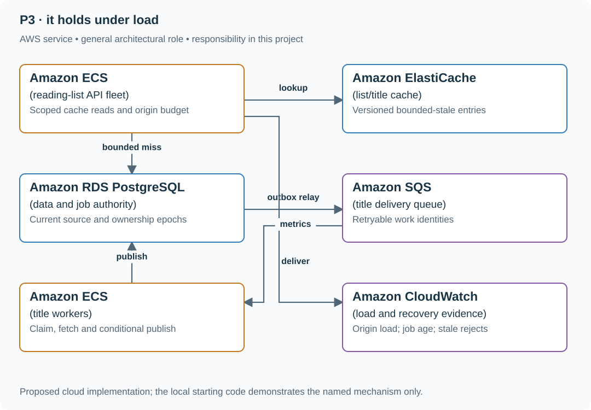

# Stage 3: Add durable jobs and bounded caching

## Application background

The Stage 2 reading list must serve more readers while fetching titles asynchronously. Background workers and caches improve responsiveness only if duplicates, stale work and origin load remain controlled.

This is a fictional engineering scenario. The workload figures later in the page are exercise assumptions, not measured production traffic.

## Your assignment

**Deliver:** Extend your running application with durable title jobs, fenced worker completion, authorized cache keys and measured admission limits.

Add asynchronous title jobs and caching to the working reading list. Two workers overlap after a lease expiry, and ten application instances face 200 readers while the database can sustain only 100 reads/s under this exercise workload.

**Required behavior:** Job acceptance is durable, result publication is fenced by current ownership epoch, and cache misses cannot exceed the database budget. A cache improves reads without becoming the authority for ownership, deletion or job completion.

The required first milestone is a working local implementation of the behavior above. The numbered implementation steps define the scope; the cloud architecture is a later extension, not something the starter has already provisioned.

## Get the code and run the supplied example

The code is in the public [junior-to-staff repository](https://github.com/Soulful-Iris/junior-to-staff). Install Git and Python 3.12+. No AWS account or Python packages are required for this first run. If you already have a checkout, use it and skip cloning.

```bash
git clone https://github.com/Soulful-Iris/junior-to-staff.git
cd junior-to-staff
python3 examples/architecture-starts/reading_list_under_load.py
```

**Supplied file:** [`examples/architecture-starts/reading_list_under_load.py`](https://github.com/Soulful-Iris/junior-to-staff/blob/main/examples/architecture-starts/reading_list_under_load.py). You can also [read or download the source here](../../../../examples/architecture-starts/reading_list_under_load.py).

This program is a **mechanism demonstration**: it runs the small scenario in one process and prints the result. It is not an HTTP service, a complete application, or an AWS deployment. A successful run demonstrates this mechanism only; it does not establish the workload or failure guarantees of the application you will build.

**Example output from the supplied run:**

Generated IDs and timestamps may differ; compare the state transitions and outcomes.

```text
rejected stale attempt {'epoch': 2, 'state': 'succeeded', 'title': 'New title'}
Offered 200/s, origin budget 100/s: at least 100/s need cache, bounded stale data, or rejection.
Ten local coalescers can still produce ten origin fills for one hot miss.
```

### Run the application you will extend

The [reading-list API setup guide](../../../../examples/reading-list-starter/README.md) gives you a real local HTTP server, SQLite database, save/list/edit requests and controlled title success/timeout behavior. Start it in one terminal and send the documented `curl` requests from another. Read that setup before following the implementation steps below. The demo above isolates this lesson's mechanism; the server is where you integrate it.

Continue the application you built in the preceding stage. The supplied server is only a Stage 1 starting point; it does not contain the previous stages' completed UI, operations, jobs or AI feature.

For a first run, start this in **terminal 1** from the repository root:

```bash
python3 examples/reading-list-starter/app.py --db /tmp/reading-list.sqlite3
```

In **terminal 2**, save one bookmark with a controlled title timeout:

```bash
curl -i http://127.0.0.1:8080/bookmarks \
  -H 'X-Demo-User: alice' -H 'Content-Type: application/json' \
  -d '{"url":"https://example.com/docs","title_mode":"timeout"}'
```

Expect **201 Created**, a bookmark `id` and `title_status: "timeout"`. The URL is persisted despite the title failure. This is the supplied baseline; the assignment adds the behavior described above. The lookup is a fixture, so no external website is contacted. For members Bob or Ben in a scenario, use the starter's second demo identity `bob`; Alice or Ana corresponds to `alice`.

Work in your own branch or copy `examples/reading-list-starter/` to `work/03-under-load/`. `app.py` exists in that directory; add the modules named below there as you separate HTTP, storage and background work. The server has demo membership, not production authentication.

## Local components and state to implement

This table names the records, interfaces or decision inputs for your deliverable. Unless a name is explicitly linked to supplied source above, it is something you create. Implement the local state transitions first, then connect the HTTP, storage or worker boundaries required by the steps.

| Record / module | Key or interface | Responsibility |
|---|---|---|
| jobs | link_id,source_version,epoch,lease,state | Durable work and publication authority. |
| cache_entry | group,key,source_version,expires_at | Bounded acceleration with current access checks. |
| origin_budget | active_limit,rate_limit,wait_deadline | Fleet/dependency protection during cache loss. |

## Implement the assignment

### 1. Move enrichment behind durable jobs

Commit job/outbox identity with the saved link. Add worker claims with lease and epoch, bounded retries and a visible failed/repair state. A queue message is delivery, while the job record is truth.

### 2. Fence publication and source versions

Before storing a title, require both current worker epoch and current link URL version. A completed old fetch cannot overwrite a new URL’s title. Acknowledge after result commit and recognize already completed jobs on redelivery.

### 3. Add cache-aside with bounded origin work

Key by group and source version, enforce authorization before response and coalesce hot misses. Add an explicit database concurrency/rate budget shared across the relevant fleet scope. Choose safe stale serving or rejection when the budget is exhausted.

### 4. Observe useful load and recovery

Record offered/completed/rejected requests, cache hit rate, origin reads, queue age and stale publication rejections. Stop a worker and clear the cache in a controlled local run; show bounded recovery instead of only a warm-cache latency number.

## Demonstrate the completed local result

| Action | Expected visible result |
|---|---|
| Run the starting program | The old worker cannot change the completed title. |
| Expire a hot key across all instances | Origin work remains within the configured dependency budget. |
| Restart after a completed job loses acknowledgement | Duplicate delivery observes the committed result. |

**Handoff:** In your implementation README, include the start command, one successful operation, the failure case above and the resulting stored state or decision. State which dependencies are simulated. Someone with a fresh checkout should be able to reproduce this without your chat history.

## Workload assumptions and capacity decisions

These are constructed exercise assumptions. The stated workload is a design target; the local demonstration does not establish that throughput. Use the [estimation constants](../../../../curriculum/01-code/01-problem-solving/estimation-constants.md) to check units before choosing capacity.

| Input or objective | Calculation / consequence |
|---|---|
| 200 readers issuing one request/s | 200 reads/s offered; a 100 reads/s origin cannot serve every miss directly. |
| Ten application instances | Per-process singleflight can still permit ten fills for one hot key; it is not a fleet-wide rate limit. |
| Worker epoch 1 pauses; epoch 2 finishes | The late epoch-1 result must be rejected, even if its network fetch succeeded. |

## Map the local implementation to AWS

**Deployment status: local only.** Running the supplied command creates no AWS resources and configures no cloud connections. The diagram is a proposed deployment of the completed application. Each box needs either a deployed runtime, a provisioned service or an explicitly external dependency.

Read the diagram by following the arrows from the entry point: application code accepts the request or event, the state owner commits it, and any worker produces the later result. The table ties those roles to code and adapter work. Multiple boxes do not imply multiple Python files already exist.



The added services separate optional work and hot reads, but the original database/version authority remains. Explicit resource budgets make the ten-instance design understandable during cache failure.

| Local responsibility | Cloud destination and role | Implementation still required |
|---|---|---|
| Application or worker process | Amazon ECS: reading-list API fleet | Build a container and task definition; supply configuration, task roles and graceful shutdown behavior. |
| Local cache, counter or coordination state | Amazon ElastiCache: list/title cache | Implement a Redis/Valkey adapter and atomic operations, expiry and unavailable-cache behavior; keep the durable authority separate. |
| Local records and transaction boundary | Amazon RDS PostgreSQL: data and job authority | Write PostgreSQL schema/migrations and a database adapter; configure credentials, connection limits and recovery. |
| Local pending-work collection | Amazon SQS: title delivery queue | Publish committed job intent, consume messages and persist deduplication/ownership state; add visibility, retry and dead-letter handling. |
| Application or worker process | Amazon ECS: title workers | Build a container and task definition; supply configuration, task roles and graceful shutdown behavior. |
| Local counters, timestamps and diagnostic output | Amazon CloudWatch: load and recovery evidence | Emit bounded metrics and logs, build the named operational view and configure retention and access. |

### Provision resources, then connect the application

| Resource or boundary | Initial configuration and reason |
|---|---|
| Worker configuration | Visibility/lease renewal and finite redrive policy; source-version checks survive retries. |
| Cache outage | Database budget applies even when every cache lookup misses. |
| Fleet capacity | Sum per-instance pools and limits; a local semaphore does not enforce a global maximum by itself. |

Use one disposable AWS environment for the cloud exercise. Put the named resources in `infra/template.yaml` or your existing IaC tool, pass resource IDs through configuration, and scope each runtime role to its own tables, buckets and queues. The diagram is a design to implement; it is not a claim that these resources have been deployed. Record the commands you used to deploy and remove the exercise resources.

For concrete provisioning commands, configuration wiring and cleanup, use the [AWS foundation guide](../../../../examples/architecture-starts/infra/README.md). It includes a deployable table/queue/object-storage foundation and explains which application and service adapters you still implement.

A provisioned queue or table does not make the local program use it. Configure resource IDs in the deployed runtime, replace the local adapter, and replay the same successful and failing operation against that runtime. Record the deployed commit and observable result, then remove the disposable resources using your infrastructure tool.

## Extend the design after the baseline works


Continue to stage 4 by adding optional AI tags without putting model latency or model guesses on the critical save/list path.

<details>
<summary>Additional design reasoning and requirement changes</summary>

## Follow-up 1 · The owner stops after fetching

**Changed requirement:** A crash occurs after the remote GET but before the durable record. How does retry recover? Predict which boundary must change before opening the design.

<details>
<summary>Expected reasoning and changed diagram</summary>

Refetch is allowed. Record outcome only with the current generation in an atomic completion transaction. Match payload hashes; a duplicate ID with different content is a conflict, not a replay.

</details>

## Follow-up 2 · The cache disappears

**Changed requirement:** Traffic remains 1,000 reads/s but the database can handle only 100/s. What should users see? State what evidence would make you reject your first design.

<details>
<summary>Expected reasoning and changed diagram</summary>

Bound origin/bypass work and choose authorized bounded-stale responses or quick 429/503. If read-your-writes is required, use primary/session watermark/confirmed progress; a finite primary pin cannot cover unbounded replica lag.

</details>

## Supplied mechanism practice

- [Cache and replica boundary lab](../../../../curriculum/04-scale-and-evolution/01-data-at-scale/labs/cache-consistency/README.md) — includes its own run command, fixtures and validation limits.
- [Lease and provider recovery lab](../../../../curriculum/04-scale-and-evolution/04-migrations/labs/recovery-migration/README.md) — includes its own run command, fixtures and validation limits.
- [Reliability arithmetic and incident lab](../../../../curriculum/03-production/05-reliability/labs/reliability/README.md) — includes its own run command, fixtures and validation limits.

These exercises verify specific boundaries; completing their reference tests does not implement or assess the full project.

</details>
