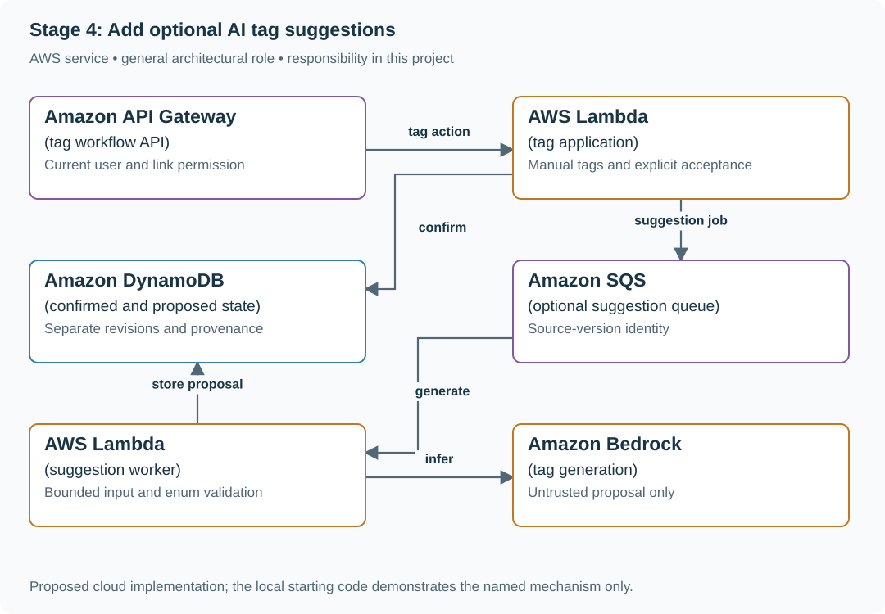

# Stage 4: Add optional AI tag suggestions

## Application background

The reading list already lets members tag bookmarks manually. You now want an optional helper that suggests tags from three allowed categories: databases, frontend and reliability. A member can accept a suggestion or keep choosing tags themselves.

The model reads article content, which may include mistakes or instructions written by someone else. It may also return an invented category. The application must treat the model's response as a proposal to validate, not an instruction it automatically obeys.

### Example walkthrough

| Action | Expected behavior |
|---|---|
| The model suggests `databases` | Offer it as an allowed suggestion. |
| The model suggests `wizardry` | Reject the unsupported category. |
| The model fails or the article tells it to call a tool | Keep manual tagging usable and do not grant tool authority. |

A taxonomy is the set of allowed categories. Output validation checks the proposed response against that set and the expected data shape before the interface uses it.

## Your assignment

**Deliver:** Add optional tag suggestions with allowed-category validation and recorded source/model versions. Require user acceptance and keep manual tagging usable when the model fails.

**Required behavior:** Model output is a proposal, not confirmed user data. Validate a closed tag set, preserve source/model versions and require explicit user acceptance. Manual save/list/tagging remains usable without a model response.

The required first milestone is a working local implementation of the behavior above. The numbered implementation steps define the scope. The cloud architecture is a later extension, not something the starter has already provisioned.

## Get the code and run the supplied example

The code is in the public [junior-to-staff repository](https://github.com/Soulful-Iris/junior-to-staff). Install Git and Python 3.12+. No AWS account or Python packages are required for this first run. If you already have a checkout, use it and skip cloning.

```bash
git clone https://github.com/Soulful-Iris/junior-to-staff.git
cd junior-to-staff
python3 examples/architecture-starts/reading_list_it_reasons.py
```

**Supplied file:** [`examples/architecture-starts/reading_list_it_reasons.py`](https://github.com/Soulful-Iris/junior-to-staff/blob/main/examples/architecture-starts/reading_list_it_reasons.py). You can also [read or download the source here](../../../../examples/architecture-starts/reading_list_it_reasons.py).

This program is a **mechanism demonstration**: it runs the small scenario in one process and prints the result. It is not an HTTP service, a complete application, or an AWS deployment. A successful run demonstrates this mechanism only. It does not establish the workload or failure guarantees of the application you will build.

**Example output from the supplied run:**

Generated IDs and timestamps may differ. Compare the state transitions and outcomes.

```text
Invalid suggestions: ['finance']
Confirmed before user action: []
Explicit manual confirmation: ['databases']
```

### Run the application you will extend

The [reading-list API setup guide](../../../../examples/reading-list-starter/README.md) gives you a real local HTTP server, SQLite database, save/list/edit requests and controlled title success/timeout behavior. Start it in one terminal and send the documented `curl` requests from another. Read that setup before following the implementation steps below. The demo above isolates this lesson's mechanism. The server is where you integrate it.

Continue the application you built in the preceding stage. The supplied server is only a Stage 1 starting point. It does not contain the previous stages' completed UI, operations, jobs or AI feature.

For a first run, start this in **terminal 1** from the repository root:

```bash
python3 examples/reading-list-starter/app.py --db /tmp/reading-list.sqlite3
```

In **terminal 2**, save one bookmark with a controlled title timeout:

```bash
curl -i http://127.0.0.1:8080/bookmarks \
  -H 'X-Demo-User: alice' -H 'Content-Type: application/json' \
  -d '{"url":"https://example.com/docs","title_mode":"timeout"}'
```

Expect **201 Created**, a bookmark `id` and `title_status: "timeout"`. The URL is persisted despite the title failure. This is the supplied baseline. The assignment adds the behavior described above. The lookup is a fixture, so no external website is contacted. For members Bob or Ben in a scenario, use the starter's second demo identity `bob`. Alice or Ana corresponds to `alice`.

Work in your own branch or copy `examples/reading-list-starter/` to `work/04-it-reasons/`. `app.py` exists in that directory. Add the modules named below there as you separate HTTP, storage and background work. The server has demo membership, not production authentication.

## Local components and state to implement

This table names the records, interfaces or decision inputs for your deliverable. Unless a name is explicitly linked to supplied source above, it is something you create. Implement the local state transitions first, then connect the HTTP, storage or worker boundaries required by the steps.

| Record / module | Key or interface | Responsibility |
|---|---|---|
| tag_suggestion | link_id,source_version,model,prompt,proposed_tags | Unconfirmed, provenance-bearing output. |
| confirmed_tags | link_id,user_revision,tag_ids | User-authorized application state. |
| suggestion_outcome | accepted,rejected,invalid,unavailable | Useful product evidence beyond generation success. |

## Implement the assignment

### 1. Keep the manual workflow complete

Add a tag picker backed by the closed taxonomy and conditional user revision. Save a link and tag it with the model disabled. This is the fallback and comparison baseline, not an unfinished error screen.

### 2. Generate a versioned proposal

Queue optional suggestion work with link/source identity. Pass only authorized bounded content to the model and record model/prompt versions. Treat retrieved instructions as content and expose no effectful tools for this task.

### 3. Validate and present suggestions

Parse the structured response, reject unknown tags and limit count/duplicates. Display the proposal distinctly from confirmed tags. A user action commits selected allowed tags against the current link revision. A late proposal cannot overwrite a manual choice.

### 4. Measure whether it helps

Record acceptance, correction, invalid-output rate, latency and usage assumptions. Review examples where a confident suggestion was wrong. Keep privacy and deletion behavior consistent with the earlier stages, including warmed suggestion caches.

## Demonstrate the completed local result

| Action | Expected visible result |
|---|---|
| Run the starting program | finance is rejected, and suggestions do not populate confirmed tags automatically. |
| Disable model access | Manual tagging still works. |
| Change the link while generation runs | The old source-version proposal is not applied to the new content. |

**Handoff:** In your implementation README, include the start command, one successful operation, the failure case above and the resulting stored state or decision. State which dependencies are simulated. Someone with a fresh checkout should be able to reproduce this without your chat history.

## Workload assumptions and capacity decisions

These are constructed exercise assumptions. The stated workload is a design target. The local demonstration does not establish that throughput. Use the [estimation constants](../../../../curriculum/01-code/01-problem-solving/estimation-constants.md) to check units before choosing capacity.

| Input or objective | Calculation / consequence |
|---|---|
| Three allowed tags | Validate exact normalized enum membership. A plausible fourth tag is still outside this contract. |
| 200 new links/day. 25% suggestion use assumption | Fifty model-assisted cases/day provides a bounded initial scope and review workload. |
| Two-second optional suggestion budget | On timeout, show manual tagging. Do not delay the already committed link. |

## Map the local implementation to AWS

**Deployment status: local only.** Running the supplied command creates no AWS resources and configures no cloud connections. The diagram is a proposed deployment of the completed application. Each box needs either a deployed runtime, a provisioned service or an explicitly external dependency.

Read the diagram by following the arrows from the entry point: application code accepts the request or event, the state owner commits it, and any worker produces the later result. The table ties those roles to code and adapter work. Multiple boxes do not imply multiple Python files already exist.



The model adds a proposal path beside the existing user-owned state. Keeping separate records makes it impossible for a retry or late answer to masquerade as a user-confirmed tag.

| Local responsibility | Cloud destination and role | Implementation still required |
|---|---|---|
| Local HTTP boundary or the endpoint you will add | Amazon API Gateway: tag workflow API | Create routes and an integration. Translate requests and responses and configure identity validation. |
| Python operation or worker function | AWS Lambda: tag application | Write a Lambda event adapter, package its dependencies and give its role only the required resource actions. |
| Local dictionary, SQLite records or state model | Amazon DynamoDB: confirmed and proposed state | Design partition/sort keys and write a storage adapter with conditional updates or transactions. Python state and SQL are not uploaded as a database. |
| Local pending-work collection | Amazon SQS: optional suggestion queue | Publish committed job intent, consume messages and persist deduplication/ownership state. Add visibility, retry and dead-letter handling. |
| Python operation or worker function | AWS Lambda: suggestion worker | Write a Lambda event adapter, package its dependencies and give its role only the required resource actions. |
| Deterministic model response fixture | Amazon Bedrock: tag generation | Implement model invocation with deadlines, input boundaries and validated output. Preserve the same permission and action rules. |

### Provision resources, then connect the application

| Resource or boundary | Initial configuration and reason |
|---|---|
| Model access | Suggestion worker can invoke the selected model and write proposals, not perform unrelated tools. |
| Validation | Closed enum, bounded input/output and source-version checks before showing a proposal. |
| Fallback | Manual tagging remains available when queue, model or parsing fails. |

Use one disposable AWS environment for the cloud exercise. Put the named resources in `infra/template.yaml` or your existing IaC tool, pass resource IDs through configuration, and scope each runtime role to its own tables, buckets and queues. The diagram is a design to implement. It is not a claim that these resources have been deployed. Record the commands you used to deploy and remove the exercise resources.

For concrete provisioning commands, configuration wiring and cleanup, use the [AWS foundation guide](../../../../examples/architecture-starts/infra/README.md). It includes a deployable table/queue/object-storage foundation and explains which application and service adapters you still implement.

A provisioned queue or table does not make the local program use it. Configure resource IDs in the deployed runtime, replace the local adapter, and replay the same successful and failing operation against that runtime. Record the deployed commit and observable result, then remove the disposable resources using your infrastructure tool.

## Extend the design after the baseline works


Continue to stage 5 by migrating the tag representation while old browsers, queued jobs and model prompts still refer to the previous contract.

<details>
<summary>Additional design reasoning and requirement changes</summary>

## Follow-up 1 · All regressions pass

**Changed requirement:** A bug was fixed and all required cases now pass. What should the release record show? Predict which boundary must change before opening the design.

<details>
<summary>Expected reasoning and changed diagram</summary>

Keep those passing regressions. Demonstrate that a seeded wrong-tag or cross-user-data mutation is caught, report challenge coverage and stochastic variability separately, and do not tune on held-out labels.

</details>

## Follow-up 2 · Budget expires mid-task

**Changed requirement:** Two attempts consume the task budget before a valid suggestion arrives. What gets committed? State what evidence would make you reject your first design.

<details>
<summary>Expected reasoning and changed diagram</summary>

Persist a visible exhausted/no-suggestion outcome without changing confirmed tags. Reserve budget before calls, bound attempts and elapsed time, and measure time-to-usable-suggestion. First-token latency is only relevant if streaming is actually shown.

</details>

## Supplied mechanism practice

- [Runnable evaluation and judge fixtures](../../../../curriculum/04-scale-and-evolution/03-ai-systems/labs/evaluations/README.md) — includes its own run command, fixtures and validation limits.

These exercises verify specific boundaries. Completing their reference tests does not implement or assess the full project.

</details>
