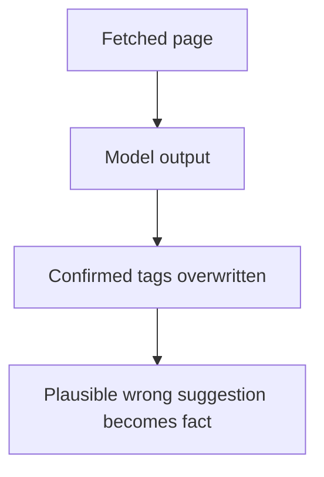
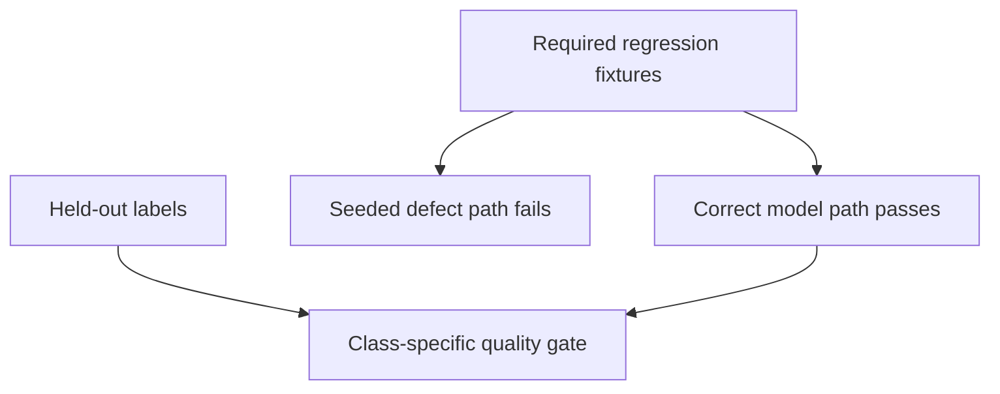
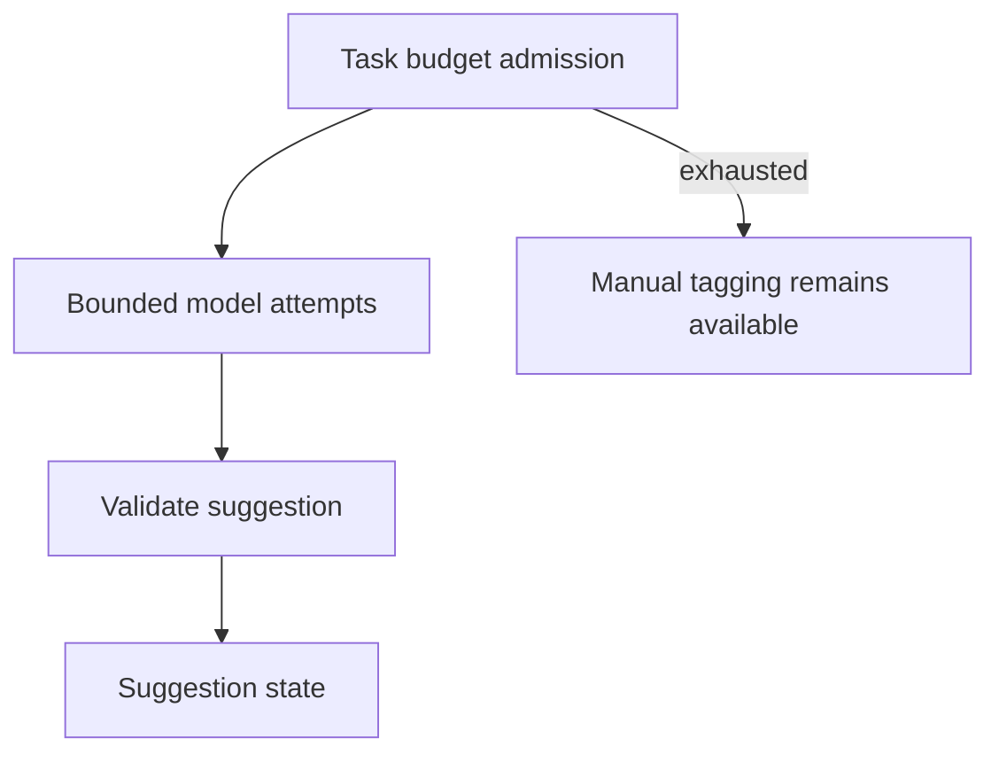
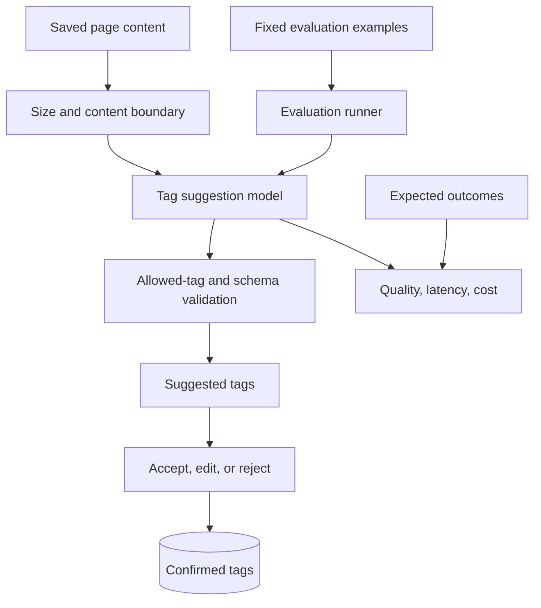

# P4 · it reasons, provably

## The reviewer's brief

> Users can accept or ignore suggested tags. The model passes twenty saved examples, but you must decide whether to enable it more broadly. Define the task contract and show what a failing suggestion looks like without assuming every passing test is weak.

This is a **constructed practice brief**, not an attributed company question.
Prerequisites: [P3](../03-under-load/README.md). This page is a build brief; it does not ship a runnable application. The original build and prompt sequence below defines the implementation checkpoints.

| Case | Exact input or workload | Expected outcome |
|---|---|---|
| Small example | Closed tags `{databases,frontend,reliability}`; page describes SQL indexes; expected `databases`; empty content expects no suggestion. | Store validated suggestions separately; only user acceptance changes confirmed tags. Unavailable or malformed output leaves manual tagging usable. |
| Boundary / failure | Human labels 99 pass/1 fail; judge always predicts pass. | 99% agreement with 0% failure recall is inadequate evidence of failure detection. |
| Scope | Use real collected examples for implementation; these inputs are constructed teaching fixtures. | Explain any additional assumption before implementing it. |

Before looking at the guidance, state the invariant in one sentence and trace the example. In interview practice, implement or sketch independently, then reveal the reasoning. On the AI path, use the prompts below and verify each checkpoint before the next request.

## Baseline and the failure to explain



The baseline merges a suggestion and a user decision. HTTP success and schema validity are different from task usefulness.

<details>
<summary>Reveal the approach and decisions</summary>

Separate suggestion state from confirmed state and define valid output, fallback, quality metrics and hard constraints. Partition development/regression/challenge/holdout data. The invariant is that only an authorized user or explicit product rule confirms tags; quality gates demonstrate sensitivity to seeded relevant defects.

</details>

## Follow-up 1 · All regressions pass

**Changed requirement:** A bug was fixed and all required cases now pass. What should the release record show? Predict which boundary must change before opening the design.

<details>
<summary>Expected reasoning and changed diagram</summary>

Keep those passing regressions. Demonstrate that a seeded wrong-tag or cross-user-data mutation is caught, report challenge coverage and stochastic variability separately, and do not tune on held-out labels.



</details>

## Follow-up 2 · Budget expires mid-task

**Changed requirement:** Two attempts consume the task budget before a valid suggestion arrives. What gets committed? State what evidence would make you reject your first design.

<details>
<summary>Expected reasoning and changed diagram</summary>

Persist a visible exhausted/no-suggestion outcome without changing confirmed tags. Reserve budget before calls, bound attempts and elapsed time, and measure time-to-usable-suggestion; first-token latency is only relevant if streaming is actually shown.



</details>

## Evidence to bring to review

Build in three stops: reproduce the small case and baseline failure; implement the protected boundary; then replay both changed requirements with captured outputs. Record commands, fixtures, and observed results in your implementation README. A diagram is a prediction until those checks run.

**Senior expectation:** Show fault-sensitive passing regressions, held-out judge metrics and budget exhaustion. **Additional lead scope:** Own release gates, drift review and user correction paths. Completion demonstrates practice evidence; it does not establish interview readiness or multi-team delivery experience.

## Supplied mechanism practice

- [Runnable evaluation and judge fixtures](../../../../curriculum/04-scale-and-evolution/03-ai-systems/labs/evaluations/README.md) — includes its own run command, fixtures and validation limits.

These exercises verify specific boundaries; completing their reference tests does not implement or assess the full project.

## Build and prompt sequence

> Senior tier · fed by section 15 · the question is **can you add a model to it and prove it is any good?**

Same reading list. Add one small feature that uses a model, and then spend most
of the project proving whether it works.

The feature is deliberately modest: when somebody saves a link, suggest tags for
it from the page's content. That is it. If you find yourself building a chat
interface, you have swapped this project for a different one, and the different
one teaches less.

**The feature is perhaps a fifth of the work. The other four fifths are the
evaluation, and that ratio is the lesson.**

## What done means

- [ ] Tag suggestions appear, and a person can accept, edit or ignore them.
- [ ] You read **thirty real outputs by hand** and grouped the failures into a taxonomy you wrote yourself.
- [ ] At least twenty versioned cases have operational task metrics or pass/fail gates with stated thresholds; development, regression, challenge and held-out purposes are distinguished.
- [ ] Required regressions pass and reject seeded relevant defects. Challenge-set results are documented separately; no current product failure is required.
- [ ] If a model judges, report class balance, confusion matrix and failure precision/recall where defined on held-out human labels; include the always-pass judge counterexample.
- [ ] Cost is recorded per suggestion, and there is a hard cap in code that you have tested by hitting it.
- [ ] Time-to-usable-suggestion is measured from the browser; measure first-token latency separately only if the UI actually streams tokens.
- [ ] Turning the model off leaves the product working, minus this feature.
- [ ] You wrote down why this is a model rather than a rule, honestly.
- [ ] There is a written trifecta analysis: what private data it sees, what untrusted content it reads, what it can send outward — and which leg you cut.

## The decisions you are being asked to make

1. **What exactly is the model deciding?** "Suggest tags" is a product sentence. The engineering version names the input, the allowed outputs, and what happens when it is unsure.
2. **Is the tag set open or closed?** A closed vocabulary makes evaluation tractable and the feature slightly worse. An open one is the reverse. Pick, and say what it costs.
3. **What does the untrusted content do to you?** The page you fetched is written by somebody else and your model is about to read it. That is the whole of prompt injection, in your own product, on purpose.
4. **What is a failure here?** A wrong tag, a missing obvious tag, a tag that leaks something from another user's item? They are different failures with different severities and your eval must tell them apart.
5. **What does the user see when it fails?** Silence, a guess, or an honest "could not suggest"? The third is usually right and is almost never what gets built.

## Working with Claude on it

**1. Error analysis before any metric.**

```
Here are 30 real outputs with their inputs.

Do not score them. Read them, and group the failures into categories you
derive from what you see. Report the count per category and two examples
of each.

Then tell me which single category, fixed, removes the most failures.
```

Why: a score is a number with nothing under it. A taxonomy derived from the data
is the shape of your actual problem, and the counts tell you where to spend.

**2. Build the eval so it can fail.**

```
Turn category <X> into an explicit task metric or release gate with a
threshold. Keep required regressions passing. Seed relevant wrong-tag,
malformed-output and cross-user-data defects and show the appropriate
checks rejecting them. Restore the correct path, then evaluate untouched
held-out cases. Report challenge failures separately.
```

Why: seeded failures test the instrument’s sensitivity. A useful regression
can pass on the fixed system; its ability to reject a relevant defect is the
evidence, not a requirement to ship known failures.

**3. The injection test on your own feature.**

```
Write a test page whose visible content includes text trying to redirect
the tagging model — for example instructing it to ignore its task.

Run it through the real pipeline and show me what the model produced.
Then tell me what in my architecture, not my prompt, would stop it.
```

Why: doing this to your own system, on purpose, once, is worth more than reading
about it. The second half forbids the answer "add a line to the prompt", which
is the answer everyone reaches for and the one that does not hold.

## How you would know it is wrong

1. **Replace the model with a stub that returns a fixed answer.** Relevant wrong-answer cases must fail. Format or empty-input cases may legitimately pass; report exactly which checks the stub exercises and which it cannot assess.
2. **Evaluate the judge on held-out human labels.** Report class-specific errors and uncertainty with sample size; overall agreement alone cannot establish failure detection.
3. **Reorder the options in any pairwise comparison** and count how many verdicts flip. That is your noise floor.
4. **Check the cost on the worst case**, not the average — the longest page, the most tags, the retry — and confirm the cap actually stops it.
5. **Measure time-to-usable-suggestion from the browser.** Include queueing and validation; report first-token time only for an actual streaming flow.
6. **Feed it a page in another language, an empty page, and a page that is one image.** Three inputs, thirty seconds, and they will find more than an hour of thinking.
7. **Turn the model off** and use the product. What you experience is your degradation path whether or not you designed it.

## Break it on purpose

| do this | what should happen | what it teaches |
|---|---|---|
| make the model return malformed output | handled as a failure, not written to the database | anything that parses model output is parsing untrusted input |
| put instructions in the page content | the architecture limits the damage, not the prompt | prompt injection is a design problem |
| run the same input twice | you find out how non-deterministic your feature is | it is more than you think, and your eval must cope |
| let the cap fire mid-request | a clear, honest failure and no half-written state | a budget that corrupts data when it fires is worse than none |

## What P5 will do to this

P5 makes you replace something load-bearing in the system you now have, safely,
with a written design doc and a rollout plan — and the tagging feature is a
tempting thing to migrate, because it is the newest and the least certain.

Whatever you choose, P5 is where the guide stops being about building and starts
being about changing something other people depend on.

## Architecture rehearsal · Keep suggestion quality separate from API uptime



**Draw the failure:** If the model returns nonsense with HTTP 200, which box detects the product failure?
