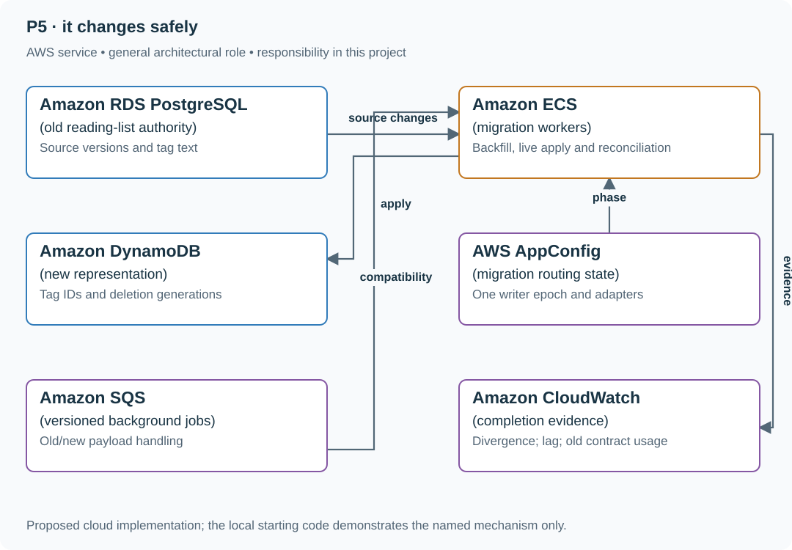

# Stage 5: Migrate the reading list to stable tag IDs

## Application background

The accumulated reading-list application now has a UI, workers, exports and optional AI suggestions. Changing tag identity affects all those consumers while members continue editing data.

This is a fictional engineering scenario. The workload figures later in the page are exercise assumptions, not measured production traffic.

## Your assignment

**Deliver:** Carry out a compatibility-first migration with version-aware backfill, deletion protection, reconciliation and retirement of the old format.

Evolve the completed reading list from text tags to stable tag IDs while users keep editing and deleting links. An old backfill row arrives after a live edit and deletion. The migration must include browsers, workers, exports and AI inputs, not just the database table.

**Required behavior:** Versioned apply preserves the newest source state including deletion. One write authority exists at a time. Supported old contracts are adapted until retirement, and the irreversible rollback boundary is recorded before incompatible writes begin.

The required first milestone is a working local implementation of the behavior above. The numbered implementation steps define the scope; the cloud architecture is a later extension, not something the starter has already provisioned.

## Get the code and run the supplied example

The code is in the public [junior-to-staff repository](https://github.com/Soulful-Iris/junior-to-staff). Install Git and Python 3.12+. No AWS account or Python packages are required for this first run. If you already have a checkout, use it and skip cloning.

```bash
git clone https://github.com/Soulful-Iris/junior-to-staff.git
cd junior-to-staff
python3 examples/architecture-starts/reading_list_it_changes.py
```

**Supplied file:** [`examples/architecture-starts/reading_list_it_changes.py`](https://github.com/Soulful-Iris/junior-to-staff/blob/main/examples/architecture-starts/reading_list_it_changes.py). You can also [read or download the source here](../../../../examples/architecture-starts/reading_list_it_changes.py).

This program is a **mechanism demonstration**: it runs the small scenario in one process and prints the result. It is not an HTTP service, a complete application, or an AWS deployment. A successful run demonstrates this mechanism only; it does not establish the workload or failure guarantees of the application you will build.

**Example output from the supplied run:**

Generated IDs and timestamps may differ; compare the state transitions and outcomes.

```text
5 applied
6 applied
4 ignored stale
Final: {'version': 6, 'tags': [], 'deleted': True}
```

### Run the application you will extend

The [reading-list API setup guide](../../../../examples/reading-list-starter/README.md) gives you a real local HTTP server, SQLite database, save/list/edit requests and controlled title success/timeout behavior. Start it in one terminal and send the documented `curl` requests from another. Read that setup before following the implementation steps below. The demo above isolates this lesson's mechanism; the server is where you integrate it.

Continue the application you built in the preceding stage. The supplied server is only a Stage 1 starting point; it does not contain the previous stages' completed UI, operations, jobs or AI feature.

For a first run, start this in **terminal 1** from the repository root:

```bash
python3 examples/reading-list-starter/app.py --db /tmp/reading-list.sqlite3
```

In **terminal 2**, save one bookmark with a controlled title timeout:

```bash
curl -i http://127.0.0.1:8080/bookmarks \
  -H 'X-Demo-User: alice' -H 'Content-Type: application/json' \
  -d '{"url":"https://example.com/docs","title_mode":"timeout"}'
```

Expect **201 Created**, a bookmark `id` and `title_status: "timeout"`. The URL is persisted despite the title failure. This is the supplied baseline; the assignment adds the behavior described above. The lookup is a fixture, so no external website is contacted. For members Bob or Ben in a scenario, use the starter's second demo identity `bob`; Alice or Ana corresponds to `alice`.

Work in your own branch or copy `examples/reading-list-starter/` to `work/05-it-changes/`. `app.py` exists in that directory; add the modules named below there as you separate HTTP, storage and background work. The server has demo membership, not production authentication.

## Local components and state to implement

This table names the records, interfaces or decision inputs for your deliverable. Unless a name is explicitly linked to supplied source above, it is something you create. Implement the local state transitions first, then connect the HTTP, storage or worker boundaries required by the steps.

| Record / module | Key or interface | Responsibility |
|---|---|---|
| migration_phase | phase,checkpoint,writer_epoch | Explicit authority and restart progress. |
| new_link_state | link_id,tag_ids,source_version,deleted | Conditional monotonic target apply. |
| compatibility_inventory | consumer,old_shape,new_shape,owner,retirement | Actual application-wide completion criteria. |

## Implement the assignment

### 1. Inventory the entire working system

List browser request/response fields, store methods, queued payloads, exports, prompt inputs and model-output validators. Keep one canonical tag mapping and adapt old contracts deliberately. The previous stage’s optional model does not get an exception from schema compatibility.

### 2. Backfill with versions and tombstones

Capture a source boundary, apply live changes without a gap and checkpoint completed ranges. Use the same conditional apply function for snapshot rows and subsequent updates/deletes. Replaying an old range must not recreate deleted links.

### 3. Reconcile and switch authority

Compare canonical source/target state at an aligned watermark. Fence old writes, catch up the final change prefix and move the writer epoch/routing state. Keep authorized reads and personal read markers consistent through the transition.

### 4. Retire and hand over

Observe actual old-consumer usage, adapt or drain old queue messages and record the removal conditions. Demonstrate the supported rollback before the incompatible-write boundary and the forward-repair procedure after it. Finish with run commands, data/infra ownership and the measured limits from all five stages.

## Demonstrate the completed local result

| Action | Expected visible result |
|---|---|
| Run the starting program | The version-6 deletion survives late version-4 backfill. |
| Replay an old title/tag job | It follows the adapter/source-version rule and cannot resurrect old data. |
| Inspect every consumer after cutover | The retirement inventory has an owner and evidence for each remaining old path. |

**Handoff:** In your implementation README, include the start command, one successful operation, the failure case above and the resulting stored state or decision. State which dependencies are simulated. Someone with a fresh checkout should be able to reproduce this without your chat history.

## Workload assumptions and capacity decisions

These are constructed exercise assumptions. The stated workload is a design target; the local demonstration does not establish that throughput. Use the [estimation constants](../../../../curriculum/01-code/01-problem-solving/estimation-constants.md) to check units before choosing capacity.

| Input or objective | Calculation / consequence |
|---|---|
| Backfill version 4; live edit 5; deletion 6 | Applying 4 last must leave the version-6 tombstone intact. |
| Four active consumer families | Browser/API, title worker, export and AI-tagging paths all need compatibility decisions. |
| 10,000 links; 100 rows/s exercise backfill | About 100 seconds ideal copy time, plus live-change catch-up and reconciliation. |

## Map the local implementation to AWS

**Deployment status: local only.** Running the supplied command creates no AWS resources and configures no cloud connections. The diagram is a proposed deployment of the completed application. Each box needs either a deployed runtime, a provisioned service or an explicitly external dependency.

Read the diagram by following the arrows from the entry point: application code accepts the request or event, the state owner commits it, and any worker produces the later result. The table ties those roles to code and adapter work. Multiple boxes do not imply multiple Python files already exist.



This stage changes the same system built in the earlier stages. The migration succeeds when its consumers and operating procedures agree on the new state, not when a copy counter reaches 100%.

| Local responsibility | Cloud destination and role | Implementation still required |
|---|---|---|
| Local records and transaction boundary | Amazon RDS PostgreSQL: old reading-list authority | Write PostgreSQL schema/migrations and a database adapter; configure credentials, connection limits and recovery. |
| Application or worker process | Amazon ECS: migration workers | Build a container and task definition; supply configuration, task roles and graceful shutdown behavior. |
| Local dictionary, SQLite records or state model | Amazon DynamoDB: new representation | Design partition/sort keys and write a storage adapter with conditional updates or transactions; Python state and SQL are not uploaded as a database. |
| Local versioned configuration | AWS AppConfig: migration routing state | Publish validated configuration versions and consume them with bounded caching and rollback behavior. |
| Local pending-work collection | Amazon SQS: versioned background jobs | Publish committed job intent, consume messages and persist deduplication/ownership state; add visibility, retry and dead-letter handling. |
| Local counters, timestamps and diagnostic output | Amazon CloudWatch: completion evidence | Emit bounded metrics and logs, build the named operational view and configure retention and access. |

### Provision resources, then connect the application

| Resource or boundary | Initial configuration and reason |
|---|---|
| Authority | Enforce fencing at writes; configuration changes alone do not stop stale processes. |
| Compatibility | Keep old response/job adapters until recorded retirement conditions, then remove dead paths. |
| Recovery | Preserve the earlier backup/restore procedure and verify how the new representation changes it. |

Use one disposable AWS environment for the cloud exercise. Put the named resources in `infra/template.yaml` or your existing IaC tool, pass resource IDs through configuration, and scope each runtime role to its own tables, buckets and queues. The diagram is a design to implement; it is not a claim that these resources have been deployed. Record the commands you used to deploy and remove the exercise resources.

For concrete provisioning commands, configuration wiring and cleanup, use the [AWS foundation guide](../../../../examples/architecture-starts/infra/README.md). It includes a deployable table/queue/object-storage foundation and explains which application and service adapters you still implement.

A provisioned queue or table does not make the local program use it. Configure resource IDs in the deployed runtime, replace the local adapter, and replay the same successful and failing operation against that runtime. Record the deployed commit and observable result, then remove the disposable resources using your infrastructure tool.

## Extend the design after the baseline works


Choose the next change from observed user demand or operating limits. Carry forward the same discipline: concrete scenario, measurable contract, explicit state authority, runnable path and honest recovery evidence.

<details>
<summary>Additional design reasoning and requirement changes</summary>

## Follow-up 1 · A delete is missed

**Changed requirement:** Counts match but item 7 is present in the target after deletion. What check was missing? Predict which boundary must change before opening the design.

<details>
<summary>Expected reasoning and changed diagram</summary>

Use tombstone/version/value-level reconciliation, not just counts. Replay the missing deletion idempotently and keep it beyond the maximum replay horizon; name gaps in the source log and resnapshot if history expired.

</details>

## Follow-up 2 · Rollback after target-only writes

**Changed requirement:** New writers now create fields the old path cannot read. Can routing alone restore service? State what evidence would make you reject your first design.

<details>
<summary>Expected reasoning and changed diagram</summary>

No. Require reverse projection/compatibility before cutover or define a stop-and-fix-forward boundary. DNS changes also wait for resolver caches and existing connections; distinguish route admission from data readiness.

</details>

## Supplied mechanism practice

- [Live migration and rollback fixture](../../../../curriculum/04-scale-and-evolution/04-migrations/labs/recovery-migration/migration.md) — includes its own run command, fixtures and validation limits.

These exercises verify specific boundaries; completing their reference tests does not implement or assess the full project.

</details>
