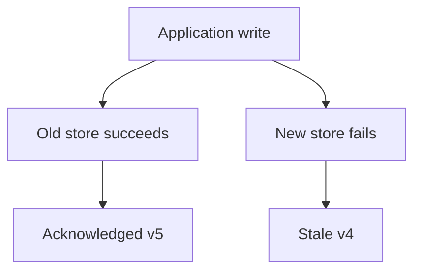
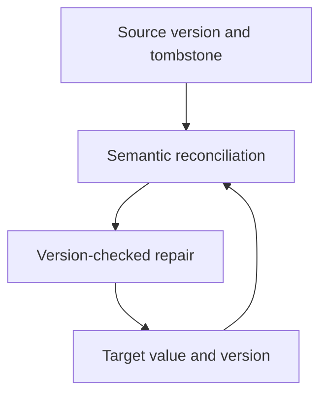
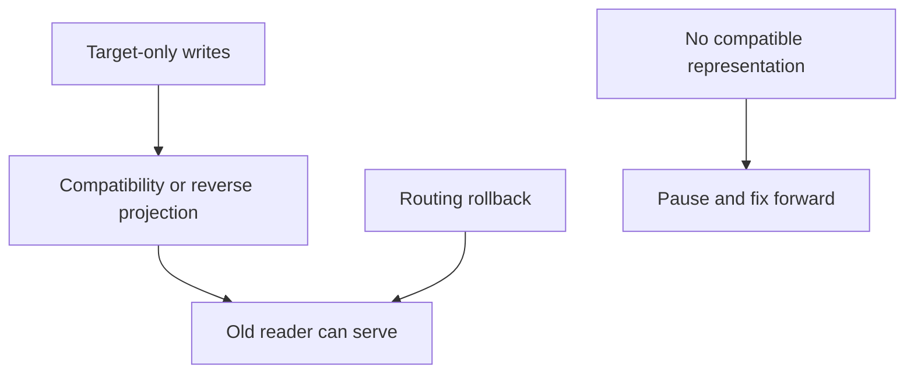
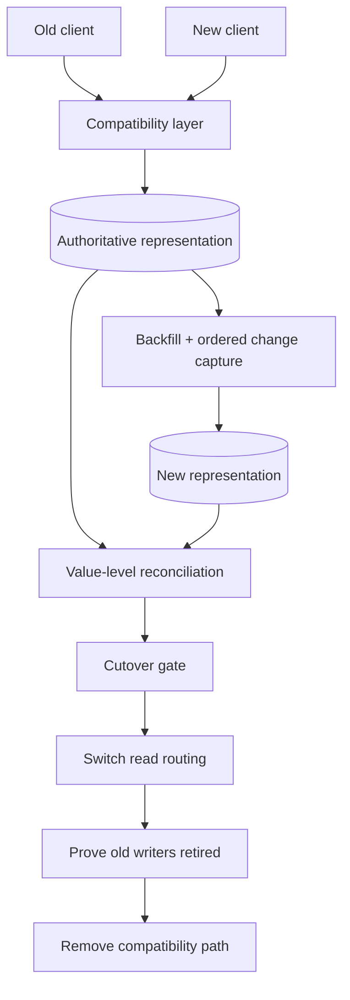

# P5 · it changes safely

## The reviewer's brief

> Your reading list has old clients, queued refresh jobs and confirmed AI tags. Move bookmark storage without dropping acknowledged writes or reviving deleted items, then retire the old path. How does the hardest consumer constrain rollback?

This is a **constructed practice brief**, not an attributed company question.
Prerequisites: [P4](../04-it-reasons/README.md). This page is a build brief; it does not ship a runnable application. The original build and prompt sequence below defines the implementation checkpoints.

| Case | Exact input or workload | Expected outcome |
|---|---|---|
| Small example | Backfill reads item 7 at v4; live edit produces v5; deletion creates v6 tombstone; v4 arrives last. | Target remains deleted at v6; a delayed backfill cannot overwrite newer live state. |
| Boundary / failure | An old-store write succeeds while an independent target write fails. | Durable source change capture enables replay/repair; observed divergence is not itself safety. |
| Scope | Choose authority and compatible readers/writers at each phase; retirement can have benefits beyond earlier cohort gains. | Explain any additional assumption before implementing it. |

Before looking at the guidance, state the invariant in one sentence and trace the example. In interview practice, implement or sketch independently, then reveal the reasoning. On the AI path, use the prompts below and verify each checkpoint before the next request.

## Baseline and the failure to explain



“Dual-writing is safe” omits the partial-failure and ordering protocol. The migration must retain an authoritative repair source for every acknowledged mutation.

<details>
<summary>Reveal the approach and decisions</summary>

Write the compatibility matrix, select authority, capture live changes durably, version backfill/replay, and preserve tombstones. Gate read cohorts with semantic comparisons and test rollback against new writes. The invariant is monotonic per-item versions with no lost accepted mutation or resurrection.

</details>

## Follow-up 1 · A delete is missed

**Changed requirement:** Counts match but item 7 is present in the target after deletion. What check was missing? Predict which boundary must change before opening the design.

<details>
<summary>Expected reasoning and changed diagram</summary>

Use tombstone/version/value-level reconciliation, not just counts. Replay the missing deletion idempotently and keep it beyond the maximum replay horizon; name gaps in the source log and resnapshot if history expired.



</details>

## Follow-up 2 · Rollback after target-only writes

**Changed requirement:** New writers now create fields the old path cannot read. Can routing alone restore service? State what evidence would make you reject your first design.

<details>
<summary>Expected reasoning and changed diagram</summary>

No. Require reverse projection/compatibility before cutover or define a stop-and-fix-forward boundary. DNS changes also wait for resolver caches and existing connections; distinguish route admission from data readiness.



</details>

## Evidence to bring to review

Build in three stops: reproduce the small case and baseline failure; implement the protected boundary; then replay both changed requirements with captured outputs. Record commands, fixtures, and observed results in your implementation README. A diagram is a prediction until those checks run.

**Senior expectation:** Replay live update/delete fixtures and document a real reversible boundary. **Additional lead scope:** Resolve consumer deadlines, migration cost and honest completion counters. Completion demonstrates practice evidence; it does not establish interview readiness or multi-team delivery experience.

## Supplied mechanism practice

- [Live migration and rollback fixture](../../../../curriculum/04-scale-and-evolution/04-migrations/labs/recovery-migration/migration.md) — includes its own run command, fixtures and validation limits.

These exercises verify specific boundaries; completing their reference tests does not implement or assess the full project.

## Build and prompt sequence

> Staff tier · fed by sections 16, 17, 19, 20 · the question is **can you replace a load-bearing piece without stopping the world?**

The last project is not a feature. It is a **migration** of the system you have
spent four projects building, done the way you would have to do it if other
people depended on it.

Pick something genuinely structural. How items are stored. How authentication
works. The job runner from P3. Not a library upgrade, not a rename — something
where a mistake means data in two shapes and a bad afternoon.

And the deliverable is not only the migration. It is the **writing around it**:
the document that would let somebody else decide whether to let you do this.

## What done means

- [ ] A design doc exists, under four pages, with context, goals, **at least three non-goals**, and **two alternatives argued at their strongest** with a stated reason each lost.
- [ ] Named approvers. Actual people, who know they are approvers, even if that is one friend.
- [ ] Kill criteria, written before you start: what you would observe that makes you stop and revert.
- [ ] Phase one was done on the **hardest** case, not the easiest, and you wrote down what it taught you that the plan had wrong.
- [ ] New usage of the old path fails the build. You demonstrated it failing.
- [ ] A remaining-work counter you can run any day, plus a written note of what it misses.
- [ ] **The finish.** The old code is deleted, in a commit, with the counter at zero.
- [ ] A postmortem of something that went wrong during it — and something will — written blamelessly and with one change that actually happened as a result.

## The decisions you are being asked to make

1. **What is the smallest migration that is still genuinely load-bearing?** Too small and it teaches nothing; too large and you will abandon it at 80% and prove the point the hard way.
2. **Do you run both paths at once, and for how long?** Independent dual writes can partially fail or reorder. Name the authoritative writer, durable capture, versioned repair and rollback compatibility; then choose a coexistence period and cutover gate.
3. **How do you verify the new path agrees with the old one?** Shadow reads, comparison in production, a reconciliation job? "We tested it" is not an answer at this scale.
4. **What is irreversible?** Usually a schema change or a deletion. Find it, and make it the last thing you do rather than the first.
5. **What would make you stop?** Decide now, while calm. Kill criteria written during an incident are not criteria, they are feelings.

## Working with Claude on it

**1. The steelman for your document.**

```
Here is my migration plan and the alternative I rejected.

Argue for the alternative as strongly as you can. Assume its advocate
knows something about the cost or the risk that I do not.

Do not balance it. Argue one side.
```

Why: the alternatives section is where a design doc's credibility lives, and a
weak steelman is visible immediately. You want the argument you will actually
face, before you face it.

**2. Find the hardest case.**

```
Here is what uses the thing I am replacing. Rank them by how AWKWARD they
are to migrate, not by size — I want the one most likely to break my plan.

For the top one, tell me what specifically does not fit the new model.
```

Why: migrating the easy thing first produces confidence and no information.

**3. The mechanical block.**

```
Write the check that makes new usage of the old path fail the build.
Not a warning. Show me it failing on a deliberately added usage, then
passing when I remove it.
```

Why: without this, you are migrating faster than new usage appears, or you are
not, and you will not find out for months.

**What to keep for yourself:** the decision, the kill criteria, and the
postmortem. Especially the postmortem — a model can format one, and the value
was never in the formatting.

## How you would know it is wrong

1. **Give the design doc to someone who has not seen the system** and ask them to say back what is being decided, what is out of scope, and what you rejected. If they cannot, the document is wrong.
2. **Show the alternatives section to somebody who prefers one you rejected.** "That is not why I would have argued for it" means you built a strawman.
3. **Run your remaining-work counter, then grep by hand.** A difference means the counter is the broken thing, and you were about to declare victory on it.
4. **Push a branch that adds new usage of the old path.** The build must fail.
5. **Try deleting the old system early, in a branch**, and see what screams. Five minutes now, a decision later.
6. **Check whether both paths are documented as current.** If a new reader could reasonably pick the old one, they will.
7. **Read your kill criteria back after you finish.** Would you have noticed if they had been met? If not, they were not observable, and you would have carried on regardless.

## Break it on purpose

| do this | what should happen | what it teaches |
|---|---|---|
| run old and new against live updates, deletes and delayed backfill | required invariants match after repair; seeded divergence must be detected | comparison reveals differences; ordered idempotent repair resolves them |
| abandon the migration at 80% deliberately, for a day | measure what carrying both systems costs you in that day | this is the cost people pay for years without measuring once |
| roll back mid-migration | you find out what is actually reversible, which is less than you assumed | irreversibility is discovered, not designed, unless you look |
| have somebody else deploy it | every question they ask is a gap in the document | the document is the artefact, not the code |

## When you are finished

Write the last thing in the guide: a short note to yourself about what changed
in how you work, from P1 to here.

Not what you learned — what you now **do differently**. Those are not the same,
and the difference between them is roughly the whole subject of this repo.

## Architecture rehearsal · Prove coexistence and retirement



**Draw the failure:** Define the last reversible step. This is one migration pattern; adapt capture and rollback to your store.


[Static view](../../../../assets/learning/traffic-shift-still.svg)
