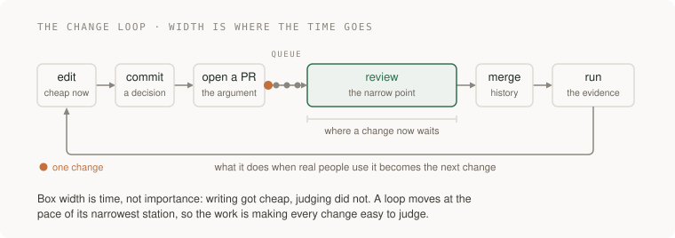

# 01 · The change loop

> Junior tier · feeds **P1 (it works)**

## The one-liner

A change is not the edit you made; it is the trip that edit takes — commit,
review, merge, run — and the record it leaves behind. That loop, not the file,
is the unit of engineering. In 2026 the expensive half of the loop is no longer
writing the code but judging it; this section is about running the loop so
judgment stays possible.

## The failure it prevents

Tuesday, 02:40. Checkout is failing for about a tenth of users and you are the
one awake. The last day of history looks like this:

```
9f31c02 fixes
a41f9c2 checkout updates + refactor + review comments
77b0d1e wip
```

`a41f9c2` touches 38 files. Generated in an afternoon, opened as one pull
request, approved in four minutes with "LGTM". Somewhere inside it is
a change to how prices are rounded. Also inside it: a rename that touched
thirty files, and a database migration. You cannot revert it — the migration
already ran. You cannot read it — the one behaviour change is diluted across a
sea of mechanical rename. And nobody can tell you why the rounding changed,
because the message says `fixes`.

The bug is not the failure. The failure is that the record cannot answer the
only two questions that matter at 02:40 — **what changed, and why** — and that
the one moment a human could have caught it was a four-minute wave-through of
a diff too big to judge.

## The mental model



**Version control is a record of decisions, not a backup.** A backup answers
"what did the code look like on Tuesday?" A record answers "why is this line
here?" — the question you actually have when something breaks. A **commit** is
the smallest change you can honestly describe in one sentence, with the reason
attached. A **pull request** is an argument for changing the shared branch:
what changes, why now, how you checked. A **merge** turns the argument into
shared history, and the running system produces the evidence that becomes the
next change. "The code exists" is the middle of the loop, not the end.

**Small batches win by arithmetic, not taste.** A reviewer has a roughly fixed
budget of attention per sitting. Spend it on sixty lines and every line gets
read; spread it over two thousand and each line gets a glance — which is how a
rounding change hides inside a rename. Small batches also fail better: a bad
small change reverts cleanly, a bad big one has grown roots.

**The bottleneck moved, and 2026's tooling is the evidence.** Producing code
stopped being the slow part. Stack Overflow's 2025 survey (about 49,000
developers): 84% use or plan to use AI tools, and the most-cited frustration,
at 66%, is solutions "almost right, but not quite". METR's randomized
trial (July 2025) found experienced open-source developers 19% slower with AI
on their own mature repos — while believing they had been 20% faster.
Generation feels like speed; verification is where the time goes; your sense
of progress is not an instrument. GitClear found duplicated code blocks
up roughly 8x during 2024, copy/paste exceeding refactoring moves for the
first time, and DORA 2025 calls AI an amplifier of whatever system it lands
in. (All figures checked 2026-09-21.) More code, cheaper, of uneven quality —
all arriving at the same narrow gate.

So the platform rebuilt itself around that gate. **Merge queues** (generally
available on GitHub since July 2023) land approved changes one at a time
against the latest main, so nobody babysits a merge. **AI first-pass review**
(Copilot code review, generally available April 2025) puts a machine read on
every PR before a human spends attention. **Stacked pull requests** (public
preview 2026-07-30) let a large feature land as a chain of small, individually
judgeable diffs. (Dates checked 2026-09-21.) Three features, one premise:
review capacity is the constraint; everything else queues behind it.

**Which leaves the skill: reading a diff.** Not top to bottom: state the claim
first — what does the message say this does — then sort every hunk into
"needed for that claim" or "riding along", then hunt for what is absent: the
test, the migration, the error path. Review was never spell-check; it is the
moment a second mind asks *is this the right change, what does it break, will
we understand it in a year*. When the author is a model, that moment is not
courtesy; it is the only point in the loop where a human decides anything at
all.


## What good looks like

- `git log --oneline -20` reads like a story someone chose to tell: each line says what, each body says why.
- Every PR does one thing you can state without the word "and".
- The diff is mostly signal: the behaviour change, its tests, nothing else riding along.
- Review comments are about behaviour, risk and names; formatting is a machine's job, enforced, never argued about.
- Any single commit can be reverted without dragging strangers with it.
- The repo holds everything needed to rebuild the system and nothing that can be rebuilt from it: source, tests, lockfile, config, decision notes in; secrets, artifacts, generated files out.
- `main` is always in a state you would be willing to run.

Done badly, you see:

- `wip`, `fixes`, `final-final2` as the story of a week.
- One PR per feature, forty files at a time, mixing a rename, a refactor and a behaviour change.
- Approvals in minutes on diffs that would take an hour to actually read.
- A `.env` file in history — history, not just the tip — or `node_modules`, or a 200 MB binary nobody remembers.

## Ask Claude for this

**Request 1 — a batch built to be reviewed, not just to work**

```
Implement <one sentence of behaviour>.

Before writing code, list the commits you plan to make. Each commit must:
- do exactly one thing, stated without the word "and",
- build and pass tests on its own,
- keep refactoring separate from behaviour change: if a refactor is
  needed, it is its own commit, with behaviour identical before and after.

Then make the commits. Message format: one line of what, blank line, then
why — the reason, the alternative you rejected, and what to check first if
this commit is ever suspected in an incident.
```

*Why it is asked that way:* the plan-first requirement forces the batch
structure to exist before the code does, so you can veto the shape while it is
still cheap. The "and" test is mechanical enough that the model can apply it
to itself. The refactor/behaviour separation is what makes each diff readable
later.

*What you should get back:* a numbered commit plan you could review as prose,
then commits that match it. Check out the refactor commit and run the tests:
behaviour must be identical.

*Push back on:* one giant commit relabelled as three ("part 1/3"); messages
that narrate the diff ("changed X to Y") instead of giving the reason; a
"pure refactor" commit whose tests needed editing — edited tests mean
behaviour moved.

**Request 2 — the first-pass read of a diff you must judge**

```
Here is a diff I have to review. Do a first pass. Do not comment on style.

1. In three sentences, what does this change in behaviour? Write it for
   someone who has not seen the ticket, and cite the hunks you used.
2. Which files' changes are NOT needed for that behaviour?
3. Which three hunks deserve most of my attention, and what could
   plausibly be wrong in each?
4. What is absent that you would expect: tests, a migration, error
   handling, a way to roll back?
```

*Why:* requiring the summary without the ticket, hunks cited, stops the model
paraphrasing the PR title — the failure mode is a summary of the claim instead
of the diff. Question 4 is where a first pass earns its keep: absence never
shows up in a diff on its own.

*What you should get back:* a behaviour summary you can hold against the PR
description. A mismatch between the two is a finding, whichever turns out to
be wrong.

*Push back on:* answers that could have come from the title alone — ask for
the hunk citations again. Confident claims about behaviour outside the diff:
the model has not seen that code, and neither have you until you open it. Keep
the verdict: this pass is a map of where to spend your attention, not a
substitute for spending it.

**Request 3 — the message the 3am debugger will read**

```
Here is the final diff and the ticket. Write the commit message.

One line, imperative, under about 65 characters, that completes the
sentence "if applied, this commit will ...". Blank line. Then a body
answering, for someone debugging at 3am: what behaviour changed, why it
was needed, what to suspect first if this commit is implicated, and what
we tried that did not work. Do not restate the diff; the diff already
says what.
```

*Why:* the "if applied, this commit will…" frame produces imperative summaries
that scan in `git log --oneline`. The 3am questions define what a body is
for. "What we tried that did not work" is the most valuable sentence in a
history and almost nobody writes it; it stops the next person re-walking the
dead end.

*What you should get back:* a message where every sentence says something the
diff cannot. If a sentence merely re-describes an edit, delete it and check
whether anything was lost.

*Push back on:* vague verbs in the summary line — "improve", "update", "fix" —
and any motivation in the body that the model cannot actually know from the
diff and the ticket. Invented motivation reads exactly like real motivation,
which makes it worse than none.

## How you would know it is wrong

1. **Ask history a real question.** Take a bug you fixed last month and, using
   only `git log` and `git blame`, work out why the offending line was written.
   If the record cannot answer, you have a backup, not a record.
2. **The revert drill.** Pick a merged change from last week at random and
   revert it on a branch. If the revert refuses to apply cleanly, or drags
   unrelated behaviour out with it, your batches are entangled.
3. **Plot approval time against diff size** for your last twenty PRs. Slow
   review on big diffs is honest friction. *Fast* approval on big diffs is the
   red flag: it means review has become a ritual that cannot say no.
4. **Plant a bug in a PR** — an inverted condition, an off-by-one — and let
   the normal process run: machine first pass, then reviewer. If it
   gets approved, the review step is decorative, and you learned that for the
   price of one closed PR rather than an incident.
5. **Search history, then build from a clean clone.** History, not the tip —
   deleting a file in a new commit unpublishes nothing — so scan `git log
   --all` for `.env`, keys, tokens. If the clean-clone build fails, something
   the repo needs is not in the repo.

> The rule under all five: **a check that cannot fail is not a check.** A
> review that has never rejected anything, a history never queried, a secret
> scan never tested with a planted secret — all green, all unproven.

## Your slice of the project

Your slice starts [P1](../../../projects/p1-it-works/):

- Create the repository before the first line of code. First commit:
  `.gitignore`, the lockfile decision, and a short note saying what stays out
  — secrets, artifacts, generated files — and why.
- Build P1's first runnable slice — a person can sign up and sign in — as
  **two to four commits**, each doing one thing, each leaving the app
  runnable.
- Land it through a real pull request, even alone: a description with one
  sentence of behaviour and the exact steps to verify it; a machine first
  pass if available; your own full read of the diff before merging.
- Reject at least one review suggestion — the machine's or your own second
  thought — in writing, in the PR, with the reason. "No, because" is the
  review skill; agreeing is not.

**Acceptance criteria you can check yourself:**

- `git log --oneline` for the slice reads as a plan you could have written in
  advance.
- Reverting the middle commit leaves the app building and its tests passing,
  or you can say in one sentence why not.
- A fake secret planted in a branch gets caught before merge — by a hook, a
  scan, or your own checklist. If it sails through, fix the gate before
  adding features.
- A stranger could verify the PR's behaviour from its description alone,
  without messaging you.

## Words you now own

- **commit** — the smallest recorded decision: one change plus its reason.
- **diff / hunk** — the difference between two versions; a hunk is one contiguous block of it.
- **pull request (PR)** — a proposed batch of commits plus the argument for merging it.
- **main / trunk** — the shared branch every loop returns to; its state is the team's state.
- **merge queue** — machinery that lands approved PRs one at a time against the latest main.
- **stacked PRs** — one large feature as a chain of small dependent PRs, each reviewable alone.
- **review latency** — time from "PR opened" to first meaningful response; the loop's dominant wait now.
- **revert** — a new commit that undoes an old one; the record keeps both, which is the point.
- **git blame** — shows which commit last touched each line; the tool that makes commit messages matter.
- **lockfile** — the exact dependency versions you actually run; belongs in the repo precisely because it is boring.
- **trunk-based development** — small changes merged into main frequently, instead of long-lived branches merged rarely.

---

**Not covered here:** git's internals — objects, refs, rebase-versus-merge
mechanics — worth learning the first time a rebase eats your afternoon, not
before. CI pipelines and deployment are P2's territory: this section ends at
"merged and running", P2 is where "running" becomes trustworthy. The test half
of "how you checked it" gets its own section, [06 · Testing](../06-testing/).
Branching-strategy debates (gitflow and relatives) are deliberately skipped:
every tool named above assumes short-lived branches off main, and that default
is the one worth learning first. Monorepo versus many repos is a staff-tier
argument about organisations, not a junior decision.

[Choose your learning path](../../../paths/README.md) · [Interview applications](../../../paths/interviews/README.md)
