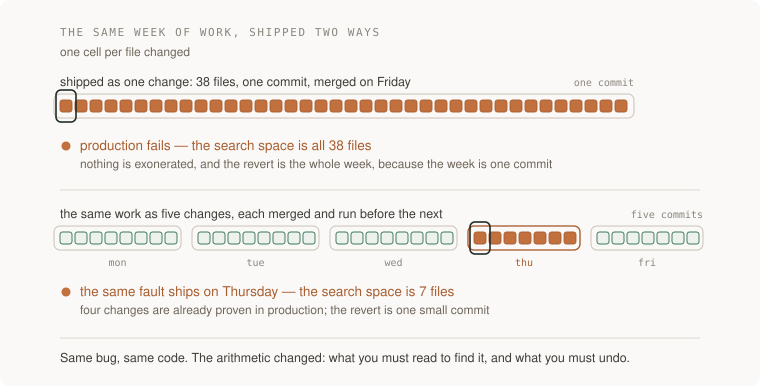

# 01 · The change loop — five projects

> Junior tier · each one an afternoon · read [the section](README.md) first

Five projects, rising. Each isolates a different thing the change loop is
for, and each ends with a number or a proof you did not have before. None adds
a feature to [P1](../../../projects/p1-it-works/): the loop is machinery, and
you study machinery by running your own work through it and watching what it
refuses.



---

### 1. The history a stranger can debug from

*You end up with the same week of work told two ways, and a number: how long a
stranger takes to find out why a line changed in each.*

**Build**

Take a real week of your P1 history, the honest one with `wip` in it. On a
copy, rewrite it into the sequence you would want at 3am: same final code,
different story. Then a stranger gets one line and one question — why is this
here — against each version, timed.

**The thought process**

The first decision is not a git command, it is a list: what were the actual
decisions made that week? A `fixes` commit usually contains three. Commits map
to decisions one for one; until the list exists you cannot say what the
commits should have been.

Second: rewriting is allowed only because this copy was never pushed — shared
history is a record others built on, and rewriting it deletes their context.
The honesty constraint: the final tree stays byte-identical. You change the
story, never the code; `git diff` between the tips is the proof.

Last: time-to-answer only counts when the answer is right and cited — the
stranger must name the commit that justifies the line. A fresh model session
with only the clone is the perfect stranger: no memory of the ticket, no
politeness.

**How to organise the prompts**

**1. The inventory.**

```
Read `git log -p` for the last week. List the distinct decisions
buried in it: behaviour changes, refactors, reversals, dead ends. One
line each. Do not touch the repository yet.
```

Check it against your memory. A decision it missed was recorded nowhere — a
finding already.

**2. The rewrite.**

```
Plan a rewritten history: one commit per decision, refactors separate
from behaviour, each message one line of what plus a body of why and
what we tried that did not work. Show me the plan; after I approve,
execute on a new branch and show me `git diff <old-tip> <new-tip>`.
It must be empty.
```

Read the plan as prose; split any commit needing "and". The empty diff is
the checkpoint: story changed, code untouched.

**3. The experiment**, in a fresh session, clone only:

```
Why does line <N> of <file> say what it says? Use only git log, git
blame and the code. Cite the commit that justifies your answer.
```

Time it against both branches. Wrong-but-fast counts as wrong.

**On AWS**

**GitHub** is the default, because the machinery this section leans on —
merge queue, machine first pass, stacked PRs — lives there. **CodeCommit** is
the neighbour: closed to new customers in July 2024,
returned to general availability on 2025-11-24 (checked 2026-09-22). Choose it
when the record must sit inside your IAM, VPC and CloudTrail boundary;
otherwise GitHub. The wobble is the lesson — a host is a bet, so keep
the record exportable: `git bundle` packs the whole history into one file,
and a scheduled copy to a versioned **S3** bucket is an offsite record for
cents.

**What productionising it means**

The rewrite is a drill, not a workflow. The production version is writing
history well on the way in: a message check in project 3's pipeline,
protected main so nobody rewrites shared history, the inventory prompt run
before the week instead of after.

**The learning**

A history has a reader, and the reader arrives at the worst moment. Watch a
stranger answer "why is this line here" in ninety seconds against one telling
and give up against the other; "backup versus record" stops being a slogan.

**How you would know it is wrong**

- `git diff` between the tips is not empty: you edited code, not story.
- The stranger answers as fast against the messy history: the question was answerable from code alone. Pick a line whose *why* is not in the file.
- Messages that narrate the diff — first word "update", "change", "fix" — survived the rewrite. Grep for them.

---

### 2. The change small enough to judge

*You end up with one feature built as a single 40-file pull request and again
as a stack of five, and numbers for what review actually caught in each.*

**Build**

One real P1 feature — tagging is the right size: a rename, a migration,
behaviour, UI — built twice from one plan: as a single PR, and as a stack of
five layers, each green and runnable alone. Two bugs planted blind in both at
the same spots; review both forms, timed, and open the sealed answers last.

**The thought process**

The first decision is where the cut lines go — a dependency question before a
size question. The order that works: mechanical rename first
(behaviour identical, tests untouched), schema next (harmless while nothing
consumes it), then behaviour, then wiring. A cut passes two tests: the layer
can be stated without "and", and main stays runnable if the stack stops here
forever — stacks do get abandoned.

Second: what to measure. Minutes-to-review is gameable, and reviewers game it
unconsciously. The honest instrument is the planted bugs — blind, because if
you know where they are you measure memory, not review.

**How to organise the prompts**

**1. The stack plan.**

```
Here is the feature: <one sentence>. Before any code, split it into
at most five layers. For each: one line of what, what it depends on,
why main is still runnable if the stack stops here. Renames and
refactors get their own layer.
```

No layer may need "and"; every stop-here claim must be plausible. Argue with
the plan before anything is built.

**2. The two builds.**

```
Build the feature twice from that plan. First the whole thing on one
branch, tests included, as one pull request — the control. Then as the stack,
one branch per layer, each branched from the last; after each layer,
run the suite and stop so I can check.
```

At each stop: check out the layer, run it, describe the diff in one sentence.
At the top, `git diff` against the blob tip — empty, or every difference
explained.

**3. The planting**, in a separate session:

```
Here are two branches containing the same change. Plant the same two
subtle bugs in both — an inverted condition, an off-by-one — at the
same logical spots. Write the locations to sealed.txt; do not show me.
```

Review both forms — the section's first-pass prompt plus your own full read —
recording minutes and findings; open `sealed.txt` only after both.

**On AWS**

"Each layer leaves main runnable" is demonstrable: give each PR a preview.
**Amplify Hosting** is the zero-glue answer when the app fits its build
model — a preview per branch, automatically. **App Runner** is the
container-shaped neighbour, but a per-PR service idles at a cost while the PR
sits open: the permanent-EC2 mistake in miniature. The assemble-it-yourself
option is a **Lambda** function URL deployed by the PR's pipeline through an
OIDC role — it scales to zero between review clicks.

**What productionising it means**

Stacks are a practice, not a trick: GitHub's native stacked PRs (in preview,
per [the section](README.md)) or plain rebase discipline; the recurring
cost is keeping the stack rebased when review changes a bottom layer.
Previews need a reaper wired to PR close — idle previews are money and attack
surface.

**The learning**

A big diff does not get reviewed more slowly; it gets reviewed less. Attention
per line collapses as line count grows — and you now have your own numbers.

**How you would know it is wrong**

- A middle layer fails checkout-and-run: the stack is one PR wearing five hats.
- Neither review caught either bug: the instrument is broken — bugs too subtle, or review is theatre. Find out which first.
- You opened `sealed.txt` early. Say so; a contaminated measurement reported clean is worse than none.

---

### 3. The pipeline that can refuse

*You end up unable to merge into main until four named checks pass, with one
closed PR per check proving each can actually go red.*

**Build**

Four checks on P1 as separate named jobs — build-and-test, format-and-lint,
secret scan, and the invariant that nobody can touch someone else's items —
made required by branch protection, plus the red catalogue: one deliberately
bad PR per check, refused and kept closed as evidence.

**The thought process**

First: what earns a place at the gate. Every required check taxes every future
change, and a slow or flaky gate teaches people to route around it.
The entry bar is a named harm — a way a bad change could actually reach main
here — never a list of available tools.

Second: advice versus law. A local hook is advice; it runs on machines you do
not control and dies to `--no-verify`. The pipeline on the protected branch is
law. And a check has to name itself: one fat "CI" job is a puzzle at the worst
moment; named jobs make red self-explanatory.

Third, the section's rule made physical: a gate is unproven until you have
watched it refuse. The refusals are not extra credit; they are the
deliverable.

**How to organise the prompts**

**1. The threat list.**

```
List every way a bad change could reach main today: broken build,
failing test, committed secret, unformatted code, a change violating
<the ownership rule>. Rank by damage. Propose one check per way. No
configuration yet.
```

Every check must map to a named harm; anything justified only as best
practice gets cut.

**2. The pipeline, then the red suite.**

```
Implement those checks as one workflow, each check a separate named
job. Show me a green run on a no-op pull request. Then, for each job,
make the smallest change that must make it — and only it — fail. One
PR per change; report which job went red on each.
```

Every job goes red exactly once. A job you cannot make fail is not a check;
it is decoration with a duration.

**3. The lock.**

```
Make all four checks required in branch protection, reopen the worst
red PR, and show me merging is impossible. Close it without merging.
```

Keep the closed PRs: proof, re-run whenever a check changes.

**On AWS**

**GitHub Actions** versus **CodeBuild** versus **CodePipeline**. Actions is
the default: next to the code, free on standard runners for public
repositories, 2,000 minutes a month for private repos on the free plan
(checked 2026-09-22). CodeBuild is for what hosted runners cannot give — a
machine inside your VPC to reach a private database, or more memory; its free
tier of 100 build minutes a month on the smallest machine, unusually, does
not expire after twelve months (checked 2026-09-22). CodePipeline is an
orchestrator of release stages, not a build machine; a merge gate has nothing
to orchestrate.

When a check touches AWS, use **OIDC role assumption, not stored keys**: an
IAM identity provider for GitHub's token issuer, a role whose trust policy
pins repository and branch, the credentials action to assume it. Costs
nothing — and a long-lived key in repository secrets is exactly what your own
secret scan catches.

**What productionising it means**

Decide who can bypass and make bypass loud: an admin merge nobody sees voids
the exercise. Give the pipeline a time budget and treat a breach as a
defect: a slow gate recreates big batches, people amortise the wait. A
required check that flakes gets fixed or quarantined that day; a
gate that cries wolf gets ignored.

**The learning**

A pipeline is a list of claims about what cannot reach main, and a claim is
worth nothing until you have watched it refuse. Green means something only where
red is reachable — you hold four reds that prove yours is.

**How you would know it is wrong**

- Merge a red PR using admin bypass. If nothing records that it happened, there is a silent door.
- Add a check without marking it required. The drill must expose the gap: check red, merge still possible.
- Plant a fake secret with a real key's shape in a branch. It must be stopped before merge, not found after.
- Time the pipeline monthly; past the budget, PR sizes grow and project 2 comes undone.

---

### 4. The review you automate away

*You end up with your review comments sorted into machine work and judgment,
and the machine pile at zero on your next five pull requests.*

**Build**

A corpus of real review comments — project 2 supplies plenty — sorted into
machine work and judgment. Then the machine layer: a formatter that rewrites,
a linter that enforces, an AI first pass constrained by contract — and the
count, re-run on your next five PRs.

**The thought process**

The first decision is the line itself. Mechanical means one right answer every
time it applies: formatting, import order, unused symbols, an obvious footgun.
Judgment means naming, design, "is this the right change at all". The danger
is the middle — rules right often but not always: every false positive spends
credibility, and credibility does not refill. Start strict and small.

Second: enforce beats advise. A formatter that rewrites ends the argument; a
linter that complains starts one. The end state: style stops being reviewable
because it stops being variable. Adopting the formatter costs one huge
mechanical diff — project 1's discipline as policy: its own commit, behaviour
identical, tests untouched.

Third: the AI pass gets a job description — the section's first-pass read:
map where attention should go, name what is absent, no verdicts, and no
style, which machines now own twice over.

**How to organise the prompts**

**1. The sort.**

```
Here are the review comments from my last N pull requests. For each:
could a machine have made this comment every time it applies? For
each yes, name the tool or rule; for each no, the judgment it needed.
```

Sample ten yeses and argue: a wrong yes is a future false positive, cheap to
catch now.

**2. The tools, one at a time.**

```
Add the formatter as two commits: one that only reformats, tests
untouched and green; one that enforces it in the pipeline. Then the
linter and import order, same shape. Show each enforcement red on a
planted violation before we keep it.
```

The reformat commit's tests must pass unmodified, and every tool must have
been seen red once.

**3. The AI pass, then the count.**

```
Wire a first-pass review on every PR with this contract: comment only
on behaviour, risk, and what is absent — tests, migration, rollback.
Never on style. End with the three hunks most deserving of human
attention, and no verdict. Then, for my next five PRs, sort every
review comment into the two piles; the machine pile should be zero,
each machine comment that still occurs naming its missing rule.
```

Test the contract on a PR that is stylistically ugly and behaviourally fine —
one style comment is a breach.

**On AWS**

The zero-setup pass is GitHub-side, covered in [the section](README.md). The
AWS version exists for when the diff must not leave your boundary: run the
model through **Bedrock** from a small **Lambda** on the PR webhook, assuming
an **OIDC** role. Bedrock rides IAM, so no vendor API key sits in repository
secrets — the thing project 3's scanner hunts. Lambda beats **CodeBuild**
here: a diff fits in memory and the work lasts seconds. Mechanical tools stay
in Actions as ordinary free-tier work.

**What productionising it means**

Keep a false-positive ledger: a rule overridden weekly gets fixed or
deleted — an ignorable gate teaches ignoring gates. Pin formatter and linter
versions; an unpinned upgrade reformats the world mid-PR. Decide whether the
AI pass fails open or closed when its API is down; not deciding means finding
out during an outage.

**The learning**

Reviewer attention is the loop's scarcest input; every comment category you
automate is attention returned to questions only a person can answer.
Enforced checks disappear from consciousness; advisory ones become noise;
little worth keeping lives between.

**How you would know it is wrong**

- Plant one style violation and one real bug in the same PR. The machine must catch the style; the human pass must still catch the bug. A bug that sails through on the green glow means you automated complacency.
- The comment mix is unchanged after a month: the tools are advisory, not required, or not running.
- Turn the formatter off locally and push. The pipeline must catch it — advice dies, law holds.

---

### 5. Two greens that make a red

*You end up having built the failure merge queues exist for — two PRs, each
green alone, red together — and the machinery that stops it reaching main.*

**Build**

PR A changes a function's contract. PR B, branched before A landed, adds a
call site in the old terms, in a different file. No textual conflict; both
green alone; together they break main. Then a merge queue — real or
hand-rolled — catches the second before main sees it.

**The thought process**

Start by naming why CI lied: "this PR is green" means "was green against the
main that existed when its checks ran". A statement about a moment. Main
moved; nobody tested the combination. No tool was wrong — the claim was
smaller than everyone assumed.

Second, the construction discipline: the pair must merge cleanly — a textual
conflict means you built the wrong failure, the kind caught for free. You
want semantic dependency with no textual overlap; hence the call site in a
different file.

Third, the prevention menu: require-branches-up-to-date serialises humans,
who babysit rebases; test-and-revert after merge lets main go red sometimes,
which tiny teams tolerate; a merge queue serialises machines, testing each PR
against main plus everything ahead. Team size times CI duration picks; the
queue won by converting human waiting into machine time.

**How to organise the prompts**

**1. The construction brief.**

```
Describe two changes that each pass the full suite on their own
branch, merge into main with no textual conflict, and make the suite
fail once both are in. Name the mechanism. Do not write code yet.
```

The mechanism must be semantic dependency; the no-conflict claim must name
which files each change touches.

**2. The trap, proven.**

```
Build both branches from the same base. Show me four results: suite
green on A, green on B, both merging cleanly into a scratch branch,
suite red there.
```

The four results are the artefact. A green scratch branch demonstrates
nothing — construct again.

**3. The prevention, then its limits.**

```
Enable the merge queue — or write a landing script that refuses to
merge a PR until the suite passes on a temporary merge of it onto
current main plus everything ahead in line. Replay both PRs; show me
where the second is stopped. Then list what the queue still cannot
catch, one concrete example from this repository for each.
```

The failure must happen inside the queue, main's history green throughout.
The limits must include runtime-only combinations and the flaky suite the
queue amplifies; a claim that it catches everything is selling, not thinking.

**On AWS**

A queue converts merge safety into CI capacity: every queued PR is another
full run against speculative main, so merge throughput is bounded by build
throughput. **Actions** minutes are the first wall for private repositories —
2,000 a month free (checked 2026-09-22) — and **CodeBuild** is the overflow:
per-minute billing, bigger machines, the same OIDC pattern. Do not
rebuild what did not change: build once per commit, store by SHA — images in
**ECR**, the registry ECS, Lambda and Fargate pull from natively (500 MB
private free for twelve months, checked 2026-09-22); everything else in
**S3**, which can hold an image tarball that nothing can pull as an image.

**What productionising it means**

The queue gets metrics — depth, time-in-queue, ejection rate — a queue nobody
watches is a delay nobody can explain. Flakiness is now existential:
one flaky test ejects innocent PRs and stalls every merge behind them; the
quarantine rule from [testing](../06-testing/) stops being optional.

**The learning**

Green is a statement about a moment, not a property of a change. Integration
is a race; the queue removes the race without a person holding a lock. And
you know exactly which failure it removes: you built it with your own hands.

**How you would know it is wrong**

- Git reports a textual conflict: wrong construction — that case is caught for free.
- The scratch branch is green: no semantic dependency, nothing demonstrated.
- The queue passes both PRs: check which ref CI ran on. If it re-ran the stale PR head instead of the speculative merge, the queue is ceremony.
