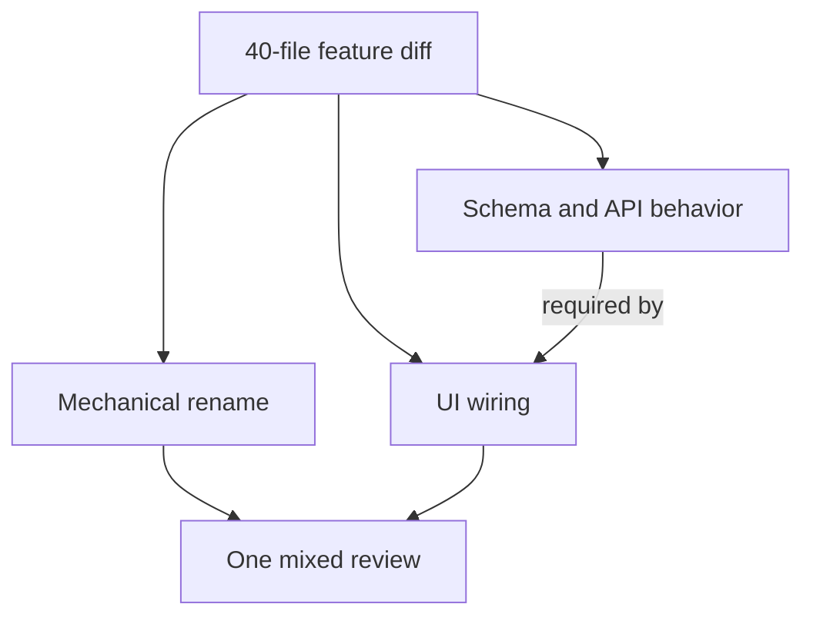
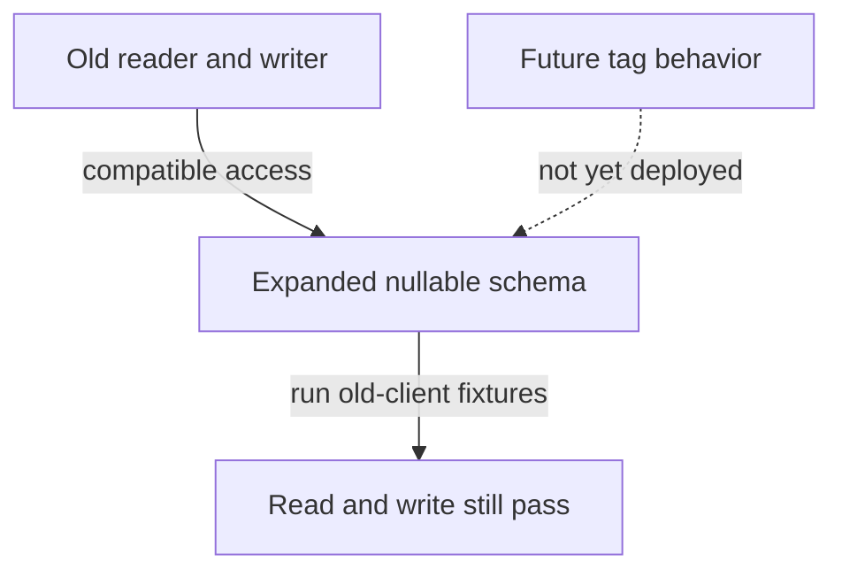
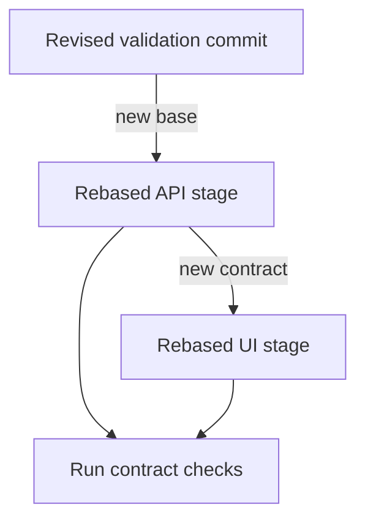

# 2. The change small enough to judge

## The reviewer's brief

> Your team must add tags to a reading list. A 40-file change mixes a rename, a database column, validation, and UI wiring. Make the work reviewable while leaving every landed stage runnable. Which dependency determines your first cut?

This is a **constructed practice brief**, not an attributed company question.
Prerequisites: [the section](../README.md). This page is a build brief; it does not ship a runnable application. The original build and prompt sequence below defines the implementation checkpoints.

| Case | Exact input or workload | Expected outcome |
|---|---|---|
| Small example | Rename → nullable tags column → validation → API behavior → UI, all from the same base. | All five stage tips build; the top matches the single-change implementation and seeded bugs have cited findings. |
| Boundary / failure | The UI stage lands before the response includes tags. | A contract check rejects that stage; a smaller diff is not automatically a safe diff. |
| Scope | One feature; compare identical behavior and preserve reviewer blinding. | Explain any additional assumption before implementing it. |

Before looking at the guidance, state the invariant in one sentence and trace the example. In interview practice, implement or sketch independently, then reveal the reasoning. On the AI path, use the prompts below and verify each checkpoint before the next request.

## Baseline and the failure to explain



Review time mixes mechanical changes with decisions. The counterexample is a tiny UI diff that depends on an absent API field: size alone cannot choose the order.

<details>
<summary>Reveal the approach and decisions</summary>

Write the dependency graph before splitting by file count. Add compatible schema before consumers; keep mechanical changes separate. The invariant is deployable behavior at each stop, with an explainable final-tree comparison. Score correctly found defects rather than speed alone.

</details>

## Follow-up 1 · The work stops halfway

**Changed requirement:** Funding disappears after the schema stage. Can that stage remain deployed for a month? Predict which boundary must change before opening the design.

<details>
<summary>Expected reasoning and changed diagram</summary>

Use an additive nullable field or a safe default while existing readers remain compatible. Defer deleting or requiring the field. Verify both the old reader and old writer against the new schema.



</details>

## Follow-up 2 · A lower stage changes

**Changed requirement:** Review changes the validation API after the UI branch already exists. Which checks become stale? State what evidence would make you reject your first design.

<details>
<summary>Expected reasoning and changed diagram</summary>

Rebase dependent layers and rerun their integration checks against the revised base. Reuse artifacts only when their input commit is unchanged; do not transfer a green result across a new dependency graph.



</details>

## Evidence to bring to review

Build in three stops: reproduce the small case and baseline failure; implement the protected boundary; then replay both changed requirements with captured outputs. Record commands, fixtures, and observed results in your implementation README. A diagram is a prediction until those checks run.

**Senior expectation:** Demonstrate checkout-and-run at every stage and a blind defect review. **Additional lead scope:** Budget review dependencies and define who maintains abandoned stages. Completion demonstrates practice evidence; it does not establish interview readiness or multi-team delivery experience.

## Build and prompt sequence


*You end up with one feature built as a single 40-file pull request and again
as a stack of five, and numbers for what review actually caught in each.*

**Build**

One real P1 feature — tagging is the right size: a rename, a migration,
behaviour, UI — built twice from one plan: as a single PR, and as a stack of
five layers, each green and runnable alone. Two bugs planted blind in both at
the same spots. Review both forms, timed; open the sealed answers last.

**The thought process**

The first decision is where the cut lines go, and it is a dependency question
before it is a size question. The order that works: mechanical rename first
(behaviour identical, tests untouched), schema next (harmless while nothing
consumes it), then behaviour, then wiring. A cut passes two tests: the layer
can be stated without "and", and main is still runnable if the stack stops
here forever — stacks do get abandoned, and every layer must be a safe place
to stop.

Second: what to measure. Minutes-to-review is gameable, and reviewers game it
unconsciously. The honest instrument is the planted bugs, which is why they
are planted blind: if you know where they are, you are measuring memory, not
review.

**How to organise the prompts**

**1. The stack plan**, before any code:

```
Here is the feature: <one sentence>. Split it into a stack of at most
five layers. For each: one line of what, what it depends on, and why
main is still runnable if the stack stops here. Renames and refactors
get their own layer.
```

No layer may need "and"; every stop-here claim must be plausible. The plan is
the project — argue with it before anything is built.

**2. The blob.**

```
Build the whole feature from that plan on one branch, tests included,
and open it as a single pull request.
```

Green suite. This is the control.

**3. The stack.**

```
Now build the same feature as the planned stack, one branch per layer,
each branched from the last. After each layer, run the suite and stop
so I can check before you continue.
```

At each stop: check out the layer, run it, describe the diff in one sentence.
At the top, `git diff` against the blob tip — empty, or every difference
explained.

**4. The planting**, in a separate session:

```
Here are two branches containing the same change. Plant the same two
subtle bugs in both — one inverted condition, one off-by-one — at the
same logical spots. Write the locations to sealed.txt and do not show
me its contents.
```

Review both forms — the section's first-pass prompt plus your own full read —
recording minutes and findings. Open `sealed.txt` only when both are done.

**On AWS**

"Each layer leaves main runnable" is a claim you can demonstrate instead of
assert: give every PR a preview environment. **Amplify Hosting** is the
zero-glue answer when the app fits its build model — it deploys a preview per
branch automatically. **App Runner** is the container-shaped neighbour, but a
per-PR service idles at a cost while the PR sits open — the permanent-EC2
mistake in miniature. The assemble-it-yourself option is a **Lambda** function
URL deployed by the PR's pipeline through an OIDC role: it scales to zero
between review clicks, and review traffic is too small to notice on a bill.

**What productionising it means**

Stacks are a practice, not a trick: GitHub's native stacked PRs (in preview,
per [the section](../README.md)) or plain rebase discipline. The recurring cost
is keeping the stack rebased when review changes a bottom layer — budget for
it. And preview environments need a reaper wired to PR close, because idle
previews are money and attack surface accumulating quietly.

**The learning**

A big diff does not get reviewed more slowly; it gets reviewed less. Attention
per line collapses as the line count grows, and you now have your own numbers
for that instead of a line from a book.

**How you would know it is wrong**

- The stack's final tree differs from the blob's and you cannot explain each difference.
- A middle layer fails checkout-and-run: the stack is one PR wearing five hats.
- Neither review caught either bug: the instrument is broken — bugs too subtle, or review is theatre. Find out which before trusting anything else here.
- You opened `sealed.txt` early. Say so; a contaminated measurement reported clean is worse than none.

---

[Back to the ordered project index](../projects.md)
