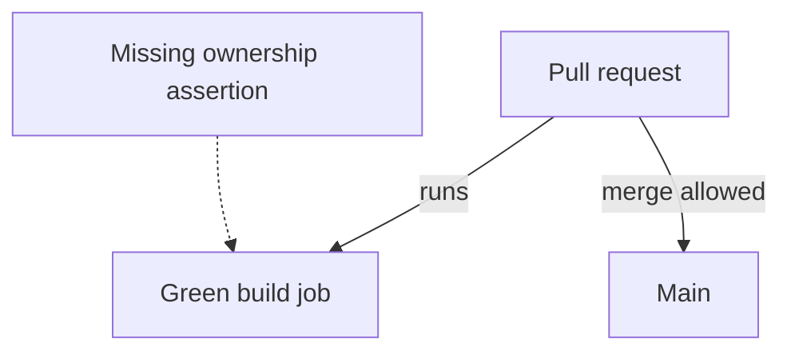
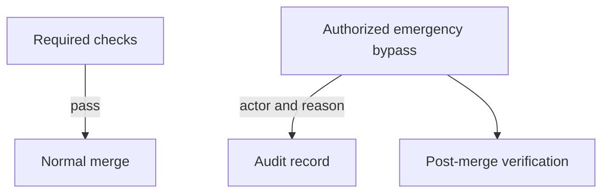
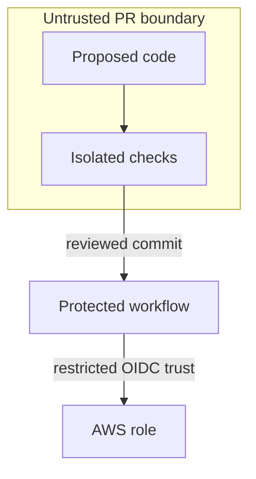

# 3. The pipeline that can refuse

## The reviewer's brief

> Your reading-list repository shows a green CI badge, yet a cross-user edit reached main. Build a gate that actually blocks this harm. What exactly does “green” prove, and who can bypass it?

This is a **constructed practice brief**, not an attributed company question.
Prerequisites: [the section](../README.md). This page is a build brief; it does not ship a runnable application. The original build and prompt sequence below defines the implementation checkpoints.

| Case | Exact input or workload | Expected outcome |
|---|---|---|
| Small example | Four mutations: syntax error, format violation, fake secret fixture, and removal of owner filtering. | Build/test, formatting, secret scan, and ownership checks respectively refuse their mutation; protected merge refuses each PR. |
| Boundary / failure | A failed ownership job is advisory rather than required. | The exercise fails even though the job is red: merging remains possible. |
| Scope | Test repository and inert secret fixtures; never plant a real credential. | Explain any additional assumption before implementing it. |

Before looking at the guidance, state the invariant in one sentence and trace the example. In interview practice, implement or sketch independently, then reveal the reasoning. On the AI path, use the prompts below and verify each checkpoint before the next request.

## Baseline and the failure to explain



A build can pass while authorization is broken. Map harms to separately named checks, then distinguish a check running from its result being required for merge.

<details>
<summary>Reveal the approach and decisions</summary>

The invariant is that a candidate commit with any named harm cannot enter protected main through the normal path. First prove each negative fixture, then enforce the jobs, then test bypass visibility. Avoid making flaky or unowned checks required merely to increase the count.

</details>

## Follow-up 1 · An administrator can bypass

**Changed requirement:** An emergency change uses an authorized bypass. How will reviewers know the gate was skipped? Predict which boundary must change before opening the design.

<details>
<summary>Expected reasoning and changed diagram</summary>

Record actor, commit, reason, and follow-up validation. The bypass remains an explicit operating decision; pretending it cannot happen prevents measuring it. Replay with a deliberately failed check in a sandbox repository.



</details>

## Follow-up 2 · A workflow changes its own gate

**Changed requirement:** An untrusted PR edits the workflow and asks for AWS credentials. Where is the trust boundary? State what evidence would make you reject your first design.

<details>
<summary>Expected reasoning and changed diagram</summary>

Keep untrusted code execution separate from privileged deployment. Pin OIDC trust to the intended repository and execution context; do not expose a deploy role to arbitrary fork code. A green check is evidence about one commit and one workflow, not permission to execute it with secrets.



</details>

## Evidence to bring to review

Build in three stops: reproduce the small case and baseline failure; implement the protected boundary; then replay both changed requirements with captured outputs. Record commands, fixtures, and observed results in your implementation README. A diagram is a prediction until those checks run.

**Senior expectation:** Show both refusal and merge enforcement for every named harm. **Additional lead scope:** Define emergency authority, audit review, and credential boundaries. Completion demonstrates practice evidence; it does not establish interview readiness or multi-team delivery experience.

## Build and prompt sequence

*You end up unable to merge into main until four named checks pass, with one
closed PR per check proving each can actually go red.*

**Build**

Four checks on P1 as separate named jobs — build-and-test, format-and-lint,
secret scan, and the invariant that nobody can touch someone else's items —
made required by branch protection. Plus the red catalogue: one deliberately
bad PR per check, refused by that check, kept closed as evidence.

**The thought process**

First: what earns a place at the gate. Every required check taxes every future
change forever, and a slow or flaky gate teaches people to route around it.
The entry bar is a named harm — a way a bad change could actually reach main
in this repository. Work back from harms, never forward from a list of
available tools.

Second: advice versus law. A local hook is advice; it runs on machines you do
not control and dies to `--no-verify`. The pipeline on the protected branch is
law. Fast advice locally, law remotely — and never law that exists only
locally.

Third: a check has to name itself. One fat "CI" job that fails is a puzzle at
the worst moment; four named jobs make red self-explanatory.

Fourth, the section's rule made physical: a gate is unproven until you have
watched it refuse. Building the refusals is not extra credit; it is the
deliverable.

**How to organise the prompts**

**1. The threat list.**

```
List every way a bad change could reach main in this repository today:
broken build, failing test, a committed secret, unformatted code, a
change that violates <the ownership rule>. Rank by damage. Propose
exactly one check per way. No configuration yet.
```

Every proposed check must map to a named harm. Anything justified only as
best practice gets cut.

**2. The pipeline.**

```
Implement those checks as one workflow with each check as a separate
named job, so a failure names itself. Show me a green run on a no-op
pull request.
```

The job list should read like the threat list; then confirm the green run.

**3. The red suite.**

```
For each job, make the smallest change that must make it — and only
it — fail. Open one PR per change and report which job went red on
each.
```

Every job goes red exactly once. A job you cannot make fail is not a check;
it is decoration with a duration.

**4. The lock.**

```
Make all four checks required in branch protection, reopen the worst
red PR, and show me that merging is impossible. Then close it without
merging.
```

Keep the closed PRs. They are the proof, and they get re-run whenever a check
changes.

**On AWS**

**GitHub Actions** is a natural default beside a GitHub repository.
**CodeBuild** earns its place when a check needs private VPC resources or a
particular build environment. **CodePipeline** orchestrates release stages;
it is not itself the build machine. Pick from execution and access requirements,
then estimate build minutes, machine class and logs under the account's current
pricing and free-tier eligibility. A permanent **EC2** runner adds idle cost and
patching that this occasional workload may not justify.

When any check touches AWS, use **OIDC role assumption, not stored keys**: an
IAM identity provider for GitHub's token issuer, a role whose trust policy
pins repository and branch, the credentials action to assume it. It costs
nothing, and a long-lived key in repository secrets is exactly what your own
secret scan exists to catch.

**What productionising it means**

Decide who can bypass the gate and make bypass loud — an admin merge nobody
sees is a side door that voids the exercise. Give the pipeline a time budget
and treat a breach as a defect: a slow gate quietly recreates big batches,
because people amortise the wait. And when a required check starts flaking,
fix or quarantine it that day; a gate that cries wolf trains everyone to stop
reading it.

**The learning**

A pipeline is a list of claims about what cannot reach main, and every claim
is worth nothing until you have watched it refuse. Green only means something
where red is reachable — you now hold four reds that prove yours is.

**How you would know it is wrong**

- Merge a red PR using admin bypass. If nothing records that it happened, there is a silent door.
- Add a fifth check but forget to mark it required: the red suite must expose the gap — check red, merge still possible.
- Plant a fake secret with a real key's shape in a branch. It must be stopped before merge, not found after.
- Time the pipeline monthly. Past the budget, watch PR sizes grow — a slow gate undoes project 2.

---

[Back to the ordered project index](../projects.md)
