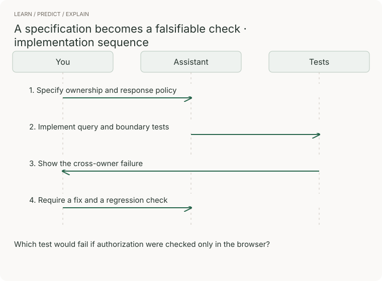

# 02 · Working with an AI that writes the code

> Junior tier · feeds **every project in this guide**

## The one-liner

If a model writes most of your code, your job is no longer typing. It is
**specifying** what you want precisely enough that a wrong answer is
recognisable, and **verifying** what comes back even though you could not have
written it yourself. Those two skills are the whole of this section, and they
are the reason the rest of the guide is shaped the way it is.

## The failure it prevents

You ask for a feature. You get a hundred lines that look right, read well, and
have tests. The tests pass. You ship it.

What actually happened: the tests were written after the code, so they assert
what the code *does* rather than what it *should* do. The database call was
mocked, so the query with the typo in it never ran. An exception is caught and
logged at debug level, so the failure that will bite you in three weeks is
already invisible. None of that is visible in a skim, and a skim is what you gave
it, because it looked like code you would have written.

The measured version of this, so it is not folklore:

- A 2025 randomised controlled trial by METR found experienced open-source
  developers were **19% slower** on their own repositories using AI tooling — and
  believed they had been about 20% *faster*. The perception gap is the finding.
- The 2025 Stack Overflow developer survey (49,009 respondents) found **84%**
  use or plan to use AI tools, and at the same time **more developers actively
  distrust the accuracy of the output (46%) than trust it (33%)** — distrust up
  from 31% the year before, with only 3% saying they highly trust it. The single
  most common frustration, at **66%**, was output that is "almost right, but not
  quite". Experienced developers are the most sceptical of all.
- GitClear's analysis of large commit corpora reports code duplication rising
  sharply and refactoring collapsing as a share of changes.
- Google's DORA 2025 report frames AI as an **amplifier**: it magnifies whatever
  your existing practice is, good or bad, and it adds a verification tax that
  somebody has to pay.

*(Checked 2026-09-21. Re-check before quoting these; the METR result in
particular is one trial on experienced developers in familiar repositories, not a
law of nature.)*

**"Almost right" is the expensive failure mode**, because obviously-wrong output
costs you nothing. You see it and ask again.

## The mental model

The loop has three steps and only one of them got cheaper.


Generation went from hours to seconds. Specification got slightly easier,
because you can now describe intent in prose instead of syntax. **Verification
did not move at all** — it still takes a human being who understands the problem.

So the bottleneck moved. It used to be the middle. Now it is the ends, and the
two failure modes are:

- **under-specifying**, and getting a confident answer to a question you did not
  ask
- **under-verifying**, and accepting an answer whose wrongness you had no way to
  detect

Everything below is about those two.


### Watch the concept, then trace the implementation



The comparison follows four illustrative states. Without the mechanism: cross-owner access remains undetected. With it: reject the patch if unauthorized data leaks. These are teaching states, not measured performance.



[Still storyboard / reduced-motion alternative](../../../assets/learning/ai-verification-still.svg).

**Predict before replaying:** Which test would fail if authorization were checked only in the browser?

**Try it:** reproduce the final transition in a small example, remove the mechanism, and record the changed outcome. Use the checks later in this chapter to judge the result.

## What good looks like

- You can state, before you accept a change, what would make it wrong.
- Your asks contain constraints, not just goals. "Do not mock the database" is
  worth more than three paragraphs of context.
- You work in slices that each end somewhere runnable, so each one can be checked.
- You read the diff, not the summary of the diff.
- When you do not understand a line, you ask what it does before you keep it.
  Code you do not understand is code you cannot maintain, and you will be the one
  maintaining it.
- You keep the definition of "done" yourself.

Done badly:

- Accepting whole features in one go, because reviewing them whole is the only
  option you left yourself.
- Prompt-tinkering: rephrasing until the output looks nicer, with no check that
  it got more correct.
- Treating a green test suite the model wrote as evidence about code the model
  wrote. Both halves came from the same place.
- Letting it pick your dependencies without asking why that one.
- Asking "is this right?" — it will tell you yes, in detail, and that costs you
  nothing but time.

## Ask Claude for this

**Request 1 — make it disagree with itself before it commits**

```
Before writing any code: describe how you would implement this, then list
the three decisions in that design most likely to be wrong and what you
would need to know to settle them.

Do not write code yet.
```

*Why it is asked that way:* a model will happily produce one confident design.
Asking for the three most likely to be wrong surfaces its own uncertainty, which
is information you cannot get from the output itself. It also separates design
from implementation, so the cheap thing to change is changed while it is still
cheap.

*What you should get back:* real tensions — a chosen data shape with a named
cost, an assumption about volume, an unclear requirement. If you get three
cosmetic worries, the question was too easy; give it more context and ask again.

*Push back on:* a list of risks that are all about "scalability" and "edge
cases". Those are placeholders. Ask which specific input breaks it.

**Request 2 — make the check prove itself**

```
Write the test for this first and show me it FAILING. Then implement.
Then show me the test passing.

If the test passes before you implement anything, stop and tell me why.
```

*Why:* this is the single highest-value habit in the whole guide. A test that
has never been seen to fail is not evidence of anything — it may be asserting
something that is true regardless of your code. Watching it go red once, on
purpose, is the only thing that establishes it can.

*What you should get back:* a red run, then a green one, and the diff between
them is small.

*Push back on:* a test that passes on the first run "because the behaviour was
already partly there". Sometimes true. Usually it means the assertion is too
weak.

**Request 3 — read the change, not the story about the change**

```
Summarise this diff as: what behaviour changed, what behaviour could have
changed accidentally, and which existing tests would catch the second
thing if it went wrong.

If the answer to the third is "none", say so plainly.
```

*Why:* the dangerous part of a change is never the part described in the commit
message. It is the sibling that the same edit also touched. Asking what *could*
have changed accidentally points attention at exactly that, and asking which
test would catch it turns a vague worry into a yes or a no.

*What you should get back:* an honest "none" at least sometimes. If every answer
is reassuring, you are being agreed with rather than reviewed.

**What to keep for yourself:** the acceptance criteria, the decision about
whether something is done, and the list of what you do not understand yet. Those
three are the job.

## How you would know it is wrong

1. **Plant a bug and watch the tests catch it.** Change a comparison, delete a
   line, invert a condition. If the suite stays green, it is decorative. This is
   the general form of every check in this guide.
2. **Ask what was mocked.** A test whose dependencies are all fakes is a test of
   your fakes. At least one test must touch the real thing.
3. **Search the diff for swallowed failures** — an empty catch block, a bare
   `except`, a logged-and-continued error, a default value standing in for a
   failed call. These are how a system starts lying to you quietly.
4. **Check the dependencies it added.** When was the package last released, how
   many maintainers, is it doing something you could do in ten lines? A model
   will reach for a library as readily as for a function.
5. **Run it somewhere other than where it was built.** Clean clone, fresh
   directory, different machine if you have one.
6. **Read every line you are about to keep.** If you cannot say what a line does,
   ask. This is slower and it is the job.

> The rule under all six, and it recurs in every section of this guide:
> **before believing a green result, say what it would have looked like if the
> thing were broken.** If the answer is "the same", it proved nothing.

## Your slice of the project

Before you start **P1**, set up the habits, not the code:

- A `DECISIONS.md` in the repo. Every time you take a suggestion you did not
  fully understand, write one line: what you accepted and what you would need to
  check later. This file is the honest record of your own debt.
- A rule for yourself: no change larger than you are willing to read goes in.
  Write the number down. Revise it when you find out it was too high.
- One check per feature that you wrote yourself, without help, however crude.
  It is the only thing in the repo whose provenance you are sure of.

**Acceptance criteria:** at the end of P1, you can open `DECISIONS.md` and point
at three things you accepted without fully understanding, and say what you did
about each of them afterwards.

## Words you now own

- **specification** — the description of what you want, precise enough that a wrong answer is recognisable.
- **verification** — establishing that what you got is what you asked for. Not the same as it running.
- **the verification tax** — the time cost of checking generated output, which somebody always pays.
- **slice** — a piece of work small enough to end somewhere runnable and checkable.
- **plausible failure** — output that is wrong in a way that survives a skim. The expensive kind.
- **swallowed error** — a failure caught and discarded, so the system continues in a state nobody chose.
- **provenance** — where a piece of code came from and who understood it. Increasingly the thing worth tracking.
- **agent** — a model running in a loop with tools, able to take actions rather than only produce text.
- **context window** — how much the model can hold at once. More is not free; recall degrades as it fills.

---

**Not covered here:** building AI *features into your product* is a different
discipline and lives in the senior tier, in **15 · AI systems** — retrieval,
evaluation harnesses, guardrails and cost budgets. This section is only about
using a model to help you build. Prompt-phrasing tricks are deliberately absent;
they were the 2023 skill, and the durable one is specification plus verification.

[Choose your learning path](../../../paths/README.md) · [Interview applications](../../../paths/interviews/README.md)
