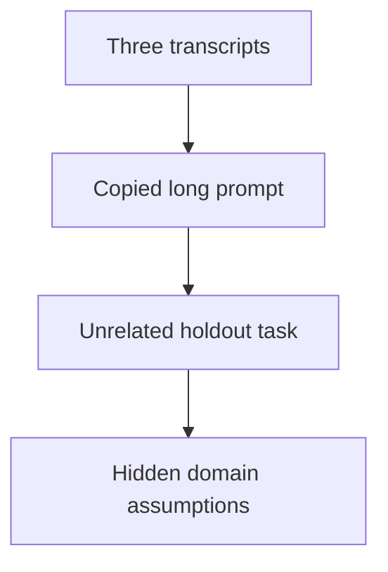
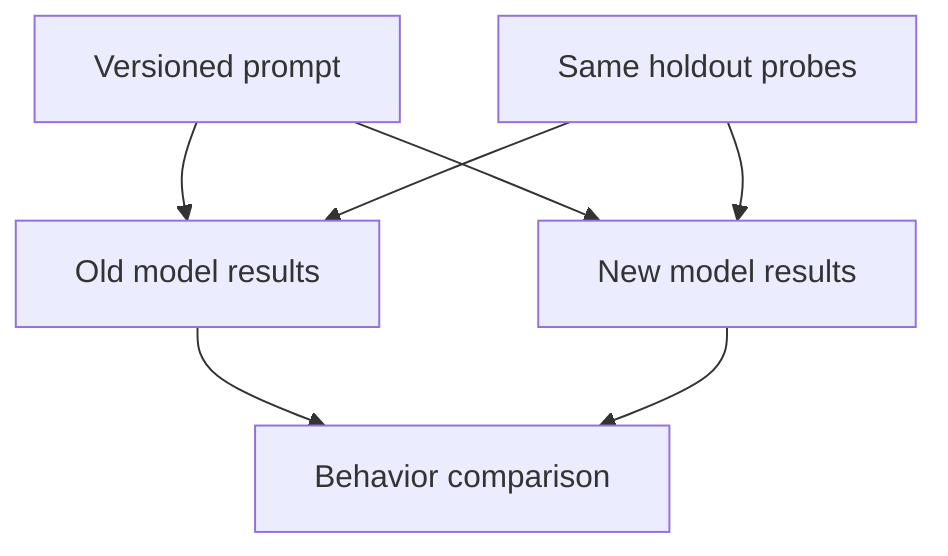
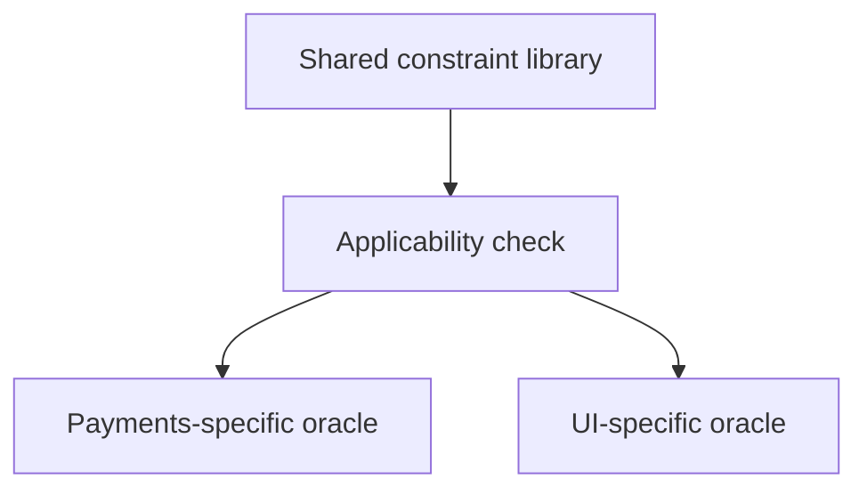

# 3. The prompt library

## The reviewer's brief

> Your team copies a long debugging prompt into every task. Nobody can name which clause helps. Build a small reusable library and show that its constraints transfer to a different problem. How will you avoid grading on the task used to write it?

This is a **constructed practice brief**, not an attributed company question.
Prerequisites: [the section](../README.md). This page is a build brief; it does not ship a runnable application. The original build and prompt sequence below defines the implementation checkpoints.

| Case | Exact input or workload | Expected outcome |
|---|---|---|
| Small example | Five entries from three transcripts; holdout is a paginated importer, while source tasks were UI edits. | Each entry names its constraint, applicability, checkpoint, and keep/parameterize/delete decision after the holdout. |
| Boundary / failure | An entry says “do not mock the database” on a parser with no database. | Reject or narrow applicability; literal reuse is not successful transfer. |
| Scope | A small local comparison; no causal productivity claim from one run. | Explain any additional assumption before implementing it. |

Before looking at the guidance, state the invariant in one sentence and trace the example. In interview practice, implement or sketch independently, then reveal the reasoning. On the AI path, use the prompts below and verify each checkpoint before the next request.

## Baseline and the failure to explain



Repeated words can preserve irrelevant assumptions. First extract the constraint and its evidence; wording is secondary.

<details>
<summary>Reveal the approach and decisions</summary>

Predefine the holdout checkpoint, then parameterize only genuine variables. Compare with and without a constraint over comparable fresh runs. The invariant is that every retained entry has a named failure it is intended to prevent and a check that could reveal that failure.

</details>

## Follow-up 1 · A model upgrade

**Changed requirement:** The same prompts run on a new model version. What evidence expires? Predict which boundary must change before opening the design.

<details>
<summary>Expected reasoning and changed diagram</summary>

Re-run the saved task probes and track model/configuration versions. Earlier observations remain historical; they do not establish present behavior.



</details>

## Follow-up 2 · Several teams adopt it

**Changed requirement:** A payments team needs stronger review than a UI prototype. How does the library avoid unsafe blanket rules? State what evidence would make you reject your first design.

<details>
<summary>Expected reasoning and changed diagram</summary>

Give entries applicability conditions and owners. Reuse the verified stopping point while letting domain-specific correctness requirements remain explicit.



</details>

## Evidence to bring to review

Build in three stops: reproduce the small case and baseline failure; implement the protected boundary; then replay both changed requirements with captured outputs. Record commands, fixtures, and observed results in your implementation README. A diagram is a prediction until those checks run.

**Senior expectation:** Name one transferred constraint and one failed transfer with evidence. **Additional lead scope:** Version and review shared constraints without turning anecdotes into policy. Completion demonstrates practice evidence; it does not establish interview readiness or multi-team delivery experience.

## Build and prompt sequence

*You end up with a page of named asks — constraints, not phrasings — and a
measured answer to whether they hold on work they were not written for.*

**Build**

Mine three or four of your own transcripts for the asks you keep retyping.
Compress them into five to ten named entries — a constraint, when it applies,
what to check after — then run the library on a task from a different area and
count what needed editing.

**The thought process**

What is worth extracting is not sentences. In every ask that worked, one clause
did the work — *show me it failing first*, *do not mock the database*, *stop
when it runs* — and the rest was upholstery. The mining question is which
clause was load-bearing, and the evidence is what the output did differently
because of it. Sometimes the unit is not one ask but a sequence — describe it
back, then slice, then prove — because ordering is what protects your judgment;
a sequence entry names its checkpoints.

Then the part that separates a library from a superstition: the transfer test.
A prompt polished on the task it was written for is fitted to it, the way a
test written after the code asserts whatever the code does. So the measure is a
holdout — a task from somewhere else, success defined before you run. One
afternoon establishes "no worse than ad hoc, cheaper to type, and the checks
fired", which is more than most people ever establish.

**How to organise the prompts**

**1 — mine with evidence, not nostalgia.**

```
Here are three transcripts of me working with a model.

List every constraint I imposed. Rank them by how much work each
did, citing the exact moment in the transcript where the output
changed because of it. No moment, bottom of the list.
```

The check is the citations; anything with no moment attached gets cut.

**2 — compress into entries.**

```
Rewrite the top five as reusable asks. For each: the ask itself, the
constraint doing the work, when it applies, and what I should check
after using it. Strip everything specific to those three tasks.
```

Grep the entries for your project's nouns — any hit means still fitted, not
reusable.

**3 — transfer, then interrogate the misses.**

```
Here is my library and the edits I had to make to use it on today's
unrelated task. For each edit: a parameter I should turn into a
blank, or an assumption that should kill the entry? Answer per
entry: keep, blank it, or delete.
```

Every entry ends the afternoon blanked, rewritten, or deleted — and for each
survivor you can name the failure it prevents.

**On AWS**

Prompts live in git — versioned, diffed and blamed like anything load-bearing.
**Bedrock Prompt Management** is the managed neighbour; it earns a place when
people who do not ship code must edit prompts, or prompts must change at
runtime without a deploy. A personal library meets neither test. The genuinely
useful piece is measurement: asks run through **Bedrock** with invocation
logging get token counts in **CloudWatch**, so "this ask is efficient" becomes
a number per call instead of a feeling.

**What productionising it means**

Libraries rot when models change under them. Date-stamp every entry with the
model it was measured against, and re-run the transfer test after an upgrade
the way you re-run tests after a dependency bump. Shared with a team, edits get
reviewed like code — a quietly deleted constraint degrades everyone's output,
and nobody's diff shows why.

**The learning**

Most of what you retype does nothing, and the clause that works is shorter than
you thought. Watch one constraint survive transfer and three collapse, and you
stop collecting phrasings for good.

**How you would know it is wrong**

- An entry whose prevented failure you cannot name. Decoration with a title.
- Ablate: same task, with and without the constraint, fresh sessions. Equally
  good outputs mean it does nothing — or the task was too easy to tell.
- Success defined after seeing the output. That is tinkering with a ledger.
- Every entry survived transfer untouched. Your domains were too close; the
  clean result is the suspicious one.

---

[Back to the ordered project index](../projects.md)
