# 03 · Frontend

> Junior tier · feeds **P1 (it works)**

## The one-liner

The frontend is the part of your system that runs on hardware you did not
choose, over a network you cannot trust, in front of the only person whose
opinion of the software counts. It is not the pretty part. It is a small set of
placement decisions — where the page gets built, where each fact lives, what
the user sees while the truth is still in transit — and every one of them is
checkable.

## The failure it prevents

The reading list demos perfectly on your laptop. Then a real person opens it on
a phone, on hotel wifi.

They tap **add**. The request is in flight but the screen does not say so, so
they tap four more times: five copies of the same URL, because the button never
disabled and the server never checked. The fifth request times out; the list
code assumed responses succeed, so the page renders nothing at all — just
white. They give up and reopen the app, and the three items they marked read
yesterday are unread again, because "read" lived in the page's memory and never
reached the database.

Nothing in that chain is exotic: a slow network, a missing pending state, a
server that trusts the client, a fact in the wrong home. Each was invisible on
the machine it was built on, because a fast network and a mouse hide all four.

The demo did not lie. It was measured on the one machine where none of this can
happen.

## The mental model

Three placement decisions, made per page rather than per app.

**1. Where does the page get built?** Four answers, and every framework is a
bundle of defaults over them:

- **Ahead of time (static).** Built once, before anyone asks. Fastest and
  cheapest to serve; stale by definition. Right for content that changes when
  you deploy.
- **On the server, per request.** Fresh every time, and secrets stay on the
  server. Costs a round trip and server work on every view.
- **In the browser (client).** The server sends data plus a program that builds
  the page. Interactions after load feel instant; the first load pays to ship
  and run that program on the user's device.
- **Streamed.** The server sends what is ready first and the rest as it comes —
  a schedule mixing the above.

The question underneath is **who pays, and when**: your build machine
yesterday, your server now, or the user's phone — the only one you do not
control and the only one that is ever slow.

"Fast enough" is measured, not felt on your laptop. The field benchmark
(checked 2026-09-21 at web.dev) is Core Web Vitals at the 75th percentile of
real visits: main content painted within 2.5 s (LCP), a response to any
interaction within 200 ms (INP), layout shift under 0.1 (CLS). The human
thresholds underneath are older than the web: a tenth of a second feels
instant; a second keeps the thread of thought.

**2. Where does each fact live?** State is any fact the interface must
remember: the list, the filter, the open dropdown, who is signed in. Each fact
needs exactly one home, chosen by what the fact must survive.


The classic self-inflicted bug is the same fact in two homes: server truth
copied into page memory "for convenience" and synchronised by hope. Treat
everything outside the server as a cache you can throw away, and P1's
"refreshing loses nothing" criterion follows on its own.

**3. The boundary.** Between the page and the server, data arrives late,
broken, or not at all. So every server-backed view has four states —
**loading, error, empty, data** — and only one is the happy path. The empty
state is the first thing every new user sees. The error state is the difference
between "the system failed" and the far worse "no items yet" shown over data
that is fine. "There is nothing" and "I could not find out" must never look the
same.


### Watch the concept, then trace the implementation



The comparison follows four illustrative states. Without the mechanism: a returns late; show stale cat. With it: a is generation 1; discard. These are teaching states, not measured performance.


[Still storyboard / reduced-motion alternative](../../../assets/learning/ui-race-still.svg).

**Predict before replaying:** Why keep a generation check even when you abort request A?

**Try it:** reproduce the final transition in a small example, remove the mechanism, and record the changed outcome. Use the checks later in this chapter to judge the result.

## What good looks like

One property here is a legal floor, not a preference. The European
Accessibility Act (Directive (EU) 2019/882) has applied to products and
services sold into the EU since 28 June 2025, and the benchmark is WCAG 2.2
AA — the current W3C Recommendation, adopted by the updated European standard
EN 301 549 v4.1.1 (published 2026-09-02, its Official Journal citation still
pending). All checked 2026-09-21. At AA that means, among other things: text
contrast of at least 4.5:1 (3:1 for large text), a visible focus indicator, and
interactive targets of at least 24×24 CSS pixels.

Done well:

- For every fact on screen you can say, in one sentence, where it lives and
  what it survives.
- Every server-backed view has loading, error and empty designed, and you can
  force each on demand.
- The URL reproduces the view: refresh, back, and a pasted link land on the
  same page, filter and item.
- The server validates everything it stores; client validation is a courtesy
  copy, never the enforcement.
- The whole main flow works with Tab, Enter and Escape; every field has a
  visible label; focus never disappears.
- Contrast and target sizes were measured, not eyeballed.
- Someone has watched it load on a throttled connection and a mid-range phone
  profile, recently.

Done badly:

- A spinner that never resolves, or a blank page with the real error in a
  console no user opens.
- Filters and half-written forms vanish on refresh; the back button loses the
  view or exits the app.
- The same fact in three homes, synchronised by effects and luck.
- Delete works with a mouse and not a keyboard; clickable `<div>`s;
  `outline: none` because somebody disliked the focus ring.
- "Validation" that a raw HTTP request walks straight past.
- The error state and the empty state are the same grey nothing.

When a model writes the interface, the misses cluster — fluent at layout,
weakest exactly where this section lives. Judge these first:

- **Happy path only.** Loading, error and empty exist only if you demanded them.
- **Semantics traded for looks.** A `<div>` with a click handler instead of a
  button, a placeholder doing a label's job, the focus outline removed, ARIA
  attributes sprinkled where a native element was the fix.
- **State over-copied.** Server data duplicated into local variables and kept
  in sync by effects — drift, scheduled.
- **Client-only validation.** The endpoint believes whatever arrives.
- **Dependencies by reflex.** A store, a fetching library and a form library
  for a page that needed none of them.
- **Plausible inventions.** Endpoints and options that look right and do not
  exist. Read each as a claim, not a fact.

## Ask Claude for this

**Request 1 — the view, with its state placed first**

```
Build the list view for the reading list. Before writing any code, list
every piece of state on this screen, and for each one tell me where it
lives — server, URL, shared store, or component memory — and what it
must survive: a refresh, a shared link, another device.

Then implement the view with explicit loading, error and empty states,
and give me a way to force each of the three so I can look at them.
```

*Why it is asked that way:* the inventory-before-code turns placement into a
decision you can review instead of a default you inherit. "A way to force each
state" is the constraint doing the work — an error state you cannot summon
ships unseen.

*What you should get back:* a table of fact → home → what it survives, then a
view where you can kill the API, open an empty account, and watch the pending
state. If every fact landed in a store, the question was not answered; it was
avoided.

*Push back on:* server data copied into a store or component "for performance"
with no story for when the copy goes stale; an error state that logs to the
console and renders nothing; an empty state that is just the absence of rows.

**Request 2 — the form that does not trust the browser**

```
Add the "add a URL" form. Validate on the client for fast feedback and
on the server as the real check — the same rules in both places.

Then show me exactly what happens in three cases: the form submitted
by a raw HTTP request that skips the page entirely; the same URL
submitted twice; and a submission that takes ten seconds. The submit
button must not be clickable while a submission is in flight.
```

*Why:* the three cases are the three ways forms actually fail, and naming them
forces the enforcement point onto the server. Left unnamed, you get a polished
client and an endpoint that believes anything.

*What you should get back:* server-side checks that reject garbage no matter
what the page did, a pending and disabled submit, and a decision — not an
accident — about duplicates.

*Push back on:* any suggestion that bypassing the page "won't happen" — the
client is optional and curl exists; two diverging implementations of "the same
rules"; errors surfaced only as a toast that vanishes in three seconds.

**Request 3 — the audit you make it do element by element**

```
Audit this page against WCAG 2.2 AA. Walk it interactive element by
interactive element: can it be reached with Tab, does it have an
accessible name, is focus visible on it, does the Tab order match the
visual order, is its text contrast at least 4.5:1?

List every failure with the exact line that causes it. Do not fix
anything yet.
```

*Why:* "make it accessible" produces a coat of aria-labels; element by element
against named criteria produces findings you can verify. "List, don't fix"
keeps the judgment with you.

*What you should get back:* a concrete failure list — an input with no label, a
clickable div, a focus order that jumps across the page, a grey caption below
4.5:1.

*Push back on:* `aria-label` used where a real `<label>` or `<button>` is the
fix — prefer the native element that carries the behaviour for free; and any
fix that quietly removes the visible focus indicator.

## How you would know it is wrong

Seven checks, each capable of going red:

1. **Unplug the mouse.** Tab through sign-in → add → tag → mark read → delete.
   Anything you cannot reach, or cannot see focused, is red — and in the EU,
   illegal since June 2025.
2. **Throttle the network** in the dev tools and click **add** twice. Count
   the rows in the database, and watch the screen during the wait: if nothing
   acknowledges the click, real users will do what you just did.
3. **Measure contrast with a tool**, never your eye — your eye knows what the
   design intended. Body text below 4.5:1 is red.
4. **Stop the API mid-session.** A readable failure is green; a blank page or
   an eternal spinner is red. "No items yet" over data that exists is the worst
   result here, because it lies.
5. **Bypass the client.** Send the form endpoint a raw request with a garbage
   "URL". Anything other than a rejection and zero new rows means the
   validation was theatre.
6. **Give a screen reader five minutes** — VoiceOver ships with macOS and iOS,
   Narrator with Windows, NVDA is free. Do buttons announce as buttons, with
   names? "Clickable, clickable, clickable" means the page is divs.
7. **Open a brand-new account.** The first screen is either the empty state you
   designed or the proof that you never designed one.

> The rule under all seven: the demo on your own laptop, with your own mouse,
> on your own fast network, is the canonical check that cannot fail — so it
> proves nothing.

## Your slice of the project

On **P1**, add:

- The list view with all four states explicit — loading, error, empty, data —
  and a documented way to force each one.
- The add-URL form with a pending state, a submit disabled in flight,
  server-side validation, and a written decision about duplicates.
- The current filter (and page, if you paginate) carried in the URL.
- A state inventory in your decisions file: every fact on screen, its home,
  what it survives. Three columns, however many rows.

**Acceptance criteria you can check yourself:**

- Stop the API: the list shows a readable failure that a stranger could tell
  apart from "empty".
- A raw request with an invalid body gets a rejection and writes zero rows.
- A filtered URL pasted into a private window reproduces the same view.
- The whole flow — sign in, add, tag, mark read — completes with the keyboard
  only.
- On a throttled network, double-clicking **add** produces one row, or exactly
  the duplicate behaviour you wrote down.

## Words you now own

- **rendering** — turning data into the page; the question is always where and
  when.
- **hydration** — attaching interactivity in the browser to HTML that was built
  on the server.
- **state** — any fact the interface must remember.
- **source of truth** — the one home where a fact is authoritative; every other
  copy is a cache.
- **optimistic update** — showing a result before the server confirms, with a
  plan to roll back.
- **pending state** — the screen acknowledging work in flight; its absence is
  behind most double-submits.
- **empty state** — what a view shows when there is genuinely nothing; must be
  distinguishable from an error.
- **accessible name** — what a control is called when read aloud; supplied by a
  label, its own text, or ARIA.
- **focus order** — the sequence Tab walks through the page; it should match
  the order the eye reads.
- **contrast ratio** — measured, not judged: 4.5:1 minimum for body text at
  WCAG AA.
- **progressive enhancement** — the basic flow works before the client-side
  program loads; the program improves it.
- **Core Web Vitals** — the three field metrics (LCP, INP, CLS) at the 75th
  percentile of real users, not your machine.

---

**Not covered here:** CSS itself — layout, typography, design systems — is a
craft this section only borders. Build tooling, caching, offline behaviour,
real-time updates and animation are deliberately out; performance returns in
the senior tier as a budget you defend with numbers. And nothing here helps you
choose a framework, on purpose: every placement decision above outlives
whichever one you pick.

[Choose your learning path](../../../paths/README.md) · [Interview applications](../../../paths/interviews/README.md)
