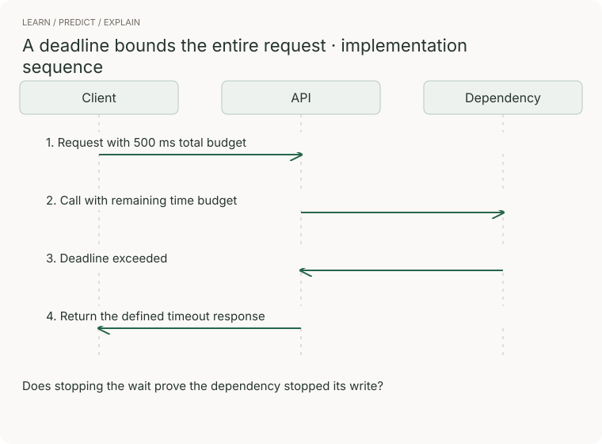

# 04 · Backend

> Junior tier · feeds **P1 (it works)**

## The one-liner

The backend is where a click becomes a row in a database — the code that takes
requests from the outside world and decides what actually happens. Everything
that arrives is a message from a stranger, and everything you promise must
stay true when two strangers arrive at once. A frontend bug is wrong on one
screen; a backend bug is wrong for everyone.

## The failure it prevents

You ship the reading list. Someone pastes a link to a server that accepts the
connection and then never sends a byte — a half-crashed machine, a load
balancer with nothing behind it.

Your title-fetch code waits. How long? You never said, so you inherited your
HTTP client's default. In Node's built-in `fetch` that is five minutes
waiting for response headers (300 seconds; checked 2026-09-21). In Python's
`requests` there is no default at all — the docs warn that without a timeout
"your code may hang for minutes or more" (checked 2026-09-21).

Each pasted link ties up one of your handful of worker processes. Nothing
crashes and nothing logs, because nothing is wrong — everything is just
waiting. A few links later, the sign-in page stops loading for everyone.

One pasted URL, zero exceptions, whole site down. That is the cost of an
unchosen timeout — one entry on this section's list: every place
between the click and the row where a request can stop, and who finds out when
it does.

## The mental model

A request is a message on a journey. The browser turns a name into an address
(DNS), opens an encrypted connection (TLS), and sends a few hundred structured
bytes across machines you do not own. At your process a router picks the code,
the body is parsed and validated, auth decides who is asking, and your handler
does the work — reading and writing the database, sometimes calling someone
else's server. The response makes the same trip in reverse, to a browser
that may no longer be waiting. The order of the middle steps varies by
framework; the stops do not.


Three ideas survive framework churn.

**Every hop is a place it can stop, and each stop needs an owner.** HTTP is
the contract for saying so: 4xx means the sender got it wrong, 5xx means you
did. GET must never change anything. PUT and DELETE are idempotent — twice
leaves the world as once — while POST is not guaranteed to be (RFC 9110;
checked 2026-09-21), which matters because networks deliver things twice and
users double-click. Failures come in three kinds: expected (a 4xx with a clear
message), unexpected (a 5xx, logged loudly with stack trace and request id),
and swallowed — caught, hidden, returned as success. The third costs the
most; the 2025 OWASP Top 10 added "Mishandling of Exceptional Conditions" as a
category of its own (checked 2026-09-21).

**Your process is disposable; nothing true lives in it.** Restarted,
duplicated, killed mid-request; truth lives in the database. Requests
interleave, so "read a value, change it, write it back" is a bug waiting for
company: both read 4, both write 5, one update vanishes without an error. A
transaction is the database's promise that a group of changes happens entirely
or not at all, never seen half-done. Identity comes from the environment:
harmless defaults in committed config files; secrets handed to the process at
start, as environment variables set by whatever launches it, or read from a
secret store. Never the repo — a repo is designed to be copied
everywhere.

**Everything crossing the boundary is untrusted.** Body, headers, URL,
cookies: attacker-controlled bytes until checked. The reading list makes this
sharp because it fetches URLs users hand it. Your server sits somewhere
privileged — inside a network, possibly next to a cloud metadata service — so
a user who submits `http://localhost:5432/` is asking *your server* to make
that request from *its* position. That is server-side request forgery (SSRF).
OWASP gave it its own slot in 2021 and folded it into Broken Access Control in
the 2025 revision (checked 2026-09-21); the reclassification is the lesson —
you never decided what your fetcher was allowed to reach.


### Watch the concept, then trace the implementation



The comparison follows four illustrative states. Without the mechanism: work continues after the client gives up. With it: timeout ends waiting and records failure. These are teaching states, not measured performance.



[Still storyboard / reduced-motion alternative](../../../assets/learning/deadlines-still.svg).

**Predict before replaying:** Does stopping the wait prove the dependency stopped its write?

**Try it:** reproduce the final transition in a small example, remove the mechanism, and record the changed outcome. Use the checks later in this chapter to judge the result.

## What good looks like

- Status codes tell the truth: every failure is a 4xx or 5xx. A 200 with an
  error inside is a lie that frontends, caches, and monitoring all believe.
- Errors have one shape everywhere: machine-readable code, human message, a
  request id that also appears in the logs.
- Every outbound call has a timeout visible in the code, chosen on purpose.
- GET changes nothing; repeating a PUT or DELETE changes nothing more; a
  duplicate POST does something you decided in advance.
- Input is validated at the edge; handler logic starts after the shape is
  proven.
- Config comes from the environment; the repo holds an example file with
  variable names and none of the values.
- Read-modify-write paths sit inside transactions or single atomic statements.

Done badly, you see:

- `200 {"success": false}`.
- A catch block that logs nothing and returns something.
- The database password in a committed config file, "to rotate later."
- A fetcher that will happily request `http://169.254.169.254/`, where cloud
  providers serve a machine's own credentials.
- Code that works every time you click it and corrupts data under two
  simultaneous clicks, which sequential tests never produce.

## Ask Claude for this

**Request 1 — the contract before the code**

```
I am building <feature: e.g. "add a URL to a shared reading list">.

Before any code: list every endpoint as a table — method, path, what it
does, the success status, and every failure it can return, each with its
status code and a structured error code.

Then tell me which failures on that list my frontend would never find out
about if the endpoint returned 200 with an error message inside the body.
```

*Why it is asked that way:* the failure column is what juniors and models both
skip, so it is demanded before a happy path exists to crowd it out. The second
paragraph turns "never 200 on failure" from a rule into a visible cost.

*What you should get back:* a boring table — nouns in the paths, methods as
verbs, mostly 200, 201, 400, 401, 403, 404, 409. Boring is the win:
everything already understands it.

*Push back on:* any failure returned as 200; POST used for reads; inventive
shapes that trade a decade of shared convention for nothing.

**Request 2 — hostile-input review of the fetcher**

```
Here is the code that fetches a user-submitted URL and reads the page
title. Assume the URL was chosen by someone who wants to hurt this server.

First list every way it can: where the request can hang, which internal
addresses it could be pointed at, how large a response it might swallow,
and what a redirect can do to any check you add.

Then fix each item: a total timeout I name, a response size cap, an
allowlist of URL schemes, and a block on private and internal addresses
that still holds after redirects. For each fix, say what the user sees
when it fires.
```

*Why:* "assume hostile" flips the model from helping the URL succeed to
attacking it, and list-first means every fix maps to a named threat. The
redirect clause names the classic bypass: validate, then obediently follow a
redirect to the address you just blocked.

*What you should get back:* timeout, size cap, scheme allowlist,
private-address block — each tied to a user-visible outcome, not a silent one.

*Push back on:* checking the hostname string but fetching whatever it resolves
to; a timeout on connect but none on the body; "sanitising" a bad URL instead
of refusing it.

**Request 3 — prove the race, then fix it**

```
Find every place in this code that reads a value, changes it, and writes
it back. For the most important one, write a test that runs two of those
operations concurrently and demonstrates the lost update — I want to see
it fail before any fix exists.

Then fix it with a transaction or a single atomic statement, and show the
same test passing.
```

*Why:* the same discipline as [06 · Testing](../06-testing/) — evidence the
bug exists before you trust the fix. A concurrency fix without a red test
first is a guess that happened to compile.

*What you should get back:* one red run showing the lost update, then the same
test green after the fix, in that order.

*Push back on:* a test that fakes concurrency with sleeps and sequential
calls; any fix that adds an in-process lock, which dies the moment you run a
second process — the first thing that happens after P1.

## How you would know it is wrong

The checks for this topic, each one capable of going red:

1. **Kill the database mid-request.** Stop the database while a write is in
   flight. You want a clean 5xx within seconds, no half-written rows, and
   recovery without a restart when it returns. A 200, a hang, or a half-saved
   item is red.
2. **Point the fetcher at a URL that hangs.** Time it with a clock: the
   request must give up within the seconds *you* chose. "It errored
   eventually" is a fail — eventually was the default.
3. **Send a malformed body.** Truncated JSON, wrong types, a ten-megabyte
   string. You want a 400 in your structured shape. A 500 means untrusted
   bytes reached code that assumed their shape; a stack trace in the response
   publishes your internals.
4. **Call the same endpoint twice.** Submit the same URL twice, fast. Whatever
   you documented should happen. Two identical rows means you did not decide,
   you discovered.
5. **Ask the fetcher for something internal.** `http://localhost:5432/`, a
   private-range address, `http://169.254.169.254/`. The refusal must come
   before any connection opens — and survive a public URL that redirects
   there.
6. **Grep the repo for a secret you know, history included** (`git log -p`
   piped through grep). One hit means it belongs to everyone who ever clones;
   the fix is rotation, not deletion — history is the repo.

> Underneath all six: **before believing a green result, say what it would
> have looked like if the thing were broken.** A fetcher never pointed at a
> hostile URL is not safe; it is untested.

## Your slice of the project

On **P1**, this section is the add-a-URL flow done properly:

- The endpoint table from Request 1, committed *before* the handlers exist,
  failure column included.
- The title fetcher with a total timeout you chose (write the number and the
  reason next to it), a size cap, a scheme allowlist, and a private-address
  block. A failed fetch still saves the item, failure visible on it.
- One structured error shape — code, message, request id — used by every
  handler, and no 200-with-a-failure-inside anywhere.
- Your one genuinely concurrent write (two people marking the same item read,
  say) protected by a transaction or atomic update, with Request 3's
  red-then-green test as evidence.
- Secrets via the environment: an example env file in the repo, the real one
  ignored.

**Acceptance criteria you can check yourself:**

- Checks 1 through 5 each run once, with what you saw written down.
- The hanging-URL check completes within your chosen timeout plus one second,
  measured, not felt.
- Grepping the full git history for your database password and session secret
  returns nothing.
- A fresh clone with only the example env file refuses to start, naming the
  missing variable — not a stack trace.

## Words you now own

- **endpoint** — one method plus one path your server answers; the unit of API contract.
- **status code** — the machine-readable verdict: 2xx worked, 4xx the sender's problem, 5xx yours.
- **idempotent** — safe to repeat; the second identical call changes nothing more.
- **structured error** — a failure with a machine-readable code and a request id, not just prose.
- **timeout** — the longest you are willing to wait, chosen on purpose.
- **transaction** — a group of database changes that happens entirely or not at all, never seen half-done.
- **race condition** — two interleaved operations producing a result neither would alone; the lost update is the starter kind.
- **environment variable** — configuration the process reads at start; how secrets reach code without living in it.
- **SSRF** — server-side request forgery: tricking a server into making requests from its own privileged position.

---

**Not covered here:** the database itself — modelling, indexes, migrations —
has its own section; here it is where truth lives, nothing more.
Authentication internals (passwords, sessions, tokens) likewise. Retries,
queues, caching and rate limits are P3; deploying and observing this backend
is P2. Nothing here is about speed — a backend first has to be right when
things go wrong, which is most of what a backend is.

[Choose your learning path](../../../paths/README.md) · [Interview applications](../../../paths/interviews/README.md)
