# 04 · Backend — five projects

> Junior tier · each one an afternoon · read [APIs and background work](../../../curriculum/02-applications/01-backend/README.md) first

Five projects, rising. Each one isolates a different thing the backend owes
the world: an account of what it did, an answer on time, a refusal it can
prove, a promise kept to old callers, and work that survives its own death.
All five build on P1's reading list, and in all five the order of the asks
matters more than the code.



---

### 1. The request you can trace end to end

*You end up able to take one id from an error message and reconstruct
everything that request did, in order, with timings.*

**Build**

P1 emits one structured JSON event for each step of every request — an id
minted at the entry point, carried through auth, the database and the title
fetch, echoed in the response headers and in every error body. Plus a script
that, given an id, prints that request's story.

**The thought process**

First decide what the evidence belongs to. Processes produce logs, but
requests are what break, and until every line carries the id of the request
that caused it, the logs are a pile sorted by time — and under concurrency,
time lies.

Second, where the id is born: at your own front door, because an id accepted
from any browser header is a field strangers get to write.

Third, the event shape is an API whose consumer is you at 3am — id, timestamp,
event name, duration, outcome — decided once, or every handler invents a
dialect and grep becomes archaeology. Decide what never appears, too: secrets,
whole bodies, URLs carrying tokens.

**How to organise the prompts**

**1. The inventory.**

```
Read this repository. List every place a request leaves evidence today —
log lines, prints, uncaught errors. For each one: could I tell WHICH
request produced it? Do not write any code.
```

The honest answer is mostly no, and that list is the case for the work.

**2. The shape.**

```
Design one JSON log event: request id, timestamp, event name, duration,
outcome. Mint the id at the entry point, return it in a response header
and in the error body, and wrap the database calls and the title fetch so
each logs start and finish with the id.

Show me the event shape and where the id is born before the rest.
```

One curl, then grep the id: every step you know about, exactly once.

**3. The stitcher.**

```
Write a script: given a request id, print that request's events in order
with elapsed milliseconds between them. If the story has a hole — a fetch
that started and never finished — say so.
```

Point it at a request whose fetch hangs. The visible hole is the deliverable.

**On AWS**

**CloudWatch Logs**, for what you do not build: log JSON to stdout and Lambda
or Fargate ship it automatically, where EC2 has you installing and patching an
agent. **Logs Insights** queries the JSON fields directly, which at one
application's scale is why you do not need **OpenSearch** — a cluster that
runs, and bills, while you sleep. **X-Ray** is this project done by
infrastructure; meet it after threading one id by hand.

**What productionising it means**

A metric filter on error events feeding an alarm, so the logs page you before
a user does; the id shown in the UI's error state, so a support message
arrives holding the thread to pull; a second person able to answer "what
happened to this request" with one query. And retention chosen on purpose — a
log group left alone keeps everything forever.

**The learning**

Evidence belongs to requests, not processes. Once one id threads the whole
journey, everything later — metrics, tracing, support — hangs off it. A
backend that cannot narrate one request is operated by guessing.

**How you would know it is wrong**

- The hanging-URL story must show a started-and-never-finished step, not a clean-looking gap.
- Take the id from a forced 500's error body: one grep must land on the stack trace.
- Fire two requests concurrently: two clean stories, no line belonging to both.
- Send a password-shaped value in a request body, then grep the logs: one hit and the pipeline leaks.

---

### 2. The three-second budget

*You end up with every outbound call bounded by a number you chose, retries in
exactly one place, and a POST that is safe to send twice.*

**Build**

A time budget for P1's add-a-URL request: a deadline minted at the door and
spent down the chain — the diagram above — timeouts derived from what remains,
retries only in the fetch client, and an idempotency key so a retried POST
cannot create two rows.

**The thought process**

The top number comes first: how long will a person wait before the answer is
worthless? Until that number exists, every timeout below it is a guess about a
whole nobody named.

Then the arithmetic: budgets subtract, and a hop may spend what is left, not
what feels generous. The diagram's failure is a hop whose own timeout exceeds
what it was handed — the caller gone at three seconds, the fetch working seven
more for nobody.

Third, retries live in one layer. They multiply through a stack — three
layers of three is twenty-seven calls at the bottom — so they belong where
the failure is understood: the fetch client.

Last: nothing makes a retry safe by default — the network can lose a response
after the insert happened. So safety is built: the client mints a key, the
server remembers the first outcome and returns it to replays.

**How to organise the prompts**

**1. The timeout census.**

```
List every outbound call this system makes — HTTP, database, anything
leaving the process. For each: its timeout today, and whether that was
chosen or inherited from a library default. No fixes yet.
```

Every "inherited" row is the section's opening failure, waiting; the table
becomes the budget.

**2. The deadline.**

```
The whole request gets 3.0 seconds. Create a deadline at the entry point
and pass it down: every outbound timeout becomes the smaller of its own
cap and the time remaining, and a call with nothing left fails at once.

Show me the budget as a table before changing any code.
```

Worst cases must sum to 3.0 or less; whatever cannot fit does not belong in
the request — that is project 5.

**3. Retries, then the key.**

```
Add retries for the title fetch only: at most two, exponential backoff
with jitter, only on timeouts, connection failures and 5xx — never 4xx —
and both attempts must fit the same 3.0s deadline.

Then make the POST safe to retry: the client sends an Idempotency-Key; a
replay returns the first attempt's result instead of inserting again.
Prove it: cut the connection after the insert, before the response, and
retry.
```

One row in the database, two identical responses.

**On AWS**

The edge already enforces a budget: **API Gateway** REST APIs wait at most 29
seconds for an integration by default, raisable for regional and private REST
APIs at a possible throttle-quota cost (checked 2026-09-22), where an
**ALB** mostly hands the socket through — budget-keeper versus plumbing you
instrument yourself. And **Lambda** runs up to 900 seconds (checked
2026-09-22), so a function timeout above your edge's is the diagram at cloud
scale: the 504 sent, the function still running, still billed.

**What productionising it means**

The budget is a file in the repository, changed by review, not numbers smeared
across call sites. Timeout rate and retry rate become their own metrics — a
retry storm can look healthy in error rate. And retries get an
environment-variable kill switch: in an incident they convert failure into
load, and you want a lever, not a deploy.

**The learning**

A timeout is a claim about the whole chain, and a default is someone else's
claim about a system that is not yours. Retries are extra load, safe only
where a repeat is provably harmless — a proof you construct, never assume.

**How you would know it is wrong**

- Wall-clock a request whose fetch hangs: 3.0 seconds plus a little, measured, not felt.
- In that run's logs, fetch activity stamped after the deadline means the budget is decoration.
- Send the same Idempotency-Key twice: one row, byte-identical responses.

---

### 3. The fetch that cannot be aimed inward

*You end up with a title fetcher that can be handed any URL and can only ever
reach the public internet — with a test that proves each refusal.*

**Build**

One guarded HTTP client that everything in P1 fetches through: scheme
allowlist, resolve-then-connect to the vetted address, refusals for private,
loopback, link-local and metadata ranges, every redirect re-vetted, plus
project 2's deadline and a size cap. Refusals are coded 4xxs; the item still
saves, failure visible.

**The thought process**

Start from the job description, not the threat list: this fetcher exists to
read public web pages, so deny by default — http and https, to public
addresses, everything else refused because it was never the job.

The decision that makes the project: a check must bind to the connection it
protects. A URL is indirection, so the guard resolves the name, vets the
address, and connects to exactly what it vetted. Checking the string and then
connecting to whatever it resolves to later is checking a costume.

A redirect is a new fetch; approval does not survive it. Each hop gets the
whole check again, capped — the classic hole is a public URL redirecting
somewhere internal, followed by code that finished checking a hop ago.

**How to organise the prompts**

**1. The map.**

```
Here is the code that fetches user-submitted URLs. Assume any URL. List
every way it could be made to reach something inside my network or cloud
account, hang forever, swallow something enormous, or be re-aimed after a
check passed. No code.
```

If redirects and re-resolution are missing, the list is not finished — push
back.

**2. The one guarded client.**

```
Build one guarded fetch client and route every fetch through it: allow
only http and https; resolve the hostname and refuse private, loopback,
link-local and metadata ranges; connect to the address that passed;
re-run the whole check on every redirect (maximum three); enforce the
deadline and a 1 MB cap. Every refusal is a distinct 4xx with a code.
```

Grep for any fetch that bypasses the client. One bypass and the guard is a
suggestion.

**3. The refusals, proven.**

```
Write the refusal tests: one per promise, each able to fail. Include a
test that starts a listener on a local port and proves the fetcher never
opened a connection to it, and one where a public URL redirects to an
internal address. Then remove the guard on a branch and show me every one
of them going red.
```

A suite that stays green without the guard has measured nothing.

**On AWS**

Why the position is privileged: on **EC2** the machine's credentials sit
behind plain HTTP at the metadata service — require the session-based
**IMDSv2** so a bare forged GET gets nothing — and a **Fargate**
task holds role credentials at a link-local endpoint too. **Lambda** has no
metadata endpoint reachable from code, so a fetcher isolated in its own
Lambda, with a role that can do almost nothing, is defence in depth: whatever
is tricked arrives in an empty room. Whichever you run: a route to the
internet, none inward. At P1 volume the Lambda is effectively free.

**What productionising it means**

Refusals are logged with project 1's request id and rate-limited per account —
a burst from one user is signal. The blocked ranges are data with a source
comment, not folklore. And every future URL-shaped feature — webhooks,
imports, avatars — inherits the client or does not ship.

**The learning**

"Validated" is a statement about a moment, and the connection happens after
it: safety binds to what the code does, not what it once checked. The other
half: position is privilege — the same GET is harmless from your laptop and a
live wire from inside your network.

**How you would know it is wrong**

- The canary listener records a connection for an address the fetcher claims it refused.
- A public URL redirecting to an internal address is followed instead of refused at the hop.
- A hostname that looks public but resolves to a private address — a hosts-file entry reproduces this locally — gets through.

---

### 4. The API that does not break its callers

*You end up able to change P1's API underneath a frontend you are not allowed
to touch — with a dated, tested path to removing what you replaced.*

**Build**

Yesterday's client, recorded and turned into a compatibility test. One real
change made additively — the new shape beside the old — the old marked with
`Deprecation` and `Sunset` headers and a real date, and a log query that says
who still uses it.

**The thought process**

Decide what breaking means before touching anything. Not "the schema changed"
— "a promise changed": a field removed or renamed, a type tightened, a meaning
shifted, required become optional. The honest third column is ambiguous —
field order, an enum value nobody has seen — because callers depend on
everything observable, promised or not, and that column is where incidents are
born.

The additive rule and its price: you may add; you may not remove or repurpose.
Wrong turns therefore accumulate unless retirement is a process — announce,
measure, remove — and only the measuring makes the date honest. Version only
when additive fails — when the shape itself was the mistake — and in the path:
`/v2/` shows up in logs, curls and screenshots; header versioning is tidier
and invisible, the wrong property while learning to debug.

There are standard words for retirement: `Deprecation` (RFC 9745, March 2025)
announces it, `Sunset` (RFC 8594) names the date after which it may stop
answering, and the sunset must not be earlier than the deprecation (checked
2026-09-22). Machine-readable retirement reaches callers a changelog never
will.

**How to organise the prompts**

**1. The promises.**

```
Read the API and its callers. Write down every promise a caller could
currently rely on: fields, types, optionality, meanings, status codes,
orderings. Then sort possible changes into three lists — safe to make
silently, breaking, ambiguous — one line of why each.
```

Argue with the ambiguous list; it is the whole lesson wearing a table.

**2. The additive change.**

```
Tags need to become structured objects instead of bare strings. Do it
additively: new field beside the old, both written on every change, old
callers unaffected. Before changing anything, record today's real
responses and turn them into a test that yesterday's client still passes.
```

The recorded-yesterday test must be green before and after the change.

**3. The retirement.**

```
Mark the old field's endpoints with Deprecation and Sunset headers,
sunset ninety days out. Add a log query that counts callers still reading
the old field. Then make the compatibility test enforce the calendar:
removing the old field fails before the sunset date and is allowed after.
```

`curl -i` must show both headers with a real date; the usage query must return
a number, not a shrug.

**On AWS**

**API Gateway** earns its keep over an **ALB** here: stages and base-path
mappings make `/v1` and `/v2` separately deployed, separately measured things,
and per-stage **CloudWatch** metrics answer "is anyone still on v1" without
instrumenting a line. An ALB routes paths to target groups, but the
bookkeeping — per-version metrics, gradual shift, the mapping — is yours to
build. None of it costs meaningful money at P1 traffic.

**What productionising it means**

The sunset date gets an owner and a calendar entry, because a date nobody owns
is a wish. Removal day is a deploy with behaviour decided in advance. The date
opens the conversation; the caller count closes it, at zero.

**The learning**

An API is a promise with an audience. You can widen it silently; narrowing it
needs consent and a calendar. Compatibility is not refusing to change — it is
changing in a fixed order: add, migrate, measure, then remove.

**How you would know it is wrong**

- Replaying yesterday's recorded traffic fails against today's API.
- Deleting the old field on a branch leaves the compatibility test green — a guard that cannot fail.
- A brand-new optional field trips an alarm — a guard that blocks safe changes teaches people to route around it.

---

### 5. The job that survives a restart

*You end up with the title fetch off the request path, and a worker you can
kill mid-job without losing the work or doing it twice where it shows.*

**Build**

A jobs table in the database P1 already has — pending, claimed with an expiry,
done, failed with a reason — and a worker loop that claims atomically and runs
the guarded fetch inside the budget. The endpoint returns at once, title
pending. At-least-once delivery, idempotent handling.

**The thought process**

Start with what the user gets now: the request must end on time — project 2 —
so the answer is the saved item, title pending. P1's decision list called this
the honest version of a queue; the response gains a status field — an
additive change, project 4.

Then the guarantee arithmetic. The worker claims, works, records — and a crash
between work and record repeats the work, so exactly-once is off the menu once
`kill -9` is in the room. What remains is at-least-once with work that
converges: writing the same title twice leaves the same row. And a crash
between claim and work strands the job unless claims expire.

The claim is the section's lost update wearing overalls: two workers, one job,
read-then-write hands it to both. It must be one atomic statement — update
where still pending, returning the row — never a select followed by an update. And failure is a state, not an exception: attempts counted, capped,
ending in failed with the reason where a person can see it.

**How to organise the prompts**

**1. The crash map.**

```
Move the title fetch out of the request. Design first, no code: the jobs
table with its states, the exact atomic statement by which one of two
competing workers claims a job, how a claim expires when a worker dies, and
every moment where a crash loses or repeats work.
```

A crash list missing "after the fetch, before recording it" has not
understood the problem.

**2. The worker.**

```
Implement it: the endpoint saves item and job and returns the title as
pending; the worker claims with the atomic statement; claims expire after
60 seconds; three failed attempts end in failed, reason on the item.

Run two workers against ten jobs and show, from the tables alone, that
each job was claimed exactly once.
```

From the tables — a count of claims is a number that can be wrong.

**3. The two deaths.**

```
Two demonstrations. One: kill -9 the worker mid-fetch, restart, show the
job re-claimed after expiry and finished. Two: crash between fetch and
record, show the fetch running twice while the item ends correct. Save
both stories with job ids.
```

The second run is at-least-once, seen plainly: the duplicate does not matter.

**On AWS**

**SQS** is this project as a managed service; everything you built has a name
there: the claim expiry is the visibility timeout — 30 seconds by default,
extendable to 12 hours (checked 2026-09-22) — the attempts cap is a
dead-letter queue, and standard queues promise exactly the at-least-once you
designed for (checked 2026-09-22). **EventBridge** routes events to many
listeners — announcements, not a work list. **Kinesis** is an ordered,
replayable stream for many readers — the wrong shape for "do this once".
**Lambda** from SQS wires batching, retries and the DLQ, under a 15-minute
ceiling (checked 2026-09-22); **Fargate** is for jobs that outgrow it. The
table version's claim is `SKIP LOCKED` on **RDS** Postgres or a conditional
write on **DynamoDB** — one idea, two spellings. At P1 volume it is all
effectively free.

**What productionising it means**

Alarm on depth and age, not errors: a dead worker emits none, and its silence
photographs exactly like health — so alarm when the oldest pending job passes
an age you chose. The worker finishes its claim on SIGTERM. And the failed
state needs an owner: a dead-letter queue nobody reads is a landfill.

**The learning**

Exactly-once is a slogan; at-least-once plus convergent work is what survives
`kill -9`. The queue was never the hard part — the state machine and the
atomic claim were, and both came from the database you already had.

**How you would know it is wrong**

- `kill -9` mid-fetch: the job completes within claim expiry plus one poll, measured.
- Two workers, ten jobs: the table shows exactly ten claims.
- A poison job: three attempts, a failed state with the reason, a worker still alive.
- Stop the worker for an hour: the age check goes red, or silence means nothing.
