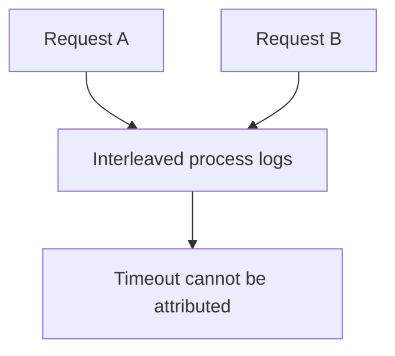
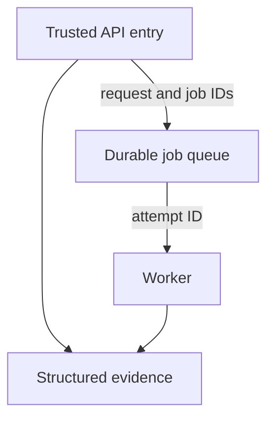
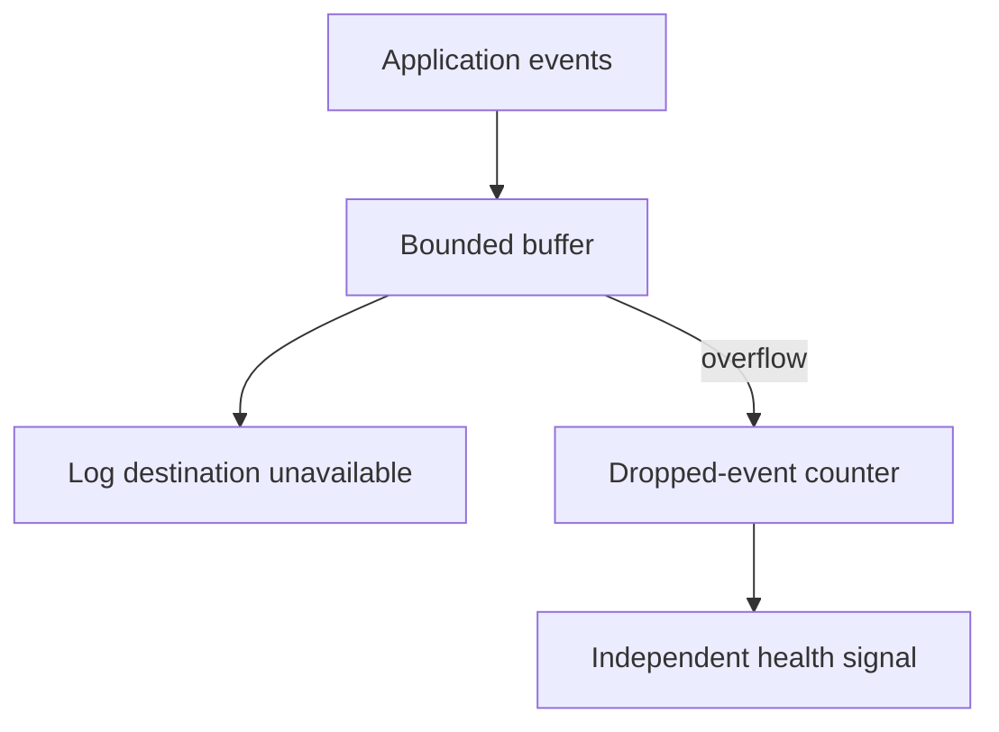

# 1. The request you can trace end to end

## The reviewer's brief

> A user reports that adding a link failed at 10:00, when fifty other requests were active. Instrument the service so support can reconstruct that one request without receiving its secret URL. Where should the correlation ID be created?

This is a **constructed practice brief**, not an attributed company question.
Prerequisites: [the section](../README.md). This page is a build brief; it does not ship a runnable application. The original build and prompt sequence below defines the implementation checkpoints.

| Case | Exact input or workload | Expected outcome |
|---|---|---|
| Small example | Two concurrent requests A and B each run auth, insert, and title fetch; A’s fetch times out. | A has its own start/timeout events and response ID; B has its own success events. No event is assigned to both. |
| Boundary / failure | Client sends `X-Request-ID` containing newlines and a token-bearing URL. | Mint or validate at the trusted edge; sanitize fields and omit token values. |
| Scope | Logs explain observed events; absence and cross-host clock skew require explicit handling. | Explain any additional assumption before implementing it. |

Before looking at the guidance, state the invariant in one sentence and trace the example. In interview practice, implement or sketch independently, then reveal the reasoning. On the AI path, use the prompts below and verify each checkpoint before the next request.

## Baseline and the failure to explain



Ordering by wall time alone interleaves different requests and cannot safely establish causality across machines.

<details>
<summary>Reveal the approach and decisions</summary>

Choose a stable event schema, mint a trusted request ID, carry child-operation IDs across boundaries, and measure durations with monotonic clocks. The invariant is correct attribution without secret disclosure; missing finish events must remain visible.

</details>

## Follow-up 1 · The title becomes a queued job

**Changed requirement:** The response finishes before the worker starts. How do support and operations join the story? Predict which boundary must change before opening the design.

<details>
<summary>Expected reasoning and changed diagram</summary>

Store job ID and parent request ID in the enqueue transaction and propagate them as data. The worker has its own attempt ID; retries are distinct attempts linked to one job.



</details>

## Follow-up 2 · Logging fails

**Changed requirement:** The log destination is temporarily unavailable. Should user work stop? State what evidence would make you reject your first design.

<details>
<summary>Expected reasoning and changed diagram</summary>

Choose bounded buffering/drop counters for ordinary diagnostics; handle audit events according to their stronger contract. Bound memory, alarm on lost evidence, and avoid recursive logging failures.



</details>

## Evidence to bring to review

Build in three stops: reproduce the small case and baseline failure; implement the protected boundary; then replay both changed requirements with captured outputs. Record commands, fixtures, and observed results in your implementation README. A diagram is a prediction until those checks run.

**Senior expectation:** Reconstruct concurrent and timed-out requests with redaction evidence. **Additional lead scope:** Set retention, audit guarantees, and cross-team correlation conventions. Completion demonstrates practice evidence; it does not establish interview readiness or multi-team delivery experience.

## Build and prompt sequence

*You end up able to take one id from an error message and reconstruct
everything that request did, in order, with timings.*

**Build**

P1 emits one structured JSON event for each step of every request — an id
minted at the entry point, carried through auth, the database and the title
fetch, echoed in the response headers and in every error body. Plus a script
that takes an id and prints that request's story.

**The thought process**

The first decision is what the evidence belongs to. Processes produce logs,
but requests are what break, and until every line carries the id of the
request that caused it, the logs are a pile sorted by time — and under
concurrency, time lies.

Second, where the id is born: mint it at your own front door. An id accepted
from any browser header is a field strangers get to write; believe an inbound
one only from infrastructure you own.

Third, the event shape is an API whose consumer is you at 3am — id, timestamp,
event name, duration, outcome. Decide the fields once, or every handler
invents a dialect and grep becomes archaeology. And decide what never appears:
secrets, whole bodies, URLs with tokens in them. Logs are copied to more
places than your database will ever be.

**How to organise the prompts**

**1. The inventory.**

```
Read this repository. List every place a request leaves evidence today —
log lines, prints, uncaught errors. For each one: could I tell WHICH
request produced it? Do not write any code.
```

The honest answer is mostly no, and that list is the case for the work.

**2. The shape, then the thread.**

```
Design one JSON log event: request id, timestamp, event name, duration,
outcome. Mint the id at the entry point, return it in a response header
and in the error body, and wrap the database calls and the title fetch so
each logs start and finish with the id.

Show me the event shape and where the id is born before writing the rest.
```

Check with one curl: grep the id, count the events — every step you know
about, present exactly once.

**3. The stitcher.**

```
Write a script: given a request id, print that request's events in order
with elapsed milliseconds between them. If the story has a hole — a fetch
that started and never finished — say so instead of hiding it.
```

Point it at a request whose fetch hangs. The visible hole is the deliverable.

**On AWS**

**CloudWatch Logs**, for what you do not build: log JSON to stdout and Lambda
or Fargate ship it automatically, where EC2 has you installing and patching an
agent. **Logs Insights** queries the JSON fields directly, which at one
application's scale removes the case for **OpenSearch** — a cluster that runs,
and bills, while you sleep. **X-Ray** is this project done by infrastructure;
meet it after threading the id by hand once. Set retention when you create the
log group — left alone it keeps everything forever, which is the quiet cost
here.

**What productionising it means**

A metric filter on error events feeding an alarm, so the logs page you before
a user does. The id shown in the UI's error state, so a support message
arrives holding the exact thread to pull. And a second person able to answer
"what happened to this request" with one query — the test of whether your
event shape was an API or a habit.

**The learning**

Evidence belongs to requests, not processes. Once one id threads the whole
journey, everything later — metrics, tracing, support — hangs off it. A
backend that cannot narrate one request is operated by guessing.

**How you would know it is wrong**

- Point the fetch at a URL that hangs. The story must show a started-and-never-finished step, not a clean-looking gap.
- Force a 500 and take the id from the error body. One grep must land on the stack trace.
- Fire two requests concurrently: two clean stories, no line belonging to both.
- Send a password-shaped value in a request body, then grep the logs for it. One hit means the pipeline leaks.

---

[Back to the ordered project index](../projects.md)
