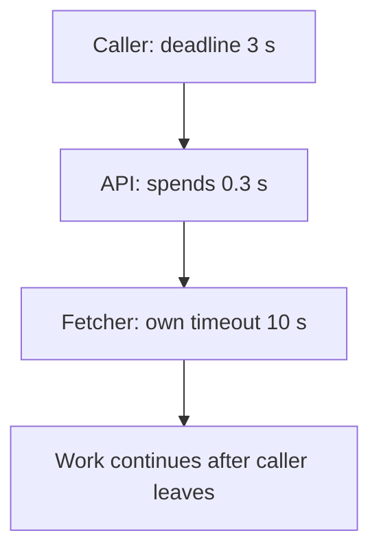
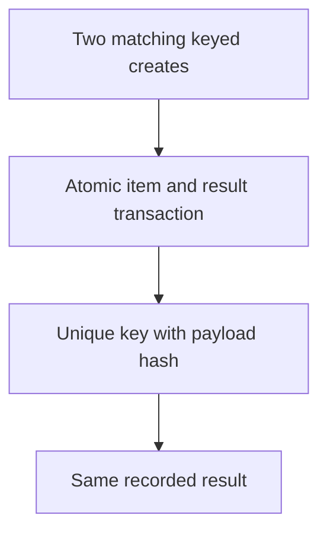
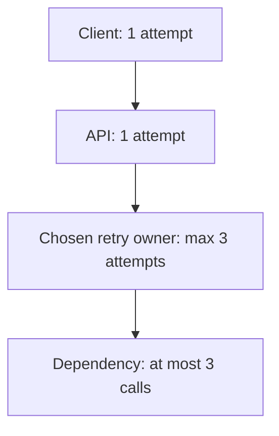

# 2. The three-second budget

## The reviewer's brief

> Adding a bookmark must return within three seconds, but the title provider can stall. Allocate the budget and keep a retried create from making two rows. What outcome is still useful after the caller’s deadline?

This is a **constructed practice brief**, not an attributed company question.
Prerequisites: [the section](../README.md). This page is a build brief; it does not ship a runnable application. The original build and prompt sequence below defines the implementation checkpoints.

| Case | Exact input or workload | Expected outcome |
|---|---|---|
| Small example | 300 ms auth/database, 100 ms reserve, 2,600 ms remaining for fetch attempts and backoff. | Two 1,200 ms attempts plus 200 ms backoff fit the remaining budget; no third attempt begins. |
| Boundary / failure | 429 says Retry-After 5 seconds with only 1 second left. | Return a pending/failure outcome under contract; do not wait beyond the original deadline. |
| Scope | Teaching durations, not production latency promises; two total attempts means one retry. | Explain any additional assumption before implementing it. |

Before looking at the guidance, state the invariant in one sentence and trace the example. In interview practice, implement or sketch independently, then reveal the reasoning. On the AI path, use the prompts below and verify each checkpoint before the next request.

## Baseline and the failure to explain



A per-hop timeout is not an end-to-end budget. Cancellation of the response also does not prove that the underlying socket or database operation has stopped.

<details>
<summary>Reveal the approach and decisions</summary>

Set an absolute monotonic deadline, reserve response time, and derive each hop’s timeout from the remainder. Choose one retry owner per operation, classify retryable failures, and persist request identity with its result atomically. Reject a reused key with a conflicting payload.

</details>

## Follow-up 1 · The response is lost

**Changed requirement:** The create committed but the connection broke. The same key is retried concurrently. What is atomic? Predict which boundary must change before opening the design.

<details>
<summary>Expected reasoning and changed diagram</summary>

The deduplication record and stored item/result must commit together. Replays return the recorded result; key reuse with different content returns conflict. A separate marker before an external side effect is not enough.



</details>

## Follow-up 2 · Several layers retry

**Changed requirement:** Client, API and SDK each permit three attempts. How many leaf calls can occur? State what evidence would make you reject your first design.

<details>
<summary>Expected reasoning and changed diagram</summary>

The maximum is 3×3×3=27; three retries after the initial attempt would be 4×4×4=64. Disable redundant retry layers, then assert the actual dependency call count and remaining deadline.



</details>

## Evidence to bring to review

Build in three stops: reproduce the small case and baseline failure; implement the protected boundary; then replay both changed requirements with captured outputs. Record commands, fixtures, and observed results in your implementation README. A diagram is a prediction until those checks run.

**Senior expectation:** Test lost responses, conflicting keys, and elapsed-work bounds. **Additional lead scope:** Coordinate retry and cancellation contracts across clients and SDKs. Completion demonstrates practice evidence; it does not establish interview readiness or multi-team delivery experience.

## Build and prompt sequence


*You end up with every outbound call bounded by a number you chose, retries in
exactly one place, and a POST that is safe to send twice.*

**Build**

A time budget for P1's add-a-URL request: a deadline minted at the door and
spent down the chain — the diagram above — every outbound timeout derived from
what remains, retries living only in the fetch client, and an idempotency key
so a retried POST cannot create two rows.

**The thought process**

The top number comes first: how long will a person wait before the answer is
worthless? Three seconds is defensible; pick yours and write it down. Until it
exists, every timeout below it is a guess about a whole nobody named.

Then the arithmetic: budgets subtract. A hop may spend what is left, not what
feels generous, and the diagram's failure is a hop whose own timeout exceeds
what it was handed — the caller gone at three seconds, the fetch doing seven
more seconds of work for nobody, holding a worker throughout.

Third, retries live in one layer, chosen. They multiply through a stack —
three layers each allowing three total attempts can make twenty-seven calls at the bottom —
so they belong where the failure is understood, here the fetch client. A retry
spends budget too: both attempts plus the backoff must fit the same deadline.

Last, what makes a retry safe: nothing, by default — the network can lose a
response after the insert happened. Safety is built: the client mints a key,
the server remembers the first outcome and returns it to replays. The section
said a duplicate POST does something you decided in advance; here you decide.

**How to organise the prompts**

**1. The timeout census.**

```
List every outbound call this system makes — HTTP, database, anything
that leaves the process. For each: the timeout it has today, and whether
that number was chosen or inherited from a library default. No fixes yet.
```

Every row that says "inherited" is the section's opening failure, waiting. The
table becomes the budget.

**2. The deadline, passed down.**

```
The whole request gets 3.0 seconds. Create a deadline at the entry point
and pass it down: every outbound call's timeout becomes the smaller of
its own cap and the time remaining, and a call asked to start with
nothing left fails at once instead of trying.

Show me the budget as a table before changing any code.
```

The worst case must sum to 3.0 or less. If it cannot, something on the list
does not belong in the request at all — that is project 5.

**3. Retries, then the key.**

```
Add retries for the title fetch only: at most two TOTAL attempts (one
retry), with exponential backoff and jitter. Classify transport failures,
transient service errors and throttling such as 429 by the provider contract.
Honor Retry-After only if the backoff plus attempt fits the original
3.0-second deadline and retry budget. Do not retry ordinary validation
or authorization failures.

Then make the POST safe to retry: the client sends an Idempotency-Key,
and a replay returns the first attempt's result instead of inserting
again. Prove it by cutting the connection after the insert but before
the response, then retrying.
```

The proof is the checkpoint: one row in the database, two identical responses.

**On AWS**

An **API Gateway** integration has an edge timeout whose applicable limits
depend on API flavor and configuration. Inspect the actual limit rather than
using it as the user-facing deadline. An **ALB** has its own connection and
routing settings, but neither service automatically spends your application
budget across dependencies. **Lambda** supports a configured timeout up to
900 seconds, so an inner function can outlive a much shorter caller budget.
Pair the numbers deliberately and verify cancellation/resource cleanup.
Checked 2026-09-22: [API Gateway quotas](https://docs.aws.amazon.com/apigateway/latest/developerguide/limits.html)
and [Lambda timeout configuration](https://docs.aws.amazon.com/lambda/latest/dg/configuration-timeout.html).

**What productionising it means**

The budget is a file in the repository that changes by review, not numbers
smeared across call sites. Timeout rate and retry rate become their own
metrics — a retry storm can look healthy in error rate alone. And retries get
an environment-variable kill switch, because during an incident retries
convert failure into load, and you want a lever, not a deploy.

**The learning**

A timeout is a claim about the whole chain, not one call, and a default is
someone else's claim about a system that is not yours. Retries are extra load,
safe only where a repeat is provably harmless — a proof you construct, never
assume.

**How you would know it is wrong**

- Point the fetch at a URL that hangs and wall-clock the request: 3.0 seconds plus a little, measured, not felt.
- Read the logs from that run: fetch activity stamped after the deadline means the budget is decoration.
- Send the same Idempotency-Key twice: one row, byte-identical responses.
- Make the upstream return a nonretryable validation 400: exactly one attempt. Then test a retryable 429 both within and beyond the remaining deadline. Record actual sends, not just application retry-loop iterations.

Technical semantics checked 2026-09-22: [AWS SDK retry behavior](https://docs.aws.amazon.com/sdkref/latest/guide/feature-retry-behavior.html). Configuration APIs and defaults vary by SDK and mode; the current guide also distinguishes its 2026 opt-in behavior from older behavior. Pin and inspect the client used in your implementation.

---

[Back to the ordered project index](../projects.md)
