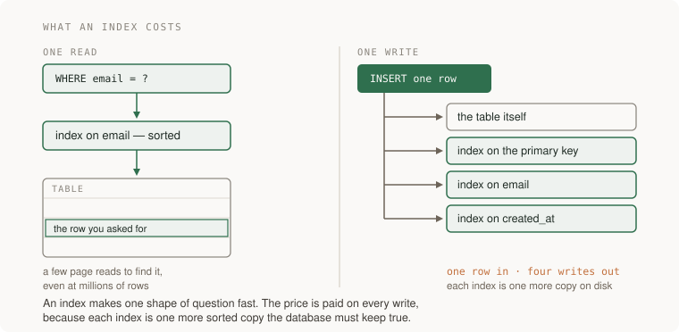

# 05 · Data and databases

> Junior tier · feeds **P1 (it works)**

## The one-liner

Code can be rewritten any afternoon. Data has to be carried, live and intact,
through every rewrite, which makes the schema the one decision in a young
system that is genuinely hard to take back. This section is about making that
decision deliberately — because a fact you never recorded cannot be recovered
at any price.

## The failure it prevents

You build the reading list. The screen shows one checkbox per item, so the
schema gets a `read` boolean on the `items` table. It demos perfectly.

Two weeks later the group is five people. Ana marks an article read and it
vanishes from everyone's unread view, because "read" was stored as a fact about
the item when it was always a fact about a person *and* an item. The code fix
is an afternoon: a new table, one row per person per item.

Then the real cost arrives. The new table should hold history — who had read
what before tonight — and that was never written down. There is nothing to
backfill from. Nothing crashed, every test stayed green, and a piece of the
past is simply gone.

Code bugs cost time. Schema bugs cost data, and they are committed at the
quietest moment of a project: the day someone models the checkbox on the screen
instead of the fact in the world.

## The mental model

**1. Data outlives code, so model the thing, not the screen.** A schema is a
set of claims about the world: *every item has one owner; one row here means
one time a person read an item.* Screens change weekly; the claims are enforced
on every row ever written. The test: say aloud what one row of each table
asserts. If the sentence describes a page rather than a thing, the screen is
leaking into the model.

**2. Normalisation, in plain words: store each fact once.** If a team's name
lives in forty rows, renaming it is forty updates, and a crash after twelve
leaves a database that disagrees with itself — with no way to tell which copy
is lying. Normalising means giving each fact one home and pointing at it from
everywhere else. Denormalising — keeping a deliberate copy, like a cached
count — is sometimes right when a *measured* read is too slow, but the database
stops guaranteeing the copies agree; keeping them true becomes your job,
including in the failure cases. Do it late, on evidence, and write down what
reconciles the copies.

**3. A join is a lookup you can reason about.** A foreign key is a value that
names a row in another table. A join says: for each row here, find the rows
there whose key matches. The entire cost lives in the word *find* — the
database either checks every row (a scan) or seeks in something kept sorted (an
index). So any join yields to two questions: how many rows survive the filters
on each side, and how are the matches found. You never need to recite join
types to answer either.

**4. Keys — and why their order is physical.** A natural key is a real-world
value (an email); a surrogate key is generated and meaningless. Natural keys
break when the world changes — people change emails — so rows usually get a
surrogate key, keeping the real value as an ordinary unique column. Which
surrogate matters more than it looks. The primary key lives in a B-tree, kept
sorted; fully random UUIDs land each new row on a random page of that tree, so
once the index outgrows memory, a typical insert means fetching a cold page
from disk and often splitting it. Time-ordered ids all land at the same recent
edge, on a few pages that stay hot in cache, and rows created together end up
stored together — which is what "latest items" queries want. UUIDv7 (RFC 9562,
2024) puts a millisecond timestamp in the first 48 bits for exactly this
reason, and PostgreSQL 18 (released 25 September 2025; checked 2026-09-21)
ships it as `uuidv7()`. The trade: a v7 id reveals when its row was created,
which matters if ids are public. The function name is trivia; the idea —
identifier order is a physical property with a cost — is not.

**5. An index is a purchase, and the planner holds the receipt.**



An index is a sorted copy of chosen columns with pointers back to the rows.
Reads matching its shape get fast; in exchange, every insert and update writes
the table *and* every index, and the copies take disk. And you do not decide
whether an index gets used — the query planner does, from statistics about your
actual data, and it can rightly choose differently at a thousand rows than at a
million. Arguments about query speed are settled by `EXPLAIN`, not intuition,
because intuition does not execute queries and the planner does.

**6. "Atomic" means both writes or neither.** The classic bug: debit one
account, crash, never credit the other. No error anywhere — the money is just
gone, because two writes that only make sense together were allowed to happen
separately. A transaction is the database's promise that if the process dies
between them, the world looks as if nothing started. A migration is the same
both-or-neither problem stretched over days, with old code still running while
the schema changes — section below.

**7. Where juniors reliably lose data: NULL, time zones, money.** NULL means
three different things — unknown, not applicable, not yet — and a schema that
never says which is one where sums, joins and comparisons quietly skip rows.
Default to NOT NULL; comment every exception with what NULL means there. A
timestamp without a time zone is a time nowhere: store instants in UTC
(PostgreSQL's `timestamptz` stores the instant and converts on display), and
keep a zone only where wall-clock time *is* the fact, like a calendar event.
And binary floats cannot represent 0.10 exactly, so money in a `float` drifts
by rounding until an audit finds it: store integer minor units, or a decimal
type.

## What good looks like

- You can say what one row asserts, for every table, in one sentence each.
- Every relationship is a foreign key the database enforces, not a convention
  the application remembers.
- Columns are NOT NULL by default; every nullable column has a written meaning
  for NULL.
- Each fact lives in one place, and every deliberate copy names the mechanism
  that keeps it true.
- Timestamps are UTC instants; money is integer minor units or a decimal type.
- Each index exists because a measured plan asked for it, and names the query
  it serves.
- Migrations are versioned files in the repo, additive first — add, backfill,
  switch, only then remove — and each ran forwards and backwards on a copy of
  real data before touching the real thing.

Done badly, you see:

- Tables named after screens, reshaped at every redesign.
- `read`, `deleted` and `active` booleans where the fact belonged to a pair of
  things, or needed a *when* (`deleted_at`).
- NULL everywhere, meaning something different in every column, written down
  nowhere.
- No foreign keys "for flexibility", and a slow accumulation of rows pointing
  at rows that no longer exist.
- Prices in `float`, off by a cent, and a reconciliation spreadsheet nobody
  admits to owning.
- An index on every column just in case: writes crawl, and the planner ignores
  half of them.
- A migration that creates the new column and drops the old one in the same
  deploy, and a minute of errors while old code runs against the new schema.

## Ask Claude for this

**Request 1 — the schema, before any code**

```
I am building a shared reading list: a group signs in, adds URLs, tags
them, and each person marks items read for themselves.

Propose the schema. For every table, give the sentence one row asserts
("one row = one ..."). For every column: can it be NULL, and what does
NULL mean there? List the rules the database itself will enforce —
unique, foreign key, NOT NULL — separately from the rules only the
application would enforce.

Then name the three decisions you are least sure of, and for each, the
future requirement that would prove it wrong. No code yet.
```

*Why it is asked that way:* the row-sentence forces tables to be nouns in the
domain — a table you cannot say as a sentence is usually a screen in disguise.
The NULL question and the enforced-versus-promised split surface the two places
schemas rot first, and the "least sure" list extracts the model's own
uncertainty, which "is this good?" never does.

*What you should get back:* nouns — people, items, tags, and a person-item
table for read-state — plus explicit NULL meanings and honest doubt, usually
around tags and read-state, which is where it belongs. If "read" comes back as
a boolean on items, you are holding the failure story above in written form.

*Push back on:* any rule left to the application "for flexibility". The
application is only one of the things that will ever write to this database,
alongside the migration script, the admin console, and next year's rewrite.

**Request 2 — reviewing a schema a model proposed**

```
Here is the schema you proposed. Review it as data, not as code.

For each table: what real-world change would force an ALTER? Which facts
are stored in more than one place? Which query the product must answer
at 100,000 rows has no index shaped for it?

Check specifically: every money column's type, every timestamp's time
zone, every nullable column's meaning, every uniqueness that is assumed
but not declared, and any primary key whose randomness scatters inserts
across the index.

Finish with the one change that is cheapest now and most expensive in
six months.
```

*Why:* models writing schemas reliably default to the same weaknesses —
nullable everything, floats for money, naive timestamps, uniqueness assumed
but never declared, boolean flags where a pair table or an `_at` timestamp
belongs, and tables shaped after your prompt's phrasing rather than the domain.
The named checklist points the review at exactly those, because a bare "review
this schema" tends to return compliments and an index suggestion.

*What you should get back:* findings that cite specific columns, at least one
undeclared uniqueness (there is almost always one), and a closing ranked by
reversibility rather than effort.

*Push back on:* a review that finds nothing. Plant a `price float` column and
run it again; if the review misses the plant, it is not measuring anything.

**Request 3 — the migration that cannot be one step**

```
The live system stores read as a boolean on items. It must become
per-person. Old code keeps running while this changes.

Plan the migration as separate deploys. For each step: what the old code
sees, what the new code sees, and what happens if the process dies
halfway through it. Never create something and remove its predecessor in
the same step.

End by telling me what the new table cannot be backfilled with, and what
we should record about that.
```

*Why:* "old code keeps running" is the constraint that kills one-step
migrations — there is no moment when nothing is reading, so every change must
be additive first, then backfilled, then switched, and only then may the old
shape be removed. The dies-halfway question forces each step to be safe on its
own.

*What you should get back:* three to five steps in that order, and a plain
admission that per-person history from before the change does not exist.

*Push back on:* a backfill that invents facts — marking the item read by
whoever added it looks plausible and is fiction. The honest version records
the assumption, or stores NULL with a documented meaning.

## How you would know it is wrong

1. **Run `EXPLAIN ANALYZE` on your main query and read it.** A sequential scan
   over the big table under a selective filter means the index is missing or
   the query cannot use it. Then compare the planner's estimated row counts to
   the actual ones in the same output: estimates off by orders of magnitude
   mean stale statistics, and plans chosen on fiction.
2. **Insert 100,000 rows and time the same query.** In PostgreSQL,
   `generate_series` makes seeding a one-liner. Everything is fast at 200 rows;
   if query time grows in step with table size, you are scanning, because an
   indexed lookup should barely move.
3. **Kill the process mid-transaction.** Put a sleep between two writes that
   only make sense together, `kill -9` in the gap, restart, and count. If half
   the change is visible, those writes were never actually in one transaction —
   and you have proven your atomicity check can go red, which is worth more
   than a week of green.
4. **Run every migration forwards and backwards on a copy.** Row counts and a
   spot-check query must survive the round trip. A down step that cannot
   restore what the up step removed is telling you the up step was destructive
   — a red result on the copy, where it is cheap.
5. **Attempt the illegal writes from `psql`, not the app.** An item owned by a
   user id that does not exist; a duplicate of something you believe unique;
   NULL into a mandatory column. The refusal must come from the database. If it
   accepts, your rules live only in application code — and the migration
   script, the console and next year's rewrite do not run application code.

> The standing rule: before believing a green result, say what broken would
> have looked like. A constraint you have never seen refuse anything, and a
> rollback you have never seen fire, have both passed a test that cannot fail.

## Your slice of the project

On **P1**, add:

- The schema, as your first migration files: users, items, and your written
  answers to P1's tag and read-state decisions — every relationship an enforced
  foreign key, every column NOT NULL unless a comment says what NULL means
  there.
- A seed script that inserts 100,000 items, so your numbers mean something.
- The `EXPLAIN ANALYZE` output of the group-list query at that size, saved in
  the repo with two sentences: what the planner chose, and either why that is
  fine or which index you added because it was not.
- One additive migration performed *after* seeding — add a `fetched_at` column
  to items, with a backfill — run forwards and backwards on a copy first.

**Acceptance criteria you can check yourself:**

- From `psql`, the database refuses: an item with no owner, a duplicate
  read-mark for the same person and item, a NULL URL.
- "Who has read this item" and "what has this person read" are each one query,
  with no schema change between them.
- The main list query's time barely moves between 1,000 and 100,000 rows, and
  both timings are written down.
- Deleting a user is a decision — cascade or refuse — written down and proven
  by a test that fails if the behaviour changes (see [06 · Testing](../06-testing/)).

## Words you now own

- **schema** — the shape of your data: tables, columns and the rules between them. The part you cannot casually refactor.
- **primary key** — the value that names a row uniquely, forever.
- **foreign key** — a column holding another row's key, with the database enforcing that the row exists.
- **surrogate key** — a generated identifier with no real-world meaning, so facts can change without renaming the row.
- **normalisation** — each fact stored once and referenced, so copies cannot disagree.
- **denormalisation** — a deliberate copy kept for read speed; keeping it true becomes your job.
- **index** — a sorted copy of chosen columns, bought with write time and disk.
- **query planner** — the part of the database that decides how to run your query, from statistics rather than your intent.
- **EXPLAIN** — the planner showing its plan; with ANALYZE, what actually happened.
- **transaction** — writes that succeed together or leave no trace.
- **migration** — a versioned change to the schema and to the data already living under it.
- **backfill** — filling in values for rows that existed before the column did.

---

**Not covered here:** ORMs, deliberately — read tables and plans directly
first, so that when an ORM later writes queries for you, you can read what it
wrote. Document and key-value stores, which are real answers for data that is
not row-shaped and belong to the senior tier. Isolation levels, locking,
replication and backups-you-have-actually-restored are senior-tier reliability
work; P2 will make you feel the first of them.
