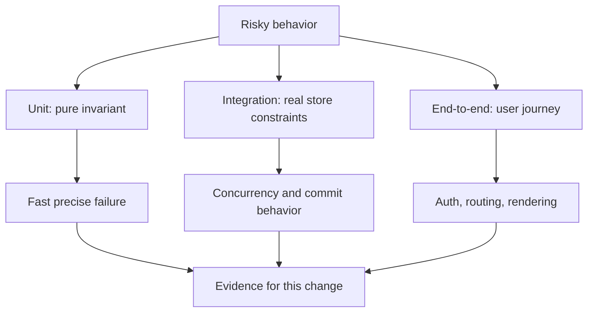

# 06 · Testing

> Junior tier · feeds **P1 (it works)** and everything after it

## The one-liner

Tests are how you find out that a change broke something, without a person
clicking through the app. They are not about proving the code is right. They are
about making breakage **loud** instead of silent, and the whole craft is in
deciding which breakage you care about.

## The failure it prevents

You ask for a small change: "when someone updates their email, send a
confirmation." It works. You ship it.

Three weeks later a customer cannot log in. The email-update path also writes to
the `users` table, and the new code writes the email in lowercase while login
compares it case-sensitively. Nothing errored. Nothing logged. The bug was
introduced by a change that had nothing to do with login, and it was found by a
human being locked out of their account.

A test suite is not there to tell you the email feature works. It is there so
that the *login* test goes red when you touch the email feature.

That is the actual job: **tests are a tripwire on the code you were not
thinking about.**

## The mental model

Three things are worth holding.

**1. A test is an experiment with a prediction.** You put the system in a known
state, do one thing, and assert what should now be true. If you cannot say in
advance what would make it fail, you have not written a test, you have written a
script that runs.

**2. Tests trade speed for realism.** The closer a test is to the real system,
the more truth it tells you and the slower and flakier it is.


You want most of your tests at the top and a few at the bottom. The exact ratio
is argued about endlessly and does not matter much; what matters is that you
have **at least one test that exercises the real thing end to end**, because
everything above it is a model of the system rather than the system.

**3. The thing you are really testing is the change, not the code.** Before a
test is worth keeping, ask: what edit would make this go red? If the honest
answer is "almost none", delete it.


## What good looks like

- Each test names the behaviour, not the function: `rejects_login_when_password_expired`, not `test_login_2`.
- A failing test tells you what broke without opening the file.
- Tests do not depend on each other or on the order they run in.
- The suite runs on every change, automatically, and nobody has to remember to run it.
- There is at least one test that would catch the bug you shipped last month.
- Test data is built in the test, not loaded from a fixture nobody understands.

Done badly, you see:

- A suite that is green and a product that is broken.
- Tests that assert what the code currently does, written after the fact, so they
  can only ever fail when someone changes the code *on purpose*.
- A mocked database, so the test passes and the real query has a typo in it.
- One enormous test that sets up half the app and asserts twelve things, so when
  it fails you learn nothing.
- Tests that were skipped months ago and nobody noticed, because a skip and a
  pass look identical in the summary line.

## Ask Claude for this

**Request 1 — the suite for a feature you just had built**

```
Here is the change you just made. Write tests for it.

Before writing anything, list the ways this code could be wrong: wrong
output, wrong state left behind, wrong behaviour on a second call, wrong
behaviour when the input is empty / duplicated / very large.

Then write one test per item on that list. For each test, add a comment
saying what edit to the source would make this test fail.

Do not mock the database. Use a real one with a throwaway schema.
```

*Why it is asked that way:* the first instruction makes the model enumerate
failure modes before it is attached to a solution, which is the part it is good
at and the part people skip. The comment requirement is the important one — it
forces each test to name the edit it defends against, and a test that cannot name
one is visibly worthless on the page.

*What you should get back:* a list of failure modes, then tests that map onto
them one to one. If you get five tests that all check the happy path with
different numbers, the list was skipped.

*Push back on:* any test that asserts the implementation ("calls `save()` once")
rather than the outcome ("the row is in the table afterwards"). Those break every
time you refactor and catch nothing.

**Request 2 — proving the suite can actually fail**

```
Pick the three most important tests in this file. For each one, introduce a
small, realistic bug into the source that it should catch. Run the suite and
show me the output. Then revert.

If any of the three still passes with the bug in place, tell me that
plainly and explain why.
```

*Why:* this is the only way to find out whether the tests bite. It is cheap, it
takes one command, and almost nobody does it.

*What you should get back:* three red runs. If something stays green, you have
just found a test that has never been able to fail, and that is a better finding
than three passing tests.

**Request 3 — the test for the bug you just hit**

```
This bug reached a user: <describe what happened>.

First write the test that reproduces it and watch it fail. Show me the
failure output. Only then fix the code.
```

*Why:* a fix without a failing test first is a guess that happened to work. You
have no evidence the fix addresses the bug rather than moving it.

## How you would know it is wrong

The checks for this topic, each one capable of going red:

1. **Break it on purpose.** Change a `>` to a `>=`, delete a line, invert a
   boolean. The suite must fail. If it does not, the coverage over that line is
   decorative.
2. **Read the summary line properly.** `21 passed, 10 errors` is not green. A
   skipped test and a passing test look the same at a glance and mean opposite
   things. Count them.
3. **Check what a "green" run actually ran.** If ten tests silently skip because
   a fixture file is missing on this machine, the number at the bottom is a lie
   about a smaller suite.
4. **Look for the test that cannot fail.** A threshold set below the floor
   ("assert improvement > 0.5dB" when the process alone produces 0.79) will pass
   forever and read as rigour.
5. **Run the tests somewhere other than your machine.** A suite that only passes
   where it was written is telling you about your laptop.

> The rule under all five: **before believing a green result, say what it would
> have looked like if the thing were broken.** If the answer is "the same", it
> proved nothing.

## Your slice of the project

On **P1**, add:

- One end-to-end test that creates a record, reads it back, and deletes it,
  against a real database.
- Three unit tests over the piece of logic with the most branches.
- One test that reproduces a bug you actually hit while building, written
  *after* you hit it and *before* you fixed it.
- Proof that the suite can fail: a commit message or note recording which bug you
  planted and which test caught it.

**Acceptance criteria you can check yourself:**

- `git stash` your fix for the reproduced bug and the suite goes red.
- The suite runs from a clean clone with one command, on a machine that is not
  the one you built it on.
- No test takes longer than a second unless it is deliberately the slow one.

## Words you now own

- **unit test** — checks one piece of logic in isolation, no database, no network.
- **integration test** — checks your code against a real dependency, usually a database.
- **end-to-end test** — drives the whole system the way a user would.
- **fixture** — prepared data or state a test starts from.
- **mock / stub** — a fake stand-in for a real dependency. Convenient, and a common way to test nothing.
- **flaky test** — passes and fails without the code changing. Treat as broken; a suite people do not trust is a suite nobody reads.
- **coverage** — the share of lines the tests execute. Says what ran, never whether it was checked.
- **mutation testing** — deliberately introducing bugs to see whether the suite notices. The honest version of coverage.
- **regression test** — a test written to make sure a specific bug never comes back.
- **test double** — the family name for mocks, stubs, fakes and spies.

---

**Not covered here:** performance testing, load testing and chaos testing are
senior-tier and live in [09 · Reliability](../../02-senior/09-reliability/),
because they measure the system under conditions rather than the code under
change. Property-based testing is genuinely useful and deliberately left out of
the junior tier; it is easier to appreciate once you have felt an example-based
suite miss something.

[Choose your learning path](../../../paths/README.md) · [Interview applications](../../../paths/interviews/README.md)

## Draw it from memory · Choose the boundary your test proves



**Redraw challenge:** Which test would fail if authorization were removed? A happy-path unit test is not enough.
