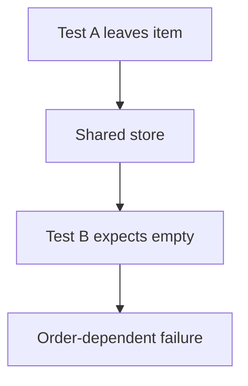
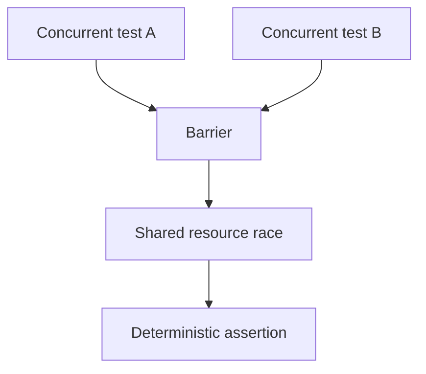
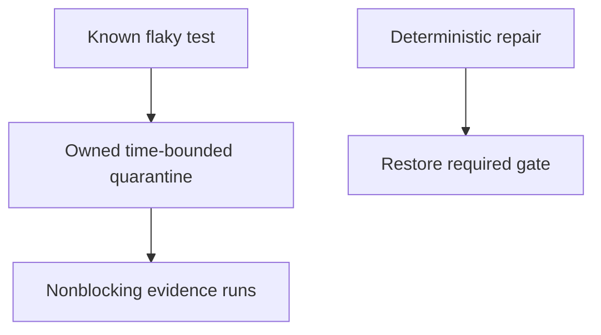
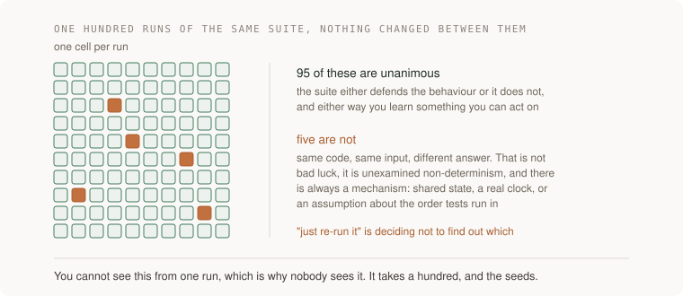

# 3. The flake hunter

## The reviewer's brief

> A test fails six times in one hundred CI runs. Re-running usually makes the PR green. Determine whether the cause is shared fixture state, time, or execution order. What evidence distinguishes those hypotheses?

This is a **constructed practice brief**, not an attributed company question.
Prerequisites: [the section](../README.md). This page is a build brief; it does not ship a runnable application. The original build and prompt sequence below defines the implementation checkpoints.

| Case | Exact input or workload | Expected outcome |
|---|---|---|
| Small example | Run order `[creates item, expects empty store]` fails; reverse order passes with the same seed. | The minimal two-test ordering reproduces failure; per-test store reset removes that dependency. |
| Boundary / failure | A worker finishes only after a randomly timed sleep. | Replace sleep-based correctness with a controllable completion barrier or fake clock. |
| Scope | A hundred runs detect observed flakiness; zero observed failures does not prove determinism. | Explain any additional assumption before implementing it. |

Before looking at the guidance, state the invariant in one sentence and trace the example. In interview practice, implement or sketch independently, then reveal the reasoning. On the AI path, use the prompts below and verify each checkpoint before the next request.

## Baseline and the failure to explain



The nominal test input is not the whole input: fixture state, scheduler, clock and external resources also matter.

<details>
<summary>Reveal the approach and decisions</summary>

Record seed, order and environment, minimize the failing schedule, then vary one hypothesized source. The invariant is isolated fixtures or an explicitly controlled shared-state contract. Do not hide a real race with automatic retries.

</details>

## Follow-up 1 · Parallel execution fails

**Changed requirement:** Sequential shuffled runs pass, but concurrent runs fail. What experiment comes next? Predict which boundary must change before opening the design.

<details>
<summary>Expected reasoning and changed diagram</summary>

Use a barrier to overlap two operations on a shared resource. Give files/ports unique test identities or synchronize intentional sharing; preserve the forced overlap as a regression.



</details>

## Follow-up 2 · The fix will take a week

**Changed requirement:** The flaky test blocks every merge while a repair is underway. How do you quarantine it honestly? State what evidence would make you reject your first design.

<details>
<summary>Expected reasoning and changed diagram</summary>

Remove it from the blocking gate only with an owner, expiry and visible nonblocking execution. Its passing reruns must not be treated as repair evidence; track the protected behavior’s temporary coverage gap.



</details>

## Evidence to bring to review

Build in three stops: reproduce the small case and baseline failure; implement the protected boundary; then replay both changed requirements with captured outputs. Record commands, fixtures, and observed results in your implementation README. A diagram is a prediction until those checks run.

**Senior expectation:** Reproduce a minimal schedule and remove its mechanism. **Additional lead scope:** Budget quarantine and preserve visibility of temporarily unprotected behavior. Completion demonstrates practice evidence; it does not establish interview readiness or multi-team delivery experience.

## Build and prompt sequence



*You end up with a list of your tests that are not deterministic, and the
evidence to prove it.*

**Build**

A runner that executes your suite one hundred times, records pass or fail per
test per run, and reports any test that was not unanimous.

**The thought process**

The decision that changes everything is how you treat a flake. The common
instinct is to re-run it and move on. The correct position is that **a test that
passes and fails on identical input is a bug — in the test, in the code, or in
your assumptions about time and ordering — and "re-run it" is deciding not to
find out which.**

Then a practical decision: one hundred sequential runs takes too long, and
parallel runs change the conditions you are measuring. Both are legitimate, and
which you pick depends on whether you are hunting order-dependence (run
sequentially, shuffled) or resource contention (run in parallel).

**How to organise the prompts**

```
Run the suite 100 times. After each run, record per-test pass/fail with a
run number and a seed. Shuffle test order each run and record the seed.

Report only tests that were not unanimous, with the count and the seeds
they failed on.
```

```
For the top flake, tell me the three most likely mechanisms: shared
state between tests, a real clock, or an ordering assumption.

Then write the smallest experiment that distinguishes them.
```

The second half is the important one. A model will happily fix a flake by adding
a sleep, which converts a fast intermittent failure into a slow one.

```
Fix it without adding a sleep or a retry. If you believe a sleep is the
only option, explain what we are actually waiting for and why we cannot
wait for that thing directly.
```

**On AWS**

One hundred suite runs is embarrassingly parallel, so this is where
**AWS Fargate** earns its place: a task definition, one hundred tasks, no
servers to manage, and you pay for the seconds used. **AWS Batch** is the
alternative and is the better answer once you want queueing, retries and
priorities across many such jobs — it is a scheduler, where Fargate on its own
is just compute.

Lambda is tempting and usually wrong here: a fifteen-minute maximum and a
read-only filesystem outside `/tmp` make it a poor fit for a full test suite.
That comparison — *why not Lambda* — is worth being able to make quickly.

**What productionising it means**

Weekly, on a schedule, with the results kept over time. Flakiness is a trend,
not an event. Quarantine is a real mechanism and needs a rule: a flake gets
tagged, excluded from blocking merges, and given an owner and a date — and the
quarantine list has a maximum size, because an unbounded one is just a disabled
suite with paperwork.

**The learning**

Flakiness is not bad luck, it is unexamined non-determinism, and there is
always a mechanism. Once you have found three of them — shared state, a real
clock, an ordering assumption — you will recognise the fourth in minutes.

**How you would know it is wrong**

- Write a test that fails exactly one time in ten by construction. The hunter must find it and report roughly that rate.
- Run the hunter twice and compare the lists. Wildly different lists mean you are measuring your machine, not your tests.
- Check the seeds are recorded and a failure actually reproduces from its seed. A flake report you cannot replay is a rumour.

---

[Back to the ordered project index](../projects.md)
