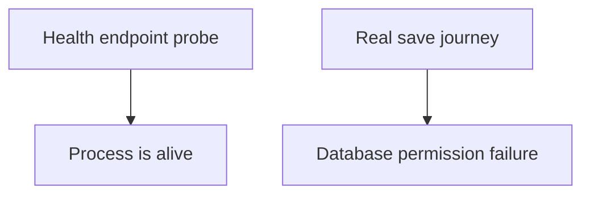
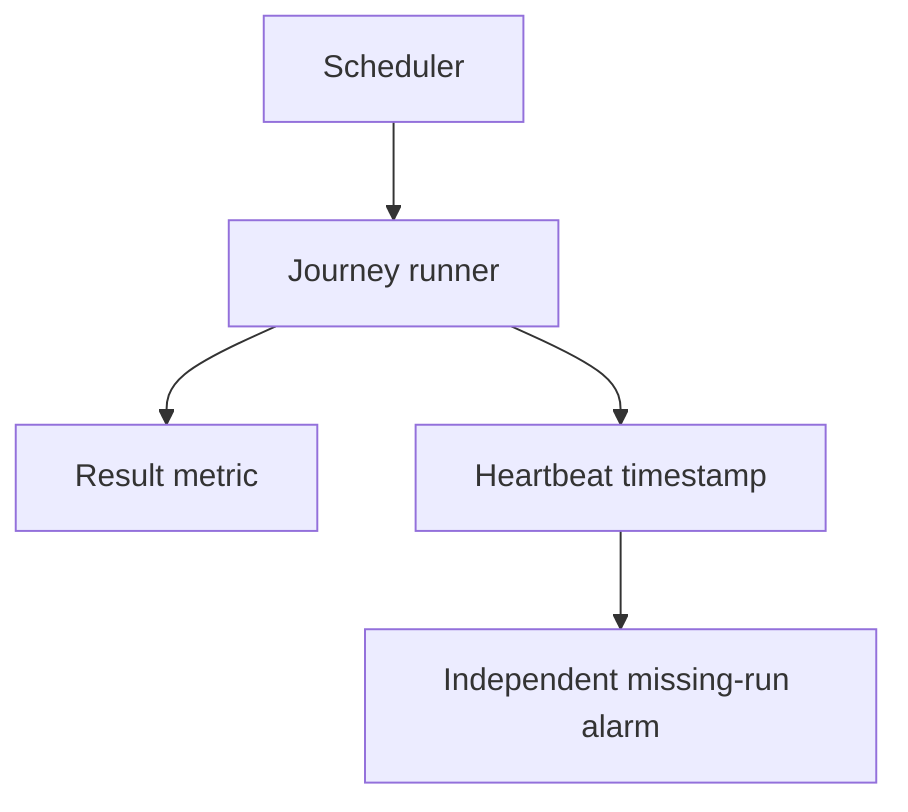
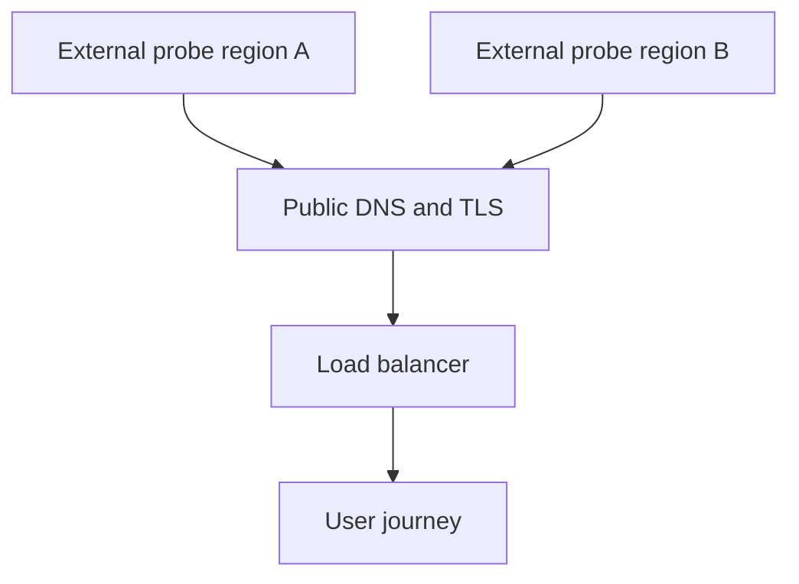

# 5. The test that runs in production, forever

## The reviewer's brief

> The health endpoint is green while users cannot save bookmarks. Build a scheduled sign-in/create/read/delete probe that detects the failure without leaving test data forever. What should happen after create fails?

This is a **constructed practice brief**, not an attributed company question.
Prerequisites: [the section](../README.md). This page is a build brief; it does not ship a runnable application. The original build and prompt sequence below defines the implementation checkpoints.

| Case | Exact input or workload | Expected outcome |
|---|---|---|
| Small example | One run each minute: create item 7, read its content, delete it, verify absent. | Success only if required steps pass; dependent steps skipped after failure are reported as skipped, not successful. |
| Boundary / failure | Read assertion fails after create succeeds. | Finally-style cleanup deletes the known item; failure still names the read step. |
| Scope | Dedicated synthetic account and bounded cleanup; no claim one region represents all users. | Explain any additional assumption before implementing it. |

Before looking at the guidance, state the invariant in one sentence and trace the example. In interview practice, implement or sketch independently, then reveal the reasoning. On the AI path, use the prompts below and verify each checkpoint before the next request.

## Baseline and the failure to explain



Liveness skips authentication, persistence and delivery boundaries that matter to the actual user journey.

<details>
<summary>Reveal the approach and decisions</summary>

Use an isolated account, record each step outcome and correlate created IDs. Run cleanup independently where its prerequisites exist. The invariant is no false success after a required step failed and no unbounded orphaned synthetic data.

</details>

## Follow-up 1 · The scheduler stops

**Changed requirement:** No probe result arrives for three intervals. Is that equivalent to success? Predict which boundary must change before opening the design.

<details>
<summary>Expected reasoning and changed diagram</summary>

No. Monitor heartbeat freshness separately from journey outcome; distinguish no eligible data from missing instrumentation. Alert on the absent run with the monitor’s owner and last successful timestamp.



</details>

## Follow-up 2 · A regional path fails

**Changed requirement:** The probe in the application VPC passes, but public DNS fails for a region. What changes? State what evidence would make you reject your first design.

<details>
<summary>Expected reasoning and changed diagram</summary>

Probe the actual public entry path from a second location and keep region-specific outcomes. Do not automatically collapse a single-location failure into global outage; correlate it with other evidence.



</details>

## Evidence to bring to review

Build in three stops: reproduce the small case and baseline failure; implement the protected boundary; then replay both changed requirements with captured outputs. Record commands, fixtures, and observed results in your implementation README. A diagram is a prediction until those checks run.

**Senior expectation:** Inject a mid-journey failure, verify cleanup, and stop the scheduler. **Additional lead scope:** Own regional coverage and missing-monitor escalation. Completion demonstrates practice evidence; it does not establish interview readiness or multi-team delivery experience.

## Build and prompt sequence

*You end up finding out about breakage before a person tells you.*

**Build**

A small check that exercises the real system from outside — sign in, add a link,
read it back, delete it — on a schedule, against production, alerting when it
fails.

**The thought process**

The first decision is **what it does with data.** A synthetic test that writes
to production writes real rows. You either accept that and clean up after
yourself, or you carve out a dedicated account whose data is ignored everywhere
else. Both are real choices; not choosing means a test user slowly polluting
every metric you own.

Second: what it checks. The temptation is a health endpoint, which tells you the
process is alive — a much weaker claim than "a person could use this". The
valuable check is the *journey*, because that is what exercises the parts that
depend on each other.

Third, and this is the one that separates a useful check from noise: **what is
worth waking someone for.** One failed run of a five-step journey is often a
network blip. Two consecutive is a signal. Deciding that ratio in advance, while
calm, is the whole difference between an alert people trust and one they mute.

**How to organise the prompts**

```
Write a check that performs this journey against a real deployment:
sign in, create an item, read it back, assert the content, delete it,
and assert it is gone.

Every step must fail loudly with which step failed and what it saw.
Do not report an unexecuted dependent step as passed. Mark it skipped with
the failed prerequisite, and always attempt applicable cleanup in a finally
path using the identifiers actually created.
```

```
Now make it clean up after itself even when it fails partway. Show me
what happens if the assertion fails between create and delete.
```

Half-cleaned synthetic data is the commonest way this kind of check becomes a
nuisance nobody removes.

```
Make it alert only after two consecutive failures, and make the alert
say which step failed and for how long it has been failing.
```

**On AWS**

This is the one place where a managed service is clearly the right answer:
**CloudWatch Synthetics** canaries exist for exactly this — a scheduled script
in a managed Lambda, with screenshots, a results dashboard and CloudWatch
alarms wired in. You write the journey and stop maintaining a runner.

The build-it-yourself version is a **Lambda** on an **EventBridge** schedule
publishing a custom **CloudWatch** metric with an alarm on it, and it is worth
understanding because it is three small pieces you will reuse for everything
else. Compare canary-run charges with function, scheduling, logging and storage
charges at the selected frequency. The managed dashboard and screenshots
reduce your maintenance work; a custom runner trades that convenience for
implementation and operating responsibility.

And run it from **outside** your VPC. A check that runs inside the network it is
checking cannot see the failures that matter most — DNS, certificates, the load
balancer, the internet.

**What productionising it means**

It already is production; that is the point. What makes it durable is that its
own failure is visible — a canary that stops running looks exactly like a canary
that is passing, which is the single most repeated failure mode in my own
record. Alarm on missing data, not only on failures.

**The learning**

The gap between "it broke" and "we knew" is the number that decides how bad an
incident is, and it is the only one you can shrink before anything goes wrong.
This project is how you find out what yours currently is.

**How you would know it is wrong**

- Break the journey on purpose (revoke the test user's permission) and time how long until the alert arrives. That number is your detection time.
- Stop the canary entirely. Something must notice. If nothing does, silence means nothing and the check is decorative.
- Check what it leaves behind after a mid-journey failure. Then check again a week later.
- Confirm the alert names the failing step. "Canary failed" at 3am is a puzzle, not a page.

---

[Back to the ordered project index](../projects.md)
