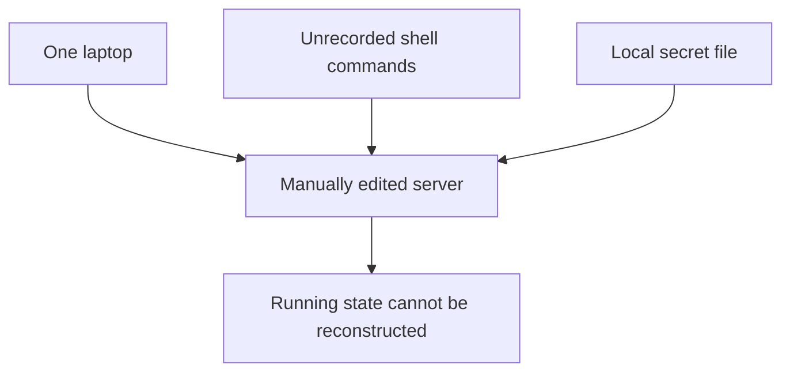
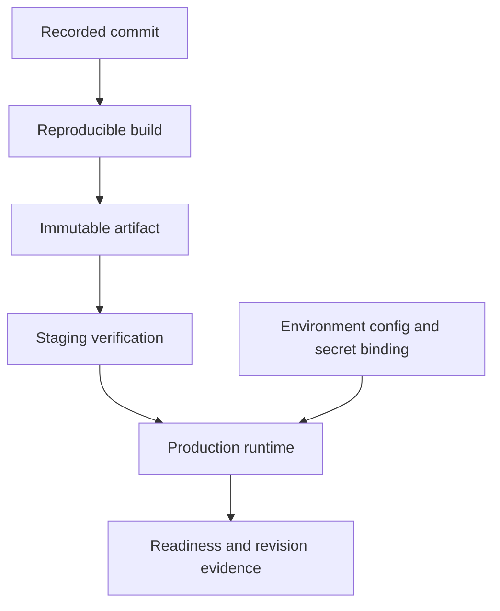
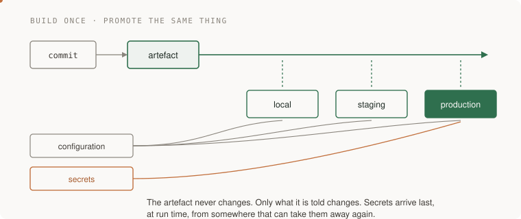
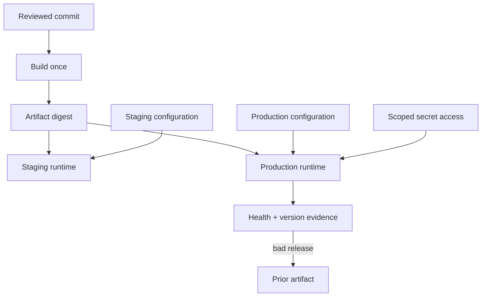

# 07 · Shipping it

> Junior tier · feeds **P1 (it works)** and sets up **P2 (it survives)**

## At the whiteboard

> “The app runs on one engineer's laptop. We need a teammate to deploy the same
> version tomorrow without their shell history or private configuration. What
> artifacts and checks make that possible?”

Shipping means connecting a known source revision to a running artifact and its
configuration. A successful manual command is only one observation.

| Given | Expected evidence |
|---|---|
| Source commit `abc123` | Build records that exact revision and dependency lock |
| Build artifact digest `D1` | Staging and production promote the same artifact |
| A changed secret | Rotation works without rebuilding source or committing the secret |
| A failed readiness check | New traffic is held back; the previous version remains available |

**Ask first:** what configuration varies by environment, what holds persistent
data, and can the old application still read the new schema?



## Reason through a reproducible release

1. Build an immutable artifact from a recorded commit. Rebuilding separately
   for each environment can introduce a different dependency or file.
2. Supply configuration and short-lived credentials at the appropriate boundary.
   Give the runtime only the permissions its operation needs.
3. Run a readiness check that reaches necessary dependencies. A process merely
   listening on a port has not proved it can serve the important request.
4. Rehearse rollback using a schema-compatible version and verify the actual
   running artifact, not just the pipeline's success badge.

**Follow-up:** “The deploy succeeded but database credentials were rotated.
Which part of your diagram should change?” The secret binding and its reload or
restart policy change; the application artifact need not.



In AWS terms, a container registry, deployment service, and secret store can fill
these roles. Choose their permissions and recovery behavior explicitly before
asking an AI to produce deployment configuration.

## The one-liner

Shipping is making the thing exist somewhere other than your laptop, in a way
anyone can repeat. Almost all of the difficulty is in three questions: what
exactly did I deploy, where did its configuration come from, and who can read
its secrets.

## The failure it prevents

The classic version is a deploy that works and nobody can reproduce. Somebody
ran a command on a server eight months ago, a file got edited in place, and the
running system no longer corresponds to anything in the repository. Nobody knows
which commit is live. The person who knows is on holiday.

The modern version is worse and quieter. In September 2025 a self-replicating
worm known as Shai-Hulud spread through the npm registry, compromising **over
500 packages**; CISA published an alert on **23 September 2025**. It scanned
infected machines for credentials — GitHub tokens, AWS, Google Cloud and Azure
keys — and published what it found to public repositories, while injecting a
workflow that kept exfiltrating secrets on every push. A second wave in
**November 2025** hit somewhere around 600 to 800 packages and more than 25,000
GitHub repositories, and added destructive behaviour when it could not spread.

*(Checked 2026-09-21 against CISA's alert and vendor write-ups. Details of the
later variants were still being revised; treat exact counts as approximate.)*

The lesson is not "npm is dangerous." It is that **`npm install` runs somebody
else's code on your machine with your credentials**, and so does the equivalent
in every other ecosystem. Removing the bad package afterwards does not end the
compromise, because the credentials already left. You have to rotate them.

## The mental model

Three rules, and everything else is detail.



**1. Build once, promote the artefact.** You build a thing — a container image,
a bundle, a binary — exactly once, and that identical thing moves through your
environments. If you rebuild for production, production is running something no
one tested.

**2. Configuration comes from the environment, not the artefact.** The same
image points at a test database or the real one depending on what it is told at
start-up. The moment you have `if environment == "production"` inside your code,
you have two programs in one file and you are testing the wrong one.

**3. Secrets are not configuration.** Config can live in a file in the repo.
Secrets cannot, ever, not even briefly, not even in a private repo. They are
injected at run time from somewhere that can revoke them, and the number that
matters is not "is it encrypted" but **"how fast can I rotate it?"**


## What good looks like

- One documented command takes a clean clone to a running system.
- You can say exactly which commit is running, from the outside, without asking anyone.
- The same artefact runs in every environment; only the injected configuration differs.
- Secrets arrive at run time and can be rotated without a code change.
- Dependencies are locked to exact versions and the lockfile is committed.
- Installs in CI use the lockfile strictly, and lifecycle scripts are off unless a specific package needs them.
- Rolling back is a thing you have actually done once, deliberately, rather than a thing you assume works.

Done badly:

- The deploy is a sequence of commands in somebody's shell history.
- Production has a hand-edited file that exists nowhere else.
- The `.env` file is in the repository. Or it was once, and it is still in the history, which is the same thing.
- Dependencies float on a range, so two installs a week apart give you different software.
- Nobody has ever rolled back, so nobody knows whether it works.
- A secret leaked and the response was to delete the file, not to rotate the key.

## Ask Claude for this

**Request 1 — make the path from clone to running explicit**

```
Write the deployment path for this project as a numbered list: what gets
built, what artefact that produces, where configuration comes from, and
where secrets come from.

Then tell me every step in that list a human currently has to do by hand,
and which of those is most likely to be done wrong at 2am.
```

*Why it is asked that way:* the second half is the part that matters. Any model
will produce a plausible deployment sequence; asking which step gets done wrong
under pressure gets you the risk ranking, which is what you would otherwise
learn the expensive way.

*What you should get back:* a short list with at least one honest "a person does
this by hand." If everything is claimed to be automated, check it, because it
almost certainly is not yet.

*Push back on:* any answer that puts secrets in the build. A secret baked into
an image is in the image forever, including in the layers you thought you
overwrote.

**Request 2 — the secrets audit, before you need it**

```
Find every place this project reads a secret. For each one, tell me where
the value comes from at run time, whether it would appear in a log or an
error message, and what I would have to do to rotate it.

If rotating any of them requires a code change, say which.
```

*Why:* "can I rotate this in five minutes" is the only question that matters
during an incident, and it is the one nobody asks beforehand. The log question
catches the common accident: a secret printed into a stack trace or a debug
line, which is how credentials most often escape without anyone attacking
anything.

*What you should get back:* a table. Any row where rotation needs a deploy is a
row to fix now rather than at 3am.

**Request 3 — the dependency review nobody does**

```
List every direct dependency with: last release date, number of
maintainers, and whether it runs a lifecycle script on install.

Flag any that I could replace with under thirty lines of my own code.
```

*Why:* a lifecycle script runs arbitrary code on your machine at install time
with your credentials in the environment. Knowing which of your dependencies do
that turns an abstract supply-chain worry into a short, specific list. The last
question is the useful one: a lot of small dependencies are a rounding error of
code and a permanent piece of attack surface.

*Push back on:* the reflex to add a library for something trivial. Ask what it
buys beyond thirty lines.

## How you would know it is wrong

1. **Deploy from a clean clone on a machine that has never seen this project.** Not your laptop with its accumulated state. This finds the undocumented step.
2. **Ask the running system what it is.** Expose the commit hash at a health endpoint and check it matches what you think you shipped.
3. **Rotate one secret and see what breaks.** If the answer is "everything, for twenty minutes", that is your incident response time and you just measured it in daylight.
4. **Search the repository history, not just the working tree, for secrets.** A key deleted in a later commit is still in the history and still compromised.
5. **Install with the lockfile strictly and with lifecycle scripts disabled** and see whether the build still works. If it does, that is your CI setting from now on.
6. **Roll back on purpose, once.** Deploy, roll back, confirm the old version is serving. Then you know.
7. **Diff what you built against what is running.** They should be the same artefact. Surprisingly often they are not.

> The rule again, because it applies here too: **before believing a green
> deploy, say what it would have looked like if it had gone wrong.** A deploy
> script that exits 0 whether or not the new version is serving is not telling
> you anything.

## Your slice of the project

On **P1**, add:

- A single documented command that takes a clean clone to a running system, and a second person (or a fresh directory) that proves it.
- Configuration read from the environment, with a committed example file listing every variable and no real values in it.
- A committed lockfile, and CI that installs from it strictly.
- A health endpoint that reports the running commit.
- One deliberate rollback, recorded: what you did, what you saw.

**Acceptance criteria:**

- A fresh clone in a new directory runs with one command and no undocumented steps.
- `git log -p` over the whole history contains no secret. You checked, rather than assuming.
- You can name the commit that is running by asking the system, not by remembering.
- You have rolled back at least once and written down what happened.

## Words you now own

- **artefact** — the built thing you deploy: an image, a bundle, a binary. Built once, promoted unchanged.
- **environment** — a place the artefact runs (local, staging, production), distinguished only by injected configuration.
- **configuration** — values that vary by environment and are not secret.
- **secret** — a value that grants access. Injected at run time, rotatable, never in the repo.
- **rotation** — replacing a secret with a new one. The only real response to exposure.
- **lockfile** — the exact resolved versions of every dependency, committed, so two installs give identical software.
- **lifecycle script** — code a package runs at install time. Convenient, and the main supply-chain execution path.
- **supply chain** — everything you did not write but do run. Larger than you think.
- **rollback** — returning to the previous known-good artefact. Only real once you have done it.
- **immutable** — never changed after creation. The property that makes an artefact trustworthy.

---

**Not covered here:** infrastructure as code, progressive delivery (canaries and
feature flags), and deployment pipelines with real gates are senior-tier and live
in **12 · Delivery**. This section is the minimum that makes P1 reproducible by
somebody who is not you.

[Choose your learning path](../../../paths/README.md) · [Interview applications](../../../paths/interviews/README.md)

## Draw it from memory · Draw what a deploy is allowed to read



**Redraw challenge:** Point to the immutable artifact and the environment-specific inputs. Which one changed?


[Static view](../../../assets/learning/traffic-shift-still.svg)
