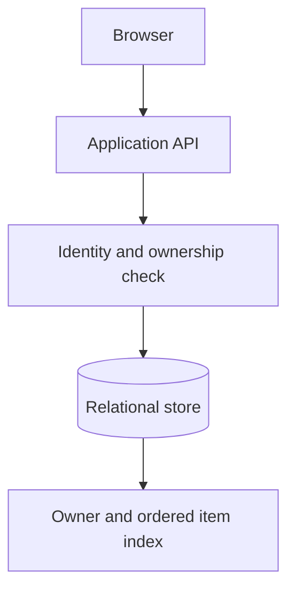
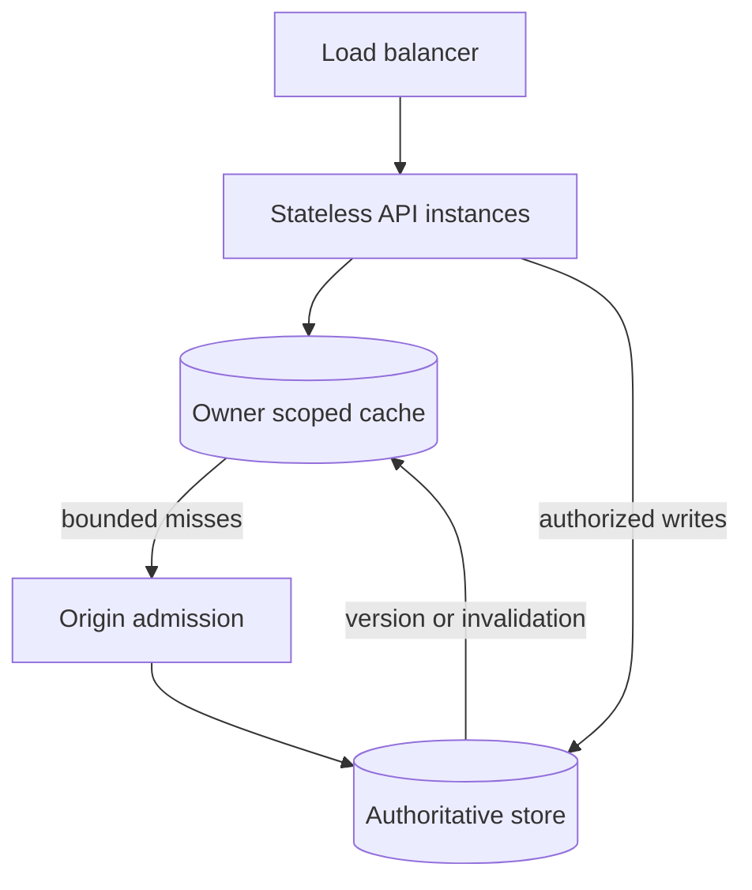
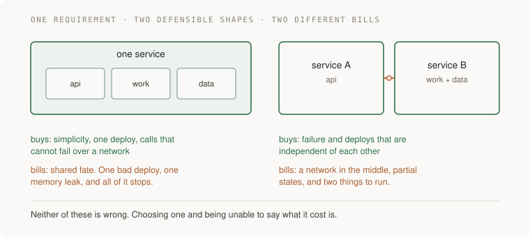
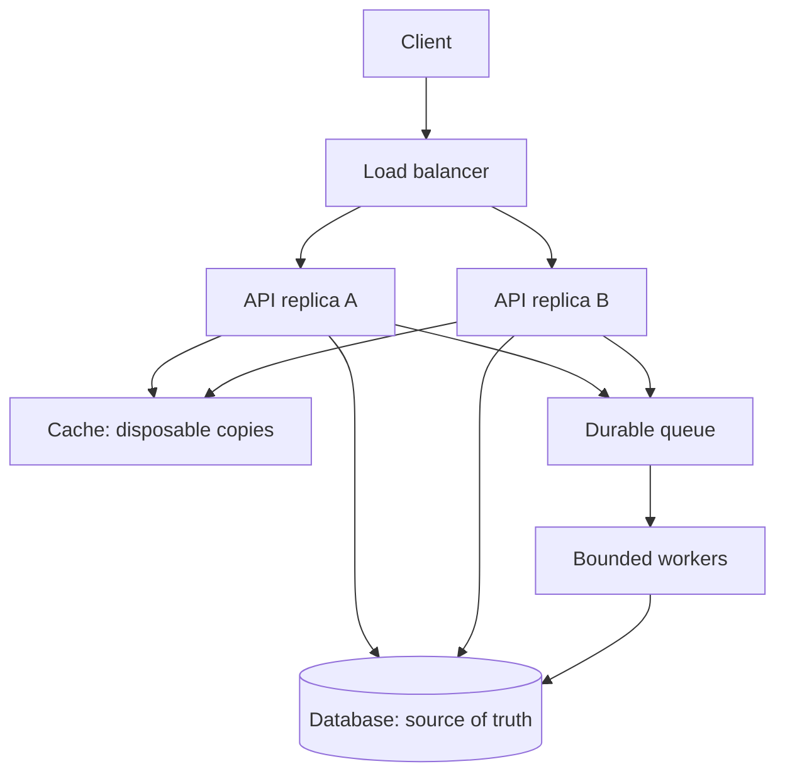
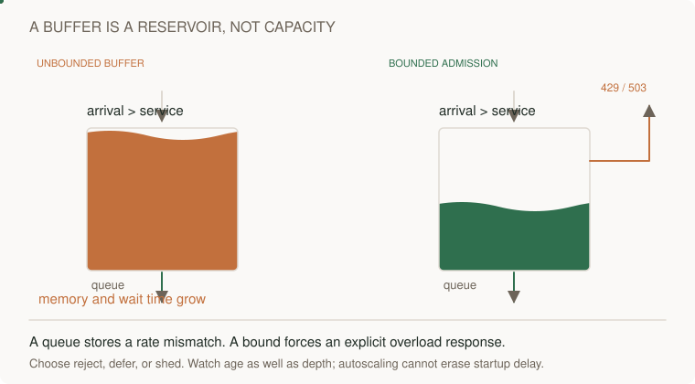

# 08 · System design

> Senior tier · feeds **P3 (it holds under load)**

## At the whiteboard

> “Design a bookmark service. We have 1,000 reads/s and 20 writes/s at peak,
> 100,000 users, and a two-second freshness target for shared lists. Start with
> the smallest design you can defend. What information would change it?”

These are constructed workload inputs. A read lists one owner's most recent
20 bookmarks; a write must never modify another owner's data. Ask about item
size, retention, burst length, latency percentiles, and whether the freshness
target permits stale data after a write. State assumptions before naming AWS.

| Example | Expected behavior |
|---|---|
| Owner A reads 20 items | Stable order by creation time and unique ID |
| Owner B submits A's item ID | Denied at the write boundary |
| Write succeeds, response is lost | Retry has an explicit duplicate policy |
| Cache fails at 1,000 reads/s | Storage load remains within an agreed budget |



## Build the argument

1. Write the read/write contracts and ownership invariant. A fast unauthorized
   response still fails the problem.
2. Calculate storage and traffic from explicit sizes and retention. Do not
   multiply peak requests by every second of a month unless peak is continuous.
3. Start with the API and indexed store. Identify the measured bottleneck before
   adding independent failure modes.
4. Add caching only with a freshness, invalidation, and cache-down admission
   policy. Explain what each arrow is allowed to promise.

**Follow-up:** “Read traffic rises tenfold but writes stay constant.” Redraw the
read path, then ask whether a hot tenant defeats a global average.



Senior depth is a coherent baseline that survives this change. Lead depth adds
owners, rollout measurements, cost attribution, and a policy when one tenant
consumes the shared budget. Practice drawing before opening the examples below.

## The one-liner

System design is not drawing boxes. It is the process of working out what must
be true, discovering which shapes can satisfy that, and then choosing one **and
being able to say what it costs**. The diagram is a byproduct. The reasoning is
the thing, and it is the part that gets thrown away.

## The failure it prevents

Most architectures are not chosen. They accrete.

Somebody needed a queue, so there is a queue. Somebody liked a database, so
there are two databases. A service was split off during a reorganisation that
has since been reversed. Nobody decided any of it, and every individual step was
reasonable, and two years later the system has a shape that no one would have
picked and no one can defend — because there is nobody to ask, only a git log.

The second failure is louder and costs more: the design chosen from fashion.
Microservices because that is what serious companies have. Event sourcing
because it sounded elegant in a talk. Both are good answers to problems you may
not have, and the bill arrives about eight months later, in the form of a team
that cannot make a small change without three deploys and a meeting.

The question that would have prevented both is the same one: **what would have
to be true for this to be the right shape, and is it true here?**

## The mental model

Design runs in one direction. Constraints first, shape second, and the shape is
mostly implied by the constraints once you have written them down honestly.



**Start with what must be true.** Not "it should be scalable" — that is not a
constraint, it is a mood. Real constraints have numbers and consequences: how
many of these per second, how stale can this be, what happens if this is down
for an hour, who is woken up, what must never be lost. Half the arguments about
architecture are two people holding different unstated constraints.

**Then ask four questions of any candidate shape:**

- **What moves?** Which data goes where, and how often.
- **What waits?** Where does something block on something else. Every wait is a place the system can stop.
- **What can fail, and what happens then?** Not "it retries" — what does the user see, what state is left behind.
- **Where does state live?** State is what makes things hard. Every copy of it is a thing that can disagree with another copy.

**Then name the bill.** Every design buys something and charges for it. A single
service is simple and couples failure: one bad deploy takes everything. Splitting
isolates failure and charges you coordination, network calls, and a distributed
transaction problem you did not have before. Neither is correct. What is not
acceptable is choosing one and being unable to say what it cost.

And the corollary that turns up in every section of this guide: **every scaling
fix trades a resource limit for a new failure class.** Replicas buy read
capacity and charge you staleness. Caches buy latency and charge you
invalidation. Queues buy burst tolerance and charge you an invisible backlog.

### What changed, and why this section matters more than it used to

When writing code was the expensive part, a mediocre design was survivable
because nobody had time to build the wrong thing very fast. That has inverted.
Generation is cheap now, which makes **design judgment the scarce resource** —
and precise specification has come back into fashion for exactly that reason.

The measured side of it is uncomfortable: telemetry from teams with heavy AI
adoption shows substantially larger pull requests, sharply higher review times,
and a meaningful share of changes merging without review. You can now build the
wrong architecture much faster than you can review it.

*(Checked 2026-09-21; see [docs/research/senior-craft-2026.md](../../../docs/research/senior-craft-2026.md) for sources and caveats.)*


## What good looks like

- The constraints are written down with numbers, before any shape is proposed.
- At least two shapes were considered, and the rejected one is described well enough that its advocate would recognise it.
- You can state what this design costs, in one sentence, without being defensive.
- The failure behaviour is specified: what the user sees, what is retried, what is lost.
- It is the boring option unless there is a stated reason it cannot be.
- Somebody who was not there can read the document and arrive at the same decision.

Done badly:

- A diagram with no document, so the reasoning lives in one person's head.
- "Scalable", "robust", "flexible" as requirements. None of them is checkable.
- The design chosen first and the constraints written afterwards to fit.
- No failure behaviour, which means the failure behaviour is whatever happens.
- Splitting a system to solve an organisational problem, without saying so.
- A shape copied from a company with a thousand engineers and a different problem.

## Ask Claude for this

**Request 1 — constraints before shapes**

```
I need to build <the thing>. Before proposing any architecture, write the
constraints as checkable statements with numbers where you can: volume,
freshness, durability, what must never be lost, what happens if it is
down for an hour.

Mark clearly which ones you have invented because I did not tell you.
Do not propose a design yet.
```

*Why it is asked that way:* the last two lines do the work. A model will
cheerfully invent plausible constraints and then design confidently against
them, and you will not be able to see the seam later. Making it mark its own
assumptions turns invisible guesses into a list you can correct.

*What you should get back:* a short list, several items flagged as invented.
Those flagged items are the questions you actually need to go and answer.

**Request 2 — two shapes and their bills**

```
Given those constraints, propose two different architectures that both
satisfy them. For each: what moves, what waits, what can fail and what
happens then, and where state lives.

Then tell me what each one costs that the other does not. I want the
trade, not a recommendation.
```

*Why:* asking for one design gets you a confident answer; asking for two gets
you the axis they differ on, which is the actual decision. Forbidding a
recommendation stops it collapsing the choice back into one option before you
have understood it.

*Push back on:* two designs that are the same design with different names. If
they do not differ on where state lives or what can fail independently, ask
again for a genuinely different shape.

**Request 3 — the failure interrogation**

```
Take this design and walk through each component failing, one at a time.

For each: what does a user see, what is retried, what is lost, and what
state is left behind that needs cleaning up.

Do not say "it retries" without saying what happens if the retry also
fails.
```

*Why:* the last sentence closes the escape hatch. "It retries" is where most
failure analysis stops, and the interesting question is always one level past
it. The state-left-behind question is the one that finds the half-written row
nobody thought about.

**What to keep for yourself:** the constraints, and the decision. If you let a
model invent your constraints you are not designing a system, you are reviewing
one it imagined.

## How you would know it is wrong

1. **Try to state the cost in one sentence.** If you cannot say what this design makes worse, you have not finished choosing — you have finished preferring.
2. **Give the constraints to somebody else and ask what they would build.** If they arrive somewhere very different, one of you is holding an unstated constraint. Find it; it is the most valuable thing in the conversation.
3. **Walk one failure end to end, out loud.** Most designs survive one question and fall apart on the third.
4. **Check the numbers are real.** "Thousands per second" from someone who has never measured is a feeling. Go and count what the current system does.
5. **Ask what would have to be true for the boring option to work.** If the answer is "nothing much", take the boring option.
6. **Look for the organisational reason.** If a split exists to let two teams avoid each other, that is a legitimate reason — but it should be written down as that, not disguised as a performance argument.
7. **Come back in six months** and compare what actually broke against what you predicted. This is the only calibration available and almost nobody collects it.

## Your slice of the project

Before starting **P3**, write one page:

- The constraints, with numbers, measured from what P1 and P2 actually do rather than imagined.
- Two shapes for the background fetching work, each with what moves, what waits, what can fail, where state lives.
- The bill for each, in one sentence.
- Which you chose and what would make you change your mind.

**Acceptance criteria:**

- Every constraint is checkable and at least one has a number you measured yourself.
- The rejected design is described well enough that you could build it from the page.
- The cost sentence is specific. "Slightly more complex" is not a cost.
- You can name the observation that would make you switch.

## Words you now own

- **constraint** — something that must be true, stated checkably. Not an adjective.
- **coupling** — the degree to which one thing's failure or change forces another's.
- **cohesion** — how much a component's parts belong together. The other half of coupling.
- **state** — what the system remembers. The source of nearly all difficulty.
- **blast radius** — how much breaks when one thing breaks.
- **failure mode** — a specific way it goes wrong, with what the user sees attached.
- **bill** — what a design costs you in exchange for what it buys. Every design has one.
- **the boring option** — the simplest shape that satisfies the constraints. The default, absent a stated reason.
- **accretion** — a shape arrived at by a series of local decisions nobody made together.

---

**Not covered here:** the interview ritual. Whiteboard system design as practised
in hiring is a related but different skill, optimised for performance under time
pressure, and this guide is not about that. The concrete techniques — caching,
queues, sharding, consistency — are [13 · Data at scale](../13-data-at-scale/);
this section is the thinking that decides which of them you need.

[Choose your learning path](../../../paths/README.md) · [Interview applications](../../../paths/interviews/README.md)

## Draw it from memory · Draw the request path and the work path



**Redraw challenge:** Label each arrow with data, timeout, and retry owner. Remove the cache and predict the new bottleneck.



[Static view](../../../assets/learning/backpressure-still.svg)
