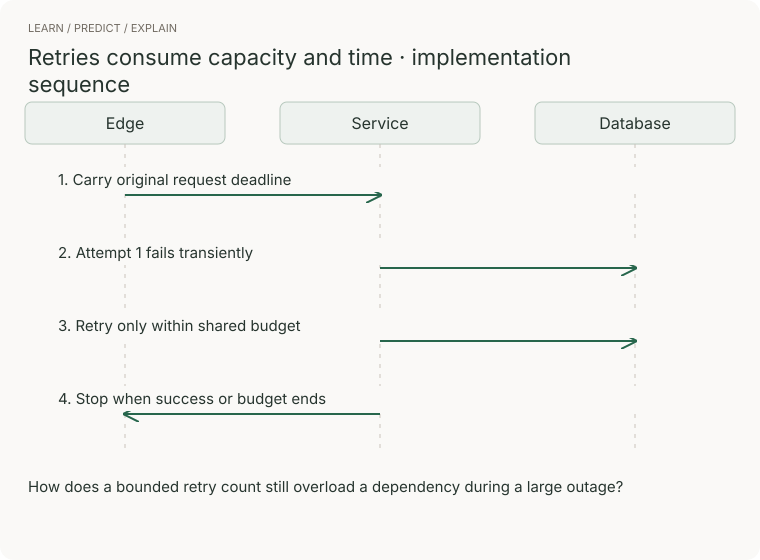

# 09 · Reliability

> Senior tier · feeds **P3 (it holds under load)**

## The one-liner

Reliability is not uptime you hope for. It is behaviour you designed for the
moments when part of the system is failing — and part of it always is. The
senior version has numbers: how much failure is allowed, what happens when the
allowance runs out, how long each call waits, and who gets dropped first when
there is not enough system to go around.

## The failure it prevents

At 02:10 the database slows down — a backup job, a bad plan, it barely matters.
Calls that took 20ms take two seconds. The data layer times out and retries,
three attempts. The service above it: three attempts. The edge: three. One
click has become twenty-seven queries, aimed at a database that was struggling
with one.

At 02:40 someone kills the backup job. The database is healthy again. The
outage continues, because the load is no longer coming from users: timeouts
breed retries, retries breed load, load breeds timeouts. At 04:55 someone
disables retries at the edge; everything recovers in ninety seconds.

The review will call the database the cause. It was only the trigger. The
outage was designed in months earlier, one locally reasonable retry policy at a
time.

## The mental model

Five ideas, one discipline: **decide the failure behaviour on a calm afternoon,
or the system decides it during the incident.**

### A budget you spend, and a policy someone signed

Set an SLO — 100% is not a target — say, 99.9% of requests succeed within
500ms, over 30 days. The **error budget** is 0.1% of eligible requests: with
1,000,000 requests, 1,000 may fail that combined success-and-latency condition.
The familiar 43.2 minutes is the budget for a *time-based* 99.9% availability
SLO over 30 days. These units are not interchangeable when traffic varies.
[Google's SLO workbook](https://sre.google/workbook/implementing-slos/) describes
request-based good-event ratios; checked 2026-09-22.

A budget becomes real when a **written error-budget policy** says what changes,
on whose authority, as it burns. Google's published example: budget exhausted
over the trailing four weeks freezes releases — only P0 and security fixes
ship — until the service is back inside SLO; one incident burning over 20%
forces a postmortem with a P0 action; disputes escalate to a named executive.
It is a deal made before anyone is angry.

Alert on **burn rate**: budget spent per unit time, rate 1 lasting exactly the
window. The SRE Workbook's starting point: page at 14.4× over the last hour (2%
of budget), page at 6× over six hours, ticket at 1× over three days, each
paired with a short window about one twelfth as long so alerts also *stop* soon
after the bleeding does. Static thresholds fail both ways: they page on blips
that never threatened the SLO, and sleep through a slow leak that eats the
month.

### Every call has a timeout; you chose it or inherited it

Every network call has a timeout. If you never set one, you run on a library
default — and defaults range from thirty seconds to forever. The Builders'
Library method: pick the false-timeout rate you can accept and read the timeout
off the dependency's real latency distribution — one good call in a thousand
sacrificed means sit near the p99.9. Too long, and a slow dependency holds
threads hostage while work queues behind them. Too short, and you kill work
that would have succeeded — then, worse, retry it.

### Retries are multiplication

A retry is extra load, added at the exact moment the system said it has too
much. One layer retrying is a tool; several layers retrying is a weapon pointed
inward:


Nobody writes 27 into a config. Three teams each write 3. The first rule is
structural: **retry at one layer only**, and know which.

Cap even that layer. The classic cap is the circuit breaker — trip open after
repeated failures, fail fast, probe for recovery. AWS prefers **token-bucket
retry limiting** (in its SDKs since 2016): successes drip tokens in, retries
spend them, and an empty bucket means fail fast until real successes refill it.
Their case against breakers: a breaker is *modal* — a second mode the system
can be in, hard to test and so usually untested — and an open breaker keeps
rejecting after the dependency recovers, stretching the outage. Run a breaker
anyway — many stacks do — and you own testing all three of its modes.

Two more rules. **Never blind-retry a 4xx**: the request was rejected, not
lost; identical bytes fail identically. (429, the exception, comes with its own
instruction: wait.) **Jitter every timer** — backoff, cron, cache TTLs, health
checks — because anything synchronised arrives as a spike.

**Only retry a side effect if doing it twice equals doing it once.** Hence the
**idempotency key**: the client mints one key per logical operation and sends
it with every attempt; the server stores key → result and replays it on
duplicates. Without one, a retry is not "try again"; it is "maybe charge them
twice".

### Degradation is a mode you design

When there genuinely is not enough system, the question left is who gets
served. Netflix classifies requests by how much a user would notice — pressing
play is CRITICAL, prefetch is BULK — and sheds the lowest class first as CPU
crosses thresholds: in their example config, non-critical from 60% CPU,
critical only at 80%, thresholds validated by continuous chaos load tests. In
one real event, prefetch returned from an outage at twelve times the normal
rate; its availability was allowed to fall to 20%, user-initiated requests
stayed above 99.4%, with over half of all requests throttled. Users did not
notice: **the system chose what to drop before the incident could.** "Whatever
times out first" is not a degradation mode; it is a lottery.

### The failure that outlives its cause

The opening story has a name: **metastable failure**, from a 2021 paper by
Bronson, Aghayev, Charapko and Zhu. A system is *stable* while it absorbs
shocks, *vulnerable* when it runs fine without headroom, and *metastable* when
a **trigger** tips it into a failure that a **sustaining loop** keeps alive
after the trigger is gone. Retries are the canonical loop; cold caches the
sneaky one — every miss costs more than a hit, so a flushed cache cuts capacity
exactly when load is highest. Waiting does not help — recovery is deliberate
loop-breaking: shed load, switch retries off, restart with intake throttled.
Everything else in this section is loop prevention.

*(Checked against the Google SRE Workbook, the AWS Builders' Library, the
metastability paper and Netflix's engineering material, 2026-09-21.)*


### Watch the concept, then trace the implementation



The comparison follows four illustrative states. Without the mechanism: each starts three db attempts: up to 27. With it: at most three db attempts within deadline. These are teaching states, not measured performance.



[Still storyboard / reduced-motion alternative](../../../assets/learning/retry-budget-still.svg).

**Predict before replaying:** How does a bounded retry count still overload a dependency during a large outage?

**Try it:** reproduce the final transition in a small example, remove the mechanism, and record the changed outcome. Use the checks later in this chapter to judge the result.

## What good looks like

- Every outbound call has an explicit timeout, and a sentence says why that value.
- An SLO someone outside engineering agreed to, and a one-page policy with named actions and authority.
- Alerts are burn rates over paired windows; the last page matched real user harm.
- Retries at exactly one layer, budgeted and jittered; every other layer fails fast upward.
- Every retried side effect carries an idempotency key, and a test submits a duplicate.
- A written shed order: which classes drop first, at what signal, what the caller sees.

Done badly, you see:

- "We target 99.99%" and nobody can say what happens when it is missed.
- Retries in the HTTP client, the mesh and the application, set by three people who never met.
- A circuit breaker whose open state has never once been exercised.
- Postmortems that stop at the trigger and never name the loop that kept it down three more hours.

## Ask Claude for this

**Request 1 — the policy, not the maths**

```
Our SLO: 99.9% of requests succeed in under 500ms, over rolling 30 days.

Write the one-page error-budget policy to go with it: tiered actions as
the budget burns (at 50%, at 100%, and for any single incident burning
20%), who can declare a release freeze and who can lift it, what still
ships during one, and where disagreement escalates.

Then define the alerts as burn rates — a fast-burn page and a slow-burn
ticket, each with paired long and short windows — showing the arithmetic
from SLO to threshold.

Do not propose loosening the SLO.
```

*Why it is asked that way:* the freeze, the names and the exceptions change
behaviour; the maths does not, and they are the part teams skip. The last line
blocks the easy out: a loosened target makes any policy painless.

*What you should get back:* thresholds paired with actions a person could
refuse to perform, and arithmetic you can recompute: 2% of budget in an hour is
burn rate 14.4. Numbers that do not recompute were pattern-matched.

*Push back on:* actions that are sentiments. "Prioritise reliability" freezes
nothing; every tier needs a change someone can point at.

**Request 2 — the outbound-call audit**

```
Find every network call in this codebase — HTTP, database, cache, queue.

For each call site: the timeout and WHERE it comes from (our code, or a
library default — name the default's actual value), every layer that
retries it (our code, client library, mesh), and whether it is
idempotent by nature, idempotent via a key, or not.

Fix nothing. Give me the table, worst rows first.
```

*Why:* "name the default's actual value" does the work — it forces a look at
what the library really does, and stacked retry layers are what reading one
file never shows.

*What you should get back:* at least one call with no explicit timeout and one
operation retried at two layers. Unaudited systems have both; a clean audit
should make you suspect the audit.

*Push back on:* "safe to retry" on a write with no dedupe mechanism named, and
"default" in the timeout column without a number — it did not check.

**Request 3 — design the shed, then hunt the loop**

```
Same system. Design its degradation mode:

1. Sort every endpoint into CRITICAL / DEGRADED / BEST_EFFORT / BULK.
   Justify surprising placements.
2. Pick the utilisation signal and a shed threshold per class, and say
   what a shed request returns to its caller.
3. Now run the film backwards: the database is pinned at 100% for five
   minutes, then fully recovers. Trace what every retry policy, cache
   and queue does during and after, and say whether load returns to
   baseline on its own. If not, name the loop.
```

*Why:* part 3 demands the sustaining loop by mechanism, answerable only from
the configuration part 2 must live with.

*What you should get back:* an uneven classification — if everything is
CRITICAL, nothing is — and either a concrete loop or a concrete argument none
exists, caches and client retry queues included.

*Push back on:* shedding at random rather than by class, and any "it recovers
cleanly" that never says what queued retries and cold caches do in minute six.

## How you would know it is wrong

1. **The kill test.** Stop a dependency for sixty seconds, restore it. If load
   does not return to baseline within minutes, on its own, you have a
   sustaining loop — a metastable system, found in the afternoon instead of at
   2am.
2. **Count the amplification.** Slow the database, send exactly one request at
   the top, and count arrivals at the bottom in the query log. The number must
   match what your single retry layer allows; twenty-seven means hidden layers
   are retrying.
3. **The duplicate test.** The same side-effecting request twice with one
   idempotency key: exactly one effect. With two keys: exactly two. The second
   half matters: a dedupe that swallows everything is broken in the other
   direction.
4. **Fire the pager on purpose.** Inject errors just above the fast-burn
   threshold: a page must arrive; stop them and it must clear within the short
   window. An alert that has never fired is a hypothesis.
5. **Ask when the policy last changed a plan.** If the budget has been
   exhausted and nothing froze, you have arithmetic, not a policy.
6. **Shed under load and diff the classes.** Past the threshold, BULK
   availability should crater while CRITICAL barely moves. If the curves droop
   together, your classes exist only in a document.

## Your slice of the project

On **P3**, the reading list meets load. From this section:

- A one-page SLO and error-budget policy for the core action: tiered actions,
  your own name in the freeze rule.
- Burn-rate alerts — fast-burn page, slow-burn ticket, paired windows — and a
  drill log showing each fired once.
- A timeout inventory: every outbound call, its value, chosen or inherited — no
  "default" without the number.
- Retries at exactly one layer, token-bucket capped, jittered; other layers
  explicitly zero. An idempotency key on adding a URL.
- Two classes — user actions CRITICAL, title fetching BULK — one threshold
  shedding BULK first, and a load test showing the availability curves
  separating.
- A game day: kill the fetch dependency for one minute, once with retries
  stacked at two layers, once with your real config, and record what load does
  *after* the trigger is removed. The difference between those two graphs is
  this whole section.

**Acceptance criteria:**

- The kill test passes: trigger removed, baseline restored, no human in the loop.
- Disabling the dedupe turns the duplicate test red.
- The worst-case number of database calls for one click is written down, and
  the measured amplification matches it.

## Words you now own

- **SLO** — the target on a measurement (the SLI) over a window.
- **error budget** — one minus the SLO: the failure you are allowed to spend.
- **error-budget policy** — the written rules for what happens as it burns; the freeze lives here.
- **burn rate** — how fast the budget is going; rate 1 spends it by the window's end.
- **retry storm** — retries stacking across layers until the system attacks its own dependency.
- **jitter** — deliberate randomness on timers so synchronised things stop arriving together.
- **token-bucket retry limiter** — successes earn tokens, retries spend them; empty means fail fast.
- **circuit breaker** — fail fast after repeated failure, probe to recover; modal, so test every mode.
- **idempotency key** — a client-minted id for one logical operation, so twice equals once.
- **load shedding** — refusing chosen work so the important work survives.
- **metastable failure** — an outage that outlives its cause, held up by a sustaining loop.

---

**Not covered here:** observability — how you would see any of these numbers —
is its own senior section; so are queues and backpressure. Capacity planning,
autoscaling, multi-region failover and incident response are out; chaos
engineering appears only as this section's game day.

[Choose your learning path](../../../paths/README.md) · [Interview applications](../../../paths/interviews/README.md)
