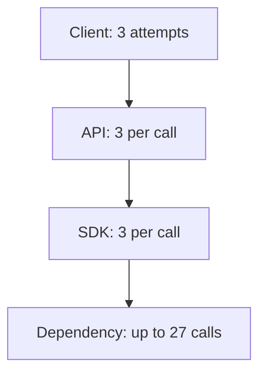
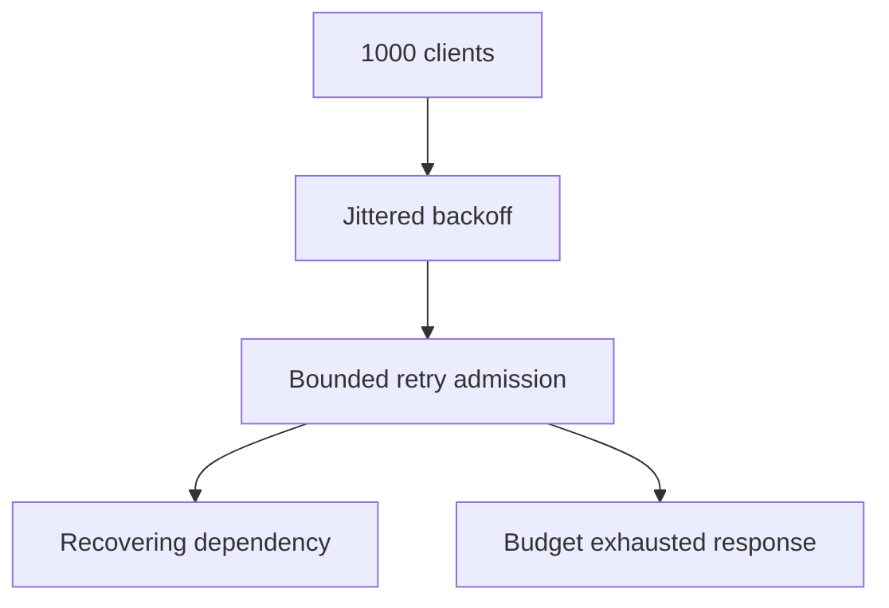
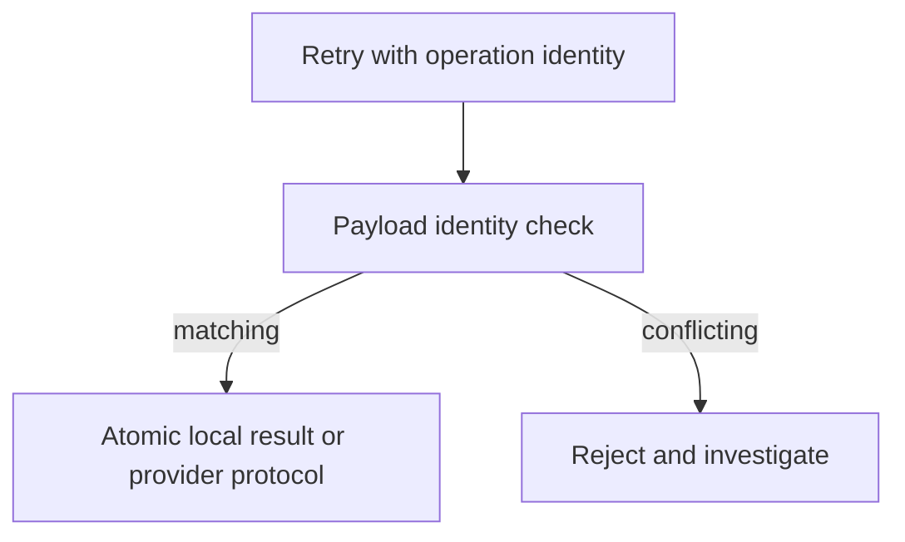

# 3. The retry storm you build on purpose

## The reviewer's brief

> A single save button produces dozens of dependency requests during an outage. Client, API and SDK each retry independently. Reduce amplification without losing safe recovery. How many total attempts does each configuration permit?

This is a **constructed practice brief**, not an attributed company question.
Prerequisites: [the section](../README.md). This page is a build brief; it does not ship a runnable application. The original build and prompt sequence below defines the implementation checkpoints.

| Case | Exact input or workload | Expected outcome |
|---|---|---|
| Small example | Three layers each allow three total attempts. | Worst case is 27 dependency attempts; with three retries plus initial at each layer it is 64. |
| Boundary / failure | Provider returns a retryable 429 with Retry-After beyond the caller deadline. | No new attempt starts; record exhaustion and surface the agreed outcome. |
| Scope | Toy worst case assumes every allowed attempt executes; actual deadlines may truncate it. | Explain any additional assumption before implementing it. |

Before looking at the guidance, state the invariant in one sentence and trace the example. In interview practice, implement or sketch independently, then reveal the reasoning. On the AI path, use the prompts below and verify each checkpoint before the next request.

## Baseline and the failure to explain



Retry budgets multiply across boundaries. An application counter cannot see retries hidden inside an SDK unless instrumented at the actual send boundary.

<details>
<summary>Reveal the approach and decisions</summary>

Inventory configured attempts, choose a single retry owner, classify retryability by service semantics, and bound both elapsed time and retry tokens. Idempotency must protect the real stored effect with payload identity; a standalone marker cannot make an external operation exactly once.

</details>

## Follow-up 1 · Every client starts together

**Changed requirement:** A dependency recovers and 1,000 clients have identical backoff. Does the request count alone reveal the risk? Predict which boundary must change before opening the design.

<details>
<summary>Expected reasoning and changed diagram</summary>

Plot attempt timestamps as well as counts. Full jitter spreads retries, while an admission limit bounds total downstream concurrency; jitter does not create extra capacity or serialize one key.



</details>

## Follow-up 2 · The first write succeeded

**Changed requirement:** The provider performed a write before the response disappeared. What determines retry safety? State what evidence would make you reject your first design.

<details>
<summary>Expected reasoning and changed diagram</summary>

For local effects, atomically persist operation identity, payload and result with the effect. For a remote effect, use its idempotency/status protocol or reconcile an unknown outcome. Compare duplicate conflicting payloads before replay.



</details>

## Evidence to bring to review

Build in three stops: reproduce the small case and baseline failure; implement the protected boundary; then replay both changed requirements with captured outputs. Record commands, fixtures, and observed results in your implementation README. A diagram is a prediction until those checks run.

**Senior expectation:** Count dependency arrivals and demonstrate safe duplicate semantics. **Additional lead scope:** Coordinate SDK settings, global load budgets and provider reconciliation. Completion demonstrates practice evidence; it does not establish interview readiness or multi-team delivery experience.

## Supplied mechanism practice

- [Runnable reliability arithmetic and incident lab](../../../../paths/interviews/reliability/README.md) — includes its own run command, fixtures and validation limits.

These exercises verify specific boundaries; completing their reference tests does not implement or assess the full project.

## Build and prompt sequence

*You end up with a number: how many requests one user action produces when everything retries.*

**Build**

Stack three layers that each allow three TOTAL attempts (one initial plus two
retries) — client, API, data client — then
measure from the outside how many requests one user action actually generates.
Then fix it: retry at one layer only, with jitter and a token bucket, and measure
again.

**The thought process**

The first thing to understand is that **retries multiply, not add.** Three
layers at three attempts is twenty-seven requests from one click, and every
layer's author made a locally reasonable decision. Nobody chose twenty-seven.

Then the counterintuitive bit: **the retry makes the outage worse.** When a
dependency is struggling, the thing that pushes it from slow to dead is the
retry traffic from everyone politely trying again. This is why the discipline is
retry at *one* layer — usually the one closest to the failure, which knows
whether the operation is safe to repeat.

Third: **retries are only safe if the operation is idempotent**, which means
this project has a precondition. A retried POST that creates something creates it
twice, and the fix is an idempotency key rather than a cleverer retry policy.

Fourth, and this is where the AWS position is genuinely instructive: a **token
bucket** is preferable to a circuit breaker for limiting retries. A breaker is
modal — it is either open or closed, which makes it hard to test and slow to
recover — where a bucket degrades smoothly and self-heals as capacity returns.

**How to organise the prompts**

```
Here are the three layers of my call chain. Tell me, for each, what its
current retry behaviour is — including any retries I did not write,
which the HTTP client or SDK does by default.

Then compute the worst-case number of requests one user action produces.
```

The "retries I did not write" clause is the important one. Most SDKs retry by
default and most people do not know their own numbers.

```
Build the storm deliberately: make the bottom dependency fail, and count
the requests it actually receives from the OUTSIDE. I want the measured
number, not the computed one.
```

Measured from outside, because that is the only place amplification is visible.

```
Now fix it: retries at one layer only, full jitter on the backoff, and a
token bucket limiting the retry budget. Measure again from the outside.

Tell me both numbers.
```

```
Add idempotency keys so a retry of a write is safe. Then write a test
that sends the same keyed request twice CONCURRENTLY and asserts the
effect happened once.
```

**On AWS**

The AWS SDKs have retried with a token bucket for years, and the setting to know
is the **retry mode** — `standard` and `adaptive` (adaptive adds client-side rate
limiting) against the older `legacy` behaviour. Reading your own SDK's configured
retry mode is the two-minute version of this project's first prompt.

For the operations themselves: **idempotency tokens** are a first-class concept
in several AWS APIs (EC2's `RunInstances` being the canonical example) and are
worth looking at as a design to copy rather than invent. **API Gateway** can be
configured to pass a client-supplied idempotency key through, and **DynamoDB**
conditional writes can protect a single stored result. Store payload identity
and the result/effect atomically; if separate records are involved, use an
appropriate transaction. A conditional marker before an external effect does
not make that effect exactly once.

Count actual HTTP attempts at the dependency’s request boundary or transport
send hook, correlating them with one operation ID. **VPC Flow Logs** describe
network flows, not one record per HTTP request; connection reuse and encryption
make them unsuitable as an exact request-attempt counter.

Technical semantics checked 2026-09-22: [AWS SDK retry behavior](https://docs.aws.amazon.com/sdkref/latest/guide/feature-retry-behavior.html).
Pin the SDK version, retry mode and explicit total attempts; the current guide
distinguishes 2026 opt-in behavior from older behavior. Include retryable 429
and nonretryable validation errors, and respect the original deadline.

**What productionising it means**

Retries exist at exactly one layer and you can say which. Every backoff has
jitter, not just the retry — synchronised clients are a self-inflicted thundering
herd. The retry budget is bounded. Writes carry idempotency keys. And the
amplification factor is a number you measured rather than reasoned about.

**The learning**

Every layer retrying is a system that turns a small failure into a large one, and
the arithmetic is multiplicative and invisible from any single layer. This is
also the clearest example in the guide of a property that only exists in the
whole system — no component is wrong.

**How you would know it is wrong**

- Count requests at the dependency during a failure, from the dependency's side. Compare to your computed worst case.
- Check for retries you did not write: read the SDK and HTTP client defaults.
- Send the same keyed write twice, concurrently. The effect must happen once.
- Remove the jitter and watch the request timing cluster. That clustering is the herd.

---

[Back to the ordered project index](../projects.md)
