# 10 · Observability

> Senior tier · feeds **P2 (it survives)**

## The one-liner

Monitoring answers the questions you thought of in advance: is it up, is it
slow, is the disk full. Observability is answering the question you did not
think of — at 3am, from evidence the system already recorded, without shipping
new code first. The skill is choosing what to record, and at what cost, so one
failing request can be explained after the fact.

## The failure it prevents

A user writes in: "saving has failed for me all week." Every dashboard is
green. The error-rate chart shows 0.4%, which is normal, because it is an
average over everyone and she is one person.

The logs contain `save failed` three thousand times, with no user id and no
request id, so you cannot say which are hers or what happened just before each
one. The save path calls another service; there is no trace, so that hop's time
is invisible inside the total.

Four hours of ssh and grep later: past a certain account size one query flips
to a bad plan, on one replica only. Nothing was unknowable — the system knew
which requests were hers and how long each hop took. It never wrote it down in
a form that could be asked.

The same day with observability: search traces for her user id, open the
slowest, see one span holding nine of the ten seconds, read the query from its
attributes. Ten minutes, no ssh.

Dashboards answer questions someone asked in advance. Users generate new ones.

## The mental model

### Known questions and new ones

Monitoring is a fixed set of questions asked continuously, alerts wired to the
answers. You need it; it is how you learn *that* something is wrong.
Observability is a property of what you record: can it answer questions nobody
anticipated — *why*, for whom, since when? The test: **can you explain the last
weird thing one user experienced without shipping new code to find out?** If
every incident starts with adding a log line, you have monitoring.

### Three signals, and where each one lies

**Metrics** are numbers aggregated over time: cheap, fast, the thing you alert
on. They lie by aggregation — the mean hides the p99, and pre-aggregation
throws the individuals away at write time, so no metric can tell you *which*
request was slow.

**Logs** are events with detail — but only the detail someone thought to write,
and without a shared id a log line is a diary entry: true, timestamped, about
somebody, connectable to nothing. A log becomes telemetry when it is structured
(keys and values, not prose) and carries the id of the request that caused it.

**Traces** follow one request across services as a tree of timed spans — the
answer to "where did the time go" for a single request. They lie by absence:
sampling may have dropped the one you need, and an uninstrumented hop is a gap
blamed on the caller. A trace nobody propagated across a boundary is two
traces, silent about the boundary — where the problem usually is.

### The substrate is a standard now

OpenTelemetry graduated from the CNCF in May 2026 (announced 21 May; checked on
opentelemetry.io, 2026-09-21): one API and wire format for all three signals,
vendor plugged in at the exporter. Instrument against the OpenTelemetry API,
never a vendor SDK: instrumentation ends up in every file of every service, the
part you cannot afford to rewrite to change vendors. A fourth signal, profiles,
was in alpha at graduation; don't build on it yet.

### The cardinality trap

A metric is not one thing in storage. It is one **time series per combination
of label values**, and every new label multiplies every series that already
exists.



Storage — and most vendor bills — scale with active series, not traffic, which
is how one deploy adding one label doubles a bill overnight. Metric labels are
for **bounded** dimensions you group by: method, route, status class. Anything
unbounded — user id, request id, raw URL — belongs on spans and logs: events
you sample and query, not series you multiply.

The counter-argument, wide events ("observability 2.0"): one wide structured
event per request, dozens of fields, in a columnar store; metrics and traces
derived at query time; cardinality becomes the point rather than the trap.
Contested — pre-aggregated metrics remain the cheapest always-on alerting, wide
events keep the individuals, many teams run both. Not contested: unbounded
labels on a metrics backend is an invoice.

### Sampling, and the part nobody teaches

You cannot keep every trace at volume. **Head sampling** decides at the start:
cheap, stateless, blind — the errors have not happened yet. **Tail sampling**
decides once the trace is complete: keep all errors, everything over the
latency target, 1% of the rest. The policy you want, with two consequences —
the second quietly ruins dashboards:

1. Tail sampling is **stateful**: the decision needs the whole trace, so every
   span with the same trace id must reach the same collector instance or traces
   fragment. OpenTelemetry's guidance (checked 2026-09-21) is two layers — a
   stateless layer load-balancing **by trace id**, then a layer buffering
   complete traces and applying the policy. The policy without the routing
   layer looks fine until there is a second collector.
2. **Compute span metrics before the sampling decision.** Tail sampling keeps
   all errors and a sliver of successes; rates derived from the survivors
   inherit that bias — error rate reads far above truth, request rate low,
   latency slow. Derive rate, error and duration from the full span stream in
   the first layer; drop only the traces.

### Where to point it

The **request** at the edge: rate, errors, duration. Every **dependency call**
— timeouts, retries and mystery gaps live there. The **queue**: depth *and* age
of the oldest item; a three-item queue looks healthy while its oldest has been
stuck forty minutes. And the thing **users feel** — "link added until title
visible" — the user's unit of work, not your process.

## What good looks like

- Every request gets an id at the edge, and that id is on every log line, span
  and error report it causes, all the way to the worker behind the queue.
- From an alert to the traces to one request's logs in a few clicks; no ssh in
  the incident story.
- Application code imports only the OpenTelemetry API; the vendor is named in
  one config file.
- Someone can state the active-series count, and every custom metric's labels
  are enumerated with their value counts.
- The sampling policy is written down: what is always kept, what fraction of
  the rest, where the decision happens.
- The telemetry bill is a reviewed line item, and the top three costs can be
  attributed to named metrics or log streams.

Done badly:

- Dashboards green during an outage users can feel.
- Logs as prose — "something went wrong in handler" — no ids, no fields.
- `user_id` as a metric label. The bill doubles overnight, or the vendor drops
  series at a limit and the charts develop quiet holes.
- Traces that end at every service boundary, so each downstream call is a
  mystery gap attributed to the wrong team.
- Alerts on causes (CPU high) rather than symptoms (users waiting): the pager
  fires for what nobody feels and sleeps through what everybody does.

## Ask Claude for this

**Request 1 — instrument a service, with the cardinality conversation forced**

```
Instrument this service with OpenTelemetry: traces, metrics, logs.

Rules:
- Application code imports the OpenTelemetry API only. No vendor
  SDK outside one exporter config file.
- Propagate trace context across every boundary: inbound HTTP,
  outbound HTTP, the database, the queue in both directions.
- Every log line is structured and carries the trace id.
- List every metric you created with its labels, and for each
  label the number of possible values. Flag anything unbounded.

Then show me one request's story end to end: its trace, its spans,
and the log lines sharing its trace id.
```

*Why it is asked that way:* the API-only rule keeps instrumentation portable,
and it is the rule generated code breaks first. Label enumeration forces the
cardinality conversation before the first deploy rather than on the first
invoice. "One request's story" is the acceptance test: the point is following
one request, so make the work demonstrate it.

*What you should get back:* a service where the queue consumer's spans share or
link to the producer's trace id. That hop is the one automatic instrumentation
misses most: the context must ride inside the message.

*Push back on:* any metric labelled `user_id`, `request_id` or raw URL — those
belong on spans; errors logged without an id; a hand-rolled "portability
wrapper" around a vendor SDK — the vendor SDK with extra steps.

**Request 2 — a tail-sampling design that must show its topology**

```
Design tail sampling for this system at <N> requests/second.
Policy: keep 100% of traces containing an error, 100% slower than
<threshold>, 1% of the rest.

Show the collector topology as configuration, not prose. The
policy needs every span of a trace in one place: show how spans
reach the same collector instance when there are three collectors,
and what happens to in-flight traces when one restarts.

State where request rate, error rate and latency metrics are
computed, and why the sampling decision cannot bias them.
```

*Why:* "configuration, not prose", because the failure lives in the topology
and prose happily describes a single collector as if it scaled. The restart
question surfaces the statefulness; the metrics paragraph is the span-metrics
trap made explicit.

*What you should get back:* two layers — stateless routing by trace id, then
the tail sampler — metrics computed before the sampler, and an honest note that
a restarting collector loses what it was buffering. One collector plus "scale
horizontally later" is the wrong answer looking reasonable: it cannot, without
the routing layer.

## How you would know it is wrong

1. **Run the fire drill.** Someone breaks one thing on purpose — hangs a
   dependency, slows one query, poisons one queue message — and you time
   yourself finding it from telemetry alone. No ssh, no grepping boxes. Ten
   minutes is a pass. If the answer came from anywhere but your instruments,
   they failed, whatever the dashboards say.
2. **Count your active time series.** If nobody knows the number, look it up —
   every backend exposes it. Add one label to one metric, predict the new
   count, check. Unable to predict means you do not control the bill; off by
   10x means the label was not bounded.
3. **Follow one real request across the boundary.** Confirm its trace reaches
   the worker on the far side of the queue with the same trace id — then walk
   from one of its error logs back to the trace and the user. Any break in that
   chain means the correlation id is decorative.
4. **Check a dashboard rate against the unsampled truth.** Compare the
   dashboard's error rate with the raw pre-sampling error count for the same
   hour. Divergence means metrics are computed after the sampler, and every
   rate on that dashboard pictures your sampling policy, not your traffic.
5. **Attribute the bill.** Tie the top three telemetry costs to named metrics
   or log streams. If you cannot, that is not a budget, it is a leak with a
   monthly statement.

## Your slice of the project

On **P2**, the reading list from P1 gets instrumented — the "can you fix it at
3am" half of that project's question.

- OpenTelemetry tracing on inbound requests, database calls, the outbound URL
  fetch, and the deferred title-fetch path in both directions.
- All logs structured, each carrying the trace id.
- Metrics for rate, errors and duration by route and status class, plus queue
  depth and the age of the oldest pending fetch.
- A written sampling policy. At your volume it may honestly be "keep
  everything" — write down why, and the number at which that stops being true.
- A series inventory: every custom metric, its labels, their value counts, the
  total.

**Acceptance criteria:**

- The fire drill passes: someone picks one of three planned failures (kill the
  database, hang the fetch, stall the queue) without telling you which, and you
  name it from telemetry alone in under ten minutes.
- Any failed fetch in the UI can be turned into its trace and logs by id, in
  one search.
- Break propagation on purpose — drop the traceparent header on one hop — and
  watch the trace split in two: proof you can tell propagation from
  coincidence.
- You can state your active series count, and predict what adding `tag` as a
  label to the request metric would do to it.

## Words you now own

- **observability** — enough recorded detail to answer questions you did not anticipate.
- **time series** — one stored stream per combination of metric name and label values.
- **cardinality** — how many distinct values a label has. The multiplier.
- **structured log** — an event as keys and values, not prose, so it can be queried.
- **correlation id** — the id, usually the trace id, connecting everything one request caused.
- **span** — one timed operation; a trace is the tree of spans for one request.
- **context propagation** — carrying the trace id across every boundary, queues included.
- **head sampling** — keep-or-drop decided at trace start. Cheap, blind to outcome.
- **tail sampling** — decided once the trace is complete, at a stateful collector; errors always kept.
- **wide event** — one rich event per request; metrics and traces derived at query time.

---

**Not covered here:** what to do when telemetry says something is wrong — SLOs,
error budgets, alerting, on-call — belongs to reliability; this section is
about being able to see. Continuous profiling is real but young. Front-end and
real-user monitoring have their own tooling. Audit logs are a security
artifact, not an observability signal.
