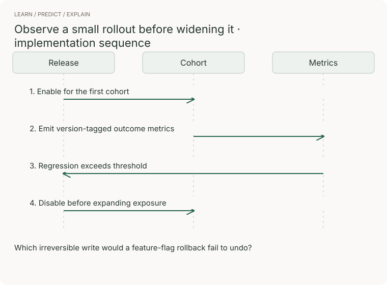

# 12 · Delivery

> Senior tier · feeds **P2 (it survives)**

## The one-liner

[07 · Shipping it](../../01-junior/07-shipping-it/) made one deploy
reproducible. This section makes deploying so small, frequent and reversible
that it stops being an event — and treats the pipeline that does it as what it
is: the most privileged system you own. Two ideas carry everything. Risk lives
in the size of a change, not in the number of deploys. And putting code on
servers is a different event from putting a feature in front of users, which
you can control separately.

## The failure it prevents

The team ships every six weeks, "to limit risk". Release 4.2 is six weeks of
work: forty-odd changes, a schema migration, a pricing feature marketing has
already announced. It goes out Thursday evening. Friday morning, checkout
errors are climbing.

Which of the forty changes did it? Nobody knows; the diff is fourteen thousand
lines. Roll it all back, then — except the migration ran, the old code has
never seen the new schema, and rolling back the artefact without the schema is
a second incident on top of the first. So they debug forward, in production,
for most of a day, with the pricing launch broken in public.

The retrospective concludes the release was "too risky" and adds an approval
board and a stabilisation window. Deploys move to ten weeks apart, so the next
batch is bigger, so the next incident is worse — and the deploy machinery,
exercised five times a year, is rustier each time. Every step was locally
reasonable. The loop is a machine for maximising blast radius.

The same bug in a team that deploys many times a day is a different event: the
suspect is one small diff that landed an hour ago, the canary flags the error
rate while exposure is still 1%, and the way back is switching a flag off.
Nothing about that team is more careful. Their batches are smaller.

## The mental model

**Batch size is the risk dial.** The instinct says deploys are risk events, so
have fewer. But a deploy's danger is proportional to what changed: a small
change can be reviewed honestly, blamed quickly — it broke now, and only one
thing is new — and undone cheaply. And machinery used daily is rehearsed
machinery, where a quarterly deploy is opening night performed by people out
of practice. The counterintuitive part is measured, not asserted: DORA's
research programme has found repeatedly that speed and stability are not a
trade-off — the same teams score well on both, and low performers score badly
on both (checked at dora.dev, 2026-09-21). You do not buy stability by slowing
down. You buy it by shrinking the batch; frequency is what falls out.

**Deploy and release are different events.** A *deploy* puts a new artefact on
servers, dark. A *release* routes users onto the new path. Progressive
delivery is doing the second in slices: a **canary** — the new version taking
a small share of real traffic, watched against the baseline for errors and
latency — then a percentage rollout, 1%, 10%, 100%, usually with a **feature
flag** as the switch. Splitting the events is what makes going back cheap:
undoing a release is flipping a flag in seconds; undoing a deploy means moving
artefacts. It also shrinks the cost of being wrong to whatever slice was
exposed, and it is the only honest way to test in production — the one
environment whose traffic you did not invent.


**A feature flag is a fork in your code with a timer on it.** While the flag
exists, two programs share one file, and every flag multiplies the paths a
request can take. So a flag is created with three things or not at all: an
owner, a removal date, and a definition of done that says *removed*, not "at
100%". Without them, flags accumulate into a codebase where nobody dares
delete the `temp_` check from three years ago because nobody knows who is
still behind it. OpenFeature — a CNCF incubating project, checked 2026-09-21 —
standardises the flag API so you are not welded to one vendor; it cannot
standardise the discipline.

**The pipeline is the most privileged system you own.** It holds credentials
to production, and it runs code that arrives in pull requests — dependency
lifecycle scripts, test code, build plugins, third-party actions. Anyone who
can influence what it executes is one step from your cloud account; the junior
tier's npm-worm story was exactly this, harvesting CI credentials at install
time. Three hardening moves, each from GitHub's own guidance (checked
2026-09-21):

- **Pin third-party actions to a full commit SHA.** A version tag can be moved
  to point at new code after you reviewed it; a SHA cannot. GitHub's docs are
  blunt: pinning to a full-length SHA is currently the only way to use an
  action as an immutable release.
- **Use OIDC instead of static cloud keys.** The pipeline proves its identity
  to the cloud per run and receives a short-lived, scoped credential. There is
  no long-lived secret sitting in CI to steal, and the blast radius of a
  compromise drops from "until someone notices and rotates" to minutes.
- **Least-privilege job permissions.** Default the CI token to read-only and
  grant write scopes per job, only where that job needs them.

**Merge queues.** "All checks passed" contains a quiet lie: each pull request
was tested against the main branch as it stood when the PR last updated, not
as it will stand when the PR lands. Two changes can each pass alone and fail
combined — one renames a function, the other adds a call to the old name; both
are green, main is broken, and every check told the truth. A merge queue
closes the gap: it builds a temporary branch of the target plus your change
plus every queued change ahead of yours, runs the required checks against that
combined state, and merges only if they pass; a failing change is ejected and
the rest are retested without it (GitHub's documentation, checked 2026-09-21).
The cost is latency between approval and merge. The purchase is a main branch
that is green because it was tested, not because everyone got lucky in the
same direction.

**Infrastructure as code, and drift.** The repo describes reality — servers,
DNS, queues, permissions — and an apply makes reality match the description.
The point is not automation; it is that the description is reviewable,
diffable and recreatable, which is what P2 means by destroying the
infrastructure and getting it back. **Drift** is the enemy: someone fixes
production by hand at 2am, reality changes, and the description now lies — the
next apply either reverts their fix or fails strangely. Treat a non-empty plan
against live infrastructure as a finding, and write hand-made changes back
into code the next morning. On tools, the licensing facts as of 2026-09-21:
Terraform has been under the Business Source License since August 2023 —
source-available, not open source — and HashiCorp has been part of IBM since
the acquisition closed on 27 February 2025. OpenTofu is the Linux Foundation
fork that kept the MPL 2.0 licence, and it has genuinely diverged rather than
trailing: state and plan encryption at rest is an OpenTofu-side feature, and
it runs its own release line (1.12, May 2026). Neither choice is wrong. Not
knowing which one you are on, and why, is.

**Rollback is a feature you build, and it has a boundary.** Going back must be
one action, and rehearsed — a rollback nobody has run is a hope with a
runbook. But be precise about what rolls back: the artefact does; several
things never do. A migration that dropped a column cannot be un-run, which is
why schema changes are written **expand/contract** — add the new alongside the
old, ship code that works with both, remove the old only when nothing running
needs it — so the previous version of the code always still works. Sent
emails, charged cards, and events other systems already consumed do not roll
back either. The senior reviewer's question for every change: *if we roll this
back in an hour, what stays behind?*


### Watch the concept, then trace the implementation



The comparison follows four illustrative states. Without the mechanism: recover while everyone is impacted. With it: advance or roll back on stated thresholds. These are teaching states, not measured performance.



[Still storyboard / reduced-motion alternative](../../../assets/learning/canary-still.svg).

**Predict before replaying:** Which irreversible write would a feature-flag rollback fail to undo?

**Try it:** reproduce the final transition in a small example, remove the mechanism, and record the changed outcome. Use the checks later in this chapter to judge the result.

## What good looks like

- Merging to main deploys, with no human running commands; deploys per week is
  a number you can state.
- Every third-party action is pinned to a commit SHA, CI reaches the cloud
  through OIDC, and the CI token is read-only by default. You can say what a
  pull-request author can reach, because you checked.
- A plan against live infrastructure comes back empty, and the infrastructure
  has been recreated from the repo at least once.
- You can deploy dark and release by percentage; the two events sometimes
  happen on different days, and that surprises nobody.
- Every flag has an owner and a removal date, and the count of live flags goes
  down as well as up.
- Rollback is one action; the last rehearsal has a date and a duration.
- Migrations are expand/contract: the previous version of the code runs
  against the current schema, and someone has proved it.

Done badly:

- Deploys have a calendar invite, a war room, and a person who "drives".
- `uses: something@v3` throughout, and a cloud key in CI secrets created two
  years ago that nobody dares rotate.
- The infrastructure repo describes what production looked like in March.
- Release means deploy: the only way to turn a feature off is to ship again.
- Flags named `temp_` or `new_` that are older than several employees' tenure.
- A rollback runbook that has never been run, and a migrations folder full of
  one-way doors.

## Ask Claude for this

**Request 1 — map the pipeline's privilege before touching it**

```
Here are my CI workflow files. Build a table, one row per job: what
secrets and credentials it can reach, what its token can write to,
and which third-party actions it runs — pinned to a tag, a branch,
or a full commit SHA.

Then answer as an attacker who controls the code in a pull request:
which of these jobs runs my code, and what do I walk away with?

Do not propose fixes until the map is complete.
```

*Why it is asked that way:* "map before fixes" stops the model skipping to
generic hardening advice, and the attacker question is the one that finds the
real problem — a job that runs untrusted PR code with secrets in reach. That
combination hides in plain sight in workflows everyone has read.

*What you should get back:* a table with at least one uncomfortable row. If
every row comes back safe, be suspicious: in most repos the honest answer is
that the test job runs arbitrary PR code, and the question is what else that
job can see.

*What to push back on:* "these actions are from reputable authors, so tags are
fine". A tag is a pointer someone else controls, and reputation does not
survive a compromised maintainer account. SHA or it is not pinned.

**Request 2 — the migration that survives a rollback**

```
I need to rename the column `email` to `contact_email` on a table
with live traffic. Write it as a sequence of separate deploys, with
one rule: at every step, both the currently deployed code and the
previous version run correctly against the current schema.

For each step, state what deploys, what migrates, and what breaks
if we roll back at exactly this point. If the answer is ever
"rollback breaks", the sequence is wrong.
```

*Why:* the both-versions rule is the constraint doing the work. Without it you
get a single `ALTER TABLE ... RENAME` plus a code change in one deploy — which
works until the first rollback, which is exactly when it must not fail.

*What you should get back:* expand/contract — add the new column, dual-write,
backfill, move reads, stop writing the old, drop it in a later release — with
the rollback answer stated per step and the drop deliberately far from the
rename.

*What to push back on:* the migration and the code change riding in the same
step "for simplicity", and any backfill that locks the table while it runs.

**Request 3 — a flag born with its own funeral**

```
Put <this change> behind a feature flag. Requirements:

1. Off by default, and the old path is what runs if the flag system
   is unreachable.
2. One choke point: the flag is evaluated in exactly one place, not
   checked in every function that cares.
3. Next to the definition: owner, created date, removal date, and
   what done means — done is the flag deleted, not the flag at 100%.
4. Write the removal diff now, as a draft PR: the change that
   deletes the flag and the old path once the rollout has held.
```

*Why:* requirement 1 chooses the failure mode before it happens — a flag
service outage should degrade to yesterday's behaviour, not to a coin flip.
Requirement 4 is the one that changes behaviour months later: removal stops
being archaeology because the diff already exists.

*What to push back on:* the flag threaded through a dozen call sites. Every
extra check is a place the two paths can disagree, and a removal diff that
touches twelve files is a removal that will not happen.

## How you would know it is wrong

1. **Deploy a deliberately broken build** — crashes on start, or fails its
   health check — through the real pipeline, in a scratch environment. It
   should never take traffic: stopped at the health gate, or rolled back
   automatically. If the pipeline exits green while the broken build serves,
   your deploy verifies "the commands ran", not "the deploy worked".
2. **Find out what your CI token can actually reach.** Print the token's
   permission set in a job log; list what the cloud role allows, not what you
   meant it to allow; then, from a pull-request branch in a sandbox, attempt
   one thing it should not be able to do. The gap between intended and actual
   is the finding.
3. **Roll back and time it**, from decision to the old version serving, with
   the person who built the pipeline on holiday. Minutes and one action is a
   pass. "First find the person who knows" is the red result, better read in a
   drill than an incident.
4. **Audit flags by age.** List every flag with its creation date. A flag
   older than six months with no owner and no removal date is not a rollout
   tool anymore; it is an unmerged fork of your product. Count them.
5. **Run a plan against live infrastructure** and read the diff. Non-empty
   means reality was edited by hand; every line is a change that bypassed
   review, and one of them is the 2am fix the next apply will silently revert.
6. **Manufacture the merge-queue failure.** Two branches: one renames a
   function, the other adds a call to the old name. Both pass CI alone. Put
   them through your merge process. If main ends up red, you have just watched
   the exact failure a merge queue exists to prevent, on demand, for free.

> The standing rule: before believing a green result, say what broken would
> have looked like. A pipeline that has never been seen to stop a bad build is
> not a gate. It is a corridor with green paint.

## Your slice of the project

On **P2**, the reading list from P1 gets its delivery machinery:

- Merge-to-main deploys, and you did not run a command — the P2 checkbox, done
  properly.
- The pipeline hardened: every action pinned to a SHA, cloud access through
  OIDC with the old static key revoked, token read-only by default. One
  written paragraph: what a pull-request author can reach.
- The infrastructure described in the repo, destroyed and recreated once, and
  a plan that comes back empty afterwards.
- One real change shipped behind a flag: deployed dark, released at 1%, then
  10%, then everyone — and then the flag removed. The removal PR is part of
  the deliverable.
- One rollback drill, timed, written down.

**Acceptance criteria:**

- A deliberately broken build went through the pipeline and never served
  traffic; you watched it get stopped or rolled back, and can say which.
- The old cloud key is revoked and the deploy still works — both halves, as P2
  demands.
- A plan against the live infrastructure shows no changes.
- The flag is gone from the code, and you can point at the diff that removed
  it.
- The rollback time is a measured number, not an estimate.

## Words you now own

- **batch size** — how much change ships per deploy. The dial that actually
  controls risk.
- **deploy** — putting a new artefact on servers. Says nothing about who sees
  it.
- **release** — routing users onto the new path. The event users experience.
- **progressive delivery** — releasing in slices — canary, percentages, flags —
  instead of to everyone at once.
- **canary** — the new version taking a small share of real traffic, watched
  against the old.
- **feature flag** — a runtime switch between code paths. A fork with an owner
  and a removal date, or a liability.
- **merge queue** — tests changes combined, in landing order, so main only
  receives what passed together.
- **infrastructure as code** — the repo as the description of reality, applied
  rather than clicked.
- **drift** — reality edited by hand until the description lies.
- **expand/contract** — schema change as add-alongside, migrate, remove-later,
  so the previous code version keeps running.
- **OIDC (workload identity)** — CI proving who it is per run and getting a
  short-lived credential, instead of storing a key.
- **roll forward** — fixing with a new small deploy instead of going back.
  Only an option because deploys are small.

---

**Not covered here:** deployment topologies in depth — blue-green, rolling,
in-place and their trade-offs; mobile releases, where the store controls the
deploy and flags stop being optional; versioned artefacts consumed by others —
libraries and APIs release on contracts, not traffic; and what happens when a
release goes wrong anyway — detection and response live in
[09 · Reliability](../09-reliability/), and the supply chain beyond your own
pipeline in [11 · Security](../11-security/).

[Choose your learning path](../../../paths/README.md) · [Interview applications](../../../paths/interviews/README.md)
