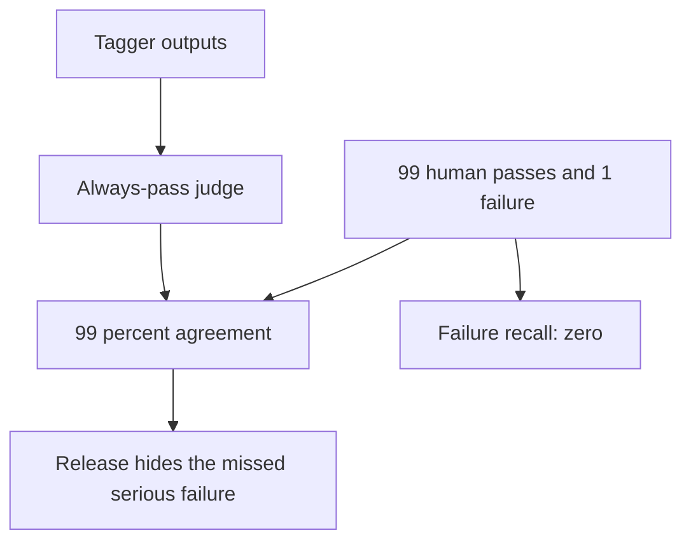
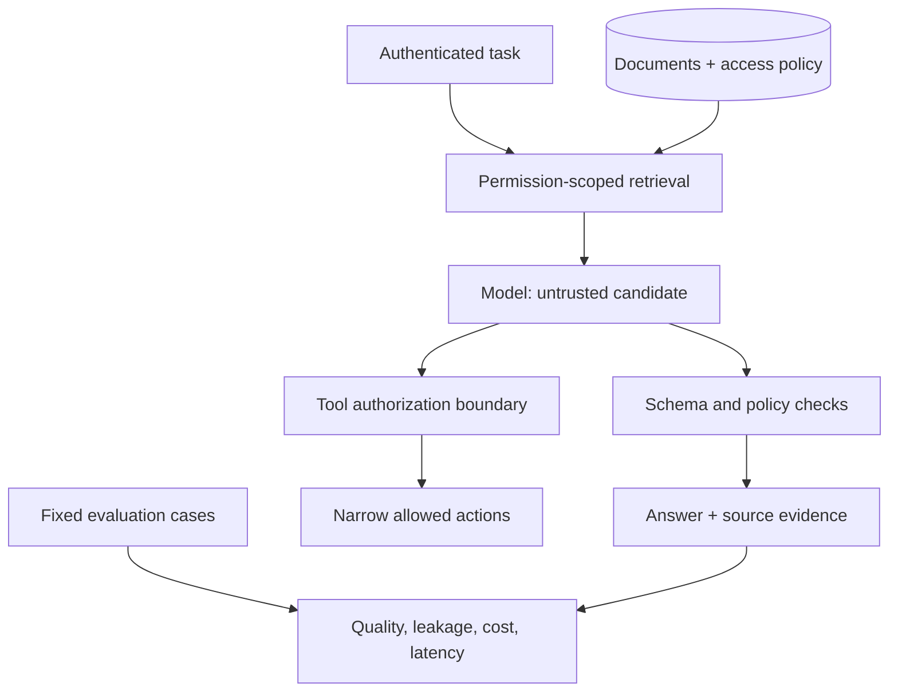

# 15 · AI systems

> Senior tier · feeds **P4 (it reasons, provably)**

> “Our tag suggestions pass twenty regressions, but a judge with 99% agreement missed a serious failure. The provider now times out. Tell us whether to release and how the reading list remains usable within a 10-cent, one-second task budget.”

Constructed optional AI-product exercise. Work from a contract and a failure model:

| Input / boundary | Expected behavior |
|---|---|
| `SQL and CSS`, both tags allowed | Suggest database and frontend; never invent an unauthorized tag |
| 99 human passes, one failure; judge always passes | 99% agreement, 0% failure recall |
| Fixed required regressions | May all pass; seeded defects must make relevant checks fail |
| 4-cent attempts, 10-cent budget | Two attempts at most, including charged failures |
| Model unavailable | Manual tags remain usable; do not disguise fallback as model quality |

Start by stating the oracle and severity; separate tuning cases from regressions and held-out labels; test sensitivity to a known defect; calculate class-specific metrics; then combine quality with independent permission, cost and latency gates. The [runnable evaluation lab](../../../paths/interviews/evaluations/README.md) supplies cases, real mutants, a fake-provider outage and a separate scored decision.

## The one-liner

Putting a model inside your product is an engineering problem, not a prompting
problem. The work is deciding what the model sees, proving the output is any
good, stopping it being turned against you, and knowing what each answer costs
in money and in milliseconds. If you cannot do the second one, you do not have a
feature, you have a demo.

## The failure it prevents

Two failures, and they look nothing alike.

**The quiet one.** The feature ships. It is good in the demo. Six weeks later
somebody notices it has been wrong about a whole category of input the entire
time — not wrong loudly, wrong plausibly. Nobody caught it because the only
check was that it returned something, and it always returns something. That is
the same disease as a test suite that cannot fail, wearing a model.

**The loud one.** Your assistant can read the user's private data, it processes
content from the outside world, and it can send things out — an email, a
request, a tool call. That combination creates an exfiltration risk. Treat an external document that requests a tool action as untrusted data. Authorization must remain outside model-generated instructions.

## The mental model

### Context engineering, of which retrieval is one part

The unit of work is not the prompt. It is **everything the model can see when it
answers**: instructions, retrieved documents, conversation history, tool
definitions, and whatever state the workflow carries. A vector database alone does not define the data permissions, tool policy or product behavior.

Hybrid keyword/embedding retrieval and reranking are candidates, not an industry-wide prescription or a fixed chunk count. Compare a simple lexical baseline on your corpus, measure recall and relevant-context cost, then add machinery only when the measurements justify it. Larger context can add latency and distract from useful evidence; measure your model and workload.

For agents, identifiers plus tools for fetching relevant data can reduce unnecessary context. Compaction and external notes can help long tasks but may lose important state. [Anthropic's context-engineering article](https://www.anthropic.com/engineering/effective-context-engineering-for-ai-agents), published 2025-09-29, describes those techniques. It is vendor engineering guidance, not evidence that all tasks require them or that all interviews ask them.

### Evaluation is the part that makes it engineering

Read representative traces, identify concrete failure categories and decide which matter to the product. Thirty traces is a manageable teaching start, not a statistically established minimum. Validate the labels and keep serious errors visible rather than averaging them away.

- Use **task-appropriate metrics**: exact match for a finite contract, retrieval recall for retrieval, calibrated graded rubrics where degrees of quality matter. A release gate may threshold a graded metric; explain the operational decision and why the threshold fits the risk.
- A model judge needs independent human labels, a confusion matrix, failure recall/precision, class balance and severity analysis. **99% agreement can coexist with 0% failure recall** when 99 labels are pass and an always-pass judge misses the only failure.
- A required regression suite **may pass 100%**. Prove falsifiability by introducing a known defect and observing the relevant check fail. Restore the fix and require those checks to pass.
- Keep development, regression, challenge and held-out sets distinct. Do not tune against a holdout and continue calling it independent. A supported-use severe failure remains a release blocker even if someone moves it to a challenge set.

[Airbnb's evaluation engineering report](https://medium.com/airbnb-engineering/eval-driven-development-lessons-from-evaluating-genai-at-scale-e817e5ae5788), published 2026-07-28, discusses combined programmatic, judge and human evaluation. Its examples are product-specific; our lab adds explicit class/severity checks rather than adopting a universal agreement threshold.

### Baseline to challenge: one average controls shipping



Before continuing, draw a separate required regression gate and a held-out failure-recall gate. Then add a provider outage: a perfect schema result says nothing about cost or total latency. The final chapter diagram adds permission and quality boundaries; the [lab](../../../paths/interviews/evaluations/README.md) develops all three changes.

### The security model is architectural, not a filter

Private data, untrusted content and outbound actions form a useful threat-model checklist. Removing one route can reduce exfiltration risk, but a count of capabilities does not prove safety: answers themselves may disclose data, and individual tools may modify state.

Enforce permission-scoped retrieval, narrow tool authorization, destination restrictions and confirmation for consequential actions in code. Detection can be another layer, not the sole authority. Test the boundary with an adversarial fixture that asks for another tenant's document; success means the retrieval/tool service denies it even if the model requests it. The original note's attack-success statistics lacked traceable provenance and are retracted in the [claim ledger](../../../docs/research/claim-ledger.md).

### Cost and latency are product decisions

A task may make several model/tool calls. Measure cost per task, including retries and failed calls, rather than assuming per-token prices predict the bill.

Options to compare on the measured workload: prompt caching (order your prompt
static-first so the cacheable prefix is stable), model routing with a measured
escalation rate, a batch tier for anything not interactive, and a hard spend cap
per key — because a runaway loop is not a probabilistic risk, it is a Tuesday.

For streaming, total completion latency alone misses the early user experience. Users feel
**time-to-first-token** and then the gap between tokens. Budget those separately
and set them as product targets.


## What good looks like

- You have an eval set built from real failures, and you can say which failure each case came from.
- You know the judge’s confusion matrix, class-specific metrics, severity misses and label provenance.
- Required regressions pass; known seeded defects make the relevant checks fail. Challenge limitations and held-out results are separately reported.
- Each tool call checks the authenticated user, resource and action outside the model; retrieved text cannot enlarge permission.
- Cost is tracked per task and capped in code.
- You can name what happens when the model is unavailable, and it is not "the page breaks".
- There is a written answer to "should this be a model at all", and sometimes it is no.

Done badly:

- Evals written after the feature, asserting what it currently does.
- A single "quality score" nobody can act on.
- Prompt-tinkering as the whole improvement loop.
- An agent with credentials, internet access and no approval step.
- Cost discovered at the end of the month.
- A model doing something a lookup table would do more accurately, for free, in microseconds.

## Ask Claude for this

**Request 1 — error analysis before any metric**

```
Here are 30 real traces from the feature, with inputs and outputs.

Do not score them. Read them and group the failures into categories you
derive from what you see, not from a list I gave you. Report the count per
category and show me two examples of each.

Then tell me which single category, if fixed, removes the most failures.
```

*Why it is asked that way:* "do not score them" is the constraint doing the
work. Ask for a score and you get a number with nothing under it; ask for a
taxonomy and you get the shape of your problem. Deriving the categories from the
data rather than from your list is what stops it confirming what you already
believed.

*What you should get back:* counts and actual trace examples, with ambiguous labels called out. An even distribution can be real; validate against the data rather than requiring a particular shape.

**Request 2 — build the check that can fail**

```
Define the task-specific oracle and metric, and explain the release threshold.
Separate development examples, required regressions, challenge cases and holdout.

Run the fixed implementation on required regressions. Then inject three named
defects, identify the cases that should catch each one, and show those cases fail.
Restore the fix and show required regressions pass. Do not require current failures.
For a model judge, compute the confusion matrix, failure recall/precision and
severity of misses on independent human labels. Report missing classes explicitly.
```

*Why:* a passing regression is useful if it detects the defect it was written for. Challenge coverage and stochastic quality need separate evidence.

*Push back on:* an impressive agreement number without class counts, or a “holdout” used during prompt tuning.

**Request 3 — find the exfiltration path**

```
Here is the feature: what data it can read, what content from outside it
processes, and which tools it can call.

Work out whether all three legs of the lethal trifecta are present. If
they are, show me the concrete path: what an attacker would put in the
untrusted content, and what would leave.

Do not propose a filter as the fix.
```

*Why:* a detector alone cannot authorize a tool call. The checkpoint is an enforced permission boundary and an adversarial fixture that tries to cross it; filtering can remain an additional signal.

## How you would know it is wrong

1. **Seed a specific defect.** A constant output should fail content-sensitive cases; it may correctly pass a schema-only check. Require each oracle to detect the class of fault it claims to test.
2. **Measure judge confusion and severity on independent labels.** Include rare failures; report undefined metrics and sample limits, not only agreement.
3. **Reorder the candidates in a pairwise judge** and see how many verdicts flip. Report order sensitivity separately from repeated-run stochastic variation; neither alone is a universal noise floor.
4. **Run the trifecta test on your own feature** honestly: private data, untrusted input, outbound capability. Trace the actual data route and test permission enforcement; counting capabilities is a checklist, not a proof.
5. **Look at the per-task cost, not the per-call cost**, on your worst-case loop, and check there is a cap that would actually stop it.
6. **Measure time-to-first-token from the user's side**, not from the API's. The queue in front of the model is part of the latency.
7. **Turn the model off** and see what your product does. That is your degradation path, whether or not you designed it.

## Your slice of the project

On **P4**, the reading list gets one AI feature — a summary, a tag suggestion, a
"what should I read next". Small. The feature is not the work.

- Thirty real traces, hand-read, grouped into a failure taxonomy you wrote.
- At least twenty required regression cases with a task-appropriate oracle; all may pass after fixing defects. Separate challenge and held-out data.
- A judge, if used, with a confusion matrix, failure precision/recall, severity misses and independent label provenance.
- Per-task cost recorded and a hard cap in code.
- Time-to-first-token measured from the browser.
- A written trifecta analysis for your own design, with the leg you cut named.
- A stated answer to "why is this a model and not a rule", and it must be honest.

**Acceptance criteria:**

- You can show your eval going red on a deliberately degraded version.
- You can compute class-specific judge metrics and severity misses, or state that no judge is used.
- Turning the model off leaves the product usable.
- The cost cap has been tested by hitting it.

## Words you now own

- **context engineering** — deciding everything the model can see when it answers. Retrieval is one input to it.
- **hybrid retrieval** — keyword and embedding search combined, then reranked.
- **reranking** — a second, more expensive pass that reorders candidates before a few are sent.
- **context rot** — recall degrading as the window fills.
- **error analysis** — reading real failures by hand and building a taxonomy from them. The start of every good eval.
- **LLM-as-judge** — using a model to grade output. An instrument; needs validating like any other.
- **lethal trifecta** — private data, untrusted content, and outbound capability in one session.
- **prompt injection** — instructions smuggled into content the model reads; enforce permissions independently of model text.
- **per-task cost** — the real unit once a feature makes many calls per user action.
- **time-to-first-token** — how long until something appears. The latency users actually feel.
- **escalation rate** — how often a cheap model hands off to an expensive one. Your routing health metric.

---

**Not covered here:** training or fine-tuning models, and the research side of
evaluation. This section is for an application engineer shipping a feature. The
security material here is the product-facing slice; the general case is
**11 · Security**.

[Choose your learning path](../../../paths/README.md) · [Interview applications](../../../paths/interviews/README.md)

## Draw it from memory · Separate retrieval permission from model output



**Redraw challenge:** Draw the boundary that still holds if retrieved text asks the model to reveal another tenant’s data.
