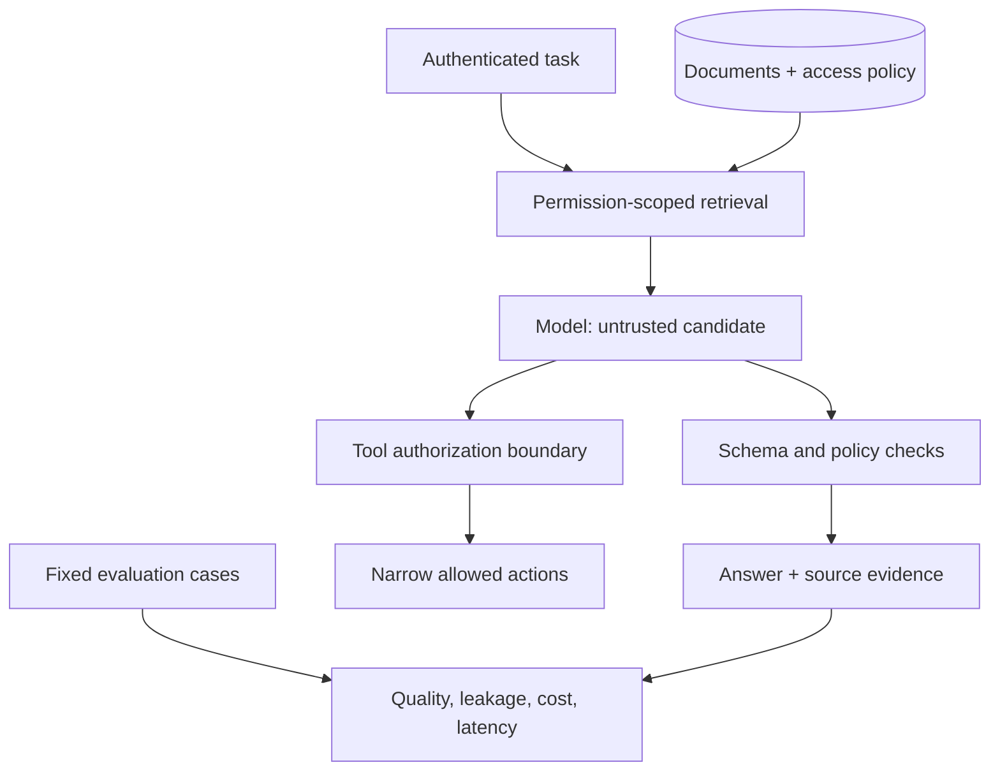

# 15 · AI systems

> Senior tier · feeds **P4 (it reasons, provably)**

## The one-liner

Putting a model inside your product is an engineering problem, not a prompting
problem. The work is deciding what the model sees, proving the output is any
good, stopping it being turned against you, and knowing what each answer costs
in money and in milliseconds. If you cannot do the second one, you do not have a
feature, you have a demo.

## The failure it prevents

Two failures, and they look nothing alike.

**The quiet one.** The feature ships. It is good in the demo. Six weeks later
somebody notices it has been wrong about a whole category of input the entire
time — not wrong loudly, wrong plausibly. Nobody caught it because the only
check was that it returned something, and it always returns something. That is
the same disease as a test suite that cannot fail, wearing a model.

**The loud one.** Your assistant can read the user's private data, it processes
content from the outside world, and it can send things out — an email, a
request, a tool call. That combination is the whole vulnerability. In the
documented EchoLeak case, a crafted email was enough to make a corporate
assistant exfiltrate data with no click from the user at all.

## The mental model

### Context engineering, of which retrieval is one part

The unit of work is not the prompt. It is **everything the model can see when it
answers**: instructions, retrieved documents, conversation history, tool
definitions, and whatever state the workflow carries. Treating a vector database
as the architecture is the named mistake of the last two years.

The standard retrieval recipe as of 2026 is hybrid search — keyword and
embeddings together, merged — then a reranking pass: fetch twenty to fifty
candidates, send the best three to five. Long context did not remove the need
for this. Bigger windows cost more, raise time-to-first-token, and recall
degrades as the window fills, because attention is a finite budget spread over
everything in it.

For an agent rather than a single answer, the current guidance is the opposite
of "load everything up front": give it lightweight identifiers — file paths,
URLs, record ids — plus tools to open them, let it fetch what it needs when it
needs it, compact old turns, and keep notes outside the window.

*(Read from Anthropic's engineering writing and several practitioner sources on
2026-09-21.)*

### Evaluation is the part that makes it engineering

The practitioner consensus is **error analysis first**, not metric first. Take
roughly thirty real traces. Read them by hand. Build a taxonomy of how they
failed. Count. In one documented case study, three issues accounted for more
than 60% of failures, and fixing date handling alone moved success from 33% to
95%.

Only then automate the checks:

- **Binary pass/fail**, not a 1-to-5 score. A dashboard showing "helpfulness:
  4.2" cannot be acted on and cannot be wrong.
- If a model is the judge, **the judge is an instrument and needs validating**.
  Hand-label a set, measure how often the judge agrees with you, and know that
  number. Judges have documented, quantified weaknesses: candidate order flips a
  meaningful share of pairwise verdicts, and a 2026 study found no frontier model
  uniformly reliable as a judge.
- **A suite that passes 100% is not challenging the system.** That is the same
  rule as [06 · Testing](../../01-junior/06-testing/), pointed at a model.

### The security model is architectural, not a filter

The organising idea is the **lethal trifecta**: private data, untrusted content,
and a way to send things out. Any two are survivable. All three is an
exfiltration channel, whatever your prompt says.

Detection is not a boundary. A 2025 paper by researchers across several frontier
labs bypassed all twelve published defences they tested at over 90% success
using adaptive attacks, and human red-teamers reached 100%. A guardrail that
blocks 95% of attacks is a failing grade, because the attacker only needs the
other 5% and gets to keep trying.

What actually holds: cut one leg of the trifecta per session. Least-privilege
tools. Human approval for consequential actions. And never treat the system
prompt as a secret or as a security control.

### Cost and latency are product decisions

Per-token prices fell. Per-**task** cost did not, because an agent loop makes
fifty to two hundred calls. Budget per task, not per request.

The levers, in rough order of payoff: prompt caching (order your prompt
static-first so the cacheable prefix is stable), model routing with a measured
escalation rate, a batch tier for anything not interactive, and a hard spend cap
per key — because a runaway loop is not a probabilistic risk, it is a Tuesday.

For anything streaming, total latency is the wrong number. Users feel
**time-to-first-token** and then the gap between tokens. Budget those separately
and set them as product targets.


## What good looks like

- You have an eval set built from real failures, and you can say which failure each case came from.
- You know your judge's agreement rate with a human. It is a number, not a vibe.
- The suite does not pass 100%, and you know which cases fail and why.
- Every tool the model can call is one you would be comfortable with a stranger calling, because effectively one can.
- Cost is tracked per task and capped in code.
- You can name what happens when the model is unavailable, and it is not "the page breaks".
- There is a written answer to "should this be a model at all", and sometimes it is no.

Done badly:

- Evals written after the feature, asserting what it currently does.
- A single "quality score" nobody can act on.
- Prompt-tinkering as the whole improvement loop.
- An agent with credentials, internet access and no approval step.
- Cost discovered at the end of the month.
- A model doing something a lookup table would do more accurately, for free, in microseconds.

## Ask Claude for this

**Request 1 — error analysis before any metric**

```
Here are 30 real traces from the feature, with inputs and outputs.

Do not score them. Read them and group the failures into categories you
derive from what you see, not from a list I gave you. Report the count per
category and show me two examples of each.

Then tell me which single category, if fixed, removes the most failures.
```

*Why it is asked that way:* "do not score them" is the constraint doing the
work. Ask for a score and you get a number with nothing under it; ask for a
taxonomy and you get the shape of your problem. Deriving the categories from the
data rather than from your list is what stops it confirming what you already
believed.

*What you should get back:* an uneven distribution. Failures cluster; if the
categories come back evenly sized, they were invented rather than observed.

**Request 2 — build the check that can fail**

```
Write an eval for this behaviour as binary pass/fail with a stated rule.

Then write three cases you expect to FAIL with the current implementation,
and show me them failing. If all my cases pass, tell me the eval is too
easy rather than reporting success.
```

*Why:* an eval nobody has seen go red is not evidence. Demanding failing cases
up front makes the instrument prove itself before you trust it.

*Push back on:* a rubric with degrees of quality in it. You wanted a decision,
not an opinion.

**Request 3 — find the exfiltration path**

```
Here is the feature: what data it can read, what content from outside it
processes, and which tools it can call.

Work out whether all three legs of the lethal trifecta are present. If
they are, show me the concrete path: what an attacker would put in the
untrusted content, and what would leave.

Do not propose a filter as the fix.
```

*Why:* the last line matters. Filtering is the answer a model reaches for and
the one the research says does not hold. Forbidding it forces an architectural
answer: remove a capability, split the session, add an approval.

## How you would know it is wrong

1. **Ask what your eval would say about a deliberately broken version.** Swap in a model that returns a fixed string. If your suite still passes anything, that part of it is measuring nothing.
2. **Measure judge-human agreement on a labelled set.** If you have never done this, your judge's verdicts are unvalidated.
3. **Reorder the candidates in a pairwise judge** and see how many verdicts flip. That number is your noise floor.
4. **Run the trifecta test on your own feature** honestly: private data, untrusted input, outbound capability. Two of three is a design. Three is an incident waiting for someone to notice.
5. **Look at the per-task cost, not the per-call cost**, on your worst-case loop, and check there is a cap that would actually stop it.
6. **Measure time-to-first-token from the user's side**, not from the API's. The queue in front of the model is part of the latency.
7. **Turn the model off** and see what your product does. That is your degradation path, whether or not you designed it.

## Your slice of the project

On **P4**, the reading list gets one AI feature — a summary, a tag suggestion, a
"what should I read next". Small. The feature is not the work.

- Thirty real traces, hand-read, grouped into a failure taxonomy you wrote.
- An eval set of at least twenty cases, binary, including cases that currently fail.
- A judge, if you use one, with a measured agreement rate against your own labels.
- Per-task cost recorded and a hard cap in code.
- Time-to-first-token measured from the browser.
- A written trifecta analysis for your own design, with the leg you cut named.
- A stated answer to "why is this a model and not a rule", and it must be honest.

**Acceptance criteria:**

- You can show your eval going red on a deliberately degraded version.
- You can state your judge's agreement rate, or say plainly that you have no judge.
- Turning the model off leaves the product usable.
- The cost cap has been tested by hitting it.

## Words you now own

- **context engineering** — deciding everything the model can see when it answers. Retrieval is one input to it.
- **hybrid retrieval** — keyword and embedding search combined, then reranked.
- **reranking** — a second, more expensive pass that reorders candidates before a few are sent.
- **context rot** — recall degrading as the window fills.
- **error analysis** — reading real failures by hand and building a taxonomy from them. The start of every good eval.
- **LLM-as-judge** — using a model to grade output. An instrument; needs validating like any other.
- **lethal trifecta** — private data, untrusted content, and outbound capability in one session.
- **prompt injection** — instructions smuggled into content the model reads. Not solved, and not solvable by filtering.
- **per-task cost** — the real unit once a feature makes many calls per user action.
- **time-to-first-token** — how long until something appears. The latency users actually feel.
- **escalation rate** — how often a cheap model hands off to an expensive one. Your routing health metric.

---

**Not covered here:** training or fine-tuning models, and the research side of
evaluation. This section is for an application engineer shipping a feature. The
security material here is the product-facing slice; the general case is
**11 · Security**.

[Choose your learning path](../../../paths/README.md) · [Interview applications](../../../paths/interviews/README.md)

## Draw it from memory · Separate retrieval permission from model output



**Redraw challenge:** Draw the boundary that still holds if retrieved text asks the model to reveal another tenant’s data.
