# 15 · AI systems — five projects

> Senior tier · each one an afternoon · read [the section](README.md) first

Five projects that turn a model feature from a demo into a thing you can
defend: a failure taxonomy you derived from real traces, an eval you have
watched go red, a judge with a measured agreement rate, an exfiltration path
you found in your own design and closed architecturally, and a per-task cost
with a cap you tested by hitting it.

The feature itself is not the work. Every one of these is about building an
instrument that can disagree with you, which is exactly the problem this
section has that the rest of engineering solved decades ago.



---

### 1. Thirty traces, read by hand

*You end up with a failure taxonomy you derived from your own data, counts per category, and the name of the single fix that removes the most failures.*

**Build**

Collect thirty real traces from your feature — inputs, outputs, and whatever
the model saw in between. Read them yourself. Group the failures into
categories you derive from what you see. Count. Then find the one category
that, if fixed, removes the most.

**The thought process**

The first decision is the one that separates this from every "AI evaluation"
article: **error analysis before any metric.** The instinct is to define
quality and measure it. The practitioner consensus is the reverse — look at
what actually went wrong, let the categories come from the data, and only then
automate checks for the categories that turned out to matter. A metric chosen
before you have read failures measures the failure mode you imagined.

Second, and this is why thirty is enough: **failures cluster hard.** In the
documented case studies, a handful of issues account for the majority of
failures — in one, three categories covered more than 60%, and fixing date
handling alone moved success from 33% to 95%. You are not sampling for
statistical power, you are looking for the shape, and the shape shows up fast.

Third, the diagnostic that tells you whether you did it right: **the
distribution must be uneven.** If your categories come back roughly equal in
size, they were invented rather than observed — you imposed a taxonomy instead
of deriving one. Evenly distributed failure categories are the signature of a
list somebody wrote in advance.

Fourth: **read them yourself first, then use a model.** This is the one place
in the guide where doing it by hand is non-negotiable, because the whole point
is to build a mental model of how your system fails, and you cannot outsource
that and still have it. Use the model to scale the categorisation after you
have read maybe ten.

Fifth: **traces, not outputs.** A wrong answer with the right context is a
model problem; a wrong answer with the wrong context retrieved is a retrieval
problem, and they look identical if you only kept the output. Log what the
model saw.

**How to organise the prompts**

```
Here are 30 real traces from the feature, with inputs, retrieved
context, and outputs.

Do not score them. Read them and group the failures into categories
you derive from what you see, not from a list I gave you. Report the
count per category and show me two examples of each.

Then tell me which single category, if fixed, removes the most
failures.
```

"Do not score them" is the constraint doing the work. Ask for a score and you
get a number with nothing under it; ask for a taxonomy and you get the shape of
your problem.

```
Here are the categories I derived by hand from the first ten: <yours>.
How do they differ from yours, and which of us is seeing something the
other missed?
```

Comparing taxonomies is more useful than accepting one. Your categories will
be product-shaped and the model's will be behaviour-shaped, and the difference
is informative.

```
For the biggest category, split it by cause: is this a retrieval
problem (wrong context), an instruction problem (right context, wrong
behaviour), or a capability problem (the model cannot do this)?

Cite the trace for each classification.
```

That three-way split is the one that determines what you do next, and they have
completely different fixes.

```
Is my distribution uneven enough to be real? If the categories are
roughly equal, tell me plainly that they were probably imposed rather
than observed.
```

**On AWS**

The prerequisite is having the traces at all, which is a logging decision made
before you need it. **Bedrock model invocation logging** writes full request
and response — including the prompt the model actually received after your
templating — to **CloudWatch Logs** or **S3**, and it is off by default.
Turning it on is the whole prerequisite for this project, and the reason to
prefer S3 for the archive is that thirty traces today becomes three thousand in
a quarter and **Athena** over S3 is how you sample them later.

If you are using **Bedrock Knowledge Bases** for retrieval, the retrieval
results are available in the response and should be logged alongside the
output — otherwise you cannot tell a retrieval failure from a reasoning
failure, which is the split the third prompt asks for.

For the tracing itself, treat this as [Trace requests and diagnose production symptoms](../../../curriculum/03-production/04-observability/README.md)
work: OpenTelemetry spans around the retrieval call, the model call and any
tool calls, with the trace id on every log line, so "show me everything that
happened for this one answer" is one search. The GenAI semantic conventions in
OpenTelemetry cover model spans specifically and are worth following rather
than inventing attribute names.

One retrieval-shaped note, since most failures in this category are retrieval
failures: the 2026 standard recipe is hybrid search — keyword and embeddings
together — then reranking. On AWS that is **OpenSearch Serverless** with both
a lexical and a vector field, or **pgvector** on **Aurora** if you already
have Postgres and want one database instead of two. Bedrock Knowledge Bases
gives you the managed version including reranking. Pure vector search with no
keyword leg is the most common cause of "it could not find the obvious
document", because exact identifiers and rare terms are precisely what
embeddings are worst at.

**What productionising it means**

Traces are logged with what the model saw, not just what it said, with
retention long enough to sample from. The taxonomy is a document that gets
updated as new failure modes appear. Counts are recomputed after each
significant change, so you can see categories shrink. And the error analysis is
repeated — quarterly, or after any material change to the prompt, the model, or
the retrieval — because the distribution moves.

**The learning**

You cannot improve a model feature by thinking about it, and you cannot improve
it with a quality score either. The only reliable loop is reading real failures
until you can name their kinds, and the reason it works is that failures
cluster far more than intuition suggests — which means a single afternoon of
reading usually finds a fix worth more than a month of prompt tuning.

**How you would know it is wrong**

- Check the distribution. Evenly sized categories mean you imposed them rather than found them.
- Confirm your traces include the retrieved context. Without it you cannot tell retrieval failures from reasoning failures.
- Read ten by hand before using a model. If you skipped that, you have a categorisation and not a mental model.
- Ask whether the biggest category surprised you. If none of it was surprising, sample differently — you may be looking at the failures you already knew about.
- Count how many traces you sampled from. Thirty picked from the ones that got complained about is a different population from thirty at random.

---

### 2. The eval that goes red

*You end up with a binary eval suite, three cases that currently fail, and the suite going red when you swap in a deliberately broken model.*

**Build**

Turn the biggest failure category from project 1 into a binary pass/fail eval
with a stated rule. Include cases you expect to fail today. Then do the
instrument check: replace the model with something that returns a fixed string
and confirm the suite goes red.

**The thought process**

The first rule: **binary, not a score.** A dashboard showing "helpfulness: 4.2"
cannot be acted on and cannot be wrong — it will drift between 4.1 and 4.3
forever while the feature silently breaks for a whole category of input. A
pass/fail with a written rule is a decision, and decisions can be wrong in a
way you notice.

Second, and this is the same rule as [Find defects and evaluate engineering evidence](../../../curriculum/02-applications/04-testing/README.md)
pointed at a model: **a suite that passes 100% is not challenging the system.**
If every case passes, you wrote the eval after the feature and asserted what it
currently does. Demanding cases that fail today is what forces the suite to
have somewhere to go.

Third, the check that makes the whole thing trustworthy: **swap in a
deliberately broken model.** Something that returns a fixed string, or the
input echoed back. If your suite still passes anything, that part of it is
measuring nothing — it is asserting that a response arrived, and a response
always arrives. This is the single most valuable thing in the project and
almost nobody does it.

Fourth, on writing the rule: **the rule has to be checkable by something other
than another model, wherever possible.** Does the output contain the date in
ISO form. Does it cite a document id that was in the retrieved set. Is it under
N words. Deterministic checks are cheap, stable, and cannot themselves drift —
save the model-as-judge for the cases where no deterministic rule exists, which
is project 3's problem.

Fifth: **each case traces back to a real failure.** An eval set assembled from
imagination tests a system you imagined. Being able to say "this case came from
trace 17" is what keeps the suite about your product.

**How to organise the prompts**

```
Write an eval for <this behaviour> as binary pass/fail with a stated
rule. Prefer a deterministic check over a model judgement — tell me
explicitly which cases need a judge and why a rule cannot cover them.

Then write three cases you expect to FAIL with the current
implementation, and show me them failing. If all my cases pass, tell
me the eval is too easy rather than reporting success.
```

The last sentence is what stops the answer being a success report.

```
Now the instrument check. Replace the model with one that returns a
fixed string. Run the suite and tell me exactly which assertions
still pass.

Every one that still passes is measuring the shape of a response
rather than its content — list them so I can fix or delete them.
```

```
For each case, tell me which trace from my error analysis it came
from. Any case you cannot attribute, mark as invented.
```

```
What failure mode does this suite NOT cover? Name one category from
my taxonomy that has no case, and say whether that is because it is
hard to check or because I forgot.
```

**On AWS**

**Bedrock model evaluation** gives you both automatic evaluation jobs and
human-in-the-loop workflows, and the honest framing is that its built-in
metrics are a starting point rather than the destination — they are general
quality measures, and this project is about a taxonomy specific to your
product. Use it for the plumbing (running a dataset through a model, collecting
results, comparing two models) and bring your own rules.

The part worth building properly is running the suite in CI, which means the
eval is a job like any other test: a **CodeBuild** step, or a Lambda triggered
on pull request, writing results somewhere comparable across runs. Store the
per-case results in **S3** or **DynamoDB** so you can answer "which case
started failing, and when" — a pass rate alone will tell you something broke
without telling you what.

For the broken-model control, **Bedrock**'s API surface makes this easy: point
the client at a stub that returns a constant. Keep that stub in the repository,
because this check should run every time the eval framework changes, not once.

If you want model comparison as part of the loop, Bedrock's
**cross-region inference profiles** and the ability to switch model ids with a
config change are what make "run the suite against three models" a cheap
experiment rather than an integration project. The counterpart discipline is
pinning: a model id that silently points at a newer version means your eval
baseline moves under you, so pin explicitly and change it deliberately.

**What productionising it means**

The suite runs in CI on every change to the prompt, the retrieval, or the model
id. It does not pass 100%, and the failing cases are known and tracked rather
than muted. The broken-model control runs too, so the suite proves itself each
time. Per-case results are stored so regressions are attributable. And the
model version is pinned, because an eval baseline that moves on its own is not
a baseline.

**The learning**

The discipline that makes model features engineering rather than craft is
identical to the discipline that makes tests worth having: the check must be
able to fail, and you must have seen it fail. With models it is more important,
not less, because the system always returns something plausible — which means
the default state of an unvalidated eval is passing.

**How you would know it is wrong**

- Swap in a model that returns a fixed string. Anything still passing is measuring nothing.
- Check your pass rate. 100% means the suite was written to describe the current behaviour.
- Count the cases that use a model judge versus a deterministic rule. If everything needs a judge, look again — many rules are checkable.
- Trace each case back to a real failure. The unattributable ones are testing your imagination.
- Change the model id to a different model and run it. If nothing moves, the suite is not sensitive to the thing you are paying for.

---

### 3. The judge, measured

*You end up with two numbers: how often your judge agrees with you, and how many of its verdicts flip when you reorder the candidates.*

**Build**

Hand-label fifty outputs yourself, pass/fail. Run your judge over the same
fifty. Compute the agreement rate. Then, if the judge does pairwise
comparisons, run every pair in both orders and count how many verdicts change.

**The thought process**

The first idea: **a judge is an instrument and an unvalidated instrument is a
guess with a user interface.** You would not trust a thermometer nobody had
calibrated, and a model grading your outputs is exactly that. The agreement
rate is the calibration, and until you have it, every number the judge produces
is of unknown quality.

Second, and this is the specific, measurable weakness worth building the
project around: **position bias.** Show a judge two answers and it prefers the
one it read first, at a rate that is not small. Reorder the candidates and a
meaningful share of verdicts flip. That flip rate is your noise floor — any
improvement smaller than it is indistinguishable from having shuffled the
inputs.

Third: **hand-labelling is the cost and there is no way around it.** Fifty
examples is an hour or two, and it is the only thing that makes the agreement
rate meaningful. The temptation is to have a stronger model produce the labels,
which measures whether two models agree — a different and much less useful
number.

Fourth, the honest reading of what the research says: **no frontier model is
uniformly reliable as a judge**, which is not an argument against using one. It
is an argument for knowing the number. A judge with 85% agreement is genuinely
useful and you will interpret its results differently from a judge with 60%,
and you cannot tell them apart without measuring.

Fifth: **where you disagree with the judge is the most interesting data you
will get.** Read those cases. Usually either your rule was ambiguous, or the
judge is systematically wrong about one kind of input — and both findings are
worth more than the headline percentage.

**How to organise the prompts**

```
I have hand-labelled these 50 outputs pass/fail. Here are my labels
and here is the judge prompt I am using.

Run the judge, compute agreement with my labels, and then show me
every case where we disagreed, grouped by the direction of
disagreement.
```

Grouping by direction matters: a judge that is systematically too lenient needs
a different fix from one that is noisy.

```
For the disagreements: for each one, say whether my labelling rule was
ambiguous or the judge was wrong. Quote the part of my rule that was
ambiguous.
```

This is the prompt that improves your rule, which is usually the bigger win.

```
Now position bias. Run every pairwise comparison in both orders and
count how many verdicts change. Report the flip rate as a percentage.

Then tell me what that number means for the smallest improvement I
could claim to detect.
```

Turning the flip rate into a minimum detectable effect is what makes it
actionable rather than a curiosity.

```
Given my agreement rate of <N>%, what can I honestly say about a run
where the pass rate moved from 72% to 76%? Be blunt.
```

**On AWS**

**Bedrock model evaluation** has an LLM-as-a-judge mode and a human evaluation
mode, and the pairing is exactly this project: use the human mode to collect
your labels through a managed workflow rather than a spreadsheet, and the judge
mode to score the same set, then compare. If your labelling needs more than a
few people, **SageMaker Ground Truth** is the heavier tool for the same job.

For the mechanics, run the judge with **temperature 0** and a pinned model id,
because a judge whose own output varies between runs adds a second noise source
on top of position bias, and you will not be able to separate them. Log every
judge invocation with **Bedrock model invocation logging** so a surprising
verdict can be inspected rather than re-run.

For the flip-rate experiment specifically, the cheap implementation is a
**Step Functions** map state running both orders of every pair in parallel and
writing results to **DynamoDB** keyed by pair id — which gives you the
both-orders comparison as a table rather than as a script you run once and lose.
**Bedrock batch inference** is the cost-efficient route if the set is large,
since none of this is interactive.

And a mitigation worth knowing before you build around the judge: running each
comparison in both orders and counting only the pairs that agree with
themselves removes position bias at exactly double the cost. That is often the
right trade for an offline eval and the wrong one for anything in the request
path.

**What productionising it means**

The agreement rate is recorded with a date and re-measured when the judge
prompt or model changes. The flip rate is known and is quoted whenever a result
is close. Judge calls are logged and inspectable. The labelling rule has been
revised at least once based on disagreements, because the first version is
always ambiguous somewhere. And there is a stated minimum detectable effect, so
nobody claims a two-point improvement that the instrument cannot see.

**The learning**

Using a model to grade a model is legitimate and is also a measurement chain
with two unvalidated links in it. The move that makes it engineering is
treating the judge as an instrument with a known error rate rather than as an
oracle — and the moment you measure it, you find a bias that has nothing to do
with quality and everything to do with which answer came first.

**How you would know it is wrong**

- If you have never measured agreement, every verdict the judge has produced is of unknown quality. That is the finding.
- Reorder candidates and count flips. A flip rate near zero is suspicious, not reassuring — check the orders actually swapped.
- Read the disagreements. If your rule turns out to be ambiguous, fix the rule before blaming the judge.
- Check the judge runs at temperature 0 with a pinned model. Otherwise you are measuring two noise sources at once.
- Compare a claimed improvement to your flip rate. Smaller than the noise floor means you measured the shuffle.

---

### 4. Cut a leg off the trifecta

*You end up with a written exfiltration path through your own feature, and a change that makes it structurally impossible rather than filtered.*

**Build**

Analyse your feature honestly for the lethal trifecta: private data, untrusted
content, and a way to send things out. If all three are present, write the
concrete attack — what an attacker would put in the untrusted content and what
would leave. Then remove one leg, architecturally.

**The thought process**

The first thing is the organising idea itself: **any two legs are survivable,
all three is an exfiltration channel** regardless of what your system prompt
says. Private data with untrusted content but no outbound capability leaks
nothing. Outbound capability with private data but no untrusted content has no
attacker input. It is the conjunction that is fatal, which means the fix is
removing one, not hardening all three.

Second, and this is the part people resist: **detection is not a boundary.**
A 2025 paper by researchers across several frontier labs bypassed all twelve
published defences they tested at over 90% success using adaptive attacks, and
human red-teamers reached 100%. A guardrail that blocks 95% of attacks is a
failing grade, because the attacker needs the other 5% and gets unlimited
attempts. Filters reduce volume. They do not create a boundary.

Third, what actually holds, and all of it is architectural: cut one leg per
session; give each tool the least privilege that lets it work; require human
approval for anything consequential; and **never treat the system prompt as a
secret or as a security control** — it is instructions to a component, not a
policy engine.

Fourth, the honest widening: **"untrusted content" is broader than it sounds.**
A web page the agent fetched, obviously. Also: a document a user uploaded, an
email in the inbox it can read, a database field another user wrote, a
dependency's README, the contents of a pull request. If the model reads it and
you did not write it, it is untrusted.

Fifth, **the outbound leg is broader than it sounds too.** Sending an email is
obvious. A tool that makes an HTTP request is an outbound channel. So is
rendering a Markdown image whose URL the model chose, which is the mechanism in
several documented zero-click cases — the browser fetches the image, the query
string carries the data, and the user clicked nothing.

**How to organise the prompts**

```
Here is the feature: what data it can read, what content from outside
it processes, and which tools it can call.

Work out whether all three legs of the lethal trifecta are present. If
they are, show me the concrete path: what an attacker would put in the
untrusted content, and what would leave.

Do not propose a filter as the fix.
```

The last line is essential. Filtering is what a model reaches for and it is the
answer the research says does not hold.

```
Widen the definition and check again. Untrusted content includes
anything I did not write: uploaded files, other users' fields,
fetched pages, email bodies. Outbound capability includes anything
that causes a network request, including rendering an image URL the
model chose.

Re-run the analysis with those definitions.
```

Almost every feature that looked safe fails this second pass, and the image-URL
channel is the one people have never considered.

```
Give me three architectural fixes, one per leg: how would I remove
private data from this session, how would I remove untrusted content,
how would I remove outbound capability. For each, what does the
feature lose?
```

Asking what it loses is what makes the choice real. One of the three is usually
almost free.

```
For the tools this feature can call: for each, describe the worst
thing a stranger could do with it, because effectively a stranger can.
Rank them.
```

**On AWS**

The architectural moves have concrete shapes here.

**Least-privilege tools**: run each tool as its own **Lambda** with its own IAM
role, so the blast radius of a tool being called maliciously is that one
function's permissions. An agent whose tools all execute under one broad role
has no isolation regardless of how the tools are described to the model.

**Human approval for consequential actions**: **Step Functions** with a task
token is the clean pattern — the workflow pauses, a human approves out of band,
and the token resumes it. That is an approval the model cannot talk its way
past, because it is not in the model's control loop at all. Approval
implemented as "the model asks the user in the chat" is inside the trifecta,
not outside it.

**Cutting the outbound leg**: run tool execution in a VPC with **no NAT
gateway** and only the **VPC endpoints** it genuinely needs. That makes
arbitrary outbound HTTP impossible at the network layer rather than at the
prompt layer, which is the difference between a control and a request. If the
feature renders model-authored Markdown, strip or allowlist image and link
hosts at render time — server-side, not by asking the model not to.

**Cutting the private-data leg**: split the session. One session that reads
untrusted content and has no access to the user's data, producing a structured
summary; a second session that sees private data and never sees raw external
text. That is more plumbing and it is the fix that actually holds.

On **Bedrock Guardrails**: worth having, and worth being precise about what it
is. It reduces the volume of successful attacks and gives you content filtering
and PII redaction you would otherwise build. It is not a boundary, and the
section's evidence says treating any filter as one is the mistake. Use it as
defence in depth behind an architectural cut, never instead of one.

For detection after the fact, log every tool invocation with its arguments to
**CloudTrail** or **CloudWatch Logs** and alarm on unusual ones — because the
honest position is that you will not prevent everything, and a tool call you
can see is one you can investigate.

**What productionising it means**

The trifecta analysis is a document that gets redone whenever a tool or a data
source is added, because adding one tool can complete the triangle. Tools run
with individual least-privilege roles. Consequential actions require an
approval outside the model's loop. Outbound capability is constrained at the
network layer. Model-authored URLs are not rendered unconditionally. And the
system prompt is not doing any security work, because it cannot.

**The learning**

Prompt injection is not a bug to be patched, it is a property of a system that
mixes instructions and data in one channel — and the only durable responses are
architectural. The trifecta framing is valuable because it converts a vague
worry into a checkable condition with three named fixes, one of which is almost
always cheap.

**How you would know it is wrong**

- Run the analysis with the wide definitions. Uploaded files, other users' fields, and model-chosen image URLs all count.
- If your fix is a filter, it is not a fix. Name the leg you cut.
- Check that approval happens outside the model's loop. An approval the model can phrase its way past is not one.
- List each tool and the worst a stranger could do with it. If any answer is alarming, that tool needs its own role or an approval.
- Ask whether the system prompt is doing security work. If it is, that work is not being done.

---

### 5. The cost per task, and the cap you tested by hitting it

*You end up with the cost of one completed task, a spend cap you have deliberately triggered, and a time-to-first-token measured from the browser.*

**Build**

Instrument your feature to record cost per *task* — the whole user action,
including every retry and every loop iteration. Find the worst case. Put a hard
cap in code and test it by hitting it. Measure time-to-first-token from the
client. Then turn the model off and see what your product does.

**The thought process**

The first reframing: **per-token prices fell and per-task cost did not**,
because an agent loop makes fifty to two hundred calls where a single completion
made one. Budgeting per request is measuring the wrong unit, and it is why
teams are surprised by bills that "should not be possible at these prices".

Second, the thing that makes a cap non-optional: **a runaway loop is not a
probabilistic risk, it is a Tuesday.** A tool that returns an error the model
retries, a loop with no iteration limit, a recursion through a tool that calls
the feature — each of those turns one user action into an unbounded spend, and
they all happen. The cap belongs in your code, at the task level, and it must
be tested by triggering it, because an untested cap is a comment.

Third, the latency half: **total latency is the wrong number for anything
streaming.** Users feel time-to-first-token and then the gap between tokens.
Budget those separately, set them as product targets, and — this is the part
people get wrong — measure TTFT from the browser, not from the API, because the
queue in front of the model is part of what the user waits through.

Fourth, the levers, in rough order of payoff: **prompt caching** (order your
prompt static-first so the cacheable prefix is stable, which is a structural
decision you should make before you have a cost problem), **model routing**
with a measured escalation rate, a **batch tier** for anything that is not
interactive, and the cap.

Fifth, and it belongs in this project because it is a cost and availability
question at once: **what happens when the model is unavailable?** Turn it off
and look. That is your degradation path whether or not you designed it, and
"the page breaks" is a choice you made by not making one.

**How to organise the prompts**

```
Here is my feature and here is a trace of one complete user task.

Count the model calls, the tokens in and out for each, and compute the
cost of this ONE task. Then construct the worst case: what sequence of
events produces the most calls, and what does that cost?
```

Worst case rather than average is the number that matters, because the worst
case is what a cap has to stop.

```
Implement a hard cap per task, in code. Tell me where it lives, what
the user sees when it trips, and how I test it by triggering it
deliberately.

"It should not happen" is not a test.
```

```
Restructure my prompt so the cacheable prefix is as long as possible:
static instructions first, then retrieved context, then the user's
turn. Tell me what my cache hit rate should be and how to measure it.
```

```
Design model routing: which requests go to the cheap model, what
triggers escalation, and what escalation rate I should expect. Then
tell me how I would notice if the escalation rate crept up.
```

```
Turn the model off. Walk me through what my product does at every
point the feature appears, and tell me which of those are acceptable.
```

**On AWS**

**Bedrock** bills per token and the invocation metrics are in **CloudWatch** —
`InputTokenCount` and `OutputTokenCount` per model — but the thing you need is
per *task*, which CloudWatch cannot know. Emit that yourself: a task id on every
invocation, tokens accumulated into a single structured log line or an **EMF**
metric at task completion. That is the instrumentation this project is really
about, and it is the same lesson as
[Measure capacity and control performance costs](../../../curriculum/04-scale-and-evolution/02-performance-cost/README.md)'s unit cost.

**Prompt caching** on Bedrock gives you a substantial discount on the cached
prefix, and the constraint that shapes your prompt design is that the cache is
prefix-based: anything that changes near the start invalidates everything after
it. So the ordering rule — static system instructions, then stable context, then
the volatile user turn — is not a micro-optimisation, it is the difference
between a high hit rate and none.

**Bedrock batch inference** is the tier for anything not interactive —
backfills, offline evals, bulk classification — and is meaningfully cheaper than
on-demand. Most teams have something in the request path that did not need to
be.

For the cap: put it in your application, at the task level, and additionally
set **AWS Budgets** with a **budget action** that can attach a deny policy or
stop resources when a threshold is crossed. The distinction matters — the
in-code cap protects a single runaway task in seconds, the budget action
protects the account over hours. You want both, and neither substitutes for the
other.

For availability: **cross-region inference profiles** route around a busy
region automatically and are the cheapest improvement to throttling-related
failures. **Provisioned Throughput** is the answer when you need guaranteed
capacity and is a commitment, so it belongs in the same conversation as Savings
Plans. And throttling is a real operational mode, not an edge case — so the
retry policy around model calls needs jitter and a bound, which is
[Set reliability objectives and recover from failures](../../../curriculum/03-production/05-reliability/README.md) arriving here.

For TTFT, stream the response — Lambda response streaming or a streaming
endpoint on your service — and record the timestamp of the first byte
client-side, reported back as a metric. Server-side TTFT omits the queue, the
TLS handshake and the cold start, which is most of what a user experiences on a
bad request.

**What productionising it means**

Cost is recorded per task with a task id, and the worst case is known rather
than assumed. A hard cap exists in code and has been triggered on purpose.
Budget actions exist as the second line. The prompt is ordered for caching and
the hit rate is a graphed metric. Escalation rate is monitored, because a cheap
model quietly escalating more often is a cost regression with no code change
attached. TTFT is measured client-side against a product target. And the
model-unavailable path is designed and has been exercised.

**The learning**

The unit that matters is the task, not the call, and almost every cost surprise
in this area comes from measuring the wrong unit. The second lesson is the
harder one: a cap you have not triggered is not a cap, and the systems that
generate the frightening bills are not the ones with expensive models — they are
the ones with loops nobody bounded.

**How you would know it is wrong**

- Trigger the cap deliberately. If you have not, you have a comment rather than a control.
- Compute cost per task on your worst case, not your average. The average is not what the invoice reflects.
- Measure TTFT from the browser. Server-side numbers omit the part users wait through.
- Check your prompt caching hit rate. If something volatile sits near the start, it is zero and nobody noticed.
- Turn the model off. Whatever happens is your degradation path; decide whether you chose it.
