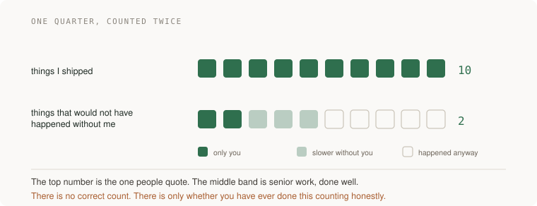

# 16 · Scope and leverage — five projects

> Staff tier · each one an afternoon · read [the section](../../../curriculum/04-scale-and-evolution/05-technical-decisions/scope-and-leverage.md) first

These five are not like the others. There is almost no code in them, and the
deliverable is usually a page, a conversation, or a decision you can point at
later. That is the section's argument made into work: past senior, what you are
measured on stops being what you built and starts being what changed.

They are also the five that are easiest to skip, because none of them produces
the satisfying feeling of a passing test. Do them anyway — the feedback loop on
staff work is measured in quarters, which is exactly why it needs deliberate
checks instead of a sense of productivity.

Three of them use your AWS account as the evidence base, because a staff claim
without evidence is an instinct, and most of the evidence for your system's
structural problems is already sitting in your account unread.



---

### 1. The three problems

*You end up with a ranked list of the three structural problems your system will have in a year, each with evidence, and one person who disagreed with your ranking.*

**Build**

Write down the three problems your system will have in twelve months. Not
bugs — structural ones. Rank them. Attach real evidence to each from your own
account and your own metrics. Then take the ranking to somebody who knows the
system and ask them where you are wrong.

**The thought process**

The first thing to get right is **the horizon**. A year out is deliberate: it
is long enough that today's bug list is irrelevant and short enough that you
can still be wrong in a checkable way. Ask what breaks at three times the
current load, what the team will not be able to change, and what costs will
have compounded.

Second, and this is the discipline that separates this from opinion:
**evidence, not instinct.** "The deploy process is painful" is a feeling.
"Deploys take forty minutes, we do four a week, and two of the last ten needed
a manual step" is a problem with a size. Staff instincts are usually right and
they get dismissed in rooms because they arrive without numbers, so the work is
converting the instinct into something a sceptical person can check.

Third: **rank, and be willing to defend the ordering.** Three problems with no
order is a list; three problems ranked is a claim about what should be worked
on first, and the ordering is where the disagreement lives. That disagreement
is the valuable part.

Fourth, the failure mode the section names: **chasing ghosts.** The problem
you saw at your last company is not automatically this company's problem. If
your three look exactly like your last three, that is worth noticing before
somebody else notices it for you.

Fifth: **go and get disagreed with, deliberately.** Long feedback loops plus a
deferential team is how people spend two years on the wrong thing while
everyone is polite. Pick the person most likely to say no.

**How to organise the prompts**

```
I think <the thing you believe is wrong> is the biggest technical
problem facing us. Interrogate that.

Ask me the five questions you would need answered to know whether it
is real, whether it is the biggest, and whether it is solvable in a
year. Do not offer solutions yet.
```

If it starts proposing an architecture, tell it to stop and answer again.
Making yourself answer five specific questions is the cheapest version of work
you would otherwise do badly in public.

```
Here is my system and here are the numbers I can measure: <data>.

Project them forward twelve months at our current growth rate. Which
constraints do we hit, in what order, and what is the earliest one?

Mark which projections you had to guess.
```

```
Here are my three, ranked: <list>. Argue for a different ranking.
Assume the person arguing is smarter than me and knows something about
this organisation that I do not.
```

```
Are any of these problems I brought with me rather than found here?
Ask me what evidence for each one came from this system specifically,
versus from my experience.
```

That last one is the ghost check and it is worth asking sincerely.

**On AWS**

Most of the evidence you need for this exercise already exists and nobody has
read it. Three tools in particular turn instinct into a defensible list, and
all three take under an hour.

The **AWS Well-Architected Tool** is the underused one. It walks your workload
through the six pillars and produces a list of high- and medium-risk items with
the reasoning attached. That is, quite literally, a structured way to generate
a ranked list of your system's structural problems, produced by a process
somebody else designed so it is harder to accuse of being your hobby-horse.
Run a review, then disagree with its ranking in writing — that disagreement is
your document.

**Cost Explorer** with a twelve-month trend, grouped by service, tells you
which line is compounding. A cost that doubles every two quarters is a
structural problem that will arrive on schedule, and it is the easiest kind of
claim to make to a room because the graph does the arguing.

**Service Quotas** tells you which ceilings you are approaching, and this is
the one that produces genuine surprises. Several of your real constraints are
not physics, they are account limits with lead times on raising them — and a
limit you discover the week you need it is an incident.

Add **Compute Optimizer** and **Trusted Advisor** for the right-sizing and
waste picture, and **CloudWatch** trends for the capacity picture from
[Design services from requirements to failure behavior](../../../curriculum/03-production/01-system-design/README.md)'s project 4. Between them you can
usually attach a number to all three of your problems in an afternoon, which is
the difference between a document people act on and one they nod at.

**What productionising it means**

The list is written down and dated, somewhere other people can find it. Each
problem has a number and a source. The ranking is explicit and has been
argued with at least once. And — this is the part that makes it a practice
rather than an exercise — you come back in six months and compare what actually
became urgent against what you predicted. That comparison is the only
calibration available for this kind of judgment and almost nobody collects it.

**The learning**

Staff work begins as an instinct and dies in rooms unless it arrives with
evidence. The habit worth building is not "have better instincts" — yours are
probably fine — it is converting an instinct into a checkable claim fast enough
that you can be argued with early, when being wrong is cheap.

**How you would know it is wrong**

- Check whether each problem has a number. The ones that do not are feelings wearing a document.
- Compare your three to the three you would have written at your last job. Overlap is a ghost warning.
- Find somebody who disagrees with the ranking. If nobody does, you asked people who agree with you.
- Run the Well-Architected review and compare its risks to your list. Where they differ, one of you is missing something.
- Come back in six months. This is the check almost nobody runs and it is the only real one.

---

### 2. The page that works without you in the room

*You end up with one page that somebody who did not build the system can read and then explain back to you correctly.*

**Build**

Take the top problem from project 1 and write the one-page case: why it
matters, what it costs to fix, what happens if nobody does. Then test it the
only way it can be tested — hand it to somebody who did not build this system,
leave, and have them tell you back what the problem is and why it is worth a
quarter.

**The thought process**

The first thing to understand is why one page and not five. **The constraint is
the point.** A page forces you to decide what the argument actually is, and the
decision of what to leave out is most of the thinking. A five-page version is
usually a one-page argument with the working shown, and the working is what
stops people reading.

Second, the test is unusual and it is the whole project: **can somebody act on
this without you present?** Being needed in every meeting is the opposite of
leverage. A document being used in a room you are not in is leverage in its
purest measurable form, and the only way to find out whether yours is that kind
of document is to be absent while somebody reads it.

Third, and it is the hardest instruction in this section: **when they get it
wrong, the page is wrong.** Not the reader. The reflex is to explain the bit
they missed, which feels like helping and is actually you being required in the
room again. Write down what they misunderstood and fix the page.

Fourth, on what goes in: the three things that carry the weight are the **cost
of not fixing it** (usually missing), **what it costs to fix** (usually
optimistic), and **who else is affected** (usually absent). Architecture
details are what people over-invest in and are the least load-bearing part.

Fifth: **write for the person who will decide, not for engineers.** If the
decision-maker is not technical, the page has to make the case in the units
they think in — risk, time, money, people — while remaining literally true.
That is not dumbing down; it is translation, and it is a skill.

**How to organise the prompts**

```
Here is the problem and my evidence: <from project 1>.

Write the one-page case. Structure: what is true today with numbers,
what happens in twelve months if nobody acts, what it would cost to
fix, and who else this affects.

Hard limit: one page. Tell me what you cut and why.
```

Asking what it cut is how you check whether the cuts were the right ones.

```
Now read it as <the person who will decide — a director, a product
lead, a CTO>. What do they not care about? What question do they ask
first that this page does not answer?
```

```
Rewrite the opening so the first two sentences carry the whole
argument, in case nobody reads past them. Some people will not.
```

```
My reader explained it back to me as <what they said>. Where did the
page mislead them? Do not explain the concept to me — tell me which
sentence caused it.
```

That last prompt enforces the rule. The question is never "how do I explain
this better in person", it is "which sentence failed".

**On AWS**

The cost-of-not-fixing-it half is where this usually falls down, and AWS gives
you the two most persuasive numbers cheaply.

**Cost Explorer** with a forecast, filtered to the services the problem
touches, produces a "here is what this costs us next year if nothing changes"
line. A graph with a slope is the single most effective artefact in a room full
of people who do not share your context.

**AWS Budgets** turns the same number into something that arrives without being
requested, which is a small and surprisingly effective piece of leverage: a
monthly email that says the thing you have been saying means you stop being the
only person who knows.

For the what-it-costs-to-fix half, be specific about the AWS-shaped costs that
get forgotten — a migration's dual-running period where you pay for both
(see [Migrate live systems and verify recovery](../../../curriculum/04-scale-and-evolution/04-migrations/README.md)), a quota increase with a lead time,
a reserved commitment you would be breaking. Those are the items that turn an
estimate from optimistic to credible, and including one you are not required to
include is how a document earns trust.

**What productionising it means**

The page lives where decisions are made rather than in your notes. It has a
date and an owner. It gets revised when someone misreads it rather than
explained. And the test gets rerun with a new reader after a significant
rewrite, because a page you have edited three times is a page only you can
still read.

**The learning**

The measure of a staff document is not whether it is correct — it is whether
somebody can act on it while you are somewhere else. That reframing changes
what you write: less architecture, more consequence, and a ruthlessness about
the first two sentences, because most readers will not get past them and the
argument has to survive that.

**How you would know it is wrong**

- Have somebody read it without you and explain it back. If they cannot, the page is not finished.
- Check whether the cost of *not* fixing it is on the page. It is the most commonly missing element and the most persuasive one.
- Count the sentences about architecture versus consequence. If architecture wins, you wrote for yourself.
- Read the first two sentences alone. If the argument is not in them, it is not in the document for most readers.
- Notice whether you explained something out loud during the test. Every explanation is a sentence the page owes.

---

### 3. Who loses

*You end up with a list of the people your proposal makes worse off, what each loses, and one change you made to the proposal because of a conversation you had before the review.*

**Build**

Map every team or role your proposal makes harder. Write what each of them
loses, in their words rather than yours. Rank the objections by how likely they
are to stop the project. Then go to the top two people *before* the review, and
record what changed as a result.

**The thought process**

The first idea is uncomfortable and true: **every proposal worth making costs
somebody something.** A change that is free for everyone was not worth writing
a document about. So the question is not whether there is opposition, it is
whether you have found it before it finds you.

Second, the reason this is a project rather than a habit: **an objection raised
in review is a cheap early warning that the project itself will slip.** The
review is where you learn it; the corridor two weeks earlier is where you can
still do something about it. Most of what "being in the room" means in practice
is having had the conversation before the room.

Third: **write what they lose in their words, not yours.** "They will have to
migrate" is your framing. "Their team spends a quarter on work that produces
nothing their users can see, during the quarter they were going to ship the
thing they have been promising" is theirs. If you cannot state the objection
better than they would, you have not understood it, and they will be able to
tell.

Fourth, the distinction that matters when you get there: **some objections are
about the proposal and some are about the sequencing.** A great many "no"s are
actually "not this quarter", and those are solvable by moving the work rather
than by winning the argument. Sorting them is the fastest way to turn opponents
into people who are merely busy.

Fifth, and this is the staff tiebreak from the section: **org-optimal beats
locally optimal**, and saying so out loud is part of the job. Sometimes the
right answer genuinely is that another team eats a cost for the organisation's
benefit. That conversation goes much better when you have already named what
they lose rather than minimised it.

**How to organise the prompts**

```
Here is my proposal. List the teams or roles whose work it makes
harder, what they lose, and the objection each would raise in review.

Rank them by how likely that objection is to stop this.
```

```
For the top two: write their objection as they would write it, in
their language, making the strongest version of their case. Assume
they have context I do not.
```

The strongest version is the one to prepare for. A weak steelman is visible
from across a meeting room.

```
For each objection, tell me which category it is: a genuine problem
with the proposal, a sequencing problem, or a cost that somebody has
to bear for the organisation's benefit.

The three have different responses — give me each.
```

```
I spoke to <person> and they said <what they said>. What should
change in the proposal, and what should I refuse to change and why?
```

Asking what to refuse matters. A proposal that absorbs every objection becomes
a compromise nobody wanted, which is its own failure mode.

**On AWS**

The AWS-shaped version of "who loses" is worth naming explicitly because it is
concrete and frequently missed: **shared infrastructure means your proposal has
neighbours.**

If your change affects an account everyone uses, the losers are named in the
account structure. Does it consume a **Service Quota** that is shared — Lambda
concurrency, VPC elastic IPs, API Gateway request rate — so your growth becomes
somebody else's throttling? Does it add cost to a shared line item that another
team is judged on? Does it change a **VPC**, a **Transit Gateway**, a shared
**RDS** instance, or a security group somebody else depends on?

**Cost allocation tags** and **Cost Explorer** grouped by team tell you whose
budget absorbs your change, and that is a conversation much better had in
advance. **IAM Access Analyzer** and **CloudTrail** tell you who is actually
using a resource you plan to change — which is regularly a longer list than the
documentation suggests, and each name on it is somebody who will find out the
hard way otherwise.

If the answer to several of these is "we would not have known", that is itself
a finding worth a separate proposal: an account-per-team structure under
**AWS Organizations** exists precisely so that one team's growth is not another
team's incident.

**What productionising it means**

The objection map is part of the proposal document, not a private note — the
"alternatives considered" section's cousin, and it does the same credibility
work. Conversations happen before reviews as a habit rather than for important
proposals only. What changed because of each conversation is recorded, because
that record is what makes people willing to have the next one. And the things
you refused to change are recorded too, with reasons.

**The learning**

Opposition is information arriving early, and treating it as an obstacle is how
staff engineers get surprised in reviews by people who were never consulted.
The reframe that makes the job easier is that you are not trying to win the
review — you are trying to have already had the disagreement somewhere cheaper.

**How you would know it is wrong**

- If your list of who loses is empty, the proposal is either trivial or you have not looked.
- Read your version of their objection to them. If they improve it, you had not understood it.
- Check whether any objection is really about sequencing. Those are the cheap wins and they hide inside "no".
- Ask what you refused to change. A proposal that absorbed every objection is a compromise nobody asked for.
- Count how many of the affected people heard about this from you rather than from the review.

---

### 4. The snacking audit

*You end up with a ratio, and with one piece of work you declined in a way that left it getting done by somebody for whom it was growth.*

**Build**

List the last ten things you worked on. For each, answer honestly: would this
have happened without you, would it have happened slower, or would it have
happened anyway. Compute the ratio. Then decline one piece of incoming work
that is beneath your leverage — and hand it to somebody for whom it is a step
up, deliberately, with support.

**The thought process**

The first idea is the trap the section names, and it is a trap specifically for
people who are good at the work: **snacking.** Picking easy, satisfying,
low-impact work because it feels productive. It is not laziness — it is the
opposite. It is the pleasure of doing something well, applied to things that
did not need you, and it is invisible from the inside because you are shipping.

Second, the honest instrument: **the counterfactual, item by item.** "Would
this have happened anyway" is a brutal question and it is the one the ladder is
actually asking. Most people find a number they do not like the first time, and
that is the point — there is no correct ratio, only whether you have ever
counted.

Third: **declining is a skill with a technique.** "No" is not the move. The
move is to say no in a way that leaves the work getting done by somebody for
whom it is growth, which means naming the person, telling them why you thought
of them, and being available when they get stuck. Done badly this is dumping;
done well it is the cheapest sponsorship there is.

Fourth, the honest caveat about **glue work.** Some of the low-counterfactual
work is coordination, unblocking and quiet repair, and it is genuinely
necessary. Tanya Reilly's finding is that the people who do it are
disproportionately told they lack technical contribution, and that women do
measurably more of it. The response is not to stop — it is to do it visibly and
credited as leading, or to do less of it. Which of the two is a real choice and
you should make it on purpose.

Fifth: **preening is the other failure and it is harder to see**, because it
looks like impact. The demo that impresses and changes nothing. The
refactor everybody admires that nobody needed. Ask of each item not "did people
notice" but "what is different now".

**How to organise the prompts**

```
Here are the last ten things I worked on, with rough time spent:
<list>.

For each, ask me the questions you need to classify it as: would not
have happened without me, would have happened slower, or would have
happened anyway. Do not classify until you have asked.
```

Making it ask rather than assume is what stops this becoming a flattering
summary of your own descriptions.

```
Now classify, and give me the ratio. Then tell me which items look
like snacking and which look like preening, and say why for each.
```

```
Of the "would have happened anyway" items, which were glue work —
coordination, unblocking, repair? For those, tell me the visible,
credited version of the same contribution.
```

That reframing is more useful than "stop doing it", because a lot of it is
load-bearing.

```
Here is a piece of work heading towards me: <describe it>. Who on my
team would grow from it, what would they need from me to succeed, and
how do I hand it over without it reading as dumping?

Write what I would actually say.
```

**On AWS**

The version of this that applies to the account, and it is a real source of
leverage: **the work you keep doing because only you can is usually a paving
problem.**

If you are the person who sets up IAM roles, or who knows the deploy
incantation, or who is asked every time somebody needs a new environment, that
is ten counterfactually-necessary tasks a quarter and none of them is staff
work. The staff move is to make it not require you: a **Service Catalog**
product or a **CDK** construct or a **CloudFormation** template that anybody
can stamp out, with the guardrails built in via **Organizations** service
control policies and **Config** rules so that the safe path is also the easy
one.

That is the concrete form of leverage in an AWS estate: the difference between
being the person who creates the account correctly and being the person who
made creating an account correctly the default. The first is ten satisfying
tasks a quarter. The second is one piece of work that removes them permanently
and shows up in your counterfactual column for years.

If you want a single candidate, look at whatever request arrives in your
messages most often. It is almost always paveable.

**What productionising it means**

The counterfactual audit is repeated — quarterly is enough — and the ratio is
tracked rather than computed once. Declining is a habit with a script, not an
agonised decision each time. Glue work is either visible and credited or
consciously reduced. And the recurring requests get paved, so the ratio
improves structurally rather than through willpower.

**The learning**

Being busy and being effective diverge somewhere around the senior level, and
the divergence is invisible from the inside because both feel like shipping.
The counterfactual is the only instrument that separates them, and running it
honestly once is usually uncomfortable enough to change what you pick up next
quarter.

**How you would know it is wrong**

- Compute the ratio. If everything you did was counterfactually necessary, you classified generously — ask someone else to do it.
- Look for preening specifically. Impact and applause are different measurements and the second is easier to get.
- Check whether the work you declined actually got done. If it died, that was not delegation.
- Ask what request arrives in your messages most often. If you have not paved it, you are choosing to keep doing it.
- Count your glue work and decide, out loud, whether you are doing it visibly or doing less of it. Drifting is the failure.

---

### 5. Sponsorship, once, on purpose

*You end up with a name, an opportunity they got because of you, and an honest account of what it cost you.*

**Build**

Pick one person. Pick one specific opportunity — a project, a talk, a room, a
promotion packet — that they would not get by default. Spend your credibility
to put them in it. Then support them through it. Write down what it cost you,
because it costs something.

**The thought process**

The first distinction, and the section is blunt about it: **mentorship is
advice and sponsorship is spending your own credibility.** Most guides say
"mentor more". The ladders reward the other one. Mentorship is cheap and
comfortable — a coffee, an opinion, a code review. Sponsorship means putting
your name on somebody else's chance, and being partly wrong about them in
public if it goes badly.

Second: **it has to be specific.** "I support her career" is not sponsorship.
"I proposed her for the migration lead and argued for it when it was
questioned" is. The specificity is what makes it real and it is also what makes
it uncomfortable, which is the same thing.

Third, the asymmetry worth understanding: **you are spending a resource that
regenerates and they are receiving one that compounds.** Your credibility
recovers; their having led something does not un-happen. That asymmetry is why
this is one of the highest-leverage things available to a staff engineer and
why it is under-done.

Fourth, and this is the part people get wrong: **sponsorship does not end at
the nomination.** Putting somebody in a room they are not ready for, without
support, is not sponsorship — it is a test you set them. The commitment is to
the outcome: prepare them, be available, and intervene if it is going badly,
without taking it back.

Fifth, be honest about **who gets sponsored by default.** People sponsor those
who remind them of themselves, which means the default distribution of this
particular resource is not neutral. Choosing deliberately is most of the work,
and noticing who you were *about* to choose is a useful thing to be honest with
yourself about.

**How to organise the prompts**

This project is the least promptable in the guide, which is itself informative —
a model cannot do your politics. What it is good for is the preparation.

```
I want to sponsor <person> for <opportunity>. Help me make the case:
what evidence of theirs supports it, what the obvious objection will
be, and what I should say when somebody asks "are they ready".

Do not soften the objection.
```

```
What would this person need from me to succeed at it, beyond being
chosen? Give me a concrete list — what I should prepare with them,
what I should be available for, and where I should NOT step in.
```

That last clause is the one that keeps it sponsorship rather than
co-ownership.

```
If this goes badly, what do I own and what do they own? Write the
sentence I would say in that meeting.
```

Deciding this in advance is what lets you actually back them when it is
awkward.

```
Who was I about to pick before I thought about it, and what does that
say about the criteria I am using without noticing?
```

**On AWS**

The ownership-shaped version, since this tier's work is mostly about what
outlasts you: **give somebody real ownership of a real thing, with real
permissions.**

That has a concrete meaning in an AWS estate. Make them the named owner of a
service — the on-call, the cost line, the **Well-Architected** review, the IAM
role, the runbook. Ownership without permissions is responsibility without
authority, and it is the commonest way a stretch assignment quietly fails: the
person is accountable for a system they have to ask you to change.

If you are wary — and a bit of wariness is reasonable — the answer is a
**permissions boundary** or a separate account under **Organizations**, not a
narrower role. Give them the whole thing inside a fence, rather than a piece of
it under supervision. The first grows somebody; the second teaches them to ask
you.

And then actually stop touching it. The thing that converts a nomination into
sponsorship is the month afterwards where you let them do it differently from
how you would have.

**What productionising it means**

You can name a person, an opportunity and an outcome. You know what it cost
you, in credibility or in time. You stopped doing the thing you handed over.
And you have noticed at least once who you were about to pick by default, which
is the check that stops this becoming a mechanism for reproducing yourself.

**The learning**

Mentorship is advice and costs you an hour; sponsorship is a bet and costs you
something that matters. The staff ladders reward the second one because it is
the only one that reliably changes somebody's trajectory — and because being
willing to spend credibility on somebody else is the clearest available signal
that you have some.

**How you would know it is wrong**

- Can you name the person and the specific opportunity? "I support people" is not sponsorship.
- Did it cost you anything? If not, you gave advice.
- Check whether they got the permissions along with the responsibility. Accountability without authority is a trap you set.
- Notice who you were about to choose before you thought about it.
- A month later, ask whether you have stopped touching the thing you handed over. If not, they are still assisting you.
