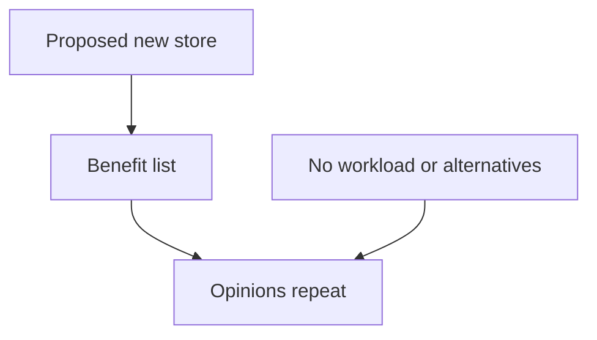
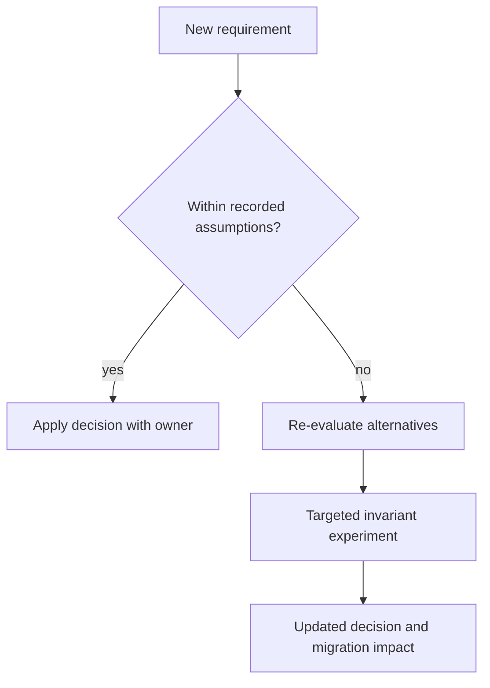
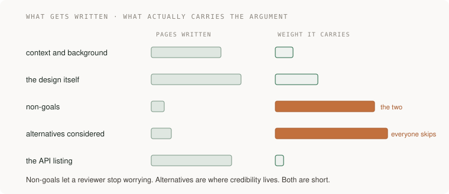
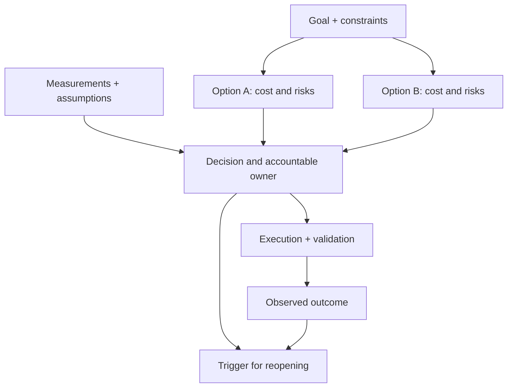

# 17 · Writing that decides

> Staff tier · feeds **P5 (it changes safely)**

## At the whiteboard

> “A team proposes replacing a relational database with a key-value store.
> The document lists benefits but never names a workload or alternative. What
> would you need in order to approve, reject, or narrow the proposal?”

A decision document records why one choice fits a stated problem. Its expected
output is a decision with assumptions and an accountable next action.

| Constructed requirement | Evidence the document needs |
|---|---|
| Point reads must meet a measured latency target | Current baseline and representative test |
| Two related records must change together | Exact transaction or invariant boundary |
| Team has one month | Migration, operational, and rollback effort |
| Existing system may already suffice | Strongest version of the keep-and-improve alternative |



## Make the decision reviewable

1. State the current failure and non-goals. A technology preference is not the
   problem statement.
2. Compare the existing design, an incremental repair, and replacement against
   the same workload, correctness, operational, and delivery constraints.
3. Name the assumption with the largest consequence and a cheap test that could
   invalidate it. Put evidence beside the claim it supports.
4. Record decision owner, dissent, review date, rollout stages, and kill criteria.
   Approval is not evidence that the hypothesis remains true forever.

**Follow-up:** “A new access pattern needs a cross-record invariant.” Redraw the
decision path: does new evidence fit the decision's scope or trigger review?



Practice defending the rejected alternative first. Lead depth appears in how
the document coordinates affected teams and keeps compatibility work owned.

## The one-liner

At staff level the artefact is usually a document, and the document has one job:
**cause a decision, and make it stay decided.** A design doc that only describes
a design has failed at the thing it was for, however good the design is.

## The failure it prevents

A team spends three weeks arguing about a datastore. Somebody eventually
decides, in a meeting, and the work starts. Four months later a new engineer
asks why they are using that datastore, nobody can reconstruct the reasoning,
and the argument runs again from the beginning — this time with less information,
because the people who held the context have moved on.

Nothing was written down. Or something was written down and it was a
description: here are the services, here are the endpoints, here is the schema.
All true, all useless, because none of it says **what else was considered and
why it lost.**

The cost of that is not the three weeks. It is that the decision has to be
re-made every time it is questioned, forever, and it gets cheaper each time to
just change it.

## The mental model

A design doc is not a specification and it is not documentation. It is an
argument, written down before the work, aimed at the people who could stop it or
be harmed by it.



The convention most widely copied is Google's, described publicly by Malte Ubl:
informal, typically three to twenty pages, written **before** the code. Context,
goals and non-goals, the design, alternatives considered. The trade-offs are the
content. An API listing is not a design doc; it is the appendix of one.

Two parts do almost all the work, and both are the parts people skip.

**Non-goals.** What you are deliberately not doing. This is the single highest
value paragraph in the document, because it is what lets a reviewer stop
worrying. Without it every reader supplies their own scope and objects to
something you never intended to build.

**Alternatives considered.** Where the credibility lives. If you cannot argue
the rejected option better than its advocates would, you have not finished
deciding — you have finished preferring. A weak steelman is visible from a long
way off, and it is the fastest way to lose a room.

### The RFC, which is the same thing with a process attached

At organisations past a certain size the document gets a lifecycle: a template,
**named approvers** rather than a vague audience, and a broadcast so people who
would be affected can object before rather than after. Uber's engineering
writing describes scaling exactly this from tens to thousands of engineers.

The detail worth internalising: **disagreement during review is cheap early
warning that the project itself will slip.** It is not an obstacle to route
around. An objection that surfaces in week one costs an afternoon; the same
objection in month four costs the project.

*(Read from published engineering writing on 2026-09-21.)*


## What good looks like

- A reader who was not in any of the conversations can say back what is being decided and why.
- There are non-goals, and they are specific enough to be disappointing to somebody.
- The rejected alternatives are argued at their strongest, with a named reason each lost.
- The approvers are named people, and they know they are approvers.
- It is short enough to be read in one sitting by someone who did not want to read it.
- Somebody changed their mind because of it. That is the only real success condition.

Done badly:

- A description of the design with no alternatives, which reads as "I already built this in my head."
- Non-goals missing, so the review is about scope rather than about the decision.
- Written after the implementation, to document rather than to decide.
- Circulated to "the team" rather than to people, so nobody is accountable for reading it.
- So long that the objections arrive from people who only read the first page.
- Passive voice covering who decided and who is responsible.

## Ask Claude for this

**Request 1 — the steelman, written against you**

```
Here is my proposal and the alternative I rejected.

Argue for the alternative as strongly as you can. Assume its advocate is
better informed than me. What do they know about the constraints, the
team, or the cost that I have not accounted for?

Do not balance it. Argue one side.
```

*Why it is asked that way:* "do not balance it" is the whole instruction. A
model's default is a fair-minded comparison table, which is exactly the thing
that makes an alternatives section weak. You want the argument you will actually
face in the room.

*What you should get back:* at least one point you had not considered. If there
is nothing, either the alternative really is bad — say so plainly in the doc and
why — or you have not given it enough context to argue with.

**Request 2 — find the objections before the meeting**

```
Here is the document. List, by role or team, everyone whose work this makes
harder. For each: what they lose, the objection they will raise, and how
likely that objection is to stop this.

Then tell me which one I should go and talk to before I send it.
```

*Why:* the last question converts analysis into an action, and going to that
person first is most of what being effective at staff level actually looks like.
A document that surprises someone whose work it damages will be fought on
principle rather than on merit.

**Request 3 — cut it without losing the argument**

```
This document is too long. Cut it by 40% without removing any
non-goal or any alternative.

Tell me what you cut and what you think was load-bearing that I will
disagree about losing.
```

*Why:* protecting the two sections that carry the weight forces the cuts to come
out of the parts people over-write — background, implementation detail,
restatements. The second sentence is what makes it a review rather than a
compression.

**What to keep for yourself:** the decision. Do not ask a model which option to
pick. It will answer, fluently, and you will have outsourced the only part of
the document that was yours.

## How you would know it is wrong

1. **Give it to someone outside the project and ask them to state the decision back.** If they cannot, the document is wrong, not the reader.
2. **Check there is a non-goal that disappoints somebody.** A non-goals list everyone is happy with is not a scope, it is a formality.
3. **Show the alternatives section to somebody who prefers one of the rejected options.** If they say "that is not why I would have argued for it", you have a strawman.
4. **Count the named approvers.** If the answer is zero, nothing is being decided, whatever the document says.
5. **Look for the decision in passive voice.** "It was decided" means nobody decided. Find the sentence with a person in it.
6. **Six months later, go back and read it.** Did the thing that actually went wrong appear anywhere in it? That is the only real calibration you will ever get, and almost nobody collects it.

## Your slice of the project

For **P5**, write the design doc for the migration before you touch anything:

- Context: what exists now and why it is a problem, with a number in it.
- Goals, and at least three non-goals.
- The design, briefly.
- **Two alternatives, each argued at its strongest**, with a stated reason each lost.
- The rollout plan and the kill criteria: what you will see that makes you stop.
- Named approvers.

Keep it under four pages.

**Acceptance criteria:**

- Somebody who has not seen your system reads it and tells you back what is being decided, what is out of scope, and what you rejected.
- You can point at a sentence you changed because of a review comment. If nothing changed, either it was perfect or nobody really read it, and it is not the first one.

## Words you now own

- **design doc** — a written argument for a decision, made before the work, aimed at the people who could stop it.
- **non-goal** — something deliberately out of scope. The highest-value paragraph in the document.
- **alternatives considered** — the rejected options, argued honestly. Where credibility lives.
- **steelman** — the strongest form of the argument against you.
- **RFC** — a design doc with a process: template, named approvers, broadcast, a window for objection.
- **approver** — a named person accountable for reading and deciding. Not "the team".
- **kill criteria** — what you will observe that makes you stop. Decided in advance, when you are calm.
- **the passive voice problem** — writing that hides who decided and who is responsible.

---

**Not covered here:** strategy and vision, which are what you get when you have
written five of these and notice the same controversial decision recurring —
that is **18 · Technical strategy**. Postmortems are writing that decides too,
but they belong with **20 · Risk and incidents** because they are written under
different pressure.

[Choose your learning path](../../../paths/README.md) · [Interview applications](../../../paths/interviews/README.md)

## Draw it from memory · Keep alternatives and reversal conditions visible



**Redraw challenge:** Change one assumption. Can a reader tell whether it reverses the decision?
