# 17 · Writing that decides — five projects

> Staff tier · each one an afternoon · read [the section](../../../curriculum/04-scale-and-evolution/05-technical-decisions/design-documents.md) first

Five projects that produce documents with a job. The test for every one of them
is the same and it is not "is this well written" — it is whether somebody who
was in none of the conversations can read it, say back what is being decided,
and act on it while you are elsewhere.

Four of the five end in a conversation with a real person, because a document
that nobody argued with has not been read. The fifth is the calibration almost
nobody collects.



---

### 1. The document that causes a decision

*You end up with a design doc under four pages that somebody read, argued with, and then agreed to — and a sentence in it that changed because of a review comment.*

**Build**

Take a real decision you are about to make. Write the design doc before doing
the work: context with a number in it, goals, at least three non-goals, the
design briefly, two alternatives argued at their strongest, and named
approvers. Send it to people, not to "the team". Then point at what changed.

**The thought process**

The first reframing is the section's whole argument: **this is not a
description, it is an argument aimed at the people who could stop it.** A
document that describes your design has failed at its job however good the
design is, because the job is to cause a decision and make it stay decided.

Second, the proportions are counterintuitive. **The API listing is the appendix,
not the document.** The two sections that carry the weight — non-goals and
alternatives considered — are the two people skip. If your draft is 70%
implementation detail, you have written documentation before the code, which is
an odd artefact with no audience.

Third: **name the approvers, as people.** "The team" is nobody. A named
approver who knows they are an approver is a person accountable for reading it,
and the count of those is the honest measure of whether anything is being
decided. Zero named approvers means the document is a blog post.

Fourth, on length: **short enough to be read in one sitting by somebody who did
not want to read it.** This is the actual constraint. Long documents generate
objections from people who read the first page, which is the worst possible
review — confident and uninformed, and you cannot tell it apart from the
informed kind.

Fifth, the success condition, and it is a hard one: **somebody changed their
mind.** Either you changed theirs, or they changed yours. A document that
produced unanimous immediate agreement was either uncontroversial — in which
case why write it — or unread.

**How to organise the prompts**

```
Here is the decision I am making and what I know: <context>.

Draft the document as: context with a number in it, goals, non-goals,
the design briefly, alternatives considered, rollout, approvers.

Do not write the alternatives section yet — leave it as a heading. I
want to write that one first and separately.
```

Holding the alternatives back is deliberate. It is the section that carries the
credibility and the one you should not receive pre-formed.

```
This document is too long. Cut it by 40% without removing any
non-goal or any alternative.

Tell me what you cut and what you think was load-bearing that I will
disagree about losing.
```

Protecting the two heavy sections forces the cuts out of background,
restatement and implementation detail — which is where the fat always is.

```
Read this as somebody who has never seen the system. What are you
unsure about after reading it, and what would you ask in the review?
```

```
Find every sentence in the passive voice where a decision is being
made. Rewrite each with a person in it.
```

"It was decided" means nobody decided, and passive voice around decisions is
the most reliable signal that a document is avoiding something.

**What to keep for yourself:** the decision itself. Do not ask a model which
option to pick. It will answer, fluently, and you will have outsourced the only
part that was yours.

**On AWS**

Two things make an AWS-shaped decision document better than a generic one.

First, **price the reversal, not just the choice.** Choosing DynamoDB over RDS
is not a hard decision on day one and is an expensive one to undo at year two,
because the access patterns have been designed around it. Choosing a region is
nearly free now and is a migration later. Choosing a managed service over
self-hosting is easy to reverse; choosing a proprietary one with no equivalent
elsewhere is not. A sentence in your document saying what it would cost to
change your mind in eighteen months is worth more than a page of comparison,
and it is the sentence reviewers remember.

Second, **use the existing frame when there is one.** The
**Well-Architected Framework**'s six pillars are a serviceable checklist for
"what did I not consider" — operational excellence, security, reliability,
performance efficiency, cost optimisation, sustainability. Running your design
past them before review catches the dimension you forgot, which is usually
operations or cost. It is not a substitute for thinking; it is a cheap way to
find the thing you would have been asked about.

And where the document lives matters more than people admit. A decision record
committed next to the code — an `adr/` or `docs/decisions/` directory — is
found by the person who asks "why is this a queue" in fourteen months. The same
document in a wiki is not.

**What productionising it means**

Documents live in the repository, dated, with an owner and named approvers.
There is a template so nobody has to invent the structure at 5pm. There is a
broadcast so affected people can object before rather than after, and a stated
window for objection. And superseded decisions are marked as superseded with a
link forward rather than deleted — because the value of the old one is the
reasoning, and that survives the decision changing.

**The learning**

The document is the unit of work at staff level, and its job is to make a
decision stay decided. The specific thing that makes it stay decided is the
alternatives section, because it is what a future reader needs in order to not
re-run the argument from scratch with less information than you had.

**How you would know it is wrong**

- Give it to somebody outside the project and ask them to state the decision back. If they cannot, the document is wrong, not the reader.
- Count the named approvers. Zero means nothing is being decided.
- Find the sentence that changed because of a review comment. If there is none, either it was perfect or nobody read it, and it is not the first one.
- Check the ratio of implementation detail to trade-offs. If detail wins, you wrote an appendix.
- Search for passive voice around decisions. Every instance is a person you did not name.

---

### 2. The steelman that changes your mind

*You end up with an alternatives section that somebody who prefers the rejected option recognises as their own argument — and ideally with a decision you reversed.*

**Build**

Take a decision you have already made. Argue the rejected alternative as
strongly as you can, assuming its advocate knows something you do not. Then
take that argument to somebody who actually prefers it and ask whether you got
it right. Revise until they say yes.

**The thought process**

The first standard, and it is higher than it sounds: **if you cannot argue the
rejected option better than its advocates would, you have not finished
deciding — you have finished preferring.** That is a genuinely demanding bar
and most alternatives sections fail it, which is why they read as box-ticking.

Second, the practical reason this matters more than fairness: **a weak steelman
is visible from a long way off and it is the fastest way to lose a room.**
Somebody who prefers the option you dismissed reads two sentences of your
characterisation, concludes you did not understand it, and now disbelieves
everything else in the document. You have spent your credibility on the
cheapest paragraph in it.

Third, the mechanism that makes this work: **assume the advocate knows
something you do not, and ask what.** Not "what are the pros" — that gets you a
list. The question is what a well-informed person could know about the
constraints, the team, the history or the cost that would make this the right
answer. That question produces information; the pros-and-cons framing produces
symmetry.

Fourth, and you should be prepared for it: **sometimes the steelman wins.** If
it does, that is the project succeeding, not failing, and the cost of finding
out here is one afternoon rather than one quarter.

Fifth: **verify with a human.** A model's steelman is a good draft and it does
not know what your colleague actually believes. The check is taking it to
somebody who prefers that option and asking whether you represented them.

**How to organise the prompts**

```
Here is my proposal and the alternative I rejected.

Argue for the alternative as strongly as you can. Assume its advocate
is better informed than me. What do they know about the constraints,
the team, or the cost that I have not accounted for?

Do not balance it. Argue one side.
```

"Do not balance it" is the whole instruction. The default output is a
fair-minded comparison table, which is exactly the thing that makes an
alternatives section weak.

```
Now attack MY option with the same energy. What is the strongest
argument that what I am proposing is a mistake — not a risk, a
mistake?
```

```
Which of those points do I actually have no answer to? Do not let me
off — if my answer is "we would monitor that", say that is not an
answer.
```

This is the prompt that finds the thing you have been avoiding. "We would
monitor it" and "we can always change it later" are the two escape hatches, and
both deserve to be closed.

```
Rewrite my alternatives section so that somebody who prefers the
rejected option would say "yes, that is my argument". Then tell me
which part of it I will be tempted to soften, and why I should not.
```

**On AWS**

The alternatives that need the strongest steelman in an AWS decision are
usually the two people are embarrassed to argue for.

**"Do not use the managed service."** Running Postgres on EC2 instead of RDS,
or Kafka on your own instances instead of MSK, is a real position with real
advantages — cost at scale, version control, no service-specific limits — and
it is routinely dismissed with "managed is obviously better" rather than
argued. Its advocate knows what the managed service's quotas and version
policies will cost you in three years. Write that down.

**"Do not use the new service."** The argument for the boring, older AWS
service over the newer, more elegant one is usually about documentation,
community answers to obscure failures, and the knowledge that its edge cases
have been found by somebody already. That is not conservatism, it is a real
purchase, and an alternatives section that cannot say so is not honest.

The reverse steelman is worth doing too: if you are choosing the boring option,
argue properly for the ambitious one rather than waving at risk. Both
directions have a version that gets dismissed instead of argued, and the
dismissal is where documents lose credibility.

**What productionising it means**

The alternatives section is written before the recommendation is finalised, not
after. Somebody who prefers each rejected option has read and endorsed the
characterisation. Each rejection has a *named reason* rather than a general
sense. And when the decision is revisited later — it will be — the section is
what makes the revisit a twenty-minute conversation instead of a three-week
argument.

**The learning**

The credibility of a technical argument lives almost entirely in how you
represent the position you did not take, because that is the only part a reader
can independently check. The practical consequence is that the alternatives
section deserves more of your time than the recommendation, which is the
opposite of how almost everyone allocates it.

**How you would know it is wrong**

- Show it to somebody who prefers the rejected option. "That is not why I would have argued for it" means you have a strawman.
- Check whether the steelman ever changed your mind about anything. If it never does, you are writing it after deciding.
- Look for "we would monitor that" and "we can change it later". Both are escape hatches, not answers.
- Count the named reasons each alternative lost. A general sense is not a reason.
- Ask whether the boring option got a fair hearing. It usually gets waved at rather than argued.

---

### 3. The non-goal that disappoints somebody

*You end up with three non-goals specific enough that a named person is disappointed by one of them — and you know who and why before the review.*

**Build**

Write the non-goals for your current proposal. Make them specific. Then find
out who is disappointed by each one, go and tell them yourself, and record what
they said.

**The thought process**

The first thing to understand is **why this is the highest-value paragraph in
the document.** Without non-goals, every reader supplies their own scope and
objects to something you never intended to build. The review becomes an
argument about what is in scope rather than about the decision, and you spend
the meeting saying "we are not doing that" — which is information that should
have been on page one.

Second, the quality test is unusual and exact: **a non-goals list everyone is
happy with is not a scope, it is a formality.** "We are not solving world
hunger" is not a non-goal. If nobody is disappointed, you have not actually
excluded anything anybody wanted, which means you have not scoped — you have
reassured.

Third: **there is a difference between "not now" and "not ever", and saying
which is kindness.** A non-goal that is really a sequencing decision should say
so, with what would have to be true to revisit it. A non-goal that is permanent
should say that too, because people will otherwise plan around a future that is
not coming.

Fourth, and this is the part that makes it a project rather than a paragraph:
**go and tell the disappointed person yourself, before the review.** They will
find out either way. Hearing it from you in a conversation is an objection you
can address; hearing it from a document in a meeting is a grievance.

Fifth: **the disappointment is information.** Sometimes you will find that what
you excluded is the thing that matters most to somebody whose support you need,
and that changes the proposal — or it changes who you need in the room. Either
way, better now. The objection cost curve is the whole argument for doing this
in week one.

**How to organise the prompts**

```
Here is my proposal. Draft the non-goals — specifically, the things a
reader might reasonably assume are in scope and are not.

For each, say who would be disappointed and what they wanted.
```

Pairing each non-goal with a disappointed party is what stops them becoming
platitudes.

```
Which of these non-goals are really "not this quarter" rather than
"not ever"? For those, write the condition under which we would
revisit — something observable, not "when we have time".
```

```
Rank the disappointed parties by how much their support matters to
this proposal. Which one should I speak to first, and what should I
open with?
```

```
For the most important one: what could I offer that costs me little
and matters to them? If the answer is nothing, say so — I would
rather know that before the conversation.
```

That last question is worth asking sincerely. Often there is a small
adjustment — an interface they can extend later, a sequencing promise — that
converts an objector into a supporter at almost no cost. Sometimes there is
not, and going in knowing that is better than improvising.

**On AWS**

Non-goals have a specific and underused form in infrastructure work: **the
capability you are deliberately not building yet, stated with the condition
that would change it.**

"This will be single-region. We will revisit multi-region when we have a
customer contract requiring an RTO under four hours" is a non-goal with a
trigger. So is "this stays on-demand DynamoDB pricing; we move to provisioned
when the monthly spend on it exceeds X and the traffic is predictable within
Y%". So is "no cross-account access; we revisit if a second team needs to read
this data."

The reason the AWS form works well is that the trigger can usually be an actual
alarm. A non-goal whose revisit condition is a **CloudWatch** alarm or an
**AWS Budgets** threshold does not depend on anybody remembering — the
condition fires and the conversation restarts by itself. That converts a
paragraph in a document into a mechanism, which is the most durable thing you
can do with a decision.

This also gives disappointed stakeholders something concrete: not "we might do
it later", but "here is the number, and when it is crossed this is
automatically back on the table". That is a much better answer than a promise.

**What productionising it means**

Every design document has non-goals and at least one of them disappoints
somebody. Non-goals distinguish "not now" from "not ever". "Not now" ones carry
an observable revisit condition, ideally wired to an alarm. And the disappointed
parties heard it from a person before they read it in a document.

**The learning**

Scope is defined by what you exclude, and excluding nothing is the most common
way a proposal becomes unreviewable. The uncomfortable corollary is that a good
non-goals section will make somebody unhappy — which is why writing them well
requires being willing to have a conversation you would rather avoid, in week
one, when it is cheap.

**How you would know it is wrong**

- Check whether any non-goal disappoints a real, named person. If not, you reassured rather than scoped.
- Look for "not now" non-goals with no revisit condition. Those are promises people will plan around.
- Ask whether the disappointed parties heard it from you or from the document.
- Count how much of your review was about scope. A lot means the non-goals were not specific enough.
- Check whether any revisit condition is wired to something that fires on its own. If they all depend on memory, they depend on you.

---

### 4. Kill criteria, written while calm

*You end up with the observable conditions under which you will stop — written before you start, agreed by somebody else, and wired to something that actually fires.*

**Build**

Before starting the work your document proposes, write what you would have to
observe to stop. Make each criterion observable rather than a judgment call.
Get somebody to agree to them. Then instrument them, so the condition can
announce itself.

**The thought process**

The first idea is about timing, not content: **you are writing these now
because you will not be able to write them later.** Once the work is underway
you will have spent effort, made public commitments, and told people it is
going well. Every one of those makes stopping harder, and none of them is
information about whether stopping is correct. The version of you who has not
started is the only one qualified to set the bar.

Second: **observable, not a judgment.** "If it is going badly" is not a
criterion. "If the migration of the first ten percent takes more than three
weeks" is. "If error rates on the new path do not reach parity within two weeks
of the first cohort" is. The test is whether two people looking at the same data
would agree the condition had been met.

Third, and this is what makes them real rather than decorative: **somebody else
has to agree to them.** Kill criteria you set alone are criteria you can
reinterpret alone, and you will, generously, at the exact moment they matter.
A named person who agreed in advance is the mechanism.

Fourth, the distinction worth drawing explicitly: **stop, pause, and
descope are different outcomes and deserve different triggers.** Most projects
that should have been descoped get either continued or abandoned, because
nobody wrote down the middle option. Writing three tiers gives the project
somewhere to go that is not binary.

Fifth: **wire them up.** A criterion that requires somebody to remember to check
is a criterion that will be checked once, early, when things are fine. One that
fires by itself is a decision that arrives whether or not anybody wants it.

**How to organise the prompts**

```
Here is what I am about to start: <the proposal>.

Write the kill criteria: what I would have to OBSERVE to conclude this
should stop. Each one must be something two people would agree on from
the same data.

Reject any criterion that requires a judgement call, and tell me which
of mine were judgement calls in disguise.
```

```
Now split them into three tiers: stop entirely, pause and reassess,
and reduce scope. Most projects need the third one and nobody writes
it.
```

```
For each criterion, tell me how it would be measured and whether it
could fire automatically. For the ones that cannot, tell me who checks
and how often.
```

```
Six months from now I will want to explain away each of these. For
each criterion, write the rationalisation I am most likely to reach
for — so I recognise it when I hear myself saying it.
```

That last prompt is unusual and it is the most useful one in this project. The
rationalisations are predictable — "the hard part is behind us", "we are nearly
there", "the new data is not comparable" — and seeing them written down in
advance makes them much harder to deploy on yourself.

**On AWS**

This is where kill criteria stop being a document and become a mechanism.

Most criteria worth having are metric thresholds, which means they can be
**CloudWatch alarms**. Error rate on the new path relative to the old, p99
latency during a migration, the count of rows still to backfill, the age of the
oldest message in the cutover queue — all of these are alarms, and an alarm
routed to **SNS** and into wherever your team talks is a kill criterion that
announces itself rather than waiting to be looked up.

For cost criteria specifically, **AWS Budgets** with a threshold and a
notification is exactly the right shape, and a **budget action** can go further
and actually stop something. "If the dual-running cost exceeds X for two
consecutive months, we stop and reassess" is a sentence you can implement
rather than intend.

For progress criteria, put the number on a dashboard that a person who is not
you looks at. A **CloudWatch dashboard** with "percentage migrated" and "days
elapsed" side by side is the cheapest possible honesty mechanism, because the
two lines diverging is visible to everybody at once and cannot be narrated away
in a status update.

And a note that connects this to [Migrate live systems and verify recovery](../../../curriculum/04-scale-and-evolution/04-migrations/README.md): the most
important kill criterion in a migration project is usually about the
*dual-running period*, because that is where the cost lives and where the
abandonment happens. Write that one first.

**What productionising it means**

Kill criteria are in the design document, not in a side note. They are
observable and at least some of them fire automatically. A named person agreed
to them before work started. There are three tiers, not one. And when one
fires, the conversation that follows is about which tier applies — not about
whether the criterion was reasonable, because that was settled while everyone
was calm.

**The learning**

The decision to stop is made under conditions that systematically favour
continuing — sunk effort, public commitment, optimism about the remaining
work — which is why it has to be made in advance by somebody who has none of
those. Writing kill criteria is not pessimism; it is delegating a decision to
the only version of you qualified to make it.

**How you would know it is wrong**

- Read each criterion and ask whether two people would agree from the same data. If not, it is a judgement wearing a threshold.
- Check that somebody else agreed in advance. Criteria you can reinterpret alone are not criteria.
- Look for the descope tier. If everything is stop-or-continue, the project has nowhere to go but the extremes.
- Check which criteria fire on their own. The rest depend on somebody remembering during the month they least want to.
- Write the rationalisations you will reach for. If you cannot think of any, you have not imagined the project going badly.

---

### 5. The document, read again six months later

*You end up with a calibration: whether the thing that actually went wrong appeared anywhere in what you wrote.*

**Build**

Find a design document that is at least six months old — one of yours, or a
public RFC or ADR from a project whose outcome you can now see. Read it knowing
what happened. Then answer one question honestly: did the thing that actually
went wrong appear anywhere in it?

**The thought process**

The first thing to say is why this is worth an afternoon: **it is the only
calibration available for this kind of judgment, and almost nobody collects
it.** Every other check in this section tells you whether the document is good
*now*. This one tells you whether your predictions about systems are any good,
which is the underlying skill and which you otherwise get no feedback on at all.

Second, the specific thing to look for: **not whether you were right, but
whether the failure was in the space you considered.** A document that named
the risk and got the probability wrong is a good document. A document where the
actual failure is not mentioned anywhere, in any section, is telling you about
a blind spot — and blind spots are stable, so it is probably still there.

Third, the useful classification of what you find. The failure was either: in
the risks you listed (you saw it, mis-weighted it), in the alternatives you
rejected (the other option would have avoided it), in the non-goals (you
excluded the thing that mattered), or **nowhere** (the interesting case).
Nowhere is where the learning is.

Fourth, and this makes the project possible even without your own old document:
**public RFCs work.** Open-source projects with long-lived design documents —
Rust RFCs, Kubernetes KEPs, Python PEPs, database engine design docs — have
visible outcomes. Reading one written before a feature shipped, then reading
the issues filed afterwards, is the same exercise with somebody else's
judgment, and it is easier to be honest about.

Fifth: **write down what you would add to your template.** The output of this
project is not a feeling, it is a change to how you write the next one. If your
blind spot was operational cost, your template gets a section. That is the
mechanism by which calibration turns into improvement.

**How to organise the prompts**

```
Here is a design document from <date>. Here is what actually happened
afterwards: <the outcome, the incidents, the rework>.

For the main thing that went wrong: find where, if anywhere, it
appears in the document. Quote it, or say plainly that it does not
appear.
```

Demanding a quote or an explicit "it does not appear" is what stops the answer
being a charitable reconstruction.

```
Classify it: was this in the risks I listed, in an alternative I
rejected, excluded by a non-goal, or absent entirely?

If absent, what category of concern does it belong to, and is that
category systematically missing from how I write?
```

```
Look at my other documents: <links or text>. Does the same category go
unmentioned in those too? I want to know if this is a pattern or a
one-off.
```

That is the prompt that turns one data point into a blind spot, which is the
actual deliverable.

```
Write the section or the checklist item that would have caught this,
phrased so it applies generally rather than to this specific
incident.
```

**On AWS**

Reading your own history has a literal form here, and it is more available than
people realise.

**CloudTrail** and your infrastructure repository's git log together tell you
what actually changed and when — which is frequently different from what the
document said would change. Comparing "what we said we would build" to "what
got created" is a fast, concrete version of this project, and the gaps are
informative: the resources nobody mentioned, the service that quietly replaced
the one in the design, the security group that grew.

**Cost Explorer** over the same period tells you whether the cost estimate in
the document was right, and this is the one that is wrong most often and most
usefully. Most design documents either omit cost or state it optimistically,
and comparing the estimate to the twelve months of actual spend is a
calibration you can do in ten minutes and will remember for years.

And if you ran a **Well-Architected** review at design time, re-run it now. The
risks it flagged then, against what actually happened, is a ready-made version
of this exercise with somebody else's checklist — which is useful precisely
because it is not your blind spot.

**What productionising it means**

Reading old documents against outcomes is a scheduled habit, not a
retrospective impulse — quarterly, on whatever is six months old. Findings
change the template rather than being noted and forgotten. Superseded documents
stay in the repository with their reasoning intact, marked superseded, because
the whole exercise depends on the old reasoning still being readable. And the
comparison between estimated and actual cost is done every time, because it is
the cheapest and most reliably wrong prediction in the document.

**The learning**

Staff judgment is a prediction skill with a feedback loop measured in quarters,
which means it does not improve on its own — most people make the same category
of misjudgment for years because nothing ever tells them. The habit of reading
your own old documents against what happened is the only mechanism that closes
that loop, and it costs one afternoon a quarter.

**How you would know it is wrong**

- If the actual failure does not appear anywhere in the document, that is the finding. Do not reconstruct a charitable reading.
- Check more than one document for the same gap. One miss is noise; three is a blind spot.
- Compare the cost estimate to the actual spend. This is the prediction that is wrong most often and is easiest to check.
- Ask what changed in your template as a result. If nothing did, you had an interesting afternoon rather than a calibration.
- Notice if you find yourself arguing that the failure was unforeseeable. Sometimes it was. Usually somebody foresaw it and it was not you.
