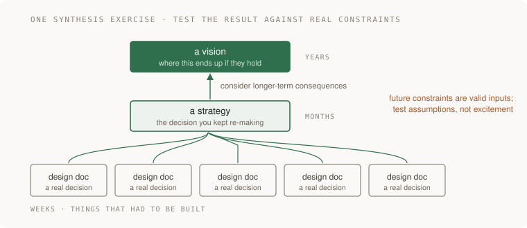

# 18 · Technical strategy

> Staff tier · feeds **P5 (it changes safely)**

## The one-liner

Strategy is not a plan and it is not a wish. It is the small set of decisions
you have made in advance so that a hundred later decisions do not each have to
be argued from scratch. The counterintuitive part is that you do not write it by
thinking about the future. You write it by noticing what you keep arguing about.

## The failure it prevents

An organisation without a technical strategy does not notice it is missing one.
What it notices is that everything takes longer than it should.

Every new service picks its own datastore, so there are five. Every team solves
authentication slightly differently, so there are five of those too. Somebody
proposes a shared platform; it is half-built and abandoned because nobody
decided it was the way. Each individual decision was locally defensible and made
by a competent person, and the sum is an organisation that cannot move because
every move requires re-litigating three things.

The other failure is the opposite and looks more impressive: a strategy document
written top-down, full of ambition, that nobody uses. It describes a future
nobody can act on from where they are standing. It gets referenced in
presentations and never in a code review, which is the only place it would have
mattered.

## The mental model

The method that works is bottom-up, and Will Larson's version of it is the one
worth copying.



**Write five design docs first.** Real ones, about real decisions, each made
because something actually had to be built. Then read them together and look for
the decision you keep making — the same trade-off appearing in three of them,
argued each time from nothing.

**That recurring decision is your strategy.** Write it down once, with its
rationale, so the next three documents can cite it instead of reopening it. A
strategy is a decision made once and reused, and its value is precisely the
arguments it prevents.

**Then five strategies, extrapolated two or three years, become a vision.** Not
an aspiration — an extrapolation. What does this place look like if these
decisions hold?

And the test, which is the line most worth remembering: **a great vision is
usually so obvious that it bores.** If yours is exciting, it is probably a
proposal with no consensus behind it yet.

*(Method from Larson's published writing on engineering strategy, read
2026-09-21.)*

### What makes a strategy real

- It is **opinionated**. It picks. A document that says "consider the
  trade-offs" has delegated the decision straight back.
- The **rationale is visible**, so someone can tell whether it still applies.
  Strategies expire, and the only way anybody notices is if the reasoning is on
  the page next to the ruling.
- It is **cited**. If nobody references it in a design doc or a review, it is not
  operating, whatever it says.

### The thing that makes strategy pay more than it used to

DORA's 2025 research found that AI acts as an **amplifier** of existing
organisational quality: the returns come from platform quality and workflow
clarity rather than from the tools. Which means the classic, unglamorous staff
work — making the paved road good, making the decisions clear — is now the thing
that decides whether the rest of it helps or hurts.


## What good looks like

- You can name the three decisions your organisation has already made, and so can everyone else.
- A design doc can say "per the datastore strategy" and stop arguing.
- The rationale is written next to the ruling, so it can be revisited rather than resented.
- There is a stated cost. Every real strategy makes something worse on purpose.
- It came from documents that already existed, not from a planning offsite.

Done badly:

- A strategy that forbids without saying why, which gets routed around within a quarter.
- A vision statement that is a list of adjectives.
- Written by one person in isolation and announced, so its first contact with reality is resistance.
- No expiry, no review, so it outlives its reasoning and becomes folklore.
- So broad it cannot be violated, which means it cannot be followed either.

## Ask Claude for this

**Request 1 — find the recurring decision**

```
Here are five design documents from the last year.

Find the decisions that appear in more than one of them, argued from
scratch each time. For each, tell me whether the documents reached the
same conclusion or different ones.

Where they disagreed, that disagreement is what I most want to see.
```

*Why it is asked that way:* this is a reading task at a scale that is genuinely
tedious for a person and easy for a model, and the output is the raw material of
a strategy. The disagreements matter most, because a decision being made
differently in different places is the exact cost a strategy removes.

*What you should get back:* two or three recurring trade-offs, with the places
they were resolved inconsistently. If you get a summary of each document
separately, the synthesis did not happen; ask again for what is *common*.

**Request 2 — make it cost something**

```
Here is my draft strategy. Tell me what it makes WORSE, and for whom.

If your answer is that it makes nothing worse, then it is not a strategy,
it is a preference. Say that instead.
```

*Why:* a strategy that only has upsides has not chosen anything. Forcing the
cost into the open both improves the document and tells you whether you have
actually decided.

**Request 3 — the boring test**

```
Rewrite this vision as plainly as possible. Remove every word that is
there to make it sound ambitious.

Then tell me whether what remains is obvious. If it is, say so — that is
the result I want, not a problem to fix.
```

*Why:* the instruction in the last line is doing the work, because a model will
otherwise try to make your vision sound better, which is the opposite of the
test.

## How you would know it is wrong

1. **Search your design docs for citations of it.** Zero citations after a quarter means it is not operating.
2. **Ask three engineers to state the strategy from memory.** If you get three different answers, it is not written clearly enough to be followed.
3. **Find the decision it should have prevented.** If somebody re-argued it anyway, ask whether they knew, disagreed, or could not find it. Those are three different fixes.
4. **Check whether the rationale is still true.** The constraint that produced the strategy may have gone. Nobody will notice unless the reasoning is on the page.
5. **Try to violate it in a pull request.** If nothing and nobody objects, it is advisory, and advisory strategy is a description of what people already felt like doing.
6. **Read it a year later.** Did the thing that actually happened appear anywhere in it? This is the only calibration you will ever get, and it is worth collecting.

## Your slice of the project

For **P5**, after the design doc from [17 · Writing that decides](../17-writing-that-decides/):

- Read your own document alongside the decisions you made in P1 through P4. Find one decision you have now made **three times** — how errors surface, how state is stored, where validation lives, what gets retried.
- Write it once, in half a page, with the rationale and what it costs.
- Then cite it in the P5 design doc, and notice whether citing it actually shortened the argument.

**Acceptance criteria:** the half page names a decision, gives a reason, states a
cost, and is specific enough that somebody could violate it and know they had.

## Words you now own

- **strategy** — a decision made once, with its reasoning, so it is not re-argued each time.
- **vision** — the extrapolation of your strategies two or three years out. Boring is the target.
- **rationale** — why the decision was made. Without it a strategy cannot be revisited, only obeyed or ignored.
- **paved road** — the supported way of doing a thing, made easy enough that leaving it is a choice.
- **amplifier** — DORA's framing of AI: it multiplies whatever your organisation already is.
- **synthesis** — reading several real decisions together and finding the one underneath them.
- **expiry** — the moment a strategy's reasoning stops being true. Rarely noticed, usually late.

---

**Not covered here:** organisational politics, which is real and is not a
document problem. And roadmaps, which are plans rather than strategy — a
roadmap tells you what is being built and when, a strategy tells you which
arguments you are no longer having.

[Choose your learning path](../../../paths/README.md) · [Interview applications](../../../paths/interviews/README.md)
