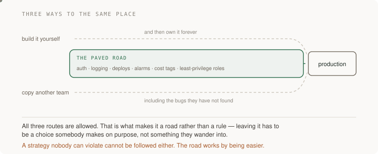

# 18 · Technical strategy — five projects

> Staff tier · each one an afternoon · read [the section](../../../curriculum/04-scale-and-evolution/05-technical-decisions/technical-strategy.md) first

Five projects, built in the section's order: find the decision you keep making,
make it cost something, pave it so the right way is the easy way, try to
violate it and see whether anything notices, and then extrapolate to a vision
boring enough to be true.

The order matters more here than in any other section. Strategy written before
the design documents that justify it is the failure mode the section opens
with — ambitious, top-down, referenced in presentations and never in a code
review.



---

### 1. The decision you have made three times

*You end up with half a page naming one recurring decision, its rationale, and its cost — synthesised from documents that already existed.*

**Build**

Gather five real design documents, decision records or substantial pull request
descriptions from the last year — yours or your team's. Read them together
looking for the same trade-off argued from scratch more than once. Write that
decision down once, with the reasoning and what it costs.

**The thought process**

The first thing that makes this work is **the direction**. You do not write
strategy by thinking about the future; you write it by noticing what you keep
arguing about. The raw material already exists, in documents written because
something actually had to be built, and that provenance is what makes the
resulting strategy defensible — it came from decisions, not from an offsite.

Second, the highest-value signal is not repetition, it is **inconsistency**.
The same trade-off resolved the same way three times is a convention you can
formalise cheaply. The same trade-off resolved *differently* in different
places is the expensive thing — it means two parts of your system disagree, and
somebody will eventually have to reconcile them. Hunt for disagreement first.

Third, on what counts: **the recurring decisions are usually small and
structural rather than grand.** How errors surface. Where validation lives.
What gets retried and by whom. How state is stored. Whether a new thing gets a
new service. Those are the ones argued repeatedly, and nobody writes them down
because each individual argument feels too small to deserve a document.

Fourth: **if you have fewer than five documents, that is the finding.** An
organisation that decides in meetings has nothing to synthesise, and the first
piece of strategy work is [17 · Writing that decides](../17-writing-that-decides/),
not this. You cannot skip a rung of the ladder.

Fifth: **specific enough to be violated.** "We prefer simplicity" cannot be
broken, which means it cannot be followed. "New services use Postgres unless
they have a stated reason; the reason goes in the design doc" can be broken,
and somebody breaking it is a conversation rather than a vibe.

**How to organise the prompts**

```
Here are five design documents from the last year.

Find the decisions that appear in more than one of them, argued from
scratch each time. For each, tell me whether the documents reached the
same conclusion or different ones.

Where they disagreed, that disagreement is what I most want to see.
```

If you get a summary of each document separately, the synthesis did not happen.
Ask again for what is *common*.

```
For the recurring decision I care about: pull out every sentence
across the five documents where somebody argued about it. I want to
see the actual arguments, quoted, not summarised.
```

Reading the real sentences is what tells you whether it is one decision or
three that look alike.

```
Draft the strategy in half a page: the ruling, the rationale, and what
it costs. Write the rationale so that somebody in two years can tell
whether it still applies.

Then tell me how somebody would violate it, specifically.
```

The last question is the test. If a violation is hard to describe, the ruling
is too vague to be followed.

**On AWS**

The recurring decisions in an AWS estate are unusually easy to find, because
the account is a record of every one of them.

Run a quick census: how many distinct datastore services are in use, how many
different ways services authenticate to each other, how many patterns for
running a scheduled job, how many logging destinations. **AWS Config**'s
resource inventory and **Resource Groups** tagging will list them, and the
count is the argument. Five datastores across eight services is not a
philosophical position, it is eight independent decisions nobody wrote down.

The three decisions that most repay being made once, in my experience of how
estates drift:

**Compute default.** Lambda, Fargate, or EC2 — pick a default and state the
conditions that justify leaving it. Without this, every new service re-runs the
whole comparison and lands wherever its author is most comfortable.

**Datastore default.** Usually Postgres on RDS or Aurora, with DynamoDB for
stated key-shaped access patterns. The strategy is not "always Postgres", it is
"Postgres unless the design doc says why not", which is a much easier ruling to
live with and still removes the argument.

**Account and environment topology.** One account per environment per team
under **Organizations**, or shared accounts with tags. This one is worth
deciding early because it is expensive to change later, and it is the decision
most often made accidentally by whoever set up the first account.

**What productionising it means**

The strategy is a short document in the repository, dated, with a named owner
and its rationale next to the ruling. New design documents cite it rather than
re-arguing. It has a review date, because strategies expire and nobody notices
unless the reasoning is on the page. And it is discoverable — a strategy
somebody cannot find is one they will re-derive.

**The learning**

Strategy is not a plan and it is not foresight; it is a small set of decisions
made in advance so that a hundred later decisions do not each get argued from
nothing. The practical consequence is that you find it by reading backwards
rather than by thinking forwards, and the best raw material is the arguments
you are tired of having.

**How you would know it is wrong**

- Check whether it came from real documents. Written from imagination, it will describe an organisation you do not have.
- Look for where the five documents disagreed. If you found only agreement, you found a convention, not a strategy.
- Ask whether somebody could violate it and know they had. If not, it is too vague to follow.
- Count your design documents. Fewer than five and this is the wrong project for now.
- Check that the rationale is written next to the ruling. A ruling without a reason becomes folklore within a year.

---

### 2. Make it cost something

*You end up with a written statement of what your strategy makes worse and for whom — or with the honest conclusion that you have a preference rather than a strategy.*

**Build**

Take the draft from project 1 and find its cost. Name the team, the use case or
the scenario it makes worse. Then take that cost to the person who bears it and
find out whether they can live with it.

**The thought process**

The first test is uncomfortably simple: **every real strategy makes something
worse on purpose.** Standardising on one datastore makes the workload that
genuinely suited the other one slower or more awkward. Requiring a design
document before new services makes small services more expensive to start.
Paving one deploy path makes the team with an unusual need do more work. If
your draft has only upsides, you have not chosen anything — you have written
down what everybody already felt like doing and called it a decision.

Second, and this is what makes the cost worth stating rather than hiding:
**an unstated cost gets discovered by the person paying it, at the worst
moment, and they will conclude the strategy was written by someone who did not
think about them.** Stating it converts the same fact into evidence that you
did.

Third: **name the bearer.** "Some flexibility is lost" is not a cost. "The
analytics team will have to run their aggregation queries against a read
replica with up to thirty seconds of lag, which rules out the live dashboard
they were planning" is. The specificity is what lets the affected person
actually evaluate it instead of worrying.

Fourth, the outcome you should be open to: **sometimes the cost is too high and
the strategy should be narrower.** A ruling that applies to new services only,
or to one domain, or with a stated exception, is a smaller strategy that will
actually hold — which is worth more than a broad one that gets routed around
within a quarter.

Fifth: **write the exception process at the same time.** A strategy with no way
to deviate legitimately produces illegitimate deviation. One sentence — how
somebody proposes an exception and who decides — is what keeps violations
visible instead of quiet.

**How to organise the prompts**

```
Here is my draft strategy. Tell me what it makes WORSE, and for whom.

If your answer is that it makes nothing worse, then it is not a
strategy, it is a preference. Say that instead.
```

```
For each cost: name the specific team, workload or scenario that bears
it, and describe what they will actually experience. "Some
flexibility is lost" is not an answer.
```

```
Given those costs, should this strategy be narrower? Propose two
narrower versions — one scoped by time (new things only) and one
scoped by domain — and tell me what each gives up in return for being
more likely to hold.
```

```
Write the exception process in three sentences: how somebody proposes
a deviation, what they must include, and who decides.

Then tell me what happens if nobody ever uses it — is that a good sign
or a sign the process is too heavy?
```

That last question is a genuinely useful diagnostic. Zero exceptions in a year
usually means the process is unusable, not that everybody agreed.

**On AWS**

The costs of infrastructure strategy are concrete and measurable, which is an
advantage — you can put a number on what you are asking people to accept.

**Standardising the datastore**: the cost is borne by the workload whose access
pattern suited the other engine, and you can quantify it. Run the query on
both, or reason from the access pattern, and state the number. "This costs the
search feature about 200ms at p99 and we are accepting that" is a sentence
people can disagree with productively.

**Standardising compute**: if the ruling is Fargate and a team has a workload
with a two-minute cold path that suited Lambda's scaling, say what their
steady-state cost becomes. **Compute Optimizer** and a quick Cost Explorer
projection give you the figure.

**Account-per-team**: the cost is cross-account plumbing — IAM role assumption,
shared VPCs or **Transit Gateway**, cross-account data transfer charges, and
one more place to configure everything. Those are real and worth naming, and
the benefit you are buying is blast-radius isolation and per-team cost
attribution, which is exactly the trade to state out loud.

And a note on where the exception process lives: if the ruling is enforced by a
**service control policy**, the exception process must include how the SCP is
amended, or you have written a rule with no door in it. A control with no
exception path gets disabled entirely the first time it blocks something
urgent — which is worse than never having had it.

**What productionising it means**

The cost is in the document, next to the ruling, in the same font. The bearer
has read it and either accepted it or negotiated a narrower scope. There is an
exception process and somebody has used it at least once. And the cost gets
revisited when the strategy is reviewed, because the thing that made it
acceptable may have changed.

**The learning**

Choosing means something gets worse, and a document that claims otherwise has
not chosen. Stating the cost explicitly does two things at once: it makes the
document honest, and it tells you — before anybody else finds out — whether you
have actually made a decision or just written down a preference.

**How you would know it is wrong**

- If the strategy makes nothing worse, it is a preference. That is the finding, not a failure.
- Check that each cost names a specific bearer. Abstract costs are not costs.
- Take it to the person who pays. If they are surprised, you found out cheaply; if they are angry, you found out at the right time.
- Look for an exception process. Without one, deviation goes underground.
- After a year, count the exceptions. Zero usually means the process is too heavy, not that everybody agreed.

---

### 3. Pave the road

*You end up with a supported path that is genuinely easier than the alternatives, and a new thing started on it in under an hour.*

**Build**

Take the decision from project 1 and make following it the path of least
resistance. Build the template, the construct, the generator — whatever makes
the right way faster than the alternatives. Then test it by starting something
new on it and timing yourself.

**The thought process**

The first idea is the one that makes strategy actually operate: **a road works
by being easier, not by being required.** A ruling enforced only by review is a
tax on the reviewer's attention and it fails silently on a busy week. A ruling
where the compliant path is a single command and the alternative is a day of
setup enforces itself, and nobody experiences it as enforcement.

Second, and this is what distinguishes a road from a rule: **leaving it must be
possible.** The section's test is that a strategy nobody can violate cannot be
followed either. You want deviation to be a deliberate choice with a visible
cost, not an impossibility — because the unusual workload that genuinely needs
something else is real, and a road that forbids it will be bypassed by people
who then also bypass the parts that were load-bearing.

Third, the thing to build into the road rather than document separately:
**the parts everybody forgets.** Logging that goes somewhere searchable. An
alarm on the obvious failure. Cost tags. A least-privilege role rather than a
broad one. Those are the items that are skipped under time pressure and that
cause the incidents, and a road that provides them by default is worth more
than any amount of guidance.

Fourth: **measure the road, not the policy.** The honest metric is how long it
takes to start something new on it, and whether people use it. Both are
observable. A paved road nobody uses is a project you finished and a problem
you did not solve.

Fifth, and this is why the section says this work pays more than it used to:
**DORA's 2025 research found AI acts as an amplifier of existing organisational
quality** — the returns come from platform quality and workflow clarity rather
than from the tools. A good paved road is now the thing that decides whether
fast generation helps or hurts, because generated code lands on whatever
foundation you have.

**How to organise the prompts**

```
Here is my strategy: <the ruling>. Design the paved road for it.

What does somebody have to do today to comply, step by step? Then
tell me which of those steps could disappear entirely if I built the
right template or construct.
```

Enumerating the current steps first is what keeps the road aimed at the real
friction rather than at the friction you imagine.

```
Build it. Requirements:
- Starting a new one is a single command or a form.
- It includes the things people skip: structured logging, one alarm,
  cost tags, a scoped role.
- Deviating is possible and visible.

Show me what the generated thing looks like and what it does NOT
include, so I know what is still on the user.
```

```
Now the adoption question. Why would somebody NOT use this? Give me
three honest reasons, including ones that are about me rather than
about the tool.
```

```
What would I measure to know whether the road is working? Give me
something observable, not a survey.
```

**On AWS**

This project has more AWS in it than any other in the staff tier, because
paving roads is largely an infrastructure activity.

**AWS Service Catalog** is the purpose-built answer: you publish a product —
a CloudFormation or Terraform template with parameters — and teams launch it
themselves with permissions they would not otherwise have. That last part is
the underrated bit: a launch constraint lets someone provision a compliant
stack without giving them the permissions to build a non-compliant one by hand.
That is a road and a fence in one mechanism.

**CDK constructs** are the version for teams that write infrastructure as code.
Publish an internal construct library where `new ServiceStack(...)` produces
the logging, the alarm, the tags, the role and the pipeline, and the compliant
path becomes three lines. This is the highest-leverage thing a staff engineer
can build in an AWS estate, and it compounds — every new service inherits every
improvement you make to it.

For the guardrails that make deviation visible rather than impossible:
**AWS Config** rules flag non-compliant resources after the fact, which is the
right severity for most rulings — it surfaces the deviation without blocking
anybody at 4pm on a Friday. **Organizations service control policies** are the
harder stop, correct for the small number of things that must never happen
(deleting CloudTrail, disabling encryption, launching in unapproved regions)
and wrong for stylistic rulings. Choosing which of your rulings deserves which
mechanism is the real design work.

**AWS Control Tower** is the packaged version of account provisioning with
guardrails, and it is worth knowing about before you build your own — a great
deal of paving work is re-implementing something that exists.

And the measurement: tag everything the road produces, then count. The number
of resources created through the road versus outside it is your adoption
metric, and it is available in Config or a Cost Explorer query rather than from
asking people.

**What productionising it means**

Starting a new compliant thing takes minutes and one command. The road includes
the items people skip under pressure. Deviation is possible, visible and
recorded. Adoption is measured from the account rather than from opinion. And
the road is maintained — an unmaintained paved road is worse than none, because
people build on it and then discover it is stale.

**The learning**

The most durable form of a technical decision is not a document, it is a
default. Writing the ruling makes it arguable; paving it makes it happen — and
the paving is the unglamorous work that determines whether everything else you
write has any effect on what actually gets built.

**How you would know it is wrong**

- Time yourself starting something new on it. If it is not faster than the alternative, nobody will use it and they will be right.
- Count what got created through the road versus outside it. Ask the account, not the team.
- Try to deviate. If you cannot, you built a rule; if nothing notices, you built a suggestion.
- Check whether the road includes the alarm, the tags and the scoped role. Those are the parts that are skipped and the parts that matter.
- Ask when the road was last updated. A stale road is a trap with your name on it.

---

### 4. Try to violate it

*You end up knowing whether your strategy is operating or advisory — and with a mechanism that notices, if it was advisory.*

**Build**

Open a pull request, or provision a resource, that breaks your own strategy.
See whether anything or anybody objects. Then, depending on what happened,
either write down why the mechanism worked or build the mechanism that would
have.

**The thought process**

The first idea is the section's sharpest test: **if nothing and nobody objects,
it is advisory — and advisory strategy is a description of what people already
felt like doing.** This is not cynicism. It is the same standard applied to
strategy that [Testing and debugging](../../../curriculum/02-applications/04-testing/README.md) applies to tests: a
check that cannot fail is not a check.

Second, the diagnostic value is in *which* thing objected, and the three
answers need different fixes. If a person objected in review, the strategy is
operating on attention, which works until the reviewer is busy. If automation
objected, it is operating structurally. If nothing objected, it is not
operating at all.

Third, and this is the more interesting follow-up: **when somebody does violate
it for real, find out whether they knew, disagreed, or could not find it.**
Those are three completely different problems — a communication problem, a
strategy problem, and a discoverability problem — and treating all three as
non-compliance is how strategies acquire a reputation for being bureaucratic.

Fourth: **match the mechanism to the stakes.** Not everything deserves a hard
block. A review comment, a CI warning, a Config finding, and a hard denial are
four severities, and putting a stylistic ruling behind a hard denial is how you
get the whole apparatus switched off the first time it blocks something urgent.

Fifth, the thing to be honest about: **this project can find that your strategy
is unnecessary.** If you violate it and nothing bad happens and nobody minds,
it is possible the ruling was not load-bearing. That is a legitimate and useful
result.

**How to organise the prompts**

```
Here is my strategy. Design the smallest possible violation of it —
something I could actually put in a pull request or provision in a
sandbox.

Then predict what will notice: a human reviewer, a CI check,
infrastructure policy, or nothing.
```

Predicting first is what makes it an experiment.

```
Nothing noticed. For each of the four severities — review comment, CI
warning, post-hoc finding, hard block — tell me what implementing it
would take and what it would cost when it is wrong.

Recommend one for THIS ruling and say why not the others.
```

```
Now the discoverability question. If somebody wanted to check whether
a strategy covers what they are about to do, where would they look?
Walk me through it as a new engineer.

If that takes more than a minute, the problem is not compliance.
```

```
Write the check. It must fail on my deliberate violation and pass on
the compliant version — show me both runs.
```

**On AWS**

The four severities have direct AWS forms, and picking correctly is the whole
skill here.

**Review comment** — a CODEOWNERS entry on the infrastructure directory so a
human sees changes in a specific area. Cheapest, and it degrades with
attention.

**CI check** — a policy-as-code step in the pipeline: `cfn-lint`, CDK aspects,
or a general policy engine over the synthesised template. This catches the
violation before it exists, which is the best place, and it is bypassable by
anybody who provisions outside the pipeline.

**Post-hoc finding** — an **AWS Config** rule, which evaluates resources
however they were created, including by hand in the console at 2am. That
coverage is exactly what the CI check lacks, and it is why the two are
complements rather than alternatives. Config can also auto-remediate, which is
a bigger hammer than it first appears — remediation that deletes something
someone was relying on is its own incident.

**Hard block** — an **Organizations service control policy**, or an IAM
permissions boundary. Correct for the small set of things that must never
happen. Wrong for rulings about style or preference, because the cost of being
wrong is somebody blocked with no override during an incident.

For the discoverability half: **AWS Config conformance packs** group rules with
their intent, and pointing the rule's description at your strategy document is
a small thing that closes the loop — the person who trips the rule can read why
it exists rather than filing a ticket asking.

**What productionising it means**

Every ruling has a mechanism and you know which severity it is. The mechanisms
have been tested with a deliberate violation, not assumed. Violations are
visible whether they came through the pipeline or the console. Each finding
links back to the strategy that produced it. And when somebody violates a
ruling, the first question asked is whether they knew, disagreed or could not
find it.

**The learning**

A strategy exists to the extent that something notices when it is broken, and
"we agreed on this" is not something that notices. The corollary that keeps you
honest is that mechanisms have costs too — so the work is not maximum
enforcement, it is matching the severity to what is actually at stake.

**How you would know it is wrong**

- Violate it deliberately. If nothing objects, it is advisory.
- Check whether the mechanism covers resources made outside the pipeline. A CI-only check misses the console.
- Time how long it takes a new engineer to find whether a strategy covers their case.
- When a real violation happens, ask whether they knew, disagreed, or could not find it before treating it as non-compliance.
- Ask whether the severity matches the stakes. A hard block on a style ruling will be switched off, and it will take the useful blocks with it.

---

### 5. The vision that bores

*You end up with an extrapolation of your strategies two or three years out, stripped of every word that was there to sound ambitious — and it is obvious.*

**Build**

Take the strategies you have and extrapolate them. What does this place look
like in two or three years if these decisions hold? Write it. Then strip every
word that exists to make it sound ambitious and check whether what remains is
boring. If it is, you are done.

**The thought process**

The first thing, and it is the line most worth remembering from this section:
**a great vision is usually so obvious that it bores.** If yours is exciting,
it is probably a proposal with no consensus behind it yet. Excitement in this
genre is a symptom — it means you are describing a future people have not
agreed to rather than extrapolating decisions they have already made.

Second, the mechanical definition that keeps it honest: **a vision is an
extrapolation, not an aspiration.** It is what follows if your existing
strategies hold. That constraint is what makes it useful, because somebody can
check it — they can ask "does that actually follow from what we decided?" — and
they cannot check an aspiration.

Third, on what it is for: **a vision lets people make decisions you are not
present for.** If an engineer can read it and infer what you would have said
about their case, it is working. That is the same test as
[17 · Writing that decides](../17-writing-that-decides/)'s and it is the test
for everything at this tier.

Fourth, the failure to avoid specifically: **a list of adjectives.** "Scalable,
reliable, developer-friendly" is not a vision, it is a mood, and it is
unfalsifiable. The test is whether somebody could read it and conclude that a
particular proposal does not fit — if nothing could fail to fit, it says
nothing.

Fifth: **it needs an expiry.** The constraints that produced your strategies
will change, and a vision that outlives its reasoning becomes folklore that
people work around rather than with. Put a review date on it and a note of what
would make it wrong.

**How to organise the prompts**

```
Here are my strategies: <the rulings and rationales>.

Extrapolate them two to three years. What does this organisation's
technical estate look like if these decisions hold and nothing else
changes?

Do not add ambitions I have not decided on. If a strategy implies
something uncomfortable, say so.
```

The last sentence is important. Honest extrapolation sometimes produces a
future you do not want, and that is information about the strategies rather
than about the writing.

```
Rewrite this as plainly as possible. Remove every word that is there
to make it sound ambitious.

Then tell me whether what remains is obvious. If it is, say so — that
is the result I want, not a problem to fix.
```

A model will otherwise try to make your vision sound better, which is the
opposite of the test.

```
Give me three concrete proposals that would NOT fit this vision. If
you cannot, the vision is too broad to be useful.
```

This is the falsifiability check and it is the fastest way to find out whether
you wrote a list of adjectives.

```
What would have to change for this vision to be wrong? Name the
constraint, and tell me how I would notice it changing.
```

**On AWS**

The extrapolation is unusually checkable in an infrastructure context, because
your estate's trajectory is already measurable.

Project the things you can measure: **Cost Explorer**'s twelve-month trend
extended two years, the growth in account count, the growth in the number of
distinct services in use, the trend in **Service Quotas** you are approaching.
If your strategies hold, do those numbers become something you would be happy
with? A vision that implies a bill you cannot pay or a quota you will hit is
not a vision, it is a deadline.

Two specific extrapolations worth doing because they are usually
uncomfortable:

**The account topology in two years.** If every new team gets accounts at your
current rate, how many is that, and does your current approach to IAM, network
connectivity and cost attribution still work at that number? Organisations that
are painful at forty accounts were designed for four, by someone extrapolating
nothing.

**The estate's operational surface.** Every service you have adopted is a thing
somebody has to know about during an incident. Extrapolate the count. A vision
that implies your on-call rota needs familiarity with thirty AWS services is
one worth confronting now, and it is often the honest argument for a narrower
compute or datastore strategy that nobody could make in the abstract.

**What productionising it means**

The vision is short, dated, and derived from strategies that are themselves
derived from documents. It is specific enough that a real proposal could fail
to fit, and somebody can name one that would. It has a review date and a stated
condition that would make it wrong. And it gets cited in design documents — not
in presentations, which is where visions go to be admired rather than used.

**The learning**

Vision is the third rung of a ladder and it is worthless without the two below
it. The test that keeps it honest is the boredom one: if writing it down makes
people say "well, obviously", you have described a shared understanding and
made it citable, which is the entire job. Excitement means you skipped a rung.

**How you would know it is wrong**

- Read it stripped of ambition words. If what remains is not obvious, you wrote a proposal.
- Name three proposals that would not fit. If everything fits, it says nothing.
- Check that each part follows from a strategy that follows from a document. A rung skipped is a rung somebody else will fall through.
- Extrapolate the numbers, not just the words. A future with a bill you cannot pay is a deadline wearing a vision.
- Put a date on it and name what would make it wrong. Without that, it becomes folklore and people route around it.
