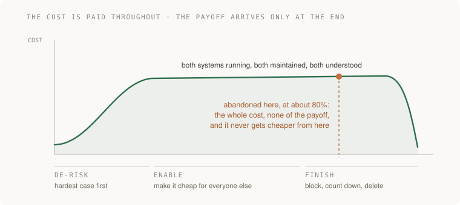
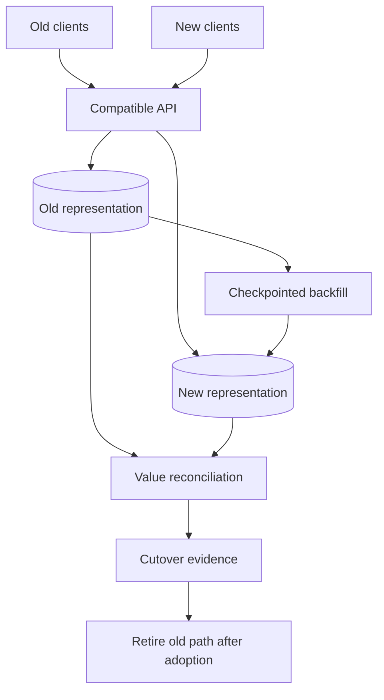
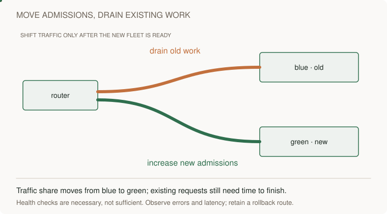

# 19 · Migrations

> Staff tier · feeds **P5 (it changes safely)**

## The one-liner

A migration is how you replace a load-bearing piece of a system that is
currently holding people up. It is the only thing that reliably reduces
technical debt at scale, and it has one property that makes it different from
every other project: **the value arrives entirely at the end.** Stop at 80% and
you have paid the whole cost and bought nothing.

## The failure it prevents

Look at any system that has been alive for five years and you will find two of
something. Two auth paths. Two job runners. Two ways of storing a date. Somebody
started replacing the old one, got most of the way, and moved on to something
with a launch attached.

The cost is not the ugliness. It is that every subsequent change now has to be
made twice, every new engineer has to learn both, and every bug has to be
diagnosed in a system where the answer is "it depends which path it took." The
old thing does not get cheaper while you wait. It gets more expensive, because
new code keeps being written against it.

And the reason it stops at 80% is not laziness. It is that the last 20% is the
worst part of the work, and by then the interesting engineering is finished, and
nobody was ever promoted for deleting the old thing.

## The mental model

Will Larson's framing is the one that has held up, and it is three phases.



**De-risk.** Prove the new thing works on the hardest case, not the easiest one.
This is counterintuitive and it is the whole phase. Migrating the simplest
service first tells you nothing, because the simplest service was never the
reason the migration is hard. Find the team with the weirdest usage and get them
across, and you will discover in week two what you would otherwise have
discovered in month six.

**Enable.** Now make it cheap for everybody else. Write the tooling, the codemod,
the compatibility shim. Programmatically migrate as much as you can. The measure
of this phase is how little of the work lands on the teams being migrated — every
hour you push onto them is an hour they will spend arguing about priority
instead.

**Finish.** Stop new usage of the old thing (a lint rule, a CI check, a
deprecation that actually fails the build), track what remains as a number that
goes down, and delete it. This is the phase that gets skipped, and it is the
phase that pays.

### The property that makes migrations different

During a migration you are running **both** systems. Both cost money, both need
maintaining, both need understanding by anyone touching that area. So the cost
curve goes up and stays up, and the benefit is a step function at the end.

That is why "we'll finish it next quarter" is so expensive and so easy to say.
Every quarter you do not finish, you pay the double-running cost again, and the
remaining work gets slightly harder because more code was written in the
meantime.


## What good looks like

- The hardest case migrated first, on purpose, and what it taught written down.
- A number that anybody can look at: how many call sites remain on the old path.
- New usage of the old thing is mechanically blocked, not discouraged by a message in a channel.
- Migration work is mostly done *by* the migration, not by the teams being migrated.
- A stated finish condition and a date, both of which somebody owns.
- The old system is actually deleted, and there is a commit where that happened.

Done badly:

- Easiest team first, so the plan is built on a case that was never representative.
- A tracking spreadsheet nobody updates, instead of a query.
- "Please migrate when you get a chance," which means never.
- Both systems documented as current, so new engineers pick whichever they read first.
- The migration declared complete while the old code is still imported in fourteen places.
- Nobody owns the finish, because the person who started it got promoted for starting it.

## Ask Claude for this

**Request 1 — find the hardest case, not the easiest**

```
Here is the system being migrated and the list of things that use it.

Rank them by how AWKWARD they will be to migrate, not by size. I want the
one most likely to reveal something the plan has not accounted for.

For the top one, tell me what specifically about it does not fit the new
model.
```

*Why it is asked that way:* the instinct — and the model's default — is to rank
by effort and start small. Explicitly asking for awkwardness inverts it. What
you want out of phase one is information, and the easy cases have none in them.

*What you should get back:* a named worst case with a specific structural reason
— it uses a feature the new system does not have, it depends on ordering, it has
a deadline nobody can move.

**Request 2 — the mechanical block, not the polite request**

```
Write the check that makes it impossible to add NEW usage of the old
system: a lint rule, a CI check, a failing import — whatever fits here.

It must fail the build, not warn. Show me it failing on a deliberately
added new usage, then passing when I remove it.
```

*Why:* this single artefact is the difference between a migration that converges
and one that does not. Without it you are migrating faster than people add new
usage, or you are not, and you will not know which for months.

*Push back on:* a warning. A warning is a lint rule that has decided not to be
one.

**Request 3 — the remaining-work query**

```
Write me a query or a script that counts exactly how many call sites are
still on the old path, that I can run any day and get a number.

Then tell me what it would miss — the usages that this will not catch.
```

*Why:* "how much is left" has to be a number you can produce on demand, not an
estimate somebody maintains. The second question is the important half: a
counter that silently misses dynamic usage will hit zero while the old system is
still being called.

## How you would know it is wrong

1. **Run your remaining-work query and then grep by hand.** If the numbers differ, the query is the thing that is wrong, and you were about to declare victory on it.
2. **Add a new usage of the old system on a branch and push it.** The build must fail. If it does not, nothing is stopping the backlog growing behind you.
3. **Ask which case was migrated first and why.** If the answer is "the easiest", the plan is untested.
4. **Try to delete the old system in a branch** and see what breaks. Do this early, when it is a five-minute experiment, not at the end when it is a decision.
5. **Check whether both systems are documented as current.** If a new engineer could reasonably pick the old one, they will.
6. **Look for the finish date and the person.** A migration with neither is a migration that is already abandoned; it just has not been said out loud yet.

## Your slice of the project

**P5** is a migration of the system you built. Pick something genuinely
load-bearing — how items are stored, how authentication works, the job runner —
not a cosmetic swap.

- The design doc from [17 · Writing that decides](../17-writing-that-decides/), including non-goals and the alternatives you rejected.
- Phase one done on the **hardest** case, with what it taught written down.
- A mechanical block on new usage of the old path, demonstrated failing.
- A remaining-work counter you can run on demand, plus a written note of what it misses.
- Kill criteria: what you would see that makes you stop and revert.
- **The finish.** The old code deleted, in a commit, with the counter at zero.

**Acceptance criteria:**

- Adding new usage of the old system fails the build. You demonstrated it.
- The counter reaches zero and the old code is gone from the repository.
- You can say what the hardest case taught you that the plan had wrong, because there will be something.
- If you stopped early, you wrote down why, and "we ran out of interest" is an acceptable and useful answer to have recorded.

## Words you now own

- **migration** — replacing a load-bearing piece of a live system while it keeps working.
- **de-risk** — phase one: prove it on the hardest case, to learn what the plan got wrong.
- **enable** — phase two: make it cheap for everyone else, mostly by doing it for them.
- **finish** — phase three: block new usage, drive the count to zero, delete the old thing. The phase that pays.
- **double running** — carrying both systems at once. The cost you pay every day you do not finish.
- **codemod** — a program that rewrites code mechanically. The difference between a migration and a request.
- **deprecation** — announcing that something is going away. Worthless without a mechanical block behind it.
- **kill criteria** — what you will observe that makes you stop. Decided in advance.
- **the last 20%** — the unglamorous remainder where all of the value is.

---

**Not covered here:** database schema migrations at the level of a single change
are junior-tier and live in [05 · Data and databases](../../01-junior/05-data-and-databases/).
This section is about the multi-month kind with other teams in it. Organisational
resistance is real and mostly a scope problem, which is
[16 · Scope and leverage](../16-scope-and-leverage/).

[Choose your learning path](../../../paths/README.md) · [Interview applications](../../../paths/interviews/README.md)

## Draw it from memory · Draw coexistence before drawing cutover



**Redraw challenge:** Circle every writer that still targets the old representation. What evidence permits retirement?



[Static view](../../../assets/learning/traffic-shift-still.svg)
