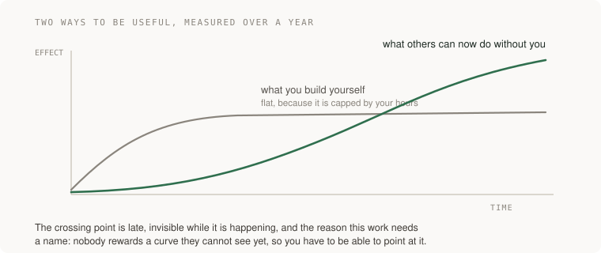
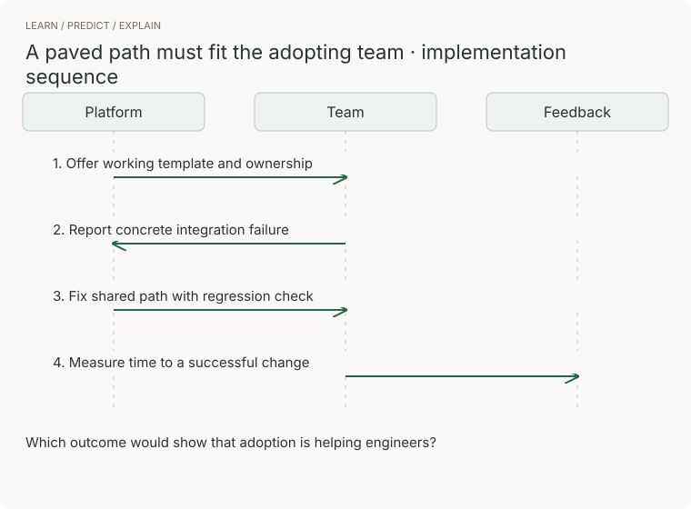

# 21 · Making other engineers faster

> Staff tier · feeds **P5 (it changes safely)**

## The one-liner

The last thing the staff tier asks of you is the hardest to measure: your output
stops being what you build and becomes what other people can now build. This is
the part of the job with the longest feedback loop, the least legible evidence,
and — since AI made writing code cheap and reviewing it expensive — by far the
highest return.

## The failure it prevents

Two failures, and they are opposites.

**The bottleneck.** You are the person who understands the deployment system, or
the payments code, or why that service is like that. Everything touching it
comes through you. You are extremely busy and visibly valuable, and the team's
throughput is capped at your attention. This feels like importance. It is a
single point of failure with a salary.

**The uncredited multiplier.** You do the coordination, the unblocking, the
onboarding, the quiet repair that keeps a group functioning — and at review time
you are told you lack technical contribution. Tanya Reilly named this "glue
work", and the uncomfortable finding is that it is necessary, systematically
undervalued, and done disproportionately by women. The advice that follows is
not "stop doing it". It is: do it visibly, framed as leading, or do less of it.

Both failures come from the same missing idea — that making others faster is
*work*, with a shape, that can be done well or badly and can be pointed at.

## The mental model



Three distinctions do most of the work here.

**Mentorship gives advice. Sponsorship spends credibility.** Mentorship is
answering questions, reviewing code, explaining the thing. Sponsorship is
putting someone's name forward for the project, in a room they are not in, with
your reputation attached. The first is generous and cheap. The second costs you
something if you are wrong, which is exactly why it is what the ladders reward
and what actually changes a career.

**The paved road beats the rule.** A guideline needs everybody to remember it.
A supported path that is easier than the alternatives works while nobody is
paying attention. Every hour you spend making the right thing the easy thing
pays out every time somebody does it without thinking.

**Review is the bottleneck now, so review capacity is the lever.** Telemetry
from teams with heavy AI adoption shows pull requests getting substantially
larger, review time rising steeply, and a meaningful share merging unreviewed.
Whatever else you do, the work that makes *judging* changes cheaper — smaller
batches, better change descriptions, tooling that answers the reviewer's
questions before they ask — is the thing multiplying everyone.

And the finding that ties them together: DORA's 2025 research frames AI as an
**amplifier of existing organisational quality**, with the returns coming from
platform quality and workflow clarity rather than the tools themselves. The
unglamorous work of making the environment good is now what decides whether
everything else helps.


### Watch the concept, then trace the implementation



The comparison follows four illustrative states. Without the mechanism: adoption number hides extra work. With it: use feedback to remove repeated friction. These are teaching states, not measured performance.



[Still storyboard / reduced-motion alternative](../../../assets/learning/developer-platform-still.svg).

**Predict before replaying:** Which outcome would show that adoption is helping engineers?

**Try it:** reproduce the final transition in a small example, remove the mechanism, and record the changed outcome. Use the checks later in this chapter to judge the result.

## What good looks like

- Somebody got an opportunity because you spent credibility on them, and they know it.
- The thing you used to be asked about, people now do without asking.
- The easy path and the right path are the same path, and you made them so.
- Review is faster because of something you built or wrote, not because you personally review everything.
- You are on holiday and nothing is blocked.
- You can name what you stopped doing to make room for this.

Done badly:

- All mentorship, no sponsorship: warm, well-liked, and nobody's situation changed.
- Guidelines instead of defaults, so compliance depends on memory.
- A platform built for the problems you found interesting rather than the ones people have.
- Glue work absorbed silently until it is invisible and then held against you.
- Becoming the reviewer of everything, which is the bottleneck wearing a helpful hat.
- Tooling nobody adopted, because you never asked what it was like to use.

## Ask Claude for this

**Request 1 — find the friction, do not guess it**

```
Here is our repository and our CI configuration.

Where does a change actually spend its time between being written and
being merged? Point at the steps, and tell me which are waiting on a
machine and which are waiting on a person.

Then tell me which one I could halve.
```

*Why it is asked that way:* the machine/person split is the useful cut. Machine
time is a tooling problem and usually cheap to fix. Person time is a process or
a clarity problem and is where the real cost is, and people almost always
optimise the first because it is easier to see.

*What you should get back:* a step where changes sit waiting for a human. That
is the one worth your attention.

**Request 2 — make the right thing the easy thing**

```
Here is a mistake people on this team keep making: <describe it>.

Give me three ways to make it structurally impossible or loudly obvious,
ranked by how little anybody has to remember. Do not suggest
documentation or a guideline.
```

*Why:* the last sentence is the instruction. Documentation is the default
suggestion and the weakest intervention — it works only when somebody reads it
at the right moment, which is precisely the moment they are busy.

*Push back on:* anything that relies on a person noticing. Prefer a default, a
failing check, or a deleted footgun.

**Request 3 — make the change reviewable**

```
Here is a large change. Split it into a sequence of smaller ones, each of
which leaves the system working, ordered so a reviewer can judge each one
without holding the others in their head.

Tell me which one carries the actual risk.
```

*Why:* the single biggest gift to a reviewer is a change that can be understood
in pieces. The last question is the important one — in almost any large change,
one part is risky and the rest is mechanical, and saying which is where your
judgment is worth most.

## How you would know it is wrong

1. **Go on holiday.** What stops is what depends on you personally. This is the cleanest measurement in this entire guide and almost nobody runs it deliberately.
2. **Count the questions only you can answer.** If it is not going down over a quarter, you are a bottleneck rather than a multiplier.
3. **Name the person you sponsored and what they got.** If you cannot, you have been mentoring, which is a different and cheaper thing.
4. **Measure the time a change waits on a person**, before and after whatever you built. If it did not move, the tool was for you.
5. **Ask somebody who joined recently what was hardest.** They still remember. In three months they will have normalised it and the information is gone.
6. **Check adoption honestly.** A platform nobody uses is not a platform, and the reason is usually that it solves the problem you had rather than the one they have.

## Your slice of the project

For **P5**, alongside the migration:

- Pick the thing you have explained more than twice during this guide — to yourself, in notes, or to a model. Make it so it does not need explaining again: a default, a check, a template, a deleted sharp edge.
- Write down what you stopped doing to make room for it. If nothing, you did not make room, you added.
- If there is anybody else in your orbit, do one genuinely sponsoring thing: put their name on something, in public, with your credibility attached.

**Acceptance criteria:**

- The thing you built means a specific mistake can no longer be made silently, and you demonstrated that.
- You can name what you stopped doing.
- Somebody other than you used it, and you asked them what was annoying about it.

## Words you now own

- **leverage** — the ratio between what changes and how much of you it took.
- **mentorship** — advice and teaching. Generous, cheap, rarely changes a trajectory alone.
- **sponsorship** — spending your own credibility on somebody else's opportunity, usually in a room they are not in.
- **glue work** — coordination and repair that makes a group function. Necessary, chronically uncredited, unevenly distributed.
- **paved road** — the supported path, made easier than the alternatives so nobody has to remember the rule.
- **bus factor** — how many people have to be unavailable before something stops. Being the answer is not a compliment.
- **review capacity** — the scarce resource now that writing code is cheap.
- **amplifier** — DORA's framing: AI multiplies your existing organisational quality, in both directions.
- **onboarding time** — how long until a new person ships something. The most honest single measure of how good your environment is.

---

**Not covered here:** management. This is the individual-contributor track, and
the leverage described here is technical and social rather than positional. If
you find you prefer the work in this section to the work in the rest of the
guide, that is worth noticing rather than suppressing — it is information, not a
failure.

[Choose your learning path](../../../paths/README.md) · [Interview applications](../../../paths/interviews/README.md)
