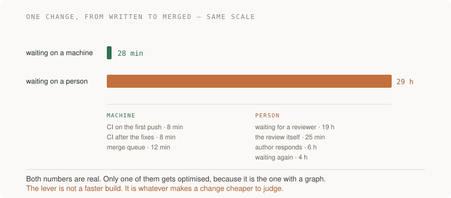

# 21 · Making other engineers faster — five projects

> Staff tier · each one an afternoon · read [the section](README.md) first

The last five projects in the guide, and all of them produce the one thing this
work is usually accused of lacking: evidence. A before-and-after number for how
long a change waits on a person. A mistake that can no longer be made silently,
demonstrated. A large change split so a reviewer can judge it in pieces. A list
of what stopped while you were away. And the thing the person who joined last
month found hardest, fixed.

This section has the longest feedback loop in the guide, which is exactly why
every project here ends in a measurement rather than a feeling.



---

### 1. Where a change waits on a person

*You end up with the time a change spends waiting on a human, before and after one thing you changed.*

**Build**

Measure the full path from "written" to "merged" for your last twenty changes.
Split every segment into waiting-on-a-machine and waiting-on-a-person. Pick the
largest person segment and halve it. Measure again.

**The thought process**

The first move is the cut that makes this tractable: **machine time and person
time are different problems and people optimise the wrong one.** Machine time
has a graph attached — the CI duration is right there, it is satisfying to
reduce, and it is usually a small fraction of the total. Person time is
invisible unless you go and compute it, and it is usually most of the elapsed
time by an order of magnitude.

Second, the specific number to find: **time from "ready for review" to "first
review comment".** In most teams this single segment dominates everything else,
and it is not a laziness problem — it is a queueing problem. Reviewers are
working on their own things and context-switching is expensive, so changes sit.

Third, the interventions that work on it are not "remind people to review".
They are structural: smaller changes (which are cheaper to pick up), better
change descriptions (which reduce the cost of starting), explicit review
rotation or assignment (which removes the diffusion of responsibility), and
service-level expectations that somebody actually agreed to.

Fourth, and this is what makes it a staff project rather than a process
complaint: **the thing you build has to reduce the number, and you have to
show that it did.** A measurement before, a change, a measurement after. If the
number did not move, the tool was for you — which is an acceptable outcome to
discover, once.

Fifth: **review capacity is the scarce resource now.** Writing code got cheap
and judging it did not, and telemetry from teams with heavy AI adoption shows
pull requests getting substantially larger, review time rising steeply, and a
meaningful share merging unreviewed. Whatever else you do, work that makes
judging changes cheaper is the thing multiplying everyone.

**How to organise the prompts**

```
Here is our repository and our CI configuration.

Where does a change actually spend its time between being written and
being merged? Point at the steps, and tell me which are waiting on a
machine and which are waiting on a person.

Then tell me which one I could halve.
```

The machine/person split is the useful cut, and it is the one people do not
make on their own.

```
Write me a script that computes this from our actual history: for the
last 20 merged changes, the timestamps at each transition, and the
totals per category.

I want real numbers, not an estimate from the config.
```

Computing it from history is what turns an intuition into something you can
compare against later.

```
The largest person segment is <X>. Give me three interventions ranked
by how little anybody has to remember, and for each, what I would
measure to know it worked.

Do not suggest asking people to be faster.
```

```
After the change, here are the new numbers: <data>. Did it move, and
is the move bigger than the variation between weeks? Be blunt if it
is noise.
```

**On AWS**

If your pipeline is **CodePipeline** and **CodeBuild**, the timings are already
metrics and the stage-level durations are in the console — so the machine half
costs you nothing to measure. Where that half is genuinely slow, the usual
culprits are dependency fetches and container pulls, and the fixes are
**CodeBuild caching**, **CodeArtifact** as a package proxy, and an **ECR
pull-through cache**, all of which remove network time rather than compute
time.

There is a real cost-versus-speed decision here that connects to
[14 · Performance and cost](../../02-senior/14-performance-and-cost/): a larger
CodeBuild compute type or reserved capacity costs more per minute and finishes
sooner, and whether that is worth it depends on how many engineer-minutes are
spent waiting. That is a unit-cost calculation you can actually do, and it is
one of the few places where "buy a faster machine" is straightforwardly
correct.

For the person half, the thing worth building is a dashboard. Push the
per-change timings into **CloudWatch** as a custom metric — time to first
review, time to merge — and graph them. The act of making review latency
visible alongside build duration does more than most interventions, because it
puts the large number next to the small one that everybody has been
optimising.

And if you want the four DORA metrics, deployment frequency and lead time for
changes are derivable from your pipeline's execution history plus your git
history; **EventBridge** rules on CodePipeline state changes into a
**DynamoDB** table is about an afternoon's work and gives you a real lead-time
number rather than a survey answer.

**What productionising it means**

The measurement is automated and runs weekly, not once for this project. Review
latency is on the same dashboard as build duration. There is an agreed
expectation for time-to-first-review, made by the people it binds. And the
before-and-after is recorded, so the next person can see what worked rather
than repeating the experiment.

**The learning**

The bottleneck in shipping software moved, and most teams' tooling attention
did not move with it. Once you have computed the two totals side by side you
cannot unsee the ratio — and you stop being interested in shaving two minutes
off a build that sits in a queue for nineteen hours afterwards.

**How you would know it is wrong**

- Compute both totals from real history. If you estimated from the config, you measured your beliefs.
- Check the move against week-to-week variation. Smaller than the noise is not a result.
- Look at what you optimised. If it was machine time, check whether that was because it was the biggest or because it was the easiest to see.
- Ask whether the intervention requires anybody to remember something. Those regress when people are busy.
- Measure again in a month. Process improvements decay faster than tooling ones.

---

### 2. The mistake that can no longer be made silently

*You end up with a specific error that is now either impossible or loud, demonstrated by trying to make it.*

**Build**

Pick a mistake people on your team keep making. Make it structurally impossible
or immediately obvious. No documentation, no guideline. Then prove it by making
the mistake on purpose and watching something object.

**The thought process**

The first rule, and it is the whole project: **documentation is the weakest
intervention available.** It works only when somebody reads it at the right
moment, which is precisely the moment they are busy and confident. A guideline
needs everybody to remember it; a default works while nobody is paying
attention.

Second, the ranking to apply: **delete the footgun, then make the wrong thing
impossible, then make it fail loudly, then make it visible, and only then write
it down.** Each rung down that ladder depends more on human attention. Most
teams start at the bottom because it is the cheapest to produce, and then
wonder why the mistake recurs.

Third, the choice of mistake matters more than the cleverness of the fix:
**pick one that has actually happened more than twice.** A hypothetical mistake
gets a fix nobody needed. Look at your incident history, your review comments,
and the questions you answer repeatedly — that last one is the richest source
and it is free.

Fourth, and this is where the staff judgment is: **prefer removing the
possibility over adding a check.** A check is a thing to maintain, to tune, and
to eventually silence. If the API can be changed so the wrong call does not
compile, or the resource can be configured so the dangerous option does not
exist, that is a fix that never needs attention again.

Fifth: **demonstrate it.** Make the mistake deliberately and watch the thing
object. A guardrail nobody has tested is in the same evidentiary state as no
guardrail, which is the standing rule of this entire guide applied one last
time.

**How to organise the prompts**

```
Here is a mistake people on this team keep making: <describe it>.

Give me three ways to make it structurally impossible or loudly
obvious, ranked by how little anybody has to remember. Do not suggest
documentation or a guideline.
```

The last sentence is the instruction, and you will have to enforce it — the
default suggestion is always a document.

```
For each option, tell me what it costs when it is WRONG: what
legitimate thing does it block, and how does somebody get past it when
they genuinely need to?
```

A guardrail with no override gets disabled entirely the first time it blocks
something urgent, and it takes the useful ones with it.

```
Can the possibility be removed rather than checked? Is there a change
to the interface, the type, or the configuration that makes the wrong
version not expressible?
```

```
Now write the demonstration: the smallest commit that makes this
mistake, and what I should see when I push it. Then the same thing
passing once I fix it.
```

**On AWS**

The four severities from [18 · Technical strategy](../18-technical-strategy/)
apply, and the choice is the design work.

**Removing the possibility**: an **IAM permissions boundary** or a **service
control policy** so the dangerous action cannot be taken at all. This is right
for the small set of things that must never happen — deleting CloudTrail,
disabling encryption, launching in unapproved regions, making a bucket public.
**S3 Block Public Access** at the account level is the canonical example and it
takes a minute.

**Making it impossible to express**: a **CDK construct** that does not accept
the wrong configuration. If your internal `Database` construct simply has no
parameter for "publicly accessible", nobody can set it, and there is nothing to
review. This is the highest-leverage version and it is why the construct
library from section 18 keeps paying.

**Failing loudly**: a policy check in the pipeline — `cfn-lint`, CDK aspects, a
policy engine over the synthesised template. Catches it before the resource
exists, and misses anything created outside the pipeline.

**Making it visible**: an **AWS Config** rule, which evaluates resources however
they were created, including by hand in the console at 2am. Config and the
pipeline check are complements, not alternatives — the pipeline catches it
early, Config catches it at all.

For the "questions I answer repeatedly" source, there is an AWS-specific one
worth checking: if people keep asking you for access, the fix is
**IAM Identity Center** permission sets and group membership, not another
ticket. If people keep asking how to get onto a box, the fix is
**SSM Session Manager**, which removes bastion hosts, SSH keys and the entire
class of question. Both are afternoons and both delete a recurring interruption
permanently.

**What productionising it means**

The guardrail exists at the lowest rung of the ladder you could reach, not the
cheapest one to write. It has an override path and somebody has used it. It has
been demonstrated failing. It covers resources created outside the pipeline, or
you know that it does not. And the mistake it prevents is one that actually
happened, more than twice.

**The learning**

Every recurring mistake is a design problem wearing a discipline problem's
clothes. The shift is from asking "how do I get people to remember" to "what
would make remembering unnecessary" — and the answer is almost always further
down the stack than where the mistake appears.

**How you would know it is wrong**

- Make the mistake on purpose. If nothing objects, you have a document.
- Check whether the fix depends on somebody noticing. Those fail on the busy weeks, which are the weeks the mistake happens.
- Ask what it blocks that is legitimate, and how somebody overrides it. No override means it will be switched off.
- Check whether it covers things made in the console, not just in the pipeline.
- Confirm the mistake has happened more than twice. Once is an anecdote and you may have built a fix for nobody.

---

### 3. The change somebody can actually review

*You end up having split one large change into a reviewable sequence, with the risky part named and separated from the mechanical part.*

**Build**

Take a large change — yours or somebody else's. Split it into a sequence of
smaller changes, each leaving the system working, ordered so a reviewer can
judge each without holding the others in their head. Name which one carries the
actual risk. Then get it reviewed and compare the experience.

**The thought process**

The first thing to be clear about is why this matters more than it used to:
**writing code got cheap and judging it did not.** A generated change of two
thousand lines takes the same twenty minutes to produce as two hundred and
roughly ten times as long to review honestly — which is why review time is
rising steeply and why a meaningful share of changes are merging unreviewed.
The batch size is the reviewer's whole experience.

Second, the split that does the most work: **separate the mechanical from the
risky.** In almost any large change, one part carries the actual risk and the
rest is rename, move, reformat, mechanical adaptation. A reviewer who has to
find the risky part inside four hundred lines of mechanical churn will either
miss it or spend an hour. Split them and the mechanical part gets a thirty-
second review it deserves and the risky part gets the attention it needs.

Third, the constraint that makes the sequence usable: **each step leaves the
system working.** That is what allows the reviewer to reason about one step at
a time and what allows you to stop halfway. It is the same expand/contract
instinct from [12 · Delivery](../../02-senior/12-delivery/), applied to review
rather than to deployment.

Fourth, and this is the part that is genuinely your judgment rather than a
mechanical split: **saying which one carries the risk.** That sentence in the
description — "the first three are mechanical; the risk is in the fourth, in
how it handles the empty case" — is worth more to a reviewer than any amount of
documentation, and it is the thing a model cannot reliably tell you about your
own system.

Fifth: **the description is part of the change.** What it does, why, what you
considered, what you are unsure about, and what you would like the reviewer to
look at hardest. A description that answers the reviewer's first three
questions before they ask saves more time than any tooling.

**How to organise the prompts**

```
Here is a large change. Split it into a sequence of smaller ones, each
of which leaves the system working, ordered so a reviewer can judge
each one without holding the others in their head.

Tell me which one carries the actual risk.
```

```
Separate the purely mechanical parts — renames, moves, formatting,
signature changes with no behaviour change — into their own steps, and
tell me how a reviewer can verify they are mechanical without reading
every line.
```

That verification question is the useful one. "This is a pure rename" is
checkable if you say how.

```
For the risky step, write the description: what it does, what I
considered and rejected, what I am unsure about, and the specific
thing I want the reviewer to look at hardest.

Be honest about the uncertainty — do not write it as if I am
confident.
```

```
What would make this change hard to review that I have not noticed?
Read it as somebody who does not know this area.
```

**On AWS**

Two AWS-shaped notes on making changes reviewable.

**Infrastructure changes are reviewed badly and they matter most.** A
CloudFormation or Terraform diff is long, mostly mechanical, and contains the
one line that opens a security group. The fix is to put the *plan* in the pull
request, not just the template diff — `terraform plan` output or a
**CloudFormation change set** summary, posted as a comment, so the reviewer
sees what will actually change rather than what the source says. A change set
that says "1 resource to be replaced" is the sentence the reviewer needs, and
"replace" on a database is a very different review from "modify".

The second: **separate the infrastructure change from the application change**
where you can. They have different reviewers, different risk profiles and
different rollback paths, and bundling them means whoever reviews gets the half
they are not expert in for free.

And the review-capacity lever worth building once: a pipeline step that posts
the change set summary, the estimated cost delta (from the
**AWS Pricing Calculator** or a cost-estimation tool), and any **Config** rule
violations as a comment on the pull request. That is three of the reviewer's
questions answered before they ask, automatically, for every change — which is
the definition of multiplying people rather than helping them.

**What productionising it means**

Large changes are routinely split, and the splitting is a normal expectation
rather than a favour. Descriptions say what to look at hardest. Infrastructure
plans appear in the pull request automatically. Mechanical changes are labelled
and verifiable as mechanical. And somebody has said out loud that a two-
thousand-line change is not reviewable, because until somebody does, everybody
pretends.

**The learning**

The size of a change is a decision about somebody else's afternoon, and since
generation got cheap it is the main way engineers now impose cost on each
other. Splitting well is a skill with a technique — mechanical from risky, each
step working, the risk named — and it is the highest-return thing you can do
for a team's throughput that involves no tooling at all.

**How you would know it is wrong**

- Ask the reviewer how long each piece took. If the split did not reduce the total, it was cosmetic.
- Check that each step leaves the system working. If not, the reviewer still has to hold them all at once.
- Look for the sentence naming the risky step. Without it, the reviewer has to find it, which is the expensive part.
- See whether the mechanical parts are verifiable as mechanical. "Trust me" is not a verification.
- Check whether the infrastructure plan is in the pull request. If only the template diff is, the reviewer is reading source and guessing at effect.

---

### 4. Go on holiday

*You end up with a written list of what stopped while you were unavailable — and one of those things fixed.*

**Build**

Be genuinely unavailable for a week. If you cannot, simulate it: for three
working days, answer nothing that is not an actual emergency, and keep a list
of every request you declined. Afterwards, record what stopped, what was
delayed, and what somebody else worked out. Then fix one.

**The thought process**

The first thing to say is that **this is the cleanest measurement in the entire
guide and almost nobody runs it deliberately.** What stops when you are away is
exactly what depends on you personally. Everything else is inference; this is
observation.

Second, the reframing that makes the result bearable: **being the answer is not
a compliment.** The feeling of being indispensable is pleasant and it is a
description of a single point of failure with a salary. The team's throughput
is capped at your attention, and that cap does not show up in any metric — it
shows up as everything taking slightly longer than it should.

Third, the categories in the results are what you are after, and they need
different fixes. Something stopped because **only you have the access** — that
is a permissions problem and it is the easiest to fix. Something stopped
because **only you know how** — that is a runbook or a paved road. Something
stopped because **only you are allowed to decide** — that is a delegation
problem and it is about you, not about the system.

Fourth, and this is the part that requires discipline: **do not answer.** The
value of the experiment is entirely in what happens when you do not, and
answering one question because it was quick invalidates that data point and
teaches everybody that the experiment was not real.

Fifth: **fix one, not all of them.** The list will be longer than you expect
and the temptation is to feel bad about the whole thing. Pick the one that
appeared most often or cost the most, remove it properly, and run the
experiment again next quarter.

**How to organise the prompts**

```
I am going to be unavailable for a week. Given <what I work on>, help
me predict what will stop: what only I have access to, what only I
know how to do, and what only I am allowed to decide.

Write it as a prediction I can check afterwards.
```

Predicting first makes it an experiment, and the gap between the prediction and
the reality is itself informative.

```
Here is what actually stopped: <list>. Sort it into access, knowledge,
and permission-to-decide.

For each, tell me the cheapest durable fix — and be explicit when the
fix is that I have to let go of something rather than build anything.
```

```
For the knowledge items: which of these should be a runbook, which
should be automation, and which should be somebody else's job now?
```

```
I am going to fix one. Given the list, which one removes the most
future interruptions, and how would I know in three months whether it
worked?
```

**On AWS**

The access category has a literal, queryable answer and it is the fastest win
in this project.

Ask your account: **what can only I do?** **IAM Identity Center** permission
set assignments and group memberships will show you the permission sets where
you are the only member. **IAM Access Analyzer**'s unused-access findings and a
**CloudTrail** query for actions in the last ninety days with exactly one
distinct principal — you — will show you the operations nobody else has ever
performed. Every one of those is something that stops when you are away.

The fixes are mostly boring and permanent: put the permission set on a group
with more than one person in it, make the approval on a deploy environment a
team rather than a name, and make sure the break-glass role can be assumed by
somebody other than you (with an alarm on its use, per
[11 · Security](../../02-senior/11-security/)).

The knowledge category has an AWS answer too: an **SSM Automation document** is
a runbook that executes, which converts "only Iris knows the sequence" into "run
this document". That is strictly better than a wiki page, because it is tested
every time it runs.

And there is one more worth checking before any holiday: are you named
personally in any **CloudWatch** alarm action or **SNS** subscription? An alert
routed to a person rather than a rota is an outage waiting for a specific
human's phone.

**What productionising it means**

The experiment is repeated — quarterly, or every real holiday — and the list is
compared to the last one. Permissions are on groups, never on individuals.
Approvals name rotas, not people. Alerts go to rotas. Recurring procedures are
executable runbooks. And you can name what you stopped doing to make room for
whatever you built, because if nothing stopped, you added rather than
delegated.

**The learning**

Dependence on you is invisible from the inside, because from the inside it
feels like being useful. The only honest instrument is absence, and the reason
almost nobody runs it is that the result is uncomfortable — you find out that
the things you were proudest of being good at were the things holding everyone
up.

**How you would know it is wrong**

- Check whether you actually stayed away. One answered question is one data point destroyed.
- Compare what stopped to what you predicted. The surprises are the valuable part.
- Query your account for permissions only you hold. There is always at least one.
- Check whether any alarm or approval names you personally rather than a rota.
- Run it again next quarter and compare lists. If it is the same list, you fixed nothing.

---

### 5. Ask the person who joined last month

*You end up with the thing a new joiner found hardest, fixed — and an onboarding time you have measured for at least one person.*

**Build**

Find somebody who joined recently. Ask them what was hardest, in detail, while
they still remember. Fix one of the things they name. Then measure the honest
number: for the next person, how long from starting to shipping something to
production.

**The thought process**

The first thing that makes this urgent: **the information has a short shelf
life.** Somebody who joined last month still remembers exactly which step took
a day and which instruction was wrong. In three months they will have
normalised all of it and become unable to see it — and everybody who has been
there a year is already in that state, including you. You are asking the only
person who can still see the environment.

Second: **onboarding time is the most honest single measure of how good your
environment is.** How long until a new person ships something to production.
Not their first commit — production, because that is the path that exercises
everything: access, local setup, the build, the tests, the review process, the
deploy. Every piece of friction in your system is on that path, and the number
is a single scalar summarising all of it.

Third, on asking well: **ask about specific moments, not for general feedback.**
"How was onboarding?" gets you "fine, everyone was helpful". "Walk me through
day three — what were you doing, what were you stuck on, who did you have to
ask?" gets you the truth. People are reluctant to criticise an environment they
have just joined and will describe events happily.

Fourth, and this is the trap: **their difficulty is not necessarily their
fault, and it is not necessarily yours either.** Some of it is genuinely
inherent. But the ratio is usually surprising — most of what makes onboarding
slow is access requests, missing credentials, a setup script that has rotted,
and documentation that describes a previous version of the system. All of that
is fixable and none of it is interesting, which is why it survives.

Fifth: **fix one properly and measure the next person.** A list of twelve
improvements is a document. One improvement plus a measured next onboarding is
evidence.

**How to organise the prompts**

```
I am interviewing somebody who joined a month ago about what was hard.
Write the questions.

Ask about specific moments and specific days, not for general
feedback. Include the questions that make it easy to say something
negative.
```

The second paragraph is the whole instruction. Interview technique is a real
skill and this is a good use of a model.

```
Here is what they told me: <notes>. Sort it into: access and
permissions, environment setup, documentation that was wrong, process
nobody explained, and genuine domain complexity.

Tell me which category was biggest — I want to know if I am looking at
a plumbing problem or a knowledge problem.
```

```
For the biggest category, what is the smallest change that removes it
for the next person rather than documenting it better?
```

```
Design the measurement: how do I time "start to first production
change" for the next person without making it feel like a test?
```

That last constraint matters. A new joiner who knows they are being timed has a
different experience, and you want the honest number.

**On AWS**

Onboarding friction in an AWS estate is concentrated in three places and all
three have clean answers.

**Access.** If getting an engineer into the accounts takes a ticket and three
days, that is three days of their onboarding gone before anything else. **IAM
Identity Center** with permission sets assigned to groups turns it into a group
membership — one action, immediate. If a new joiner's first week involves
waiting for individual IAM users to be created, that is the finding.

**Getting onto things.** **SSM Session Manager** removes bastion hosts, SSH
keys, and the entire "who has the key" conversation, and it logs every session,
which is better for security as well as for onboarding. This single change
deletes a recurring class of first-week friction.

**The first deploy.** The measure is how long until they can safely change
something in production, and the shortest path is a paved road
([18 · Technical strategy](../18-technical-strategy/)'s project 3) plus a
sandbox account under **Organizations** where they can break things without
consequences. An account per engineer for experimentation sounds extravagant
and is cheap, and it converts "do not touch that" into "go and try it".

One measurement worth taking while you are here: ask the new joiner to follow
your setup instructions exactly and note every place they diverge. That is the
same test as
[08 · System design](../../02-senior/08-system-design/)'s runbook check — the person
following it finds what the person who wrote it cannot see.

**What productionising it means**

Every new joiner is asked, in their first six weeks, while they can still see
it — and the asking is somebody's job rather than an impulse. Onboarding time
is measured and known. Access is a group membership, not a ticket. The setup
path is exercised by each new person and fixed when it breaks, so it does not
rot between hires. And one thing gets fixed per joiner, which compounds.

**The learning**

The people who can see your environment clearly are the ones who have just
arrived, and that visibility disappears within about three months. Most teams
waste it entirely — they onboard somebody, the person struggles, the person
adapts, and the friction stays for the next one. Asking, once, while they can
still remember, is the cheapest source of true information about your own
system that exists.

**How you would know it is wrong**

- If the answer is "it was fine", you asked a general question. Ask about day three specifically.
- Check the ratio of plumbing to domain complexity. If plumbing wins and you fixed documentation, you fixed the wrong thing.
- Measure the next person's time to first production change. Without it, you improved a feeling.
- Have somebody follow the setup instructions exactly and note every divergence. There are always some.
- Ask whether access took a ticket. If it did, that is days of somebody's first week and it is one configuration change away.
